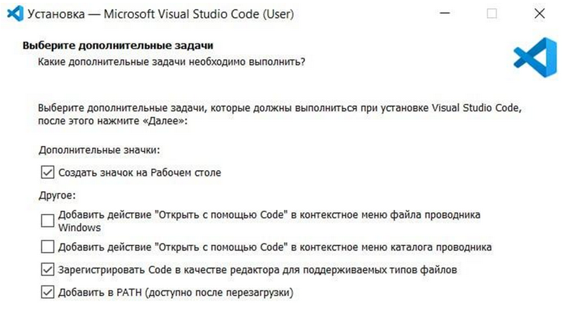

# Python
`Python` – один из самых удобных и понятных языков программирования, который стал стандартом для задач в сфере безопасности приложений (AppSec), тестирования, автоматизации и анализа данных.

Он используется повсюду – от написания скриптов для анализа уязвимостей до построения веб-приложений, которые мы будем защищать на следующих этапах курса.

В этом уроке мы не будем углубляться в сложные детали языка. Задача – вспомнить, как уверенно работать с его основами: понимать типы данных, использовать условия и циклы, хранить информацию в списках и словарях. Эти знания понадобятся вам в каждом практическом задании курса – ведь большинство лабораторий по безопасности будут связаны именно с Python.

## Зачем изучать Python в контексте AppSec
AppSec-специалист должен уметь не только находить уязвимости, но и воспроизводить их в тестовой среде, анализировать код, писать простые проверки и даже автоматизировать процессы безопасности. Для всего этого нужен язык, который:
* Прост в освоении – даже если вы раньше не программировали.
* Гибок – подходит и для веб-разработки, и для анализа данных, и для сканирования.
* Имеет огромное сообщество и множество библиотек (Flask, Requests, BeautifulSoup, Semgrep, Trivy API, и т.д.).

Python стал фактически универсальным языком специалистов по безопасности приложений. Он помогает быстро прототипировать инструменты, проверять уязвимости и строить тестовые приложения для обучения.

## Настройка Python и VSCode

Перед началом работы необходимо подготовить рабочую среду. Это первый и самый важный шаг в любом курсе разработки.  

### Установка Python
1. Перейдите на официальный сайт `python.org`.
2. Скачайте последнюю стабильную версию для вашей системы (Windows, macOS или Linux).
3. Начните установку, `отметив добавление python в Path`.
4. Можете перезапустить ПК и проверить корректность установки (необязательно).

### Установка VSСode
1. Перейдите на официальный сайт и скачайте установочный файл
2. Запустите установочный файл
3. Выберите дефолтную директорию установки 
4. Добавьте папку в меню пуск
5. Выберите галочки в следующем порядке

6. Проверьте работоспособность

### Создание первого проекта
1. Нажмите на file -> open folder
2. Выберите папку для проекта (подойдёт любая, даже новосозданная)
3. Нажав правой кнопкой по правому пространству директории создайте новый файл py.py
4. Напишите первый файл и запустите его

Если программа не запускается – не пугайтесь. В терминале может появиться ошибка, например python не найден. Это значит, что при установке не была отмечена галочка “Add to PATH”. Просто переустановите Python, включив её – и всё заработает.

## Типы данных
### Зачем вообще знать типы?
`Тип данных` – это «форма» значения: число, строка, список и т.д. От типа зависят доступные операции (что можно «делать» с этим значением) и поведение программы. 

В AppSec это критично: безопасная обработка чужих данных, правильная сериализация/десериализация (JSON), отсутствие «типовых» ошибок и путаницы, которые часто приводят к уязвимостям.

Python – язык `с динамической типизацией`: если вы не объявляете тип заранее, он определяется во время выполнения.
```python
x = 10          # int (целое число)
x = "привет"    # теперь str (строка)
```
Полезные функции:
```python
type(x) – какой у объекта тип;
```
### Важные базовые понятия
`Истинность` (truthiness): 
В логических конструкциях «пустые» объекты считаются ложью: 0, 0.0, "", [], {}, set(), None → False. 
Всё остальное → True.

`Изменяемость` (mutability):
* Неизменяемые (immutable): int, float, bool, str, tuple, bytes, frozenset.
* Изменяемые (mutable): `list`, `dict`, `set`, `bytearray`.

Разницу важно знать, потому что в Python при передаче данных в функцию `изменяемые объекты передаются по ссылке`. Если функция изменит, например, список – изменится и оригинал. 

Такие мелочи часто становятся источником багов: данные меняются "сами собой". Это может привести к непредсказуемому поведению и уязвимостям, особенно если объект используется в нескольких частях программы.

Поэтому важно различать, какие объекты можно менять, а какие – нет.

## Числа: int, float (Decimal/Fraction)
### int – целые числа
Не имеет ограничений по длине (пока хватает памяти).

Операции: `+` `-` `//` `%` `*` и побитовые `&` `|` `^` `~` `<<` `>>`.
```python
a = 7
b = 3
a // b  # 2 (целочисленное деление)
a % b   # 1 (остаток)
```
### float – числа с плавающей запятой (двойная точность, двоичное представление)
Удобно, но есть погрешности представления:
```
0.1 + 0.2  # 0.30000000000000004
```
### complex – комплексные числа
Нужны редко, но Python поддерживает: `3+4j`.

### Где в AppSec:
1. `Лимиты и квоты`: счётчики в целых числах; не используем float для сравнения порогов.
2. `Балансы/деньги`: Decimal или целые копейки (int); без float.
3. `Токены/TTL/временные окна`: секунды/мс как int, без дробных значений.
4. `Пороговые проверки`: чёткие сравнения (>=) и при необходимости заранее округляйте.

### Логический тип: bool
Два значения: `True` и `False`. Появляется в сравнениях и условиях.
```python
is_admin = True

if is_admin:

    print("Добро пожаловать!")
```

Осторожно с bool(str):
`bool("") → False`, но `bool("0") → True` (любая непустая строка – истинна). 

Это частая причина «типовой» логической ошибки. Например, пользователь может отправить "False" из формы, а ваш код воспримет это как истину – и случайно откроет ему доступ.

### Строки: str (Юникод)
`Строки` – неизменяемые последовательности символов. Поддерживают индексацию, срезы, методы.
```python
s = "AppSec"
s[0]       # 'A'
s[1:4]     # 'ppS'
len(s)     # 6
"sec" in s # True
```
Частые операции:
* `Склейка`: "Hello, " + name
* `Форматирование`: f-строки: f"Пользователь {name} вошёл"
* `Методы`: .lower(), .upper(), .split(), .strip(), .replace(), .startswith(), .endswith()

В AppSec:
* Никогда не строим SQL/команды простыми f-строками из непроверенных данных – используем параметризацию.
* Валидация и нормализация входных строк – защита от XSS/инъекций.

Любая строка из внешнего источника – потенциально небезопасна. Привыкайте очищать и проверять данные: убрать лишние пробелы, привести к нижнему регистру, убедиться, что формат ожидаемый.

### Бинарные данные: bytes, bytearray
* `bytes` – неизменяемая последовательность байтов.
* `bytearray` – изменяемая.
```python
data = b"\xff\x00\x10"
buf = bytearray(data)
buf[0] = 0x00
```
### Где в AppSec: 
* работа с сетевыми протоколами, файлами, хэшами, криптографией.
* Пока важно знать, что bytes – это просто «сырые данные», не текст.

### Множества: set и frozenset
Коллекции уникальных элементов (без повторов).
* `set` – изменяемое.
* `frozenset` – неизменяемое/хэшируемое (может быть ключом словаря).
```python
tags = {"app", "sec", "app"}   # {'app', 'sec'}
"sec" in tags                   # True
tags.add("python")
```
### Операции теории множеств:
* Объединение: A | B
* Пересечение: A & B
* Разность: A - B
* Симметричная разность: A ^ B

### Где в AppSec: 
* быстро убрать дубликаты, сравнить наборы прав/ролей, IP/токены.

Детальнее подробнее разберем в темах:
1. Безопасность API  — проверка авторизации/обход прав, rate-limiting.
2. JWT токены и Авторизация — работа с токенами/сессиями.
3. Атаки на OAuth 2.0  — потоки и валидация параметров.
4. Хранение паролей/хеши  и Secrets Management — хеши, ключи, секреты.

### ✍ Мини-шпаргалка 
* `Неизменяемые`: int, float, bool, str, tuple, bytes, frozenset.
* `Изменяемые`: list, dict, set, bytearray.
* `Для денег` – decimal.Decimal, не float.
* Для `уникальности` – set.
* Для `JSON` – dict/list, всегда проверяйте ключи и типы.
* Для `форматирования строк` – f-строки; не собирайте SQL/команды строками из непроверенных данных.

### Короткие примеры «из жизни» AppSec
1) Проверка входных данных и типов:
```python
payload = {"limit": "10", "admin": "false"}  # пришло как строки
limit = int(payload.get("limit", 10))
admin = payload.get("admin", "false").lower() == "true"
```
2) Удаление дублей и быстрые проверки:
```python
user_roles = ["user", "editor", "user", "admin"]
unique_roles = set(user_roles)  # {'user', 'editor', 'admin'}
"admin" in unique_roles         # True
```
3) Безопасное обращение к словарю из JSON:
```python
data = {"user": {"name": "alice"}}
name = data.get("user", {}).get("name")  # 'alice' или None, если чего-то нет
```
4) Осторожно с float:
```python
0.1 + 0.2 == 0.3   # False
# Для денег:
from decimal import Decimal
Decimal("0.1") + Decimal("0.2") == Decimal("0.3")  # True
```

## Условные операторы в Python
Представьте, что вы пишете программу, которая должна принимать решения. Например, если пользователь ввёл правильный пароль – пустить его в систему, если нет – показать ошибку. Или если значение превышает лимит – заблокировать запрос.

Такая логика и строится с помощью условных операторов.

В языке Python это делается при помощи ключевых слов `if`, `elif` и `else`. Они позволяют вашей программе действовать по-разному в зависимости от условий. Этот инструмент встречается буквально в каждом коде – от простого калькулятора до сложных систем авторизации и проверки безопасности.

### Что такое условие
`Условие` – это вопрос, на который можно ответить только “Да” или “Нет”, или, на языке программирования, True (истина) или False (ложь).

Например:
* «Если возраст пользователя больше 18 – разрешить вход».
* «Если введённый пароль совпадает с сохранённым – пустить на сайт».
* «Если попыток входа слишком много – заблокировать».

В Python каждое условие – это выражение, которое возвращает True или False. Пример:
```python
5 > 3     # True
2 == 10   # False
```
Эти значения потом проверяются с помощью конструкции `if`.

### Основная форма оператора if
Пример:
```python
age = 20
if age >= 18:
    print("Доступ разрешён")
```
Как это работает:
* Программа проверяет условие age >= 18.
* Если оно истинно (True), выполняет то, что написано после : – в нашем случае выводит сообщение.
* Если ложно (False), просто пропускает этот блок и идёт дальше.

### Добавляем else – вариант «иначе»
Часто нужно указать, что делать, если условие не выполнено. Для этого добавляют else:
```python
age = 15
if age >= 18:
    print("Доступ разрешён")
else:
    print("Доступ запрещён")
```
Здесь программа выполнит только один из двух блоков. Это удобно, когда есть два противоположных сценария.

### Добавляем elif – вариант «иначе если»
Если условий несколько, используется elif – сокращение от “else if”.
```python
age = 10
if age >= 18:
    print("Взрослый")
elif age >= 14:
    print("Подросток")
else:
    print("Ребёнок")
```
## Примеры условий в AppSec
Теперь разберём, где такие конструкции нужны специалисту по безопасности приложений.

### Проверка прав доступа:
```python
if user_role == "admin":
     show_admin_panel()
else:
     show_access_denied()
```
Здесь if определяет, может ли пользователь выполнять конкретное действие. ***Это основа авторизации***.

### Валидация данных:
```python
if not email or "@" not in email:
    print("Некорректный адрес электронной почты")
```
Такая проверка ***не даст пользователю отправить неправильные данные в базу***.

### Ограничение запросов:
```python
if requests_per_minute > 100:
    block_user()
```
Используется ***для защиты от Brute Force или DDoS***.

### Проверка статусов и ответов:
```python
if response.status_code == 200:
    print("Сервер ответил успешно")
else:
    print("Ошибка соединения")
```
Условные конструкции лежат в основе каждой системы контроля доступа, логирования и фильтрации в AppSec.

## Циклы в Python
`Циклы` – это инструмент, который позволяет повторять действия в программе столько раз, сколько нужно. Без циклов код был бы сплошным копированием одинаковых строк: скучным, громоздким и неудобным.

Представьте, что вы проверяете список пользователей на наличие уязвимых паролей, или анализируете логи сервера – десятки, сотни, тысячи записей. Писать одну и ту же проверку для каждого элемента вручную невозможно. Вот здесь и приходят на помощь `циклы`.

Циклы позволяют автоматизировать повторяющиеся задачи. Это основа любого инструмента автоматизации – от сканеров уязвимостей до фильтров логов.

### Что такое цикл
`Цикл` – это конструкция, которая повторяет блок кода, пока выполняется определённое условие или пока не закончатся данные для обработки.

Простейший пример – вывести числа от 1 до 5:
```python
for i in range(1, 6):
    print(i)
```
Этот короткий код заменяет пять строк вроде:
```python
print(1)
print(2)
print(3)
print(4)
print(5)
print(6)
```
### Зачем нужны циклы в AppSec
1. `Проверка множества данных` – перебор URL, токенов, логов, пользователей, конфигураций.
2. `Автоматизация тестов` – например, отправить десятки HTTP-запросов для теста на SQL-инъекцию.
3. `Анализ результатов сканирования` – обработка длинных отчётов и фильтрация найденных уязвимостей.
4. `Мониторинг событий` – повторная проверка статуса сервера или изменений в файлах.

Другими словами, циклы – это ваш инструмент для масштабирования усилий: одна логика – тысяча повторений без усталости.

### Виды циклов в Python
В Python есть два основных типа циклов:
* `for` – используется, когда заранее известно, с чем нужно пройтись (список, строка, диапазон чисел и т.д.);
* `while` – используется, когда нужно повторять действие, пока выполняется некое условие.

### Цикл for
Пример 1. Простой цикл по диапазону чисел
```python
for i in range(5):
    print("Итерация номер:", i)
```
Пример 2. Цикл по списку
```python
users = ["alice", "bob", "charlie"]
for user in users:
    print("Проверяем пользователя:", user)
```
Каждый раз переменная user получает следующее значение из списка. Так можно обработать всех пользователей, токены или строки данных.

### Цикл while
Цикл while выполняет блок кода до тех пор, пока условие истинно (True).

Пример 1. Счётчик
```python
x = 0
while x < 5:
    print("x =", x)
    x += 1
```
Пока x меньше 5 – выполняется тело цикла. Когда x становится равно 5, условие x < 5 возвращает False, и цикл завершается.

Пример 2. Проверка пароля
```python
password = ""
while password != "admin":
    password = input("Введите пароль: ")
print("Доступ разрешён")
```
Цикл повторяется до тех пор, пока пользователь не введёт нужный пароль.

### Управление циклом
Иногда нужно прервать цикл раньше или пропустить итерацию. Для этого в Python есть ключевые слова `break` и `continue`.
* `break` – прервать цикл полностью
```python
for i in range(10):
    if i == 5:
        break
    print(i)
```
Когда i станет равно 5, цикл завершится полностью.
* `continue` – пропустить текущую итерацию
```python
for i in range(10):
    if i == 5:
        continue
    print(i)
```
В этом случае программа пропустит число 5, но продолжит работу дальше.

### Примеры в AppSec
### Проверка множества URL:
```python
urls = ["http://site.com", "http://test.com", "http://demo.com"]
  for url in urls:
      print("Сканируем:", url)
```
### Перебор найденных уязвимостей:
```python
vulns = ["XSS", "SQL Injection", "CSRF"]
  for vuln in vulns:
    print("Найдена уязвимость:", vuln)
```
### Проверка состояния сервера:
```python
attempts = 3
while attempts > 0:
    print("Проверяем соединение...")
    attempts -= 1
```

### Обработка логов:
```python
logs = ["INFO: login ok", "ERROR: sql injection detected", "INFO: logout"]
for line in logs:
    if "ERROR" in line:
        print("Найден инцидент:", line)
```
Циклы позволяют «прочесывать» большие объёмы данных и находить нужную информацию автоматически.

## Списки в Python
`Списки` – это один из самых главных инструментов в Python. Если в предыдущем пункте мы говорили про массивы в общем смысле, то список (list) – это конкретный, удобный и мощный способ хранить и обрабатывать коллекции данных.

Вы будете использовать списки практически в каждой задаче: при анализе логов, обработке входных параметров, хранении данных пользователей, фильтрации результатов сканирования и во многих других сценариях, связанных с безопасностью приложений.


Что такое список

Список – это упорядоченная изменяемая коллекция элементов.
Он может содержать что угодно: числа, строки, булевы значения, другие списки и даже словари.

Пример:

users = ["Alice", "Bob", "Charlie"]

Здесь список состоит из трёх строк. Мы можем:


получить элемент по индексу,


изменить его,


удалить,


добавить новые элементы.


Python позволяет даже смешивать типы данных:

data = ["AppSec", 2025, True, 3.14]

Хотя так делать можно, на практике лучше использовать списки с однотипными элементами –
это делает код предсказуемым и менее подверженным ошибкам.


Почему это важно в AppSec

Списки – это универсальная структура для:


Хранения данных: список пользователей, уязвимостей, IP-адресов, журналов событий.


Фильтрации: убрать ненужные элементы, например, безопасные домены из общего списка.


Перебора: пройтись по каждому элементу и выполнить анализ.


Обработки данных из файлов и API: JSON, CSV, отчёты сканеров.


# список найденных URL
urls = ["http://example.com", "http://test.com", "http://admin.com"]

# фильтрация
for url in urls:
    if "admin" in url:
        print("Возможная интересная цель:", url)


Создание списков

Пустой список:

items = []


Список с элементами:

roles = ["user", "moderator", "admin"]


Преобразование других типов в список:

letters = list("AppSec")   # ['A', 'p', 'p', 'S', 'e', 'c']
numbers = list(range(5))   # [0, 1, 2, 3, 4]


Индексация и срезы

Python нумерует элементы с 0.

users = ["Alice", "Bob", "Charlie"]
print(users[0])   # Alice
print(users[-1])  # Charlie


Срезы (slicing): позволяют взять часть списка.

print(users[0:2])   # ['Alice', 'Bob']
print(users[1:])    # ['Bob', 'Charlie']
print(users[:2])    # ['Alice', 'Bob']
print(users[:])     # копия списка


Изменение списков

Списки изменяемы, поэтому можно добавлять, убирать и менять элементы.

Изменить значение:

users[1] = "Robert"


Добавить элементы:

users.append("Diana")     # добавить в конец
users.insert(1, "Eve")    # вставить на вторую позицию


Удалить элементы:

users.remove("Alice")     # удалить по значению
deleted = users.pop(0)    # удалить по индексу (и вернуть элемент)
users.clear()             # очистить весь список


Перебор списков

Часто нужно обработать каждый элемент – для этого используется цикл for.

roles = ["user", "admin", "moderator"]
for role in roles:
    print("Роль:", role)


Можно также получать индекс с помощью функции enumerate():

for i, role in enumerate(roles):
    print(i, "->", role)


Применение списков в AppSec

Хранение URL для проверки уязвимостей:

urls = ["http://test.com", "http://demo.com"]
for url in urls:
     print("Сканируем:", url)


Фильтрация подозрительных строк:

logs = ["OK", "ERROR", "WARNING", "CRITICAL"]
alerts = [x for x in logs if "ERROR" in x or "CRITICAL" in x]


Работа с JSON:
Многие ответы API возвращают массивы данных, которые в Python превращаются в списки.

import json
data = json.loads('["admin", "user", "guest"]')
for role in data:
    print(role)


Анализ ролей и прав:

roles = ["user", "admin", "user", "moderator"]
unique_roles = list(set(roles))
print(unique_roles)  # ['user', 'admin', 'moderator']


Словари в Python

Теперь перейдём к ещё более важному инструменту – словари (dict).

Если список – это как «ящик с пронумерованными ячейками», то словарь – это «ящик с ярлыками». Вы не ищете по номеру, вы сразу знаете «ключ» (например, имя пользователя, логин или ID), и по этому ключу находите нужное значение.

Словари – это основа хранения структурированных данных. Именно в виде словарей хранятся JSON-ответы от API, настройки приложений, отчёты о найденных уязвимостях и многое другое.

Словарь – это неупорядоченная коллекция пар «ключ–значение».
Каждый ключ связан с каким-то значением, и вы можете мгновенно получить это значение, зная ключ.

Пример:

user = {
    "name": "Alice",
    "role": "admin",
    "is_active": True
}

Здесь:


"name", "role", "is_active" – это ключи,


 "Alice", "admin", True – это значения.

Словарь похож на мини-базу данных в памяти: вы можете быстро добавить, удалить или изменить любую запись.


Почему словари важны для AppSec


JSON = dict.
Когда вы работаете с REST API, парсите отчёты сканеров, токены или запросы – всё это словари.

import json
data = json.loads('{"username": "admin", "password": "123"}')
print(data["username"])  # admin


Настройки и конфигурации.
Конфиг веб-приложения, список пользователей, политика безопасности – удобно хранить в словарях.


Проверка прав и ролей.

user = {"role": "admin", "active": True}
if user["role"] == "admin" and user["active"]:
print("Доступ разрешён")


Логирование и анализ данных.
Каждая запись лога может быть словарём с полями time, event, status. Вы сможете легко фильтровать или сортировать их.


Создание словарей

1. Через фигурные скобки:

user = {"name": "Bob", "age": 30}

2. Через функцию dict():

user = dict(name="Bob", age=30)

3. Пустой словарь:

data = {}


Доступ к значениям

Получить значение можно по ключу:

print(user["name"])  # Bob

Если ключа нет, будет ошибка KeyError.
Чтобы избежать этого, используйте метод .get() – он безопасен:

print(user.get("email", "нет данных"))  # выведет "нет данных"


Изменение данных

user["age"] = 31             # изменение значения
user["email"] = "bob@mail"   # добавление нового ключа
del user["name"]             # удаление ключа


Перебор элементов словаря

Словарь можно «перебирать» в цикле.

Только ключи:

for key in user:
    print(key)


Ключи и значения:

for key, value in user.items():
    print(f"{key}: {value}")


Только значения:

for value in user.values():
    print(value)


Применение словарей в AppSec 

1. Хранение данных о пользователях

user = {"login": "admin", "password": "123", "role": "superuser"}

if user["role"] == "superuser":
    print("Полный доступ")


2. Проверка токена доступа

token = {"id": 101, "valid": True, "scope": "read"}

if not token["valid"]:
    print("Ошибка: недействительный токен")


3. Анализ JSON-ответов от API

response = {
    "status": "success",
    "data": {"user": "alice", "permissions": ["read", "write"]}
}

if "write" in response["data"]["permissions"]:
    print("Пользователь может изменять данные")


4. Упрощённый лог активности

logs = [
    {"event": "login", "user": "alice"},
    {"event": "error", "message": "invalid password"},
    {"event": "logout", "user": "alice"}
]

for entry in logs:
    if entry["event"] == "error":
        print("Обнаружена ошибка:", entry["message"])


 

 

👨🏻‍🎓 Полезные ресурсы для самообразования:

Официальная документация

●      Python Docs (русская версия): https://pydocs.ru/home/

Для AppSec-навыков

●      TryHackMe “Python Basics”: https://tryhackme.com/room/pythonbasics (Мини-лаборатория с упражнениями по Python в контексте кибербезопасности)

Для практики

●      LeetCode (раздел Easy / Python): https://leetcode.com/