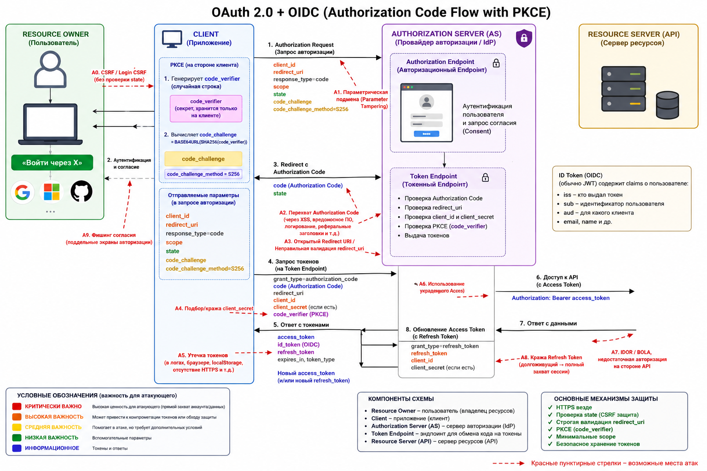

# OAuth 2.0
`OAuth` нужно рассматривать как цепочку: **authorization request** → **authentication/consent** → **redirect** → **authorization code** → **token** → **API**. Уязвимость может возникнуть на каждом этапе. 
1. `PKCE` защищает конкретно от использования перехваченного **authorization code** без **code_verifier**; 
2. `state` защищает от `CSRF`-сценариев; 
3. строгая проверка **redirect_uri** не позволяет злоумышленнику направить OAuth-ответ на свой endpoint (`OAuth misconfiguration`).

* client_id       → кто клиент?
* redirect_uri    → куда возвращаем?
* scope           → что ему разрешено?
* state           → это наш OAuth-запрос?
* PKCE            → это тот же клиент, который начал flow?
* authorization code → временное подтверждение
* access token    → что разрешено API?



Чтобы разбирать атаки, сначала освежим, как вообще работает `OAuth 2.0`.

В схеме участвуют четыре роли:
* **Resource Owner** — пользователь, чьими данными оперируем.
* **Client** — приложение, которое хочет доступ к данным (веб-приложение, мобильное, сервис).
* **Authorization Server (AS)** — сервер авторизации, который логинит пользователя и выдаёт токены `access token`.
* **Resource Server (API)** — сервер ресурсов, тот самый API, к которому в итоге идут запросы с токеном (принимает `access token`).

Основные типы токенов:
1. `Authorization Code` — краткоживущий «код», который выдаётся через браузер и потом обменивается на токены.
2. `Access Token` — токен доступа к API (по нему `Resource Server` решает, что можно).
3. `Refresh Token` — токен для обновления Access Token без повторного входа пользователя.

Самый важный сценарий сегодня — `Authorization Code` + `PKCE` (для публичных клиентов, где нет секрета, например SPA и мобильных приложений).

## Сценарий Authorization Code с PKCE
1. Пользователь открывает Client (например, SPA или мобильное приложение) и нажимает **«Войти через X»**.
2. Клиент генерирует случайную длинную строку **code_verifier**, из неё считает производное значение **code_challenge** (обычно это `BASE64URL`(`SHA256`(code_verifier))) и запоминает у себя **code_verifier**.
3. После этого клиент перенаправляет браузер на `Authorization Server` (/authorize), передавая:
**client_id**, **redirect_uri**, **scope**, **state**, **code_challenge** и **code_challenge_method**.
4. Пользователь на стороне `Authorization Server` логинится (вводит логин/пароль, 2FA и т.д.) и подтверждает, что этот `Client` может получить доступ с указанными правами (`scope`).
5. `Authorization Server` завершает авторизацию и отправляет браузер обратно на **redirect_uri** клиента, добавляя в URL параметры **code** и **state**.
6. Клиент принимает запрос на **redirect_uri**, проверяет, что **state** совпадает с тем, что он положил в сессию перед началом авторизации. Если всё ок, он берёт **code** и тот самый сохранённый **code_verifier** и делает отдельный запрос уже не из браузера, а напрямую к `Authorization Server` на `Token Endpoint` (/token), передавая: **code**, **code_verifier**, **client_id** (и **client_secret**, если это конфиденциальный клиент).
7. `Authorization Server` смотрит на полученный **code_verifier**, рассчитывает из него **code_challenge** тем же методом, что и клиент, и сравнивает с **code_challenge**, который был получен на шаге 2 и привязан к этому **code**. Если совпадает, код ещё не использован и не просрочен — `AS` выдаёт **Access Token** (и, при необходимости, `Refresh Token`). Если не совпадает — отказ.

С этого момента в игру вступает `Resource Server`. Клиент, имея `Access Token`, отправляет запросы к API, добавляя заголовок, например:
```
Authorization: Bearer <access_token>
```
Этот запрос идёт уже на `Resource Server`, а не на `Authorization Server`.

`Resource Server` проверяет **Access Token** (локально или через introspection на AS), убеждается, что токен действителен и имеет нужные `scope`/права, и только после этого отдаёт данные или выполняет операцию.

То есть `Resource Server` появляется именно на шаге, когда у клиента уже есть **Access Token**, и используется он только для доступа к данным/операциям. `Authorization Server` вообще не видит эти прикладные запросы — он только логинит и выдаёт токены.

Связка **code_verifier**/**code_challenge** — это способ доказать `Authorization Server`’у, что код использует тот же клиент, который начинал авторизацию, даже если никто не хранит **client_secret**.

Все атаки, о которых ниже, так или иначе ломают один из этих шагов: подменяют параметры, перехватывают **code** или **токены**, обманывают клиента или сервер.

* **Authorization Endpoint** отвечает на вопрос: «Можно ли этому Client получить доступ от имени пользователя?»

* **Token Endpoint** отвечает на вопрос: «Вот доказательство этого разрешения (code). Выдай Client настоящий токен».

`PKCE`: **code_challenge** передаётся на `Authorization Endpoint`, а настоящий **code_verifier** — только на `Token Endpoint`. Поэтому украденного **Authorization Code** недостаточно, чтобы получить **Access Token**.

*«А зачем вообще отдельный Token Endpoint? Почему Authorization Server сам не может выдать Client Access Token после проверки Code?»*

Архитектура разделяет эти операции намеренно:

**Authorization Endpoint**
* взаимодействие с пользователем
* логин
* согласие
* выдача Code

**Token Endpoint**
* серверная операция
* проверка Code + PKCE
* выдача Access Token

Так удобнее и **безопаснее отделить браузерную часть**, где присутствует пользователь, **от обмена credentials/code на токены**, который должен происходить непосредственно между `Client` и `Authorization Server`.

## Реальные примеры уязвимостей
Подобные ошибки встречались и у крупных игроков.

На стороне Facebook в прошлом находили уязвимости, связанные с обработкой **redirect_uri**: недостаточно строгая валидация позволяла злоумышленнику подменить адрес редиректа и получать коды авторизации для чужих аккаунтов.

У Google+ были истории с некорректной валидацией **redirect_uri** и возможностью использовать открытые редиректы для кражи потока авторизации — пользователь думал, что возвращается в привычное приложение, а код оказывался у злоумышленника.

С GitHub в своё время была проблема с логированием OAuth-токенов: токены попадали в логи, которые затем могли быть доступны людям, не предназначенным для доступа к самим аккаунтам. Сам по себе протокол при этом был выстроен корректно, но операционные практики (логирование) превращались в канал утечки.

Эти случаи хорошо иллюстрируют общую мысль: в `OAuth 2.0` и `OIDC` (OpenID Connect) важно не только следовать спецификации, но и аккуратно реализовывать каждую деталь — обработку **redirect_uri**, проверку **state** и **PKCE**, хранение и логирование токенов. Любая «мелочь» в этом конструкторе даёт вполне конкретные и эксплуатируемые атаки.

## Атаки на Authorization Endpoint
### 1. CSRF на авторизацию
Идея атаки — заставить пользователя выдать токен не тому клиенту или не под свою «логическую» сессию на клиенте.

Пример сценария:
1. У злоумышленника есть свой зарегистрированный клиент с **client_id** и **redirect_uri**.
2. Он формирует ссылку на `/authorize`, где в качестве **client_id** — его приложение, а в **redirect_uri** — его контролируемый адрес.
3. Жертва, будучи уже залогиненной в системе авторизации, переходит по этой ссылке, видит стандартное окно «предоставить приложению доступ» и нажимает «Разрешить».
4. `Authorization Server` выдаёт `Authorization Code` и отправляет его по **redirect_uri** злоумышленника.
5. Злоумышленник обменивает код на токены и получает доступ к ресурсам жертвы от своего клиента.

Защита строится вокруг параметра **state**. Клиент перед началом авторизации должен сгенерировать **криптостойкое случайное значение**, привязать его к своей сессии пользователя и отправить его в запросе `/authorize`. После возврата с **code** клиент обязан сравнить пришедший **state** с тем, что хранится в сессии. Если **state** отсутствует или не совпадает, код нельзя использовать. Тогда даже если жертва кликнет на чужую ссылку, полученный код не пройдёт проверку у легитимного клиента.

### 2. Open Redirect на authorize endpoint
Если `Authorization Server` позволяет после успешной авторизации перенаправлять пользователя на произвольные URL, это превращается в мощный инструмент фишинга и перехвата кода.

Сценарий типичный: при регистрации клиента кто-то указывает как **redirect_uri** не конкретный путь, а URL с открытым редиректом. В итоге после авторизации пользователь попадает не на настоящее приложение, а на страницу злоумышленника. Если в URL уже присутствует **code**, его можно просто считать из строки запроса.

Защита — строгая валидация **redirect_uri**: только точное совпадение с заранее зарегистрированным списком адресов. Никаких любой путь под этим доменом, никаких паттернов вида https://client.com/*. И никаких динамических редиректов вроде https://client.com/redirect?next=... в списке разрешенных адресов.

### 3. Небезопасная валидация redirect_uri
Здесь уязвимость возникает, когда разработчики проверяют **redirect_uri** неточно. Например, сравнивают только префикс: «если строка начинается с https://client.com/, значит можно». Тогда https://client.com.evil.com тоже «подходит» по префиксу.

Другой вариант — разрешать **redirect_uri** на доменах, где есть открытые редиректы. В этом случае даже если формально домен принадлежит серверу, по цепочке редиректов можно увести пользователя и код на сторонний сайт.

Правильная стратегия: хранить у `Authorization Server` полный список разрешённых **redirect_uri** и требовать точного совпадения строки.

## Атаки на Token Endpoint
`Token Endpoint` — точка, где `Authorization Code` обменивается на Access/Refresh Token. Если код перехвачен или подменён, атакующий может сам получить токены.

### 1. Перехват Authorization Code
Основной риск — передача кода по незащищённому каналу или попадание его в логи и заголовки.

Типичные источники утечки:
* использование `HTTP` вместо `HTTPS` между клиентом и `Authorization Server` (код можно перехватить);
* запись полной строки `redirect_uri?code=...` в логах веб-сервера или обратного прокси;
* утечка кода в `Referer`, если после редиректа пользователь автоматически загружается на ещё одну страницу с внешними ресурсами.

Защита: обязательно `HTTPS` для всех взаимодействий с `Authorization Server`, минимальное время жизни **Authorization Code** (обычно 1–2 минуты), одноразовость кода (после первого обмена код не должен работать повторно), а также использование `PKCE`, чтобы даже перехваченный код нельзя было обменять без знания **code_verifier**.

### 2. Code Injection (подмена кода)
Если приложение-клиент не связывает полученный **Authorization Code** с конкретной сессией пользователя и с параметром **state**, возможна подмена кода. Представим, что где-то в цепочке редиректов злоумышленник может подменить параметр **code** в запросе к клиенту. Клиент, не проверяя **state** и не сопоставляя код с ранее начатым запросом, просто берёт то значение, что пришло, и отправляет его на `Token Endpoint`.

В результате токен, который принадлежит одной сессии/пользователю, может быть использован в другом контексте.

Защита — всегда привязывать код к сессии пользователя и проверять **state**. Код должен быть использован только в той сессии, для которой была начата авторизация.

### Отсутствие PKCE для публичных клиентов
`PKCE` (Proof Key for Code Exchange) появился как способ защититься от перехвата кода у публичных клиентов — мобильных приложений, SPA, где нельзя безопасно хранить **client_secret**.

Без `PKCE` злоумышленник, который каким-то образом получил **Authorization Code** (через вредоносное приложение на устройстве, баг на клиенте), может сам обратиться к `Token Endpoint` и обменять код на токены. `Authorization Server` не отличит законный запрос от поддельного.

`PKCE` решает это так: при старте авторизации клиент генерирует случайный **code_verifier** и производную от него **code_challenge**. **code_challenge** отправляется в `/authorize`, а **code_verifier** остаётся у клиента. При обмене кода клиент предъявляет **code_verifier**, а сервер проверяет, что из него получается тот **code_challenge**, который видел на шаге авторизации. Перехвата одного только **code** становится недостаточно.

Реальная защита — обязательное использование `PKCE` для всех публичных клиентов, и корректная проверка **code_verifier** на стороне `Authorization Server`.

## Атаки на Authorization Server
Здесь атакуют сам сервер авторизации и его логику работы с клиентами.

### 1. Client Mix-up
Суть атаки — подмена клиента. Злоумышленник регистрирует свой клиент с похожим названием и пытается заставить пользователя думать, что он авторизует доступ для доверенного приложения. Либо использует ошибки в логике, где `Authorization Server` некорректно привязывает **authorization code** к конкретному **client_id**.

Защитные меры включают в себя требование доказательства владения **redirect_uri** при регистрации клиента (например, верификация домена), строгую привязку кода к **client_id** и корректное использование сочетания **client_id** + **client_secret** (для конфиденциальных клиентов).

### 2. Substitution attack при обмене кода
Если `Authorization Server` при обмене код → токен не проверяет, что **client_id** при обмене совпадает с тем, для кого код был выдан, возникает возможность подмены клиента. Атакующий может перехватить или получить код, выданный для легитимного клиента, и использовать его в запросе от своего клиента, если сервер не валидирует связку **code**–**client_id**.

Правильная реализация предполагает, что **Authorization Code** жёстко привязан к конкретному клиенту и **redirect_uri**, и любые попытки обменять **код** другим **client_id** отвергаются.

## Атаки на JWT в контексте OIDC
`OpenID Connect` поверх `OAuth 2.0` добавляет **ID Token**, чаще всего в формате `JWT`. Здесь актуальны все уязвимости, обсуждавшиеся в уроке про `JWT`, но в контексте аутентификации.

### 1. None algorithm attack
Если библиотека валидации токенов принимает `alg: "none"` и не требует подписи, атакующий может создать произвольный **ID Token** с любыми данными (например, sub для другого пользователя) и представить его как результат успешной аутентификации.

Защита — запрет алгоритма `none` для **ID Token** и явное указание списка поддерживаемых алгоритмов в конфигурации клиента.

### 2. Algorithm confusion (RS256 → HS256)
При неправильной обработке поля `alg` возможна ситуация, когда токен, который должен проверяться как `RS256` (с использованием публичного ключа), проверяется как `HS256`, при этом публичный ключ используется как «секрет». Это даёт возможность атакующему, имея доступ к публичному ключу `IdP`, самостоятельно выпускать токены, которые клиент сочтёт валидными.

Защитная мера — жёстко задавать ожидаемый алгоритм на стороне клиента, проверять соответствие используемого ключа типу алгоритма.

### 3. Слабые ключи подписи
Если `IdP` использует для `HS256` короткий или предсказуемый секрет, он может быть подобран, после чего любой желающий сможет генерировать валидные **ID Token**. Это классическая проблема слабых секретов.

Решение — криптографически стойкие ключи достаточной длины, предпочтение асимметричных схем (`RS256`/`ES256`) там, где это уместно.

## реалистичный OAuth 2.0 + OIDC 
URL может выглядеть так:
```
https://accounts.google.com/o/oauth2/v2/auth?
  client_id=123456789012-abc123xyz.apps.googleusercontent.com&
  redirect_uri=https%3A%2F%2Fmyapp.example%2Foauth%2Fcallback&
  response_type=code&
  scope=openid%20profile%20email&
  state=af0ifjsldkj&
  code_challenge=E9Melhoa2OwvFrEMTJjXl...
  &code_challenge_method=S256
```
* **Authorization Endpoint** - адрес сервера https://accounts.google.com/o/oauth2/v2/auth
* **client_id** - Какое приложение просит досту
* **redirect_uri** - куда вернуть пользователя после авторизации
* **response_type** - вернуть Authorization Code
* **scope** - что приложение хочет получить.
* **openid** - здесь означает, что мы используем `OIDC` поверх `OAuth 2.0`.
* **state** - случайное значение, которое `Client` использует для защиты `OAuth-flow` от `CSRF`/подмены ответа.
* **code_challenge** - это часть PKCE.
* **code_challenge_method** - для проверки PKCE используй SHA-256.

Вот вся эта длинная URL-строка — это в первую очередь запрос к `Authorization Endpoint`.

Google после логина и согласия делает `redirect`:
```
https://myapp.example/oauth/callback?code=4%2F0AbCdEf123456&state=af0ifjsldkj
```
* **code** - Authorization Code

Потом сам `Client` идёт на `Token Endpoint`:
```
POST /token
...
grant_type=authorization_code
code=4/0AbCdEf123456
redirect_uri=https://myapp.example/oauth/callback
client_id=123456789012-abc123xyz.apps.googleusercontent.com
code_verifier=СЕКРЕТНЫЙ_CODE_VERIFIER
```
И получает JSON контейнер с разными токенами **access_token** и **ID Token** (OIDC):
```json
{
  "access_token": "ya29.a0AfH6...",
  "token_type": "Bearer",
  "expires_in": 3599,
  "refresh_token": "1//09...",
  "id_token": "eyJhbGciOiJSUzI1Ni..."
}
```
Это ответ `Authorization Server` после обмена **Authorization Code** на токены. Client получает JSON-ответ от `Token Endpoint`, внутри которого находятся **Access Token**, **ID Token** (в OIDC) и **Refresh Token**.

Теперь клиент обращается к `Resource Server` (API).

Например, приложение хочет получить твой профиль Google. Оно отправляет HTTP-запрос вместе с `JWT Payload` (содержимое токена):
```
GET /userinfo HTTP/1.1
Host: googleapis.com
Authorization: Bearer ya29.a0AfH6...
```
`JWT Payload` (содержимое токена):
```
{
  "sub": "123456",
  "email": "alice@gmail.com",
  "scope": "profile email",
  "exp": 1750000000
}
```
Это уже содержимое самого токена, если **access_token** является `JWT`.

Не каждый **access_token** — это `JWT`. Например Google часто выдаёт:
```
ya29.a0AfH6...
```
Это может быть **opaque token** (непрозрачный токен). Тогда внутри него нет:
```json
{
 "email": "...",
 "sub": "..."
}
```
`scope creep` — это постепенное и часто незаметное расширение прав доступа (scopes) у доверенного приложения свыше того, что реально нужно для его работы, либо запрос избыточных полномочий «на будущее» при аутентификации.

Проблема «запутанного посредника» (`Confused Deputy`) в OAuth — это уязвимость, при которой клиентское приложение или сервер обманом заставляет ресурсный сервер принять токен доступа, предназначенный совсем для другого получателя, из-за чего злоумышленник получает чужие данные.