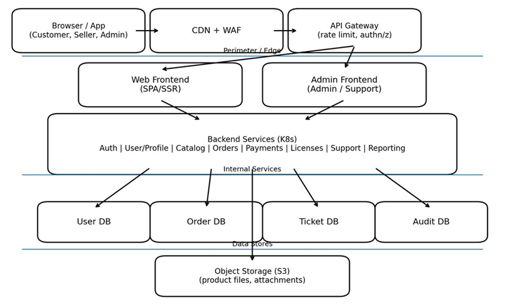

Моделирование угроз веб‑приложения (STRIDE)

 

Задача: 

провести моделирование угроз по STRIDE для описанной системы. Нужно построить список угроз для элементов и потоков данных, затем предложить меры снижения риска.

 

Система: 

MarketHub — маркетплейс цифровых товаров и подписок

MarketHub — веб‑приложение с личными кабинетами пользователей и продавцов, каталогом товаров, оплатой подписок, выдачей цифровых лицензий, внутренней поддержкой и административной панелью.

 

Роли и внешние участники

1) Покупатель (Customer) — просматривает каталог, оформляет покупки/подписки, получает лицензии.

2) Продавец (Seller) — управляет товарами, ценами, промо‑акциями, смотрит отчёты.

3) Сотрудник поддержки (Support) — отвечает на тикеты, может просматривать заказы и профили по заявке.

4) Администратор (Admin) — управляет пользователями, ролями, комиссиями, настройками, аудитом.

5) Платёжный провайдер (Payment Provider) — эквайринг, вебхуки по статусам платежей.

6) IdP (OAuth/OIDC) — вход через внешний провайдер для части пользователей.

7) Почтовый сервис (Email) — письма о регистрации, сбросе пароля, чеки, уведомления.

8) Сервис SMS/Push — одноразовые коды и уведомления.

 

Ключевые бизнес‑функции

1) Регистрация и вход: парольная аутентификация, MFA для админов и продавцов, вход через OAuth/OIDC.

2) Оформление заказа: корзина, расчёт скидок, создание платежа, подтверждение по вебхуку.

3) Подписка: продления, отмена, льготный период, уведомления.

4) Выдача цифрового товара: генерация лицензии, хранение и выдача ссылки на загрузку.

5) Личный кабинет: управление профилем, адресами, токенами API (для продавцов).

6) Панель продавца: управление товарами, файлами, ценами, промо‑кодами, отчётами.

7) Поддержка: тикеты, прикрепление файлов, просмотр заказов, частичный возврат через платежи.

8) Админ‑панель: RBAC, аудит, блокировки, настройки комиссий, управление интеграциями.

Критичные активы (данные) для защиты

1) Учётные записи и роли (Customer/Seller/Support/Admin), MFA‑настройки.

2) Секреты: ключи подписи токенов, ключи шифрования, API‑ключи к внешним сервисам, webhook‑секреты.

3) Платёжные данные: идентификаторы транзакций, статусы, суммы, ссылки на чеки (без хранения PAN).

4) Цифровые товары: исходные файлы, ссылки на загрузку, лицензии, ограничения доступа.

5) Персональные данные: email, телефон, имя, история покупок, адреса.

6) Логи и аудит: события входа, изменения ролей, возвраты, действия в админке.

External integrations:
- OAuth/OIDC IdP
- Payment Provider + Webhooks
- Email Provider
- SMS/Push Provider

DFD: элементы, которые нужно моделировать

Внешние сущности: Customer, Seller, Support, Admin, OAuth/OIDC IdP, Payment Provider, Email, SMS/Push.

Процессы: CDN/WAF, API Gateway, Auth Service, User/Profile, Catalog, Orders, Payments, Licenses, Support, Reporting, Admin UI.

Хранилища: User DB, Order DB, Ticket DB, Audit DB, Object Storage.

Потоки данных: логин/регистрация, выдача токенов, запросы к каталогу, создание заказа, редиректы OAuth, вебхуки платежей, загрузка/скачивание файлов, тикеты и вложения, действия в админке, логирование и аудит.

Границы доверия (trust boundaries)

TB1: Клиент (браузер/мобильное приложение) ↔ CDN/WAF/API Gateway (интернет‑периметр).

TB2: API Gateway ↔ внутренние сервисы (внутрисетевое взаимодействие).

TB3: Сервисы ↔ базы данных и объектное хранилище (доступ по сервисным учёткам).

TB4: Внешние провайдеры (IdP/Payment/Email/SMS) ↔ Payments/Auth/Notifications (интеграционные каналы).

TB5: Админ/Support интерфейсы ↔ Admin backend (повышенные привилегии).

Ключевые потоки данных (описание для моделирования)

Поток A: Регистрация и вход по паролю

— Клиент отправляет email/пароль → Auth Service. Auth Service создаёт сессию и/или выдаёт access token. Событие входа пишется в Audit DB. Для Admin/Seller включено MFA через SMS/Push.

Поток B: Вход через OAuth/OIDC

— Клиент получает redirect на IdP, возвращается на callback. Backend обменивает code на токены, создаёт локальную сессию/токен. Профиль связывается с внешним идентификатором IdP.

Поток C: Оформление заказа и платеж

— Клиент создаёт заказ → Orders Service. Payments Service создаёт платёж у провайдера. Провайдер отправляет webhook о статусе → Payments Service. Orders Service обновляет статус заказа. События оплаты пишутся в Audit DB.

Поток D: Выдача цифровой лицензии и загрузка файла

— После подтверждения оплаты Licenses Service генерирует лицензию и выдаёт ссылку на загрузку. Файл хранится в Object Storage. Ссылка может быть одноразовой и иметь срок действия.

Поток E: Тикеты поддержки и вложения

— Пользователь создаёт тикет и прикрепляет файл. Вложения сохраняются в Object Storage. Support читает тикеты и выполняет операции в рамках своих прав.

Поток F: Админ‑панель

— Admin выполняет операции RBAC (назначение ролей), блокировки пользователей, настройки комиссий, просмотр аудита. Все операции фиксируются в Audit DB.

Что необходимо сделать 

Нарисуйте DFD для системы. Достаточно уровня: внешние сущности, процессы, хранилища, потоки данных.

Для каждого элемента DFD перечислите угрозы по STRIDE. Минимум 2 угрозы на каждый из ключевых потоков (A–F).

Для 10 выбранных угроз предложите меры снижения риска. Меры должны быть проверяемыми.

Укажите, какие лог‑события и аудит нужны для Repudiation‑угроз (кто, что, когда, откуда).

Проанализируйте интеграции: OAuth/OIDC callback, платежные вебхуки, выдача ссылок на загрузку.

Подсказки: вопросы STRIDE для веб‑системы

Spoofing: как подтверждается личность пользователя и сервисов; как защищены сессии; как защищён callback OAuth.

Tampering: где пользователь может менять параметры запроса; как защищена целостность вебхуков; как защищены файлы и лицензии.

Repudiation: какие действия должны быть доказуемыми; что пишется в аудит; можно ли изменить/удалить аудит.

Information Disclosure: где хранятся PII и секреты; где возможна выдача чужих данных; как защищены ссылки на загрузку.

Denial of Service: где есть дорогие операции; лимиты по логину/поиску/загрузкам; защита webhook endpoint.

Elevation of Privilege: как устроен RBAC; контроль доступа на уровне объекта; права Support и Admin.

Что нужно сдать

DFD (картинка или текстовая схема).

Таблицу угроз: Element/Flow → STRIDE → Scenario → Impact → Mitigation.

Резюме: 5 угроз с самым высоким приоритетом и причины выбора.