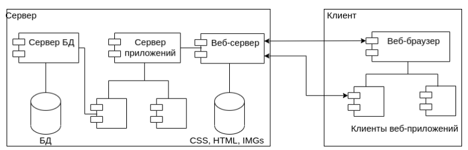
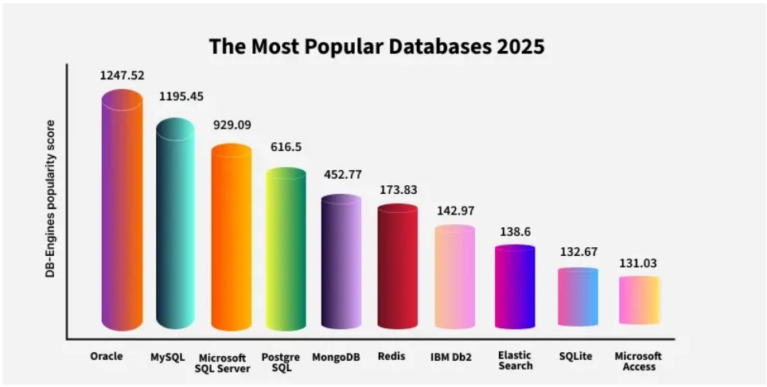
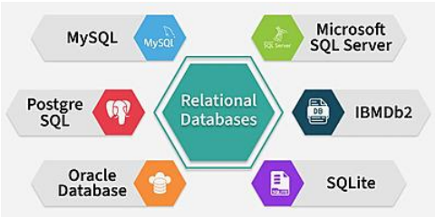
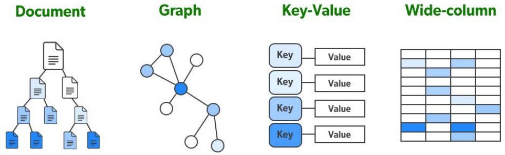
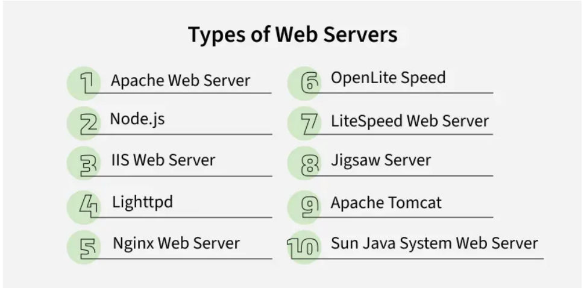
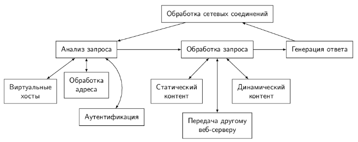

https://www.geeksforgeeks.org/blogs/how-web-works-web-application-architecture-for-beginners/

https://www.geeksforgeeks.org/web-templates/user-interface-ui/

https://www.geeksforgeeks.org/operating-systems/what-is-middleware/

https://www.geeksforgeeks.org/dbms/what-is-database/

https://www.geeksforgeeks.org/computer-networks/what-is-server/

https://www.geeksforgeeks.org/javascript/javascript-tutorial/

АРХИТЕКТУРА И ФРЕЙМВОРКИ ВЕБ-ПРИЛОЖЕНИЙ - УЧЕБНОЕ ПОСОБИЕ

## Архитектура веб-приложения

`Архитектура веб-приложения` — это структура, которая описывает, как все его компоненты (клиентская часть, сервер, база данных, сервисы) организованы, взаимодействуют между собой и внешними системами, как устанавливается соединение между клиентом и сервером, обеспечивая масштабируемость, надежность, обработку высокого трафика и удобство поддержки в будущем. Каждое веб-приложение построено на нескольких компонентах и многоуровневой архитектуре и запрос пользователя проходит через все эти уровни, прежде чем генерировать ответ.



`Веб-приложение` - это программа, которая работает в браузере и решает конкретную проблему, даже если он просто находит какую-то информацию. Он так же интерактивен, как настольное приложение и работает с системой управления контентом.

`Веб-сайт` представлял собой просто коллекцию статических страниц. Веб-сайт становится веб-приложением, когда он включает в себя как статические, так и динамические страницы.

Когда пользователь делает запрос на веб-сайте, несколько частей приложения работают вместе: `пользовательский интерфейс`, `промежуточные системы`, `базы данных`, `серверы` и `браузер`. Все эти элементы соединяет и поддерживает плавное взаимодейтсвие между ними `фреймворк` - Архитектура веб-приложений.

### Примеры фреймворков
`ASP.NET` — это фреймворк от Microsoft для создания веб-сайтов и приложений, работающий на платформе `.NET`, позволяющий использовать языки C#, F# или VB.NET для разработки динамических страниц, веб-API, микросервисов и приложений в режиме реального времени (SignalR). 

Использует языки семейства `.NET`, в основном C#, для серверной логики, сочетая его с HTML, CSS и JavaScript для пользовательского интерфейса

`ASP.NET Core` — современная, кроссплатформенная (Windows, Linux, macOS), отличающаяся высокой производительностью и гибкостью. Включает встроенные механизмы для защиты от распространенных веб-уязвимостей, таких как `XSS` и `CSRF`, а также поддерживает различные методы аутентификации.

`Flask` — это легковесный (микро) веб-фреймворк для языка программирования Python, который предоставляет минимальный набор инструментов для быстрой и гибкой разработки веб-приложений, API, микросервисов и прототипов. 

Содержит только базовый функционал (маршрутизацию запросов, работу с шаблонами), а дополнительные возможности (ORM, аутентификация) подключаются через расширения. Позволяет разработчикам самим выбирать компоненты для проекта, подстраивая его под конкретные нужды. Использует шаблонизатор `Jinja2` для динамического создания HTML-страниц и набор инструментов `Werkzeug`. 

### Языки программирования веб-приложения
Все веб-приложения работают на стороне клиента и на стороне сервера. 

`Серверный код` может быть написан с использованием языков `Python`, `JavaScript`, `C#`, `PHP`, `Ruby on Rails` и т.д. Любой код может иметь возможность работать на сервере, если он может отвечать на HTTP-запросы.

`Языки клиента` включают в себя сочетание `HTML`, `CSS` и `JavaScript`. Этот код анализируется браузером, и его можно увидеть так же, как и отредактировать пользователем. Только через HTTP-запросы клиентский код может взаимодействовать с сервером. Кроме того, он не может считывать файлы с сервера напрямую.

### Компоненты веб-приложений
Архитектура веб-приложений работает на различных компонентах. 
1. Компоненты приложения `пользовательского интерфейса`. В этой категории роль веб-страницы связана с дисплеем, панелями инструментов, журналами, уведомлениями, статистикой, настройками конфигурации и т.д. и не имеет ничего общего с функциональностью или работой веб-приложения.

2. `Структурные компоненты`. В основном связана с функциональностью веб-приложения, с которым взаимодействует пользователь, контролем и хранением баз данных. Эта структурная часть включает в себя - Веб-браузер или клиент; Сервер веб-приложений; Сервер баз данных. 

### Слои и уровни веб-приложений
Веб-приложений разделены на множество различных слоев или уровней, которые называются многоуровневой или трехъярусной архитектурой.

`Слой презентации` - этот уровень доступен клиенту через браузер и включает в себя компоненты `пользовательского интерфейса` и компоненты `процесса` пользовательского интерфейса. Компоненты пользовательского интерфейса построены с использованием `HTML`, `CSS` и `JavaScript` (и его фреймворков или библиотеки).

`Бизнес-слой` - логика бизнеса или доменная логика или уровень приложений. Он принимает запрос пользователя от браузера, обрабатывает его и регулирует маршруты, по которым будут доступны данные. Весь рабочий процесс закодирован в этом слое. 

`Постоянный слой` - уровень хранения или доступа к данным. Этот уровень собирает все вызовы данных и обеспечивает доступ к постоянному хранению приложения. Бизнес-слой тесно связан с слоем постоянства, поэтому логика знает, с какой базой данных разговаривать. Сервер и программное обеспечение системы управления базами данных существуют в инфраструктуре хранения данных, которая используется для связи с самой базой данных, приложениями и пользовательскими интерфейсами для извлечения данных и их анализа. 

Некоторые другие части веб-приложения:

`Сквозной код` - эта часть обрабатывает коммуникации, оперативное управление и безопасность. 

`Интеграции третьих сторон` - сторонние API, платежные шлюзы, социальные логины, GDS на туристических сайтах и т.д.

### Типы архитектуры веб-приложений

1. `Приложения для одной страницы` - это современные веб-приложения, которые загружают только необходимые элементы для создания гладкого и интерактивного пользовательского опыта. Вместо того, чтобы загружать новую страницу для каждого действия, контент обновляется на той же странице. Использует такие технологии, как `AJAX` (асинхронный JavaScript и XML) для связи. Пользователи могут продолжать взаимодействовать со страницей, в то время как контент обновляется в фоновом режиме, что приводит к более быстрому взаимодействию.

2. `Микросервисы` - это небольшие независимые сервисы, которые обрабатывают конкретные функциональные возможности. Каждый компонент работает сам по себе, позволяя разработчикам выбирать разные языки программирования или технические стеки для разных сервисов. Компоненты не зависят друг от друга.

3. В `безсерверных архитектурах` разработчики полагаются на сторонних облачных провайдеров для управления серверами и инфраструктурой. Логика приложений работает без прямого управления серверами. Идеально подходит для компаний, которые не хотят обрабатывать инфраструктуру или оборудование. Уменьшает оперативные накладные расходы и упрощает развертывание.

### Пользовательский интерфейс
Дизайн пользовательского интерфейса (`UI`) определяет, как пользователи взаимодействуют с цифровыми системами, такими как веб-сайты и приложения:
1. Графический пользовательский интерфейс (`GUI`): визуальные интерфейсы с использованием клавиатур и мониторов (например, настольных приложений).
2. `Menu-Driven Interface`: Навигация по меню опций (например, интерфейсы ATM).
3. Интерфейс `на основе формы`: предоставляет поля для ввода данных (например, меню настроек).
4. `Сенсорный` пользовательский интерфейс: использует тактильный ввод на сенсорных экранах (например, смартфоны).
5. `Голосовой` пользовательский интерфейс (VUI): работает с помощью голосовых команд (например, виртуальных помощников, таких как Siri).

`UI` дизайн опирается на ключевые компоненты для создания функциональных, удобных интерфейсов:
1. Входные элементы управления: `кнопки`, выпадающие и текстовые поля для ввода пользователя.
2. Навигационные компоненты: `строки поиска`, слайдеры и значки для руководства пользователями.
3. Информационные компоненты: панели прогресса, `уведомления` и оповещения для передачи статуса.
4. Визуальные элементы: типография, `цвета и графика` для повышения эстетики и читабельности.

Пользовательский интерфейс (`UI`) и Пользовательский опыт (`UX`) являются тесно связанными понятиями в области программного обеспечения и разработки веб-сайтов. `UI` фокусируется на качестве контакта пользователя с продуктом. `UX` сосредотачивается вокруг намерений и функциональности продукта. `UI` больше ориентирован на дизайн конечного продукта. `UX` занимается управлением общим проектом от идеи до разработки и доставки.

### Промежуточное ПО: Категории, Типы и работа
Промежуточное программное обеспечение - действуют как посредники между различными приложениями, системами, или службами, облегчая их общение и взаимодействие. Они гарантируют, что данные и запросы могут быть обменены бесперебойно и эффективно. 

Промежуточное программное обеспечение служит связующим звеном между пользователями, данными и приложениями.

Цели `Middleware` - контролировать доступ к различным внутренним ресурсам, устанавливать ссылки на темы и очереди сообщений,контролировать доступ к облачным сервисам (Amazon Simple Storage Service), выполнять логику в соответствии с запросом клиента, в балансировке нагрузки, управлении транзакциями и одновременной обработке, обеспечение доступа к внутренним ресурсам.

Способность промежуточного программного обеспечения для вызова клиентов зависит от двух требований: безопасного соединения (SSL) и аутентификации, осуществляемой путем использования цифрового сертификата или комбинации имени пользователя и пароля.

`Типы промежуточного ПО`:
1. Удаленная процедура вызова (RPC): программа может запросить услугу из другой программы, работающей на другом компьютере или сети, используя этот протокол, который предоставляется через промежуточное программное обеспечение.
2. Промежуточное программное обеспечение для обмена сообщениями.
3. Встроенное промежуточное программное обеспечение обеспечивает интеграцию и связь между операционными системами реального времени и встроенными приложениями.
4. Промежуточное программное обеспечение API позволяет программистам проектировать и контролировать API в своих приложениях.
5. Асинхронное промежуточное программное обеспечение для потоковой передачи данных путем дублирования потоков данных в промежуточном хранилище.
6. Транзакция или транзакционное промежуточное ПО использует мониторинг процесса транзакции, чтобы убедиться, что транзакции проходят гладко от одного этапа к другому.

### База данных
База данных представляет собой структурированную коллекцию данных, предназначенных для эффективного хранения, поиска и манипулирования. Служит централизованным репозиторием, позволяющим получать доступ, управляться и обновляться несколькими пользователями или приложениями.

Базы данных необходимы, потому что они:
1. Эффективная масштабировка для обработки огромных объемов данных.
2. Обеспечивают целостность данных с помощью встроенных правил и ограничений.
3. Защита данных с помощью безопасного контроля доступа и поддержки соответствия.
4. Включают аналитику, выявляя тенденции и направляя информированные бизнес-решения.

В основе каждой системы баз данных лежит `Система управления базами данных` (СУБД) — программный уровень, который выступает в качестве посредника между пользователями и необработанными данными. `СУБД` обрабатывает такие задачи, как запрос, обновление, удаление и управление разрешениями доступа, не требуя от пользователей знать физические данные о том, где хранятся данные.

Когда пользователь отправляет запрос (поиск или обновление), `СУБД` обрабатывает запрос, находит соответствующие данные и возвращает результаты в структурированном формате. `СУБД` обеспечивают такие функции, как резервное копирование, восстановление, оптимизация производительности и безопасность данных, чтобы обеспечить эффективную и надежную работу системы.



Базы данных состоят из нескольких компонентов, которые работают вместе для эффективного хранения, организации и извлечения данных:
1. `Данные` - информация, хранящаяся в базе данных, такая как текст, номера, изображения или файлы.
2. `Схема` - структурный план, который определяет, как данные организованы — таблицы, поля, типы данных и отношения.
3. `СУБД` - программное обеспечение, которое управляет операциями баз данных, такими как хранение, поиск и безопасность (например, MySQL, Oracle).
4. `Запросы` - инструкции (обычно SQL, язык структурированных запросов реляционных БД), используемые для извлечения или манипулирования данными в базе данных.
5. `Пользователи` - люди или системы, которые взаимодействуют с базой данных, каждая из которых имеет определенные роли и разрешения доступа.

Базы данных можно классифицировать на две - `реляционные` (SQL) и `нереляционные` (NoSQL). `Нереляционные БД` подразделяется на четыре типа: БД `документов`, БД `ключ-значение`, БД `колоночные` и БД `графов`.


**`Реляционные БД`** организуют данные в таблицы, состоящие из строк (записей) и столбцов (полевых полей). Они используют схемы, чтобы определить, как структурированы данные и как разные таблицы связаны друг с другом.
* Строгая структура, основанная на схеме.
* Основные ключи (уникальные идентификаторы) и иностранные ключи (отношения между таблицами).
* Сильное соответствие `ACID` (Атомарность, Согласованность, Изолированность, Надёжность).
* Идеально подходит для структурированных данных.

Примеры: `MySQL`, `PostgreSQL`, `Oracle`, `Microsoft SQL Server`.


`ACID` означает `Атомарность`, `Согласованность`, `Изолированность` и `Надёжность` — четыре основных принципа, которые гарантируют, что транзакции в базе данных являются надежными, точными и безопасными.

1. `Атомарность` - гарантирует, что транзакции завершены полностью или вообще не завершены.
2. `Согласованность`: гарантирует, что база данных перемещается из одного действительного состояния в другое.
3. `Изолированность`: гарантирует, что несколько транзакций могут происходить одновременно, не затрагивая друг друга.
4. `Надёжность`: сохраняет изменения навсегда после завершения.

**`Нереляционные БД`** (NoSQL) — это системы хранения данных, которые отходят от традиционной табличной структуры SQL-баз, предлагая гибкие модели данных (документы, ключ-значение, графы, колонки) для работы с неструктурированными/полуструктурированными данными, обеспечивая горизонтальную масштабируемость, высокую производительность и отказоустойчивость, что критично для Big Data и современных веб-приложений. 
* Работа с большими объемами неструктурированных данных (логи, IoT-данные, пользовательские профили).
* `BASE` вместо ACID: отдают приоритет доступности и распределенной согласованности (BASE), а не строгой атомарности транзакций (ACID). 
* Системы, требующие высокой скорости разработки и гибкости.
* Приложения с высокими требованиями к масштабируемости и доступности (социальные сети, контент-платформы)

Примеры: `MongoDB`, `Couchbase`, `Redis`, `Elasticsearch`.

1. БД документов - Храните данные в качестве JSON-подобных документов. (`MongoDB`)
2. Key-Value БД – Храните простые пары ключ-значение для быстрого поиска. (`Redis`)
3. Колоночные БД – Хранить данные по колонкам для аналитики. (`Apache Cassandra`)
4. Графовые БД - Храните узлы и отношения для подключенных данных. (Пример: Neo4j)


Вот разбивка наиболее подходящих типов баз данных для различных технологических доменов:
1. Базы данных для `веб-разработки.` Веб-приложения в значительной степени полагаются на БД для хранения и управления пользовательскими данными, контентом и транзакциями. `Популярные БД`: MySQL, PostgreSQL, MongoDB, Firebase. `Use Case`: Динамическое содержание, аутентификация, каталоги продуктов.

2. Базы данных для `мобильной разработки`. Мобильные приложения требуют быстрых, легких баз данных, оптимизированных для ограниченных ресурсов устройства и автономного доступа.
`Популярные БД`: SQLite, Realm, Firebase Realtime DB
`Use Case`: Локальное хранилище, синхронизация пользовательских предпочтений, офлайн-первые приложения.

3. Базы данных для `DevOps`. Команды DevOps управляют контролем версий и инфраструктурой CI/CD, где базы данных должны поддерживать автоматизацию, мониторинг и масштабирование. `Популярные БД`: PostgreSQL, Redis, InfluxDB, Cassandra. `Use Case`: Логирование, мониторинг метрик, конфигурация хранения.

4. Базы данных для `Data Engineering`. Инженеры данных обрабатывают огромные объемы в реальном времени. Их базы данных должны быть высокомасштабируемыми и производительными. `Популярные БД`: Apache Hadoop (HDFS), Apache Cassandra, Amazon Redshift, Google BigQuery. `Use Case`: процессы ETL, конвейеры больших данных, потоковая передача данных в реальном времени.

5. Базы данных для `Data Science`. Специалисты по обработке данных нуждаются в гибком запросе, агрегации данных и простой интеграции с такими инструментами, как Python. `Популярные БД`: PostgreSQL, MongoDB, Apache Hive, Snowflake. `Use Case`: Извлечение функций, исследовательский анализ, моделирование наборов данных.

6. Базы данных для `искусственного интеллекта`. Системы ИИ зависят от структурированных, неструктурированных и потоковых данных для обучения и прогнозирования моделей. `Популярные БД`: MongoDB, Apache Cassandra, Google BigQuery, AWS S3 (data lake). `Use Case`: Хранение наборов данных обучения в реальном времени, циклы обратной связи в реальном времени, циклы обратной связи модели.

7. База данных для `облачных вычислений`. В облачных средах базы данных должны поддерживать автоматизацию, высокую доступность и интеграцию с обслуживанием. `Популярные БД`: Amazon Aurora, Google Cloud Spanner, Microsoft Azure Cosmos DB. `Use Case`: SaaS платформы, распределенные приложения, бессерверные среды.

8. База данных для `Blockchain/Web3.0`. Системы, основанные на блокчейне, нуждаются в защищенных от взлома, децентрализованных базах данных для транзакций без доверия и прозрачности. `Популярные БД`: BigchainDB, IPFS, Ethereum (как реестр данных), Chainlink. `Use Case`: Неизменные реестры, децентрализованная личность, интеллектуальные данные.

### Сервер
`Сервер` - это аппаратное устройство или программное обеспечение, которое обрабатывает запросы, отправленные по сети, и отвечает на них. Клиент - это устройство, которое подает запрос и ждет ответа от сервера.

Каждый тип сервера выполняет определенную задачу и оптимизирован для этой роли:
1. `File Server`: хранит и позволяет пользователям обмениваться файлами по сети.
2. `Почтовый сервер`: отправляет, получает и хранит электронные письма (например, Microsoft Exchange, Postfix).
3. `Сервер БД`: обеспечивает доступ к базе данных и обрабатывает запросы (например, MySQL, Oracle).
4. `Игровой сервер`: размещает многопользовательские онлайн-игры и синхронизирует игровые данные между игроками.

5. `Веб-сервер`: обслуживает веб-страницы для браузеров (например, Apache, Nginx).
Вот упрощенная версия того, как работает процесс
* Запрос клиента: В веб-браузере (https://www.example.com/) пользователь вводит URL.
* Разрешение DNS: Чтобы получить IP-адрес запрашиваемого домена, браузер связывается с сервером системы доменных имен (DNS).
* Подключение к веб-серверу: используя полученный IP-адрес, браузер устанавливает соединение с веб-сервером.
* Запрос на обработку: веб-сервер получает запрос и обрабатывает его.
* Подача Ответа: Запрашиваемые файлы (HTML, CSS, JavaScript, изображения) отправляются обратно в браузер клиента веб-сервером.
* Рендеринг веб-страницы: на основе полученных данных браузер отображает веб-страницу пользователю.


https://www.geeksforgeeks.org/node-js/web-server-and-its-type/

Архитектура веб-сервера:


6. `Сервер приложений`: серверы размещают веб-приложения (компьютерные программы, которые работают внутри веб-браузера), что позволяет пользователям в сети запускать и использовать их, предотвращая установку копии на своих компьютерах. Их клиенты - компьютеры с веб-браузером. 
7. `Каталог сервер`: серверы поддерживают индекс или содержимую информацию, которую можно найти в большой распределенной сети. Распределенные сети могут включать компьютеры, пользователей, файлы, совместно используемые на файловых серверах и веб-приложениях. Их клиенты - это любая компьютерная программа, которая должна что-то найти в сети. 
8. `Связующий сервер`: серверы поддерживают среду, необходимую для одной конечной точки связи, чтобы найти другие конечные точки, а затем связаться с ними. 
9. `Вычислительный сервер`: серверы имеют огромное количество вычислительных ресурсов, которые включают процессор и память со случайным доступом через сеть.
10. `Факс сервер`: серверы совместно используют один или несколько факсимильных аппаратов по сети, что устраняет проблемы физического доступа.
11. `Печатный сервер`: серверы совместно используют один или несколько принтеров по сети, которая устраняет проблемы физического доступа. Их клиенты - компьютеры, нуждающиеся в печати чего-то.
12. `Прокси-сервер`: сервер выступает в качестве посредника между клиентом и сервером, принимающим входящий трафик от клиента и отправляющим его на сервер. 

### Веб-браузер
`Веб-браузер` - это прикладное программное обеспечение, платформа, которая позволяет пользователям получать доступ к информации из Интернета, выступая в качестве интерфейса между клиентом (пользователем) и сервером.

Когда пользователь получает доступ к веб-сайту, вводя такой URL https://www.geeksforgeeks.org/ в браузер, браузер сначала контактирует a `DNS` (система доменных имен) сервер для перевода доменного имени в IP-адрес, например, `52.85.142.233`. После получения IP-адреса браузер отправляет запрос на соответствующий веб-сервер. Веб-сервер обрабатывает этот запрос и отвечает требуемым контентом, в том числе `HTML`, `CSS`, `Изображения`, `сценарии`. Затем браузер использует этот контент для отображения веб-страница для пользователя.

`HTML` (HyperText Markup Language) - это основной язык, используемый для структурирования и отображения контента в Интернете, определяя такие элементы, как текст, изображения, ссылки и макет страниц, чтобы браузеры могли правильно отображать веб-сайты. Использует теги для определения элементов веб-страницы. Формирует основную структуру каждого сайта. Работает с CSS для стиля и JavaScript для интерактивности.

`XML` (eXtensible Markup Language) — для хранения и передачи данных, позволяя создавать собственные теги, но требуя строгого синтаксиса. Они не являются конкурентами, а дополняют друг друга: HTML показывает, XML структурирует. 

`CSS` (Cascading Style Sheets) языкстилей, используемый для стиля и улучшения презентации веб-сайта. CSS является одним из трех основных компонентов веб-страницы, наряду с HTML и JavaScript. HTML добавляет структуру на веб-страницу. CSS добавляет стиль и делает его визуально привлекательным. JavaScript добавляет интерактивность и логику на страницу.

`JavaScript` - это язык программирования, используемый для создания динамического контента для сайтов. Это легкий, кроссплатформенный и однопоточный язык программирования. Это интерпретируемый язык, который выполняет код за строкой, обеспечивая большую гибкость.

На стороне клиента `JavaScript` работает вместе с HTML и CSS. HTML добавляет структуру на веб-страницу, CSS стилизует ее, а `JavaScript` воплощает ее в жизнь, позволяя пользователям взаимодействовать с элементами на странице, такими как действия по нажатию кнопок, заполнению форм и показу анимации. `JavaScript` на стороне клиента выполняется непосредственно в браузере пользователя.

На стороне сервера `JavaScript` используется для доступа к базам данных, обработке файлов и функциям безопасности для отправки ответов в браузеры.

https://www.geeksforgeeks.org/javascript/where-to-put-javascript-in-an-html-document/

Когда мы посещали любой веб-сайт через Интернет, наш `веб-браузер хранит` информацию о нас в файлах `cookie`. `Cookies` предназначены для запоминания информации о нашей истории просмотра, помнить о наших интересах, наших шаблонах просмотра. Веб-сайты показывают нам рекламу на основе наших интересов, используя файлы `cookie`.

https://www.geeksforgeeks.org/websites-apps/understanding-cookies-in-web-browsers/

Обычно файлы cookie хранятся в определенной папке или каталоге на компьютере 
```
C:\Users[username]\AppData\Roaming[browser name]\Cookies,
```
Существует несколько типов файлов cookie:
1. `Сессионные файлы cookie` также известны как временные файлы cookie, которые присутствуют до тех пор, пока пользовательский браузер открыт. Сессионные файлы cookie удаляются после закрытия браузера, а сеанс пользователя неактивен (на основе времени). Сессионные файлы cookie чаще всего используются для поддержания сеанса пользователя (например, аутентификации) в браузере.
2. `Постоянные файлы cookie `также известны как долгосрочные файлы cookie. Постоянные файлы cookie могут длиться дольше, чем сессионные файлы cookie. Постоянные файлы cookie хранятся на устройстве пользователя в течение определенного периода (менее 6 месяцев). Постоянные файлы cookie чаще всего используются для долгосрочного отслеживания и запоминания предпочтений пользователей.
3. `Файлы cookie первой стороны` устанавливаются веб-сайтом, который вы посещаете в настоящее время. Файлы cookie первой стороны обычно используются для обеспечения хорошего пользовательского опыта, сбора аналитических данных, запоминания языковых настроек и т.Д.
4. `Сторонние файлы cookie` устанавливаются доменами, которые вы не посещаете. Сторонние файлы cookie в основном используются для межсайтового отслеживания и рекламных целей, поэтому эти файлы cookie собирают данные о ваших привычках просмотра и по ним подаются объявления. Например, когда вы посещаете веб-сайт, он может включать контент (например, рекламу или виджеты социальных сетей) из сторонних доменов. Эти сторонние домены могут устанавливать файлы cookie в вашем браузере для отслеживания вашей онлайн-активности и создания профилей для целевой рекламы или аналитики.

### Общие сведения об архитектуре Веб-приложения
`URI` (Uniform Resource Identificator) — унифицированная нотация для адресации ресурсов, доступных по Сети:
```
scheme://host[:port]/path/. . . /[?query-string][#anchor]
```
Компоненты `URI`:
1) `scheme` — схема обращения к ресурсу (http, file, mailto и др);
2) `host` — идентификатор компьютера (IP-адреса или доменного имени);
3) `port` — номер порта, по которому слушаются запросы на ресурс;
4) `path` — путь до ресурса в иерархии директорий на компьютере, на котором находится ресурс;
5) `query-string` — параметры запроса к ресурсу. Задаются в формате название параметра = значение параметра и разделены знаком &;
6) `anchor` — ссылка на часть документа. В документе могут быть установлены специальные метки (ярлыки), на которые можно сослаться

`HTTP` (Hypertext Transfer Protocol) — это базовый протокол Всемирной паутины, набор правил для обмена данными (текстом, изображениями, видео) между веб-браузерами (клиентами) и веб-серверами, который работает по модели "запрос-ответ" для загрузки и отображения веб-страниц, но сейчас используется для любых данных. 

Для `HTTP V0.9` особенностью являлось наличие единственного вида запроса — GET и единственного вида ответа — HTML. 

В 1996г `HTTP/1.0`, которая включала помимо GET-запроса, появились запросы HEAD и POST; зафиксировано описание формата запроса и ответа; описана базовая аутентификация и заголовок Authorization; описаны правила кеширования на стороне клиента.

В 1997 г. появилась версия `HTTP/1.1`, которая определила новые 24 ошибки для уточнения `состояния ответа`; добавлена дайджест-аутентификация, когда вместо отправки пароля открытым текстом отправляется результат работы хеш-функции `MD5`; в рамках одного TCP-соединения можно выполнять несколько запросов;отправка заголовка `host` в запросе становится обязательной;

В 2015 г. опубликован стандарт `HTTP/2`, который определяет понятия схемы `http` и `https`, а также описывает рекомендации по
соблюдению безопасности при реализации; уточняет условия запроса, заголовки метаданных для определения состояния, заголовки запроса и правила построения ответа на запрос; вводит понятие частичных запросов, когда у сервера существует возможность отправить не все данные сразу, а только часть (медиа-файлов); определяет порядок кеширования на стороне клиента и сервера и необходимые для этого заголовки; определяет каркас для реализации аутентификации; сервер может отправлять данные, которые еще не запрошены; сжатие передаваемых заголовков;явная приоретизация запросов;

С июня 2022 года находится в стадии предлагаемого стандарта `HTTP/3`, который переходит с TCP на `QUIC` (основанный на UDP), что снижает задержку при установке соединения; `QUIC` и `HTTP/3` позволяют независимым потокам данных работать параллельно, даже если один пакет потерялся; бесшовный перехода между сетями (например, Wi-Fi и сотовая связь) без разрыва соединения, что было проблемой для HTTP/1.1 и HTTP/2; `встроенное шифрование` (`TLS 1.3`) встроено в `QUIC`, что повышает безопасность и ускоряет согласование.

HTTP-запрос и ответ состоят из 4 частей, которые следуют в строгом порядке друг за другом:
1) строка запроса — содержит метод взаимодействия, адрес обращения к серверу, версию протокола HTTP. В случае ответа строка запроса также включает номер ответа;
2) заголовки — описывают различную дополнительную информацию о состоянии взаимодействия;
3) пустая строка;
4) тело сообщения — включает сами данные, может отсутствовать.

Формально запрос:
```
HTTP-request = method SP request-target SP HTTP-version CRLF 
    *( header-field CRLF )
    CRLF
    [ message-body ]
```
А ответ:
```
HTTP-response = HTTP-version SP status-code SP reason-phrase CRLF
    *( header-field CRLF )
    CRLF
    [ message-body ]
```
В вышеперечисленных примерах приняты следующие обозначения:
1) method — метод HTTP;
2) request-target — адрес запрашиваемого ресурса;
3) HTTP-version — версия протокола HTTP;
4) SP — пробел;
5) CRLF — перенос строки;
6) header-field — заголовок;
7) *( header-field CRLF ) — множество заголовков с переносом строки;
8) message-body — тело сообщения.

При использовании утилиты `curl` и опции `-v` можно получить все части запроса и ответа. 

1. `GET` — получение текущего представления запрошенного ресурса. Параметры для данного метода указываются прямо в строке запроса;
2. `HEAD` — аналогичен методу GET, только сервер возвращает статус и заголовки без тела ответа. Метод HEAD обычно для проверки наличия ресурса или данных о нем (время последней модификации ресурса);
3. `POST` — применяется для отправки пользовательских данных на сервер, который эти данные обрабатывает в соответствии со своей логикой. В отличие от GET, данные от клиентской
стороны включаются в тело запроса, а не в строку состояния.
4. `PUT` — выполнение этого метода на сервере предполагает создание заданного ресурса. Например, в случае выполнения пользователем запроса `PUT /page/1` на веб-сервере должен быть создан ресурс (страница) с идентификатором Для получения содержимого данного ресурса (страницы) должен быть выполнен запрос GET: `GET /page/1`;
5. `DELETE` — выполнение этого метода на сервере предполагает удаление заданного ресурса. Например, запрос пользователя `DELETE /page/1` должен удалить ресурс (страницу) с идентификатором 1;
6. `CONNECT` — позволяет устанавливать защищенное соединение через нешифрованный прокси-сервер;
7. `OPTIONS` — возвращает информацию об опциях соединения к заданном ресурсу. Например, может вернуть для ресурса в за-
головке Allow, какие методы клиент может использовать при
обращении к ресурсу (GET, PUT, DELETE);
8. `TRACE` — позволяет получить дополнительную информацию с промежуточных серверов, через которые проходит запрос.

Сервер может вернуть код состояния запроса:
1. `1XX` — информационные коды. Появились начиная с протокола HTTP/1.1, дополнительно информируют клиента о наступлении определенной информации.
2. `2XX` — успешные коды. Используются для обозначения того, что запрос от клиента к серверу был успешно выполнен, а ответ был отправлен (200 OK (хорошо)).
3. `3XX` — перенаправляющие коды. Обозначают, что клиенту необходимо выполнить дополнительные действия для получения доступа к ресурсу, при этом пользовательский агент может это сделать без вмешательства самого пользователя.
4. `4XX` — коды ошибок клиента. Возвращаются сервером в том случае, если клиент допустил ошибку (404 Not Found (не найден)).
5. `5XX` — коды ошибок сервера. Возвращаются сервером в том случае, если сервер не смог корректно обработать запрос (500 Internal Server Error (внутренняя ошибка сервера)).

`HTTP-заголовки` — это пары `имя:значение`, которые передаются в HTTP-сообщениях (запросах и ответах) для предоставления дополнительной метаинформации. Они могут содержать описание данных и информацию, необходимую для взаимодействия между клиентом и сервером. Заголовки и их статусы перечислены в реестре `IANA` (https://www.iana.org/assignments/message-headers/message-headers.xhtml), который постоянно обновляется.

Заголовки делятся на 4 группы:
1. `Основные` — применяются как в ответах, так и в запросах. Примеры заголовков:
`Date` — заголовок определяет время создания сообщения.
`Cache-Control` — заголовок используется для заданий инструкций кеширования, например: `Cache-Control: public, max-age=200000`. `Connection` — заголовок определяет, хотел бы клиент или сервер закрыть соединение после данной транзакции. 
2. Заголовки `запроса` — применяются в запросах. Примеры заголовков: 
`Accept` — определяет, какой тип ответа в виде MIME-типа хотел бы получить клиент. Примеры использования: Accept: text/html, Accept: */*. `Cookie` — перечисляет имена и значения Cookie, которые были сохранены на клиенте в предыдущие сессии с помощью заголовка Set-Cookie. `User-Agent` — заголовок, который позволяет серверу определить производителя, операционную систему и версию клиентского приложения. `Referer` — заголовок, который определяет предыдущий URL, с которого был получен текущий URL в результате перенаправления.
3. Заголовки `ответа` — применяются в ответах. Примеры заголовков: `Age`. `Location`. `Server`.
4. Заголовки `сущностей` — описывают содержимое сообщения.Примеры заголовков: `Content-Length`. `Content-Language`. `Content-Encoding`.

При разработке сложного приложения могут использоваться классические `шаблоны проектирования`. 
1. `Шаблон преобразователь` (Transform View) — преобразует модели данных в HTML-код. Использование Transform View подразумевает преобразование, когда на входе есть данные и модель, а на выходе HTML.
2. Шаблон `шаблонизатор` (Template View) — преобразует HTML-шаблон, созданный с использованием маркеров, в полноценную веб-страницу. В случае со статическими HTML-страницами, которые не меняются от запроса к запросу, можно использовать удобный `WYSIWYG-редактор`. В случае с динамическими страницами — создавать динамические страницы так же, как и статические, но помечать их маркерами, которые могут быть заменены динамической информацией.
3. Шаблон `контроллер приложения` (Application Controller) — единая точка управления отображением и выполнением приложения. Устранить дублирование кода можно посредством помещения всей логики выполнения приложения в контроллер приложения (Application Controller). Тогда контроллер входа (Input Controller) будет обращаться к контроллеру приложения(Application Controller) за необходимыми к выполнению на модели и за необходимыми представлениями (view) в зависимости от контекста.
4. Шаблон `двухшаговая шаблонизация` (Two Step View) — преобразует данные в HTML в два шага: сначала формирует логическую структуру, а затем заполняет ее отформатированными данными. Возможна ситуация, когда нужно сделать глобальные изменения на всем сайте возникают трудности, потому что код представления дублируется от страницы к странице и надо исправлять его во всех файлах. Шаблон Two Step View решает эту проблему разбиением шаблонизации на две части. Пример: хорошая реализация двухшаговой шаблонизации есть в фреймфорке `Zend Framework` в классе Zend_Layout. 
5. Шаблон `контроллер страницы` (Page Controller) — объект,обрабатывающий запрос к отдельной странице или действию. Когда происходит запрос к статической HTML-странице, веб-серверу передается имя и путь к хранящемуся на нем отдельному HTML-документу. В случае с динамическими страницами один путь соответствует одному файлу, который обрабатывает запрос.
6. Шаблон `контроллер входа / Единая точка входа` (Front Controller) — один контроллер обрабатывает все запросы к веб-сайту. Паттерн Front Controller объединяет всю обработку запросов, пропуская запросы через единственный объект-обработчик. Этот объект содержит общую логику поведения, которая может быть изменена в реальном времени при помощи декораторов. После обработки запроса контроллер обращается к конкретному объекту для отработки конкретного поведения.
7. Шаблон `модель-вид-контроллер` (MVC, Model View Controller) — разделяет работу веб-приложения на три отдельные функциональные роли: модель данных (model), пользовательский интерфейс (view) и управляющую логику (controller). Таким образом, изменения, вносимые в один из компонентов, оказывают минимально возможное воздействие на другие компоненты. Большинство фреймворков для веб-программирования сейчас в основе своей содержат именно `MVC`. К наиболее удачным примерам применения этого паттерна для языка PHP можно отнести `Zend Framework` и `cakePHP`.

