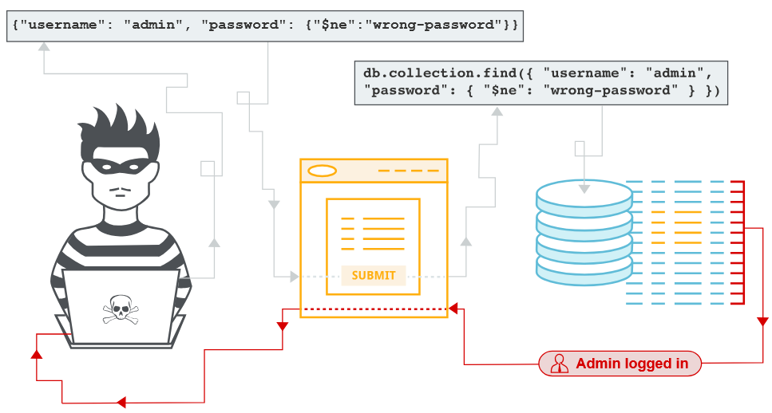

https://portswigger.net/web-security/nosql-injection
# 1.4 Инъекция NoSQL
`Инъекция NoSQL` — это уязвимость, при которой злоумышленник может «вклиниться» в запросы, отправляемые приложением в базу данных NoSQL, и подменить их на свои. По сути, хакер вкладывает в запрос специально составленные данные — и база данных выполняет их как команду.

`Инъекция NoSQL` может позволить злоумышленнику:
* Обходить механизмы аутентификации или защиты. Например, злоумышленник может войти в систему без пароля или получить доступ к учётной записи администратора.
* Извлекать или редактировать данные. Хакер может прочитать конфиденциальную информацию (например, личные данные пользователей) или изменить её — например, увеличить баланс на счёте или подменить важные записи.
* Вызвать отказ в обслуживании (DoS). Атака может перегрузить базу данных или вызвать ошибки, из‑за которых приложение перестанет работать для обычных пользователей.
* Выполнить код на сервере. В некоторых случаях злоумышленник может запустить вредоносный код прямо на сервере, что даёт ему полный контроль над системой или позволяет украсть все данные.

## Чем NoSQL отличается от SQL?
Базы данных NoSQL хранят и извлекают данные в формате, отличном от традиционных таблиц реляционных баз данных (как в SQL). Разберём подробнее:
1. `Формат хранения`. Вместо строгих таблиц с фиксированными колонками `NoSQL` использует гибкие структуры: документы (например, в формате `JSON`), пары `«ключ‑значение»`, `графы` или `столбцовые хранилища`. Это удобно для неструктурированных или быстро меняющихся данных.
2. `Языки запросов`. В SQL есть единый стандарт языка запросов, а в NoSQL каждый тип базы данных (`MongoDB`, `Cassandra`, `Redis` и т.д.) может использовать свой собственный язык и синтаксис. Из‑за этого сложнее создать универсальные средства защиты — нужно учитывать особенности каждой системы.
3. `Меньше ограничений`. NoSQL не требует строгой схемы данных и жёстких связей между таблицами (реляционных ограничений). Это упрощает разработку и масштабирование, но может снизить встроенную защиту: например, проверка типов данных или валидация ввода часто слабее, чем в SQL. 



## 1. Базы данных NoSQL
Базы данных NoSQL хранят и извлекают данные не так, как традиционные SQL‑базы с их таблицами. Они созданы специально для работы с большими объёмами неструктурированных или полуструктурированных данных — например, с логами, данными соцсетей, IoT‑устройствами или мультимедийным контентом.

По сравнению с SQL такие базы данных обычно:
* имеют меньше ограничений (не требуют строгой схемы данных);
* проводят меньше проверок согласованности (могут временно допускать расхождения в данных ради скорости);
* выигрывают в масштабируемости (легко расширяются на десятки и сотни серверов);
* обеспечивают гибкость (можно добавлять новые типы данных без перестройки всей базы);
* показывают высокую производительность при обработке больших потоков данных.

## 2. Как с ними работать?
Как и в случае с SQL‑базами, пользователи взаимодействуют с данными через запросы, которые отправляет приложение. Но есть важное отличие:
* В SQL есть единый стандарт языка запросов — SQL (Structured Query Language).
* В NoSQL нет единого стандарта: каждая система может использовать свой язык запросов. Это может быть:
    * специальный API;
    * собственный язык запросов;
    * форматы вроде JSON или XML для передачи команд.

Из‑за этого разработчикам приходится изучать особенности каждой NoSQL‑системы отдельно.

## 3. Модели баз данных NoSQL
Существует много видов NoSQL‑баз. Чтобы находить в них уязвимости, важно понимать, как устроена модель данных и какой язык запросов она использует.

Вот основные типы:
1. Документо‑ориентированные базы данных
    * Как хранят данные: в виде гибких документов (не таблиц). Каждый документ похож на карточку с набором полей.
    * Форматы: JSON, BSON, XML.
    * Как запрашивать: через API или специальный язык запросов.
    * Плюсы: легко менять структуру данных, удобно хранить сложные объекты.
    * Примеры: `MongoDB`, `Couchbase`.
2. Ключ‑значение (Key‑Value Stores)
    * Как хранят данные: каждая запись состоит из ключа (уникального идентификатора) и значения (любых данных: текста, числа, файла).
    * Как запрашивать: по ключу — как в словаре: «дай значение для ключа X».
    * Плюсы: очень быстрые операции чтения/записи, простая структура.
    * Примеры: `Redis`, `Amazon DynamoDB`.
3. Колоночные (широкие) хранилища (Wide‑Column Stores)
    * Как хранят данные: организуют информацию в гибкие семейства колонок. В отличие от SQL‑таблиц, строки могут иметь разное количество колонок.
    * Плюсы: эффективны для аналитики и временных рядов (например, логи, метрики), хорошо масштабируются.
    * Примеры: `Apache Cassandra`, `Apache HBase`.
4. Графовые базы данных
    * Как хранят данные: с помощью узлов (объекты: люди, товары, страницы) и рёбер (связи между ними: «дружба», «покупка», «ссылка»).
    * Плюсы: идеально подходят для поиска связей (соцсети, рекомендации, антифрод).
    * Примеры: `Neo4j`, `Amazon Neptune`.

Такой подход позволяет выбрать подходящую NoSQL‑систему под конкретную задачу: для быстрого кэша подойдёт Redis, для сложных документов — MongoDB, для анализа связей — Neo4j.

`BApp` - полезно для обнаружения уязвимостей, которые можно найти только путем преобразования типа контента запроса. Например, если оригинальный запрос подает данные с помощью JSON, мы можем попытаться преобразовать данные в XML, чтобы увидеть, принимает ли приложение данные в XML-форме. Если это так, то мы можем найти уязвимости, такие как инъекция XXE, которые не возникали бы в контексте Оригинальной конечной точки формата JSON.

## 4. Типы инъекций NoSQL
Существует два основных типа инъекций NoSQL — разберём их подробнее:
1. Инъекция синтаксиса.  
Это атака, при которой злоумышленник нарушает структуру запроса к базе данных `NoSQL`, чтобы вставить в него свои команды (так называемую «полезную нагрузку»).

**Как это работает:**
* Злоумышленник находит место в приложении, где пользовательский ввод напрямую подставляется в запрос к NoSQL‑базе.
* Он специально формирует ввод так, чтобы «сломать» синтаксис исходного запроса и добавить свой код.
* База данных воспринимает этот код как часть легитимного запроса и выполняет его.

**Чем похожа на SQL‑инъекцию:** принцип тот же — внедрение своего кода через уязвимый ввод.

**В чём отличие:** базы данных NoSQL используют разные языки и синтаксисы запросов (в отличие от единого SQL), а также работают с разными структурами данных. Из‑за этого атака может выглядеть иначе и требовать индивидуального подхода для каждой системы.

**Пример упрощённо:** если приложение отправляет запрос:
```
{ "username": "user_input" }
```
Злоумышленник может ввести вместо `user_input` что‑то вроде:
```
"admin" , "$ne": ""
```
В результате запрос может превратиться в условие «найти пользователя с именем `admin`, но не равным пустой строке» — что может обойти проверку пароля.

2. Инъекция операторов  
Этот тип атаки использует специальные операторы запросов NoSQL для изменения логики запроса.

**Как это работает:**
* В NoSQL‑запросах часто используются операторы для сравнения, фильтрации или модификации данных (например, `$eq`, `$ne`, `$gt`, `$or` и т.д.).
* Злоумышленник подставляет в пользовательский ввод такие операторы, чтобы изменить смысл запроса. Например, он может добавить условие `$or: [{}, {$ne: {}}]` — что в ряде случаев может вернуть все записи из базы.

**Ключевая особенность:** атакующий не ломает синтаксис целиком, а манипулирует существующими операторами, чтобы заставить базу данных выдать больше данных или выполнить нежелательные действия.

## 4.1 NoSQL‑синтаксическая инъекция
Чтобы найти уязвимости инъекций NoSQL, тестируйте пользовательский ввод: отправляйте специальные символы и fuzz‑строки (случайные или специально подобранные данные). Если приложение не фильтрует и не «дезинфицирует» ввод, это может вызвать:
* ошибку базы данных;
* изменение ответа сервера.

Советы по тестированию:
* если знаете язык API целевой базы данных — используйте символы и строки, специфичные для него;
* если язык неизвестен — применяйте универсальные fuzz‑строки для нескольких API.

### Пример обнаружение инъекции в MongoDB
Рассмотрим приложение для покупок с URL:
https://insecure-website.com/product/lookup?category=fizzy

Приложение отправляет запрос `MongoDB`:
```
this.category == 'fizzy'
```
**Шаг 1. Тестирование с fuzz‑строкой**

Подставьте `fuzz‑строку` в параметр category:
```
'"{
;Foo}
Foo \xYZ`
```
URL с кодировкой:
https://insecure-website.com/product/lookup?category='%22%60%7b%0d%0a%3b%24Foo%7d%0d%0a%24Foo%20%5cxYZ%00

**Результат:** если ответ сервера изменился — ввод не фильтруется должным образом.

**Важно:** формат fuzz‑строки зависит от способа передачи данных: 
* через URL — используйте URL‑кодировку;
* через JSON — строка будет выглядеть так: 
**'\"`{\r;$Foo}\n$Foo \\xYZ\u0000**

**Шаг 2. Проверка обработки символов**

Отправьте отдельные символы (например, `'`), чтобы понять, какие из них интерпретируются как синтаксис:
* Запрос с `'`: `this.category == '''` → вызывает ошибку? Значит, символ нарушает синтаксис.
* Проверка с экранированием: `this.category == '\''` → нет ошибки? Возможная уязвимость.

**Шаг 3. Подтверждение условного поведения**

Проверьте, можно ли влиять на логику запроса. Отправьте два запроса:
1. С ложным условием (соответствует `' && 0 && 'x`):
https://insecure-website.com/product/lookup?category=fizzy'+%26%26+0+%26%26+'x
2. С истинным условием (соответствует `' && 1 && 'x`):
https://insecure-website.com/product/lookup?category=fizzy'+%26%26+1+%26%26+'x
    
**Результат:** разное поведение приложения говорит о том, что синтаксис влияет на запрос на стороне сервера.

**Шаг 4. Преодоление существующих условий в NoSQL‑инъекциях**

Когда вы подтвердили, что можете влиять на булевы условия в запросах NoSQL, можно использовать уязвимость для обхода ограничений. Разберём основные методы.

**Способ 1.** Условие, всегда оцениваемое как `true`

Злоумышленник подставляет в запрос условие, которое всегда возвращает true, — это заставляет базу данных вернуть все записи.

Пример исходный URL:
https://insecure-website.com/product/lookup?category=fizzy

Запрос MongoDB: `this.category == 'fizzy'`

Атакующий добавляет условие `'||'1'=='1` (всегда true). URL с кодировкой:
https://insecure-website.com/product/lookup?category=fizzy%27%7c%7c%27%31%27%3d%3d%27%31

Результат — запрос MongoDB: `this.category == 'fizzy'||'1'=='1'`

Эффект: запрос возвращает все продукты в базе, а не только из категории fizzy. Это позволяет увидеть скрытые или неизвестные категории.

**Важное предупреждение:** будьте осторожны с такими атаками. Даже если в текущем контексте они кажутся безобидными, приложение может использовать те же данные в других запросах (например, для обновления или удаления). Это может привести к случайной потере данных.

**Способ 2.** Использование нулевого символа (`\u0000`)

Некоторые базы данных (включая MongoDB) игнорируют все символы после нулевого символа (`\x00` или `\u0000`). Злоумышленник может использовать это, чтобы отбросить дополнительные условия в запросе.

Пример с ограничением по статусу выпуска. Исходный запрос MongoDB (показывает только выпущенные товары): `this.category == 'fizzy' && this.released == 1`

Злоумышленник добавляет нулевой символ в параметр category: https://insecure-website.com/product/lookup?category=fizzy'%00

Результат — запрос MongoDB: `this.category == 'fizzy'\u0000' && this.released == 1`

Эффект: MongoDB игнорирует всё после `\u0000`, включая условие `&& this.released == 1`. В результате отображаются все товары в категории fizzy, в т.ч. невыпущенные (this.released == 0).

Ключевые выводы
* Условие true (`'||'1'=='1'`) позволяет получить все записи из коллекции, обходя фильтрацию по категории.
* Нулевой символ (`\u0000`) помогает отбросить последующие условия (например, проверки статуса), раскрывая скрытые данные.

Опасность: даже «безобидные» инъекции могут привести к серьёзным последствиям (удаление, изменение данных), если приложение использует те же входные данные в других операциях.

Для защиты: обязательно фильтруйте и санируйте пользовательский ввод, используйте параметризованные запросы или ORM‑библиотеки, которые предотвращают внедрение кода.

### 4.2 NoSQL‑инъекция через операторы
Базы данных `NoSQL` (в т.ч. MongoDB) используют операторы запросов — специальные команды для фильтрации и обработки данных. Злоумышленник может внедрить такие операторы в пользовательский ввод, чтобы манипулировать запросами.

Основные операторы `MongoDB`
* `$where` — выбирает документы, удовлетворяющие JavaScript‑условию.
* `$ne` — находит значения, не равные указанному.
* `$in` — ищет значения, содержащиеся в массиве.
* `$regex` — фильтрует по регулярному выражению.

Способ внедрения оператороы зависит от формата ввода:
1. `JSON‑ввод`: вставьте оператор как вложенный объект:
    * Было: {"username":"wiener"}
    * Стало: {"username":{"$ne":"invalid"}}
2. `URL‑ввод` (GET‑запросы): используйте синтаксис с квадратными скобками:
    * Было: username=wiener
    * Стало: username[$ne]=invalid
3. Если прямой ввод не работает:
    * смените метод запроса с GET на POST;
    * измените заголовок Content‑Type на application/json;
    * передайте данные в формате JSON в теле запроса;
    * используйте расширение Content‑Type Converter — оно автоматически преобразует URL‑кодированный POST‑запрос в JSON.

### Обнаружение инъекции оператора в MongoDB
Предположим, приложение принимает логин и пароль в теле POST‑запроса:
```json
{"username":"wiener","password":"peter"}
```
**Шаг 1. Проверка на уязвимость**

Отправьте запрос с оператором `$ne` в поле username:
```json
{"username":{"$ne":"invalid"},"password":"peter"}
```
Если оператор сработал, запрос вернёт всех пользователей, кроме тех, у кого `username == "invalid"`. Это подтверждает уязвимость.

**Шаг 2. Обход аутентификации**

Если оба поля (username и password) обрабатывают операторы, можно обойти проверку:
```json
{"username":{"$ne":"invalid"},"password":{"$ne":"invalid"}}
```
Запрос вернёт первую учётную запись в коллекции — злоумышленник войдёт в систему как этот пользователь.

**Шаг 3. Целевая атака на учётную запись**

Чтобы войти как конкретный пользователь (например, администратор), используйте оператор `$in`:
```json
{"username":{"$in":["admin","administrator","superadmin"]},"password":{"$ne":""}}
```
Этот запрос:
* ищет пользователя с именем admin, administrator или superadmin;
* пропускает проверку пароля (`$ne:""` — пароль не равен пустой строке, что верно для любого непустого пароля).

## 5. Использование синтаксиса JavaScript‑инъекции для извлечения данных
В некоторых базах данных NoSQL (например, в MongoDB) отдельные операторы и функции могут выполнять ограниченный код JavaScript — например, оператор `$where` и функция `mapReduce()`. Если приложение уязвимо, злоумышленник может внедрить JS‑код в запрос и использовать его для постепенного извлечения данных из базы.

### Эксфильтрация данных в MongoDB
Сценарий: приложение позволяет искать пользователей по имени и отображает их роль. Запрос отправляется по URL:
https://insecure-website.com/user/lookup?username=admin

Это формирует NoSQL‑запрос к коллекции users:
`{"$where":"this.username == 'admin'"}`

Поскольку используется оператор `$where`, в запрос можно внедрить JavaScript‑код, чтобы получить конфиденциальные данные.

Примеры полезных нагрузок:
1. Извлечение пароля посимвольно: `admin' && this.password[0] == 'a' || 'a'=='b`
    * Запрос вернёт результат, если первый символ пароля — «a».
    * Перебирая буквы, можно восстановить пароль целиком — символ за символом.
2. Проверка наличия цифр в пароле (через `match()`): `admin' && this.password.match(/\d/) || 'a'=='b`
    * Если пароль содержит цифры, запрос вернёт данные пользователя.
    * Это помогает сузить диапазон вариантов при подборе пароля.

### Идентификация названий полей
`MongoDB` хранит полуструктурированные данные без фиксированной схемы. Перед извлечением данных нужно определить существующие поля в коллекции.

Как это сделать? Отправьте запросы с проверкой на существование полей. Сравните ответы для:
* существующего поля (например, username);
* несуществующего поля (например, foo).

Примеры запросов:
1. Для существующего поля: https://insecure-website.com/user/lookup?username=admin' && this.username!='
2. Для несуществующего поля: https://insecure-website.com/user/lookup?username=admin' && this.foo!='

Анализ ответов:
* Если ответ для password совпадает с ответом для username — поле password существует.
* Если ответ для password похож на ответ для foo — поле, скорее всего, отсутствует.

### Автоматизация поиска
Для проверки множества полей можно провести «словарную атаку»:
1. Подготовьте список потенциальных имён полей (например: password, email, token, secret и т. д.).
2. Автоматизированно отправляйте запросы для каждого имени.
3. Фиксируйте ответы сервера и сравнивайте их.

**Примечание**  
Вы можете использовать инъекцию оператора NoSQL для извлечения имен полей по характеру. Это позволяет идентифицировать имена полей без необходимости угадывать или выполнять словарную атаку. Мы научим вас, как это сделать в следующем разделе.

## 6. Эксплуатация операторов NoSQL для извлечения данных
Даже если исходный запрос не содержит операторов для выполнения `JavaScript`, злоумышленник может самостоятельно внедрить такой оператор и использовать булевы условия, чтобы проверить, выполняется ли введённый код.

### Инъекция операторов в MongoDB
Сценарий: уязвимое приложение принимает логин и пароль через POST‑запрос:
```json
{"username":"wiener","password":"peter"}
```
**1. Проверка возможности внедрения оператора**

Добавьте оператор `$where` как дополнительный параметр и отправьте два запроса:
1. с условием, оцениваемым как ложь (0):
```json
{"username":"wiener","password":"peter", "$where":"0"}
```
2. с условием, оцениваемым как истина (1):
```json
{"username":"wiener","password":"peter", "$where":"1"}
```
Анализ ответа: если ответы сервера различаются, это означает, что выражение JavaScript в `$where` выполняется.

**2. Извлечение названий полей через JavaScript**  
Если удалось внедрить оператор для выполнения JavaScript, можно использовать метод `Object.keys()` для получения имён полей.

Пример полезной нагрузки:
```json
{"$where":"Object.keys(this)[0].match('^.{0}a.*')"}
```
Как это работает:
1. `Object.keys(this)` — получает массив имён полей текущего документа;
2. `[0]` — выбирает первое поле;
3. `.match('^.{0}a.*')` — проверяет, начинается ли имя поля с буквы a.

***Эффект: можно посимвольно восстановить имя поля, меняя проверяемую букву и позицию.***

**3. Эксфильтрация данных без JavaScript (через $regex) с использованием операторов**

Данные можно извлекать и без выполнения JavaScript — например, с помощью оператора `$regex`.

Сценарий: приложение принимает логин и пароль:
```json
{"username":"myuser","password":"mypass"}
```
**Шаг 1.** Проверка уязвимости к `$regex`

Отправьте запрос с универсальным регулярным выражением:
```json
{"username":"admin","password":{"$regex":"^.*"}}
```
Анализ ответа: если ответ отличается от ответа при неверном пароле, приложение уязвимо к инъекциям с `$regex`.

**Шаг 2.** Посимвольное извлечение данных

Используйте `$regex`, чтобы проверять каждый символ пароля:
1. Проверка, начинается ли пароль с a:
```json
{"username":"admin","password":{"$regex":"^a.*"}}
```
2. Проверка второго символа (например, b):
```json
{"username":"admin","password":{"$regex":"^.b.*"}}
```
3. Проверка наличия цифры в пароле:
```json
{"username":"admin","password":{"$regex":".*\\d.*"}}
```
***Принцип: перебирая символы и позиции, можно постепенно восстановить пароль или другие данные.***

## 7. Временная инъекция на основе синхронизации в NoSQL
Иногда уязвимость NoSQL сложно обнаружить: ошибка базы данных не меняет ответ приложения визуально. В таких случаях можно использовать временные инъекции — они вызывают искусственную задержку ответа, если условие выполняется. Это позволяет подтвердить уязвимость по времени загрузки страницы.

Как провести временную инъекцию? 
1. Определите базовое время загрузки.
    * Загрузите целевую страницу несколько раз без каких‑либо инъекций.
    * Зафиксируйте среднее время ответа сервера (например, 200 мс). Это будет вашей точкой отсчёта.
2. Внедрите полезную нагрузку с временной задержкой
    * Вставьте в пользовательский ввод код, который вызовет задержку, если условие истинно. Пример с оператором `$where` и функцией `sleep()`:
    ```json
    {"$where": "sleep(5000)"}
    ```
    * Если инъекция успешна, ответ сервера задержится на 5 секунд (5 000 мс) по сравнению с базовым временем.
3. Проанализируйте время ответа
    * Сравните время загрузки страницы с внедрённой полезной нагрузкой и базовое время.
    * Если ответ значительно медленнее — это признак успешной инъекции.

### Примеры временных полезных нагрузок
**Пример 1. Задержка, если первый символ пароля — «a».**

Код создаёт цикл или вызов `sleep()`, который активируется только при выполнении условия:
```javascript
'admin'+function(x){
  var waitTill = new Date(new Date().getTime() + 5000);
  while((x.password[0]=="a") && waitTill > new Date()){}
}(this)+'
```
Как работает:
* `x.password[0]=="a"` — проверяет, равен ли первый символ пароля a;
* если условие верно, цикл выполняется до истечения 5 секунд;
* если условие ложно, задержка не происходит.

**Пример 2. Упрощённый вариант с sleep()**
```javascript
'admin'+function(x){
  if(x.password[0]=="a"){sleep(5000)};
}(this)+'
```
Как работает:
* если первый символ пароля — a, вызывается sleep(5000);
* запрос задерживается на 5 секунд;
* если символ не a, задержка отсутствует.

### Практический сценарий
Цель: проверить, начинается ли пароль пользователя admin с буквы a.

**Шаг 1.** Базовый запрос (без инъекции). URL: https://insecure-website.com/user/lookup?username=admin  
Время ответа: 200 мс.

**Шаг 2.** Запрос с временной инъекцией. URL: https://insecure-website.com/user/lookup?username=admin'+function(x){if(x.password[0]=="a"){sleep(5000)};}(this)+'  
* Если пароль начинается с `a`: время ответа — ~5 200 мс (базовые 200 мс + 5 000 мс задержки).
* Если пароль не начинается с `a`: время ответа остаётся около 200 мс.

**Шаг 3.** Анализ:

Задержка в 5 секунд подтверждает, что:
* инъекция выполнена успешно;
* первый символ пароля действительно a.

Отсутствие задержки говорит, что условие не выполнено (первый символ — не a).

## 8. Предотвращение инъекции NoSQL
Способ защиты от инъекций NoSQL зависит от конкретной технологии, поэтому обязательно изучите документацию по безопасности для вашей базы данных. Ниже — ключевые принципы защиты, которые работают в большинстве случаев.

### Основные методы защиты
1. `Фильтрация и валидация` пользовательского ввода
    * Используйте разрешительный список (whitelist) допустимых символов — разрешайте только те символы, которые действительно нужны для конкретного поля (например, для логина — буквы, цифры, подчёркивание).
    * Отклоняйте или экранируйте все остальные символы, особенно потенциально опасные:
        * кавычки (`'`, `"`);
        * фигурные скобки (`{`, `}`);
        * операторы MongoDB (`$ne`, `$where`, `$regex` и т.д.);
        * JavaScript‑код.
    * Избегайте `$where` и `mapReduce()` с пользовательским вводом;
    * Проверяйте формат данных (например, email должен соответствовать шаблону user@domain.com).
2. `Параметризованные запросы` (Prepared Statements)
    * Не конкатенируйте пользовательский ввод напрямую в запрос.
    * Вместо этого используйте параметры — система подставит значения безопасно, без интерпретации как кода.  
    **Пример (неправильно):**
    ```javascript
        // Опасный код: прямая конкатенация
        db.users.find({ username: req.body.username });
    ```
    **Пример (правильно):**
    ```javascript
        // Безопасный код: параметризованный запрос
        const query = { username: sanitizeInput(req.body.username) };
        db.users.find(query);
    ```
3. `Разрешительный список` ключей (для предотвращения операторных инъекций)
    * Создайте список разрешённых полей (ключей), которые приложение может использовать в запросах.
    * Перед обработкой запроса проверяйте, что все ключи в нём входят в этот список.
    * Отклоняйте запросы с неизвестными ключами — это может быть попыткой внедрить оператор (`$where`, `$ne` и т. д.).
    * Пример списка разрешённых ключей для формы входа:
    ```json
    ["username", "password", "email"]
    ```
4. `Ограничение прав доступа`
    * Настройте минимальные привилегии для учётной записи приложения в базе данных:
        * разрешите только необходимые операции (например, find, update, но не `eval` или выполнение `JavaScript`);
        * запретите выполнение произвольного JavaScript (`$where`, `mapReduce()`).
    * Это снизит ущерб, даже если злоумышленнику удастся провести инъекцию.
5. `Валидация схемы данных`
    * Определите строгую схему для входящих данных (например, с помощью библиотек вроде `Joi` или `Yup` для Node.js).
    * Проверяйте, что:
        * все поля имеют правильный тип (строка, число, массив);
        * отсутствуют лишние поля;
        * значения соответствуют ожидаемому формату.
    * Ограничьте время выполнения запросов на сервере (тайм‑ауты);
6. Использование `ORM/ODM‑библиотек`
    * Применяйте специализированные библиотеки для работы с `NoSQL` (например, Mongoose для MongoDB).
    * Они автоматически экранируют ввод и предотвращают внедрение операторов.
7. `Мониторинг и логирование`
    * Ведите логи запросов к базе данных.
    * Анализируйте логи на признаки атак (например, частые запросы с подозрительными операторами).
    * Настройте алерты на необычные события (например, запросы с $where).
