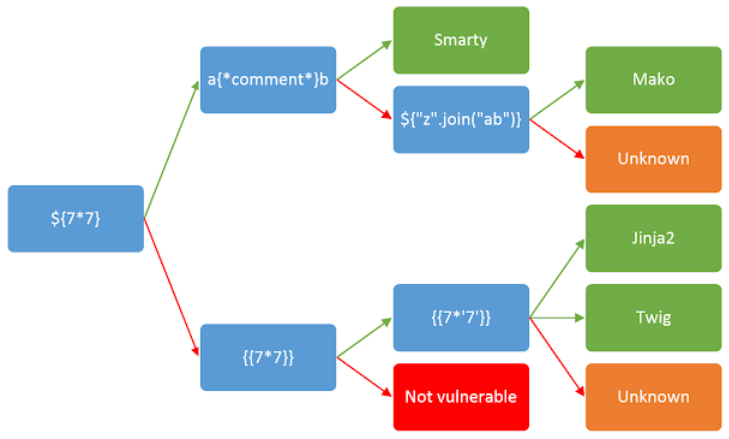

https://portswigger.net/web-security/server-side-template-injection

# 1.5 Server-side template injection (SSTI)
`Server-side template injection` — это уязвимость, при которой пользователь может передать в шаблон собственный шаблонный код. Этот код затем выполняется сервером.

### Чтобы понять проблему, сначала нужно разобраться, что такое шаблоны.

Практически любое современное веб-приложение использует `шаблонизатор` (template engine) для генерации HTML-страниц. Разработчик создает шаблон страницы, а изменяемые данные (например, имя пользователя, список товаров или комментарии) подставляются в него автоматически.

Например, шаблон может выглядеть так:
```html
<h1>Привет, {{ username }}!</h1>
```
Если пользователь называется Ivan, сервер сформирует страницу:
```html
<h1>Привет, Ivan!</h1>
```
В нормальной ситуации пользовательский ввод воспринимается только как данные.

Однако уязвимость возникает, когда приложение вставляет пользовательский ввод не как данные, а прямо в сам шаблон.

Например, если вместо обычного текста злоумышленник сможет передать:
```
{{7*7}}
```
то шаблонизатор может не вывести эту строку, а выполнить выражение и вернуть:
```
49
```
Это означает, что сервер интерпретировал пользовательский ввод как шаблонный код.

Именно поэтому `SSTI` считается одной из самых опасных уязвимостей веб-приложений.

### Главное отличие от Client-Side Template Injection

`Client-Side Template Injection` выполняется в браузере пользователя.  
`Server-Side Template Injection` выполняется непосредственно на сервере.

Поэтому последствия `SSTI` обычно намного серьезнее: атакующий получает возможность воздействовать не на страницу в браузере, а на само серверное приложение и иногда даже на операционную систему, на которой оно работает.

## 1. Каковы последствия Server-Side Template Injection?
Последствия `SSTI` зависят от двух факторов:
* какой шаблонизатор используется (Twig, Jinja2, Freemarker, Smarty и т.д.);
* как именно разработчики используют его в приложении.

В редких случаях `SSTI` практически не влияет на безопасность. Однако на практике такие ситуации встречаются редко. Обычно эта уязвимость считается критической.

Самый опасный сценарий — удаленное выполнение кода (Remote Code Execution, `RCE`). В этом случае злоумышленник может выполнять команды на сервере и фактически получить над ним полный контроль. 

Даже если выполнить системные команды нельзя, `SSTI` все равно остается очень опасной. Часто она позволяет:
* читать внутренние переменные приложения;
* получать доступ к конфигурационным файлам;
* извлекать секретные ключи и пароли;
* просматривать содержимое файлов на сервере;
* собирать информацию для дальнейших атак.

Поэтому даже без `RCE` такая уязвимость может привести к серьезной компрометации приложения.

## 2. Почему возникает SSTI?
Основная причина очень проста:
* пользовательский ввод вставляется в шаблон как часть самого шаблона, а не передается в него как обычные данные.

### Правильный способ
Представим, что сайт отправляет пользователю письмо:
```html
Уважаемый {{ first_name }},
```
Разработчик передает имя отдельно:
```php
$output = $twig->render(
    "Dear {{ first_name }}",
    array("first_name" => $user->first_name)
);
```
Если пользователя зовут Иван, шаблонизатор просто подставит значение:
```
Dear Иван
```
Даже если пользователь укажет в имени:
```
{{7*7}}
```
будет выведен именно этот текст:
```
Dear {{7*7}}
```
Шаблонизатор воспримет его как обычную строку, а не как код.

### Неправильный способ
Иногда разработчики собирают шаблон с помощью конкатенации строк.

Например:
```php
$output = $twig->render(
    "Dear " . $_GET['name']
);
```
Теперь значение параметра name становится частью шаблона.

Если открыть страницу:
```
http://vulnerable-website.com/?name={{7*7}}
```
сервер сначала создаст шаблон:
```
Dear {{7*7}}
```
Затем `Twig` обработает его и вычислит выражение.

В результате пользователь увидит:
```
Dear 49
```
То есть шаблонизатор выполнил код, который пришел от пользователя. Именно это и называется `Server-Side Template Injection`.

### Чаще всего разработчики допускают такую ошибку по незнанию.

Шаблонизатор воспринимает получившуюся строку как полноценный шаблон и начинает выполнять все найденные в ней конструкции (`{{ ... }}`, `` и т.д.).

По своей сути это очень похоже на `SQL-инъекцию`. При SQL-инъекции опасно вставлять пользовательский ввод прямо в SQL-запрос:
```sql
SELECT * FROM users WHERE name = '$user_input';
```
При `SSTI` опасно вставлять пользовательский ввод прямо в шаблон:
```php
$template = "Hello " . $_GET['name'];
```
В обоих случаях пользователь получает возможность изменить структуру того, что будет выполнено сервером.

Иногда разработчики осознанно позволяют создавать или редактировать шаблоны. Например, это может быть `CMS`, где редакторы могут настраивать:
* шаблоны писем;
* шаблоны страниц;
* HTML-оформление сайта;
* уведомления.

Пока доступ есть только у доверенных сотрудников, это считается нормальным.

Но если злоумышленник получит доступ к такой учетной записи (например, взломает аккаунт редактора или администратора), он сможет добавить вредоносный шаблон и использовать `SSTI` для атаки на сервер. Именно поэтому возможность редактирования шаблонов всегда считается потенциально опасной и требует строгого контроля доступа.

## 3. Как строится атака на SSTI (Server-Side Template Injection)
Эксплуатация SSTI обычно проходит в несколько шагов:
1. обнаружить возможную уязвимость;
2. понять, что это именно SSTI, а не что-то другое;
3. определить, какой шаблонизатор используется;
4. подобрать способ эксплуатации.

### 3.1 Обнаружение (Detection)
Чаще всего `SSTI` не сложно найти — проблема в том, что её просто не ищут.

Если разработчик случайно вставил пользовательский ввод в шаблон, уязвимость может быть очевидной, но внешне выглядеть как обычное поведение сайта.

### Как проверить наличие SSTI
Первый шаг — попробовать вставить символы, которые обычно используются в шаблонах:
```
${{<%[%'"}}%\
```
Если сервер после этого:
* возвращает ошибку;
* или ведет себя странно;

это может означать, что введённый текст обрабатывается шаблонизатором, а не просто выводится как строка.

***Важно: есть два контекста SSTI***

Уязвимости проявляются в двух разных ситуациях:
* простой (text/HTML контекст);
* кодовый (template expression context).

И подход к проверке в них немного отличается.

## 3.2 Простой контекст
В этом случае пользовательский ввод просто вставляется в страницу как часть текста или HTML:
```py
render("Hello " + username)
```
Мы можем попробовать отправить математическое выражение:
```
http://vulnerable-website.com/?username=${7*7}
```
Если на странице появляется:
```
Hello 49
```
значит сервер выполнил выражение, а не просто отобразил его как текст. Это сильный признак `SSTI`.

💡 Важно: Синтаксис `${7*7}` зависит от шаблонизатора. Например:
- `Jinja2` использует `{{ }}`;
- `Freemarker` — `${ }`;
- другие движки могут отличаться.

## 3.3 Кодовый контекст (Expression context)
Это более “скрытый” и сложный случай. Здесь пользовательский ввод вставляется внутрь самого шаблонного выражения:
```js
greeting = getQueryParameter('greeting')
engine.render("Hello {{"+greeting+"}}", data)
```
Пример запроса
```
http://vulnerable-website.com/?greeting=data.username
```
Результат:
```
Hello Carlos
```
Почему это сложнее заметить? Такой код:
* не ломает страницу;
* не вызывает XSS;
* выглядит как обычная подстановка данных.

Поэтому `SSTI` в таком виде часто пропускают при проверке.

### Как тестировать
1. Проверка на `XSS`

Сначала пробуем вставить HTML:
```html
http://vulnerable-website.com/?greeting=data.username<tag>
```
В отсутствие `XSS` это обычно приводит к пустому входу в вывод (просто Hello без имени пользователя), закодированных тегов или сообщения об ошибке.

В отличие от `XSS`, `Template Injection` может использоваться для прямой атаки на внутренние устройства веб-серверов и часто получения удаленного выполнения кода (RCE), превращая каждое уязвимое приложение в потенциальную точку поворота.

2. Попытка “выйти” из шаблона

Пробуем закрыть выражение:
```html
http://vulnerable-website.com/?greeting=data.username}}<tag>

Hello user01 <tag> 
```
Как интерпретировать результат?  
Если ошибка или пустой вывод → возможно неправильный синтаксис или нет `SSTI`  
Если HTML появился в ответе → высокий шанс `SSTI`

## 3.4 Определение шаблонизатора (Identify)
После того как `SSTI` подтверждена, нужно понять:
-  какой именно `template engine` используется (Twig, Jinja2, ERB и т.д.)

Как это делают
1. По ошибкам  
Иногда достаточно вызвать ошибку:
```
<%= foobar %>
```
И сервер может вернуть что-то вроде:  
`NameError: undefined local variable 'foobar' (ERB)`. Это сразу указывает на `Ruby ERB`.

2. По поведению выражений  
Разные шаблонизаторы по-разному обрабатывают одно и то же выражение.

Например:
```
{{7*'7'}}
```
может дать:
* 49 (Jinja2)
* 7777777 (Twig или другой движок)

Это помогает отличить движки друг от друга.

***Иногда один и тот же payload может подходить к нескольким движкам, поэтому нельзя делать вывод по одному тесту — нужно подтверждение.***


## 3.5 Эксплуатация (Exploitation)
Когда:
* уязвимость найдена;
* и шаблонизатор определён;

можно переходить к следующему шагу — попытке эксплуатации.

В зависимости от движка это может привести к:
* чтению файлов;
* утечке данных;
* выполнению системных команд;
* в худшем случае — полному захвату сервера (RCE).

## 3.6 Использование уязвимостей инъекций шаблонов на стороне сервера 
После того как ты нашёл SSTI и определил шаблонизатор начинается этап эксплуатации.

Обычно он состоит из трёх шагов:
* изучить шаблонизатор;
* исследовать окружение;
* построить полезную нагрузку (exploit).

### 3.6.1 Изучение (Read / Learn)
Первое, что нужно сделать — понять, как работает движок шаблонов. Если ты с ним не знаком, самое полезное — это прочитать документацию. Да, это один из самых эффективных способов.

Что именно нужно искать в документации

**1. Базовый синтаксис**

Нужно понять:
* как вставляются переменные;
* как выполняется код;
* какие есть конструкции (`{{ }}`, ``, `<% %>` и т.д.).

Иногда уже этого достаточно, чтобы найти способ атаки. Пример: `Mako (Python)`

В `Mako` можно вставлять Python-код прямо в шаблон:
```py
<%
import os
x = os.popen('id').read()
%>

${x}
```
Здесь сервер выполняет системную команду `id` и выводит результат.

! Если приложение уязвимо, это может привести к удалённому выполнению кода (`RCE`).

! Если шаблонизатор позволяет выполнять код — `SSTI` почти сразу становится критической уязвимостью.

**2. Документация по безопасности**

Во многих шаблонизаторах есть раздел вроде:
* Security
* Security considerations
* Best practices

Там обычно описано:
* что опасно использовать;
* какие функции могут быть рискованными;
* какие конструкции могут привести к уязвимостям.

***Для атакующего это почти готовый список “что попробовать”.***

Пример (ERB, Ruby). Документация может показывать опасные операции:
```
<%= Dir.entries('/') %>
<%= File.open('/etc/passwd').read %>
```
👉 Это означает:
* можно просматривать директории;
* можно читать любые файлы.

Даже официальная документация часто прямо показывает, что можно использовать для атаки — просто с точки зрения разработчика это “опасные функции”.

**3. Поиск известных эксплойтов**

Следующий шаг — поиск готовых решений в интернете.

После определения шаблонизатора стоит искать:
* “SSTI exploit + название движка”
* “template injection RCE + engine”
* CVE или PoC

Многие уязвимости уже кто-то находил; для популярных движков часто есть готовые цепочки до RCE; иногда достаточно слегка адаптировать payload под свой случай.

### 3.6.2 Исследование (Explore)
К этому моменту у тебя уже может быть:
* либо найден готовый эксплойт из документации;
* либо подтверждена `SSTI` без понятного способа эксплуатации.

Начинается этап исследования окружения. Твоя цель выяснить, какие объекты доступны внутри шаблона и что с ними можно делать.

**1. Объекты окружения (Environment objects)**

Многие шаблонизаторы дают доступ к специальным объектам, например:
* environment
* context
* self
* request
* глобальные пространства имён

Они содержат:
* переменные приложения;
* методы;
* системные функции;
* конфигурацию.

Это как “внутренний мир” приложения, который случайно стал доступен через шаблон.

Пример (Java). В некоторых движках можно получить доступ к окружению так:
```
${T(java.lang.System).getenv()}
```
Это возвращает переменные окружения сервера:
* пути;
* ключи;
* настройки системы.

Если ты можешь перечислить такие данные, ты получаешь:
* карту внутреннего устройства приложения;
* список потенциально интересных объектов;
* точки для дальнейшей атаки.

**2. Два типа объектов на сайте**

В шаблоне обычно есть два класса объектов:

`1. Встроенные (built-in)`

Их даёт сам шаблонизатор:
* стандартные классы;
* функции;
* утилиты.

`2. Разработанные (custom objects)`

Их создаёт само веб-приложение:
* user
* account
* session
* config
* order
* и т.д.

Самое интересное разработчики часто добавляют туда конфиденциальные данные или внутренние методы.

***Проблема***

В отличие от встроенных объектов:
* кастомные объекты почти не документированы;
* их поведение нужно угадывать;
* они отличаются от сайта к сайту.

**3. Даже без RCE уязвимость остаётся опасной**

Даже если:
* нельзя выполнить команды;
* нет полного контроля над сервером;

`SSTI` всё равно может привести к:
* чтению файлов;
* утечке данных;
* обходу ограничений;
* доступу к внутренним API.

👉 То есть отсутствие `RCE` ≠ безопасность.

### 3.6.3 Создание собственного эксплойта
Если готового решения нет — ты строишь атаку сам.

Ты начинаешь:
* проверять каждую доступную функцию;
* смотреть, что она возвращает;
* изучать цепочки объектов;
* искать неожиданные связи.

💡 Это уже не “поиск payload-а”, а полноценное исследование логики движка.

**1. Цепочки объектов (Object chaining)**

Самый мощный метод эксплуатации `SSTI` — это соединение объектов и методов в цепочку.

Ты находишь `объект` → смотришь его `методы` → они `возвращают другие объекты` → и так дальше.

Другими словами, мы можем зацепить `$class.inspect` с `$class.type`, чтобы получить ссылки на произвольные объекты. Затем мы можем выполнять произвольные команды оболочки в целевой системе с помощью `Runtime.exec()`. Это можно подтвердить с помощью следующего шаблона, предназначенного для заметной задержки времени.
```java
$class.inspect("java.lang.Runtime").type.getRuntime().exec("sleep 5").waitFor()
[5 second time delay] 
0
```
Получение вывода команды оболочки немного сложнее (это Java в конце концов):
```java
#set($str=$class.inspect("java.lang.String").type)
#set($chr=$class.inspect("java.lang.Character").type)
#set($ex=$class.inspect("java.lang.Runtime").type.getRuntime().exec("whoami"))
$ex.waitFor()
#set($out=$ex.getInputStream())
#foreach($i in [1..$out.available()])
$str.valueOf($chr.toChars($out.read()))
#end

tomcat7
```

Пример (Java Velocity). Есть объект:
```java
$class
```
Через него можно:
```java
$class.inspect("java.lang.Runtime").type.getRuntime().exec("command")
```
* получаем доступ к классу `Runtime`
* получаем его тип
* вызываем `getRuntime()`
* выполняем команду через `exec()`

👉 Это уже путь к `Remote Code Execution`.

**2. Объекты от разработчиков (custom surface)**

Иногда шаблонизатор работает в “безопасном режиме”:
* многие функции отключены;
* доступ ограничен;
* sandbox включён.

Но даже тогда остаются: объекты, которые добавили сами разработчики. Эти объекты:
* почти никогда не документированы;
* могут содержать бизнес-логику;
* иногда дают доступ к данным напрямую.

И именно через них часто обходят `sandbox`.

Главная идея - `SSTI` редко эксплуатируется “одной строкой”.

Чаще это выглядит так: постепенно собираешь цепочку из маленьких доступных возможностей, пока не получаешь доступ к чему-то опасному.

## 3.7 Как защититься от Server-Side Template Injection (SSTI)
Лучший способ защититься от `SSTI` — не позволять пользователям создавать или изменять шаблоны.

Если пользователь может редактировать шаблон, всегда существует риск, что он вставит в него вредоносный код. Конечно, в некоторых системах (например, `CMS` или `конструкторах писем`) такая возможность необходима, поэтому полностью отказаться от неё не всегда возможно.

**1. Используйте шаблонизаторы без встроенной логики**

По возможности выбирайте логически "простые" шаблонизаторы, например `Mustache`.

Такие шаблонизаторы предназначены только для подстановки данных и не позволяют выполнять код или сложные выражения внутри шаблона.

Например, они могут заменить:
```
{{ username }}
```
на имя пользователя, но не смогут выполнить:
```
{{ 7 * 7 }}
```
или вызвать системные функции.

***Чем меньше возможностей у шаблонизатора, тем меньше поверхность атаки.***

**2. Используйте песочницу (Sandbox)**

Если пользователям всё же необходимо создавать собственные шаблоны, их выполнение должно происходить в изолированной среде (`sandbox`).

В песочнице обычно запрещают:
* выполнение системных команд;
* доступ к файловой системе;
* импорт библиотек;
* вызов опасных функций.

Это значительно снижает риск эксплуатации `SSTI`.

Однако важно понимать, что `sandbox` — не абсолютная защита. История показывает, что во многих шаблонизаторах исследователи находили способы обхода песочницы. Поэтому полагаться только на неё нельзя.

**3. Изолируйте процесс выполнения шаблонов**

Даже если злоумышленнику удастся выполнить код, последствия можно ограничить.

Для этого шаблонизатор можно запускать в изолированной среде, например:
* в контейнере Docker;
* в отдельной виртуальной машине;
* в процессе с минимальными привилегиями.

Тогда, даже при успешной эксплуатации `SSTI`, атакующий получит доступ только к этой ограниченной среде, а не ко всему серверу.

### Основные рекомендации по защите

Чтобы максимально снизить риск `SSTI`:
* не вставляйте пользовательский ввод в шаблон как часть его кода — передавайте его только как данные;
* не позволяйте обычным пользователям редактировать шаблоны, если в этом нет необходимости;
* используйте шаблонизаторы без логики (например, `Mustache`), когда это возможно;
* включайте `sandbox`, если шаблоны всё же могут изменяться пользователями;
* изолируйте выполнение шаблонов с помощью контейнеров или других механизмов ограничения.

Практически все уязвимости `SSTI` появляются из-за одной и той же ошибки:

***Разработчик воспринимает пользовательский ввод как часть шаблона, а не как обычные данные.***

Если соблюдать принцип «данные всегда остаются данными», то вероятность возникновения SSTI становится минимальной. 


## 3.8 Примеры
**1. Шаблонная инъекция**

Рассмотрим маркетинговое приложение, которое отправляет массовые электронные письма, и использует шаблон `Twig`, чтобы приветствовать получателей по имени. Если имя просто передано в шаблон, как в следующем примере, все работает нормально:
```
$output = $twig->render("Dear {first_name},", array("first_name" => $user.first_name) ); 
```
Однако, если пользователям разрешено настраивать эти электронные письма, возникают проблемы:
```
$output = $twig->render($_GET['custom_email'],  array("first_name" => $user.first_name) );
```
В этом примере пользователь контролирует содержимое самого шаблона через GET параметр `data_email`, а не значение, переданное в него. Это приводит к уязвимости XSS, которую трудно пропустить. Тем не менее, XSS является просто симптомом более тонкой, более серьезной уязвимости. Этот код фактически обнажает обширную, но легко упускаемую из виду поверхность атаки. Вывод из следующих двух приветственных сообщений намекает на уязвимость на стороне сервера:
```
custom_email={{7*7}}

49
```
```
custom_email={{self}}

Object of class __TwigTemplate_7ae62e582f8a35e5ea6cc639800ecf15b96c0d6f78db3538221c1145580ca4a5 could not be converted to string
```
То, что мы имеем здесь, по сути, является выполнением кода на стороне сервера внутри песочницы. В зависимости от используемого движка шаблона, возможно, удастся вырваться из песочницы и выполнить произвольный код. 

