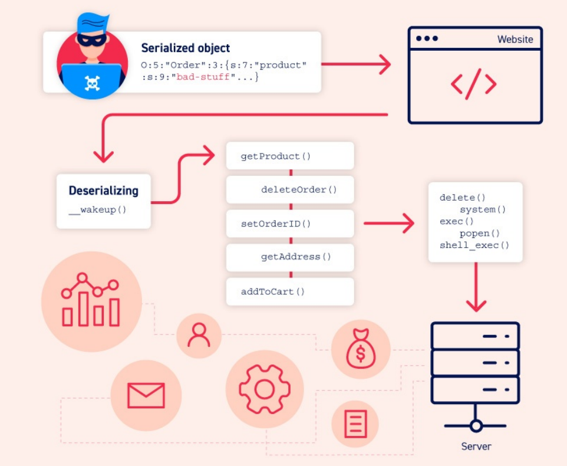
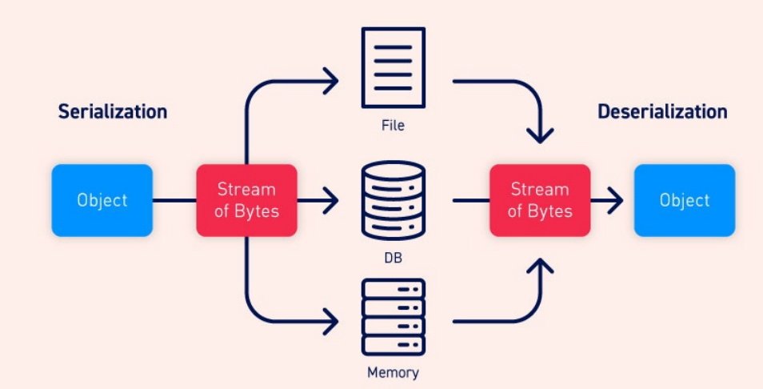

https://portswigger.net/web-security/deserialization

`Небезопасная десериализация` — это когда сервер восстанавливает объекты из недоверенных данных, что позволяет атакующему влиять на типы объектов и их поведение, потенциально приводя к RCE через цепочки вызовов методов.

# 1.6 Deserialization



## 1. Что такое сериализация?
`Сериализация` — это процесс, при котором сложные данные (например, объекты в программе со всеми их полями) превращаются в простой формат, который можно удобно передать или сохранить.

Проще говоря, объект **“упаковывают”** в поток байтов, чтобы его можно было:
* сохранить в файл или базу данных
* передать по сети между сервисами
* отправить в API или другому компоненту системы

Главная идея в том, что ***вместе с данными сохраняется и состояние объекта — то есть все его значения на момент сериализации***.

## 2. Сериализация и десериализация
`Десериализация` — это обратный процесс.

Она ***превращает поток байтов обратно в полноценный объект***, который выглядит и работает так же, как до сериализации.

После восстановления объект снова можно использовать в программе: обращаться к его полям, вызывать методы и передавать дальше по логике приложения — как будто он никуда не “пропадал”.



Многие языки программирования уже «из коробки» поддерживают сериализацию. Но то, как именно она реализована, зависит от языка.

Где-то объекты превращаются в двоичный (бинарный) формат, а где-то — в текстовые структуры, которые могут быть частично или полностью читаемыми человеком (например, JSON-подобные форматы).

Важно понимать: при сериализации сохраняются все данные объекта, включая приватные поля, к которым обычно нет прямого доступа.

Если нужно исключить какое-то поле из сериализации, его явно помечают как `transient` (или аналогичным ключевым словом в конкретном языке).

Также в разных языках сериализация может называться по-разному:
* в Ruby — marshalling
* в Python — pickling

Но по сути это одно и то же: преобразование объекта в формат для хранения или передачи и обратно.

## 3. Что такое небезопасная десериализация?
Небезопасная десериализация возникает тогда, когда ***веб-приложение принимает данные от пользователя и без должной проверки превращает их обратно*** в объект.

Проблема в том, что атакующий может подменить эти данные и «скормить» приложению специально созданный сериализованный объект. В результате программа восстановит его как обычный объект и начнёт с ним работать.

Более того, злоумышленник может:
* подделать объект другого класса
* заставить приложение создать неожиданные типы объектов
* передать данные, которые приложение не должно было вообще получать

Из-за этого такую уязвимость иногда называют `object injection` (инъекция объектов).

## 4. Как возникают уязвимости небезопасной десериализации
Чаще всего такие уязвимости появляются не из-за сложных ошибок, а из-за неправильного понимания самой проблемы.

Основная ошибка разработчиков — ***попытка десериализовать данные, которые пришли от пользователя, и при этом считать это безопасным***.

В идеале так делать вообще нельзя: пользовательский ввод не должен превращаться в объекты напрямую.

### Попытки “защититься” и почему они не работают
Иногда разработчики думают, что проблему можно решить дополнительной проверкой уже после десериализации — например, проверить поля объекта и «почистить» данные.

Но это почти всегда неэффективно.

Причина простая: к моменту, когда объект уже восстановлен из байтов, вредоносная логика может быть уже запущена. Проверка «после факта» часто приходит слишком поздно.

Кроме того, невозможно предусмотреть все варианты вредоносных данных и всех возможных комбинаций полей.

### Ложное чувство безопасности
Ещё одна распространённая ошибка — считать, что бинарные форматы сериализации безопаснее, потому что они «нечитаемы» для человека.

На практике это не защита.

Да, такие данные сложнее прочитать, но злоумышленник всё равно может их разобрать и модифицировать — просто это требует чуть больше усилий.

То есть бинарный формат не мешает атаке, он лишь немного усложняет подготовку.

### Почему проблема усиливается в современных приложениях

Современные веб-приложения используют множество библиотек и зависимостей. Каждая из них содержит свои классы и методы, которые потенциально могут быть доступны во время десериализации.

Это создаёт огромную “экосистему” объектов, где:
* сложно контролировать, что именно может быть создано
* трудно предсказать, какие методы будут вызваны
* легко случайно получить цепочку вызовов, ведущую к опасному поведению

Злоумышленник может использовать это, связывая несколько объектов и методов в цепочку, которая в итоге приводит к выполнению нежелательных действий.

## 5. Последствия небезопасной десериализации
`Небезопасная десериализация` — это одна из самых опасных уязвимостей, потому что она открывает злоумышленнику доступ к внутренней логике приложения.

По сути, атакующий получает возможность заставить приложение работать “не так, как задумано”, используя уже существующий код системы против неё самой.

### Почему это так опасно
Главная проблема в том, что злоумышленник не просто отправляет «плохие данные».

Он может:
* заставить приложение создавать неожиданные объекты
* вызывать цепочки методов, которые разработчики не планировали
* использовать внутренние механизмы приложения в своих целях

Это резко увеличивает поверхность атаки и делает последствия непредсказуемыми.

### Возможные последствия
Самый серьёзный сценарий — удалённое выполнение кода (`RCE`). В этом случае атакующий может запускать команды на сервере и фактически полностью его контролировать.

Но даже если RCE невозможен, всё равно возможны серьёзные проблемы:
* Повышение привилегий
    * атакующий получает доступ к функциям или данным, которые ему не должны быть доступны
* Доступ к файлам
    * чтение или иногда изменение произвольных файлов на сервере
* Отказ в обслуживании (DoS)
    * приложение может зависнуть, упасть или начать потреблять ресурсы до отказа

## 6. Как использовать небезопасные уязвимости десериализации
В этом разделе разбирается, как находить и использовать небезопасную десериализацию на практике. Примеры рассматриваются на PHP, Ruby и Java, потому что именно там такие проблемы встречаются особенно часто, но спарведливы и для дугих ЯП.

### 6.1 Как определить небезопасную десериализацию
На практике найти десериализацию не так сложно — независимо от того, идёт ли речь о `whitebox` (есть код) или `blackbox` (есть только трафик).

Во время анализа приложения нужно обращать внимание на данные, которые передаются между клиентом и сервером.

Если где-то в запросах или ответах встречается структура, похожая на `“упакованный объект”`, есть шанс, что это `сериализация`.

#### Как это выглядит на практике
Сериализованные данные обычно можно распознать по характерному формату, если знать особенности языка.

Например, в `PHP` и `Java` они выглядят по-разному, но имеют узнаваемые “сигналы”.

`Подсказка (инструменты)` - ***Если используешь Burp Suite Professional, Scanner часто автоматически помечает HTTP-запросы, которые содержат подозрительные сериализованные данные.***

Это помогает быстрее находить потенциальные точки атаки.

#### Формат сериализации в PHP
`PHP` использует довольно “читаемый” текстовый формат.

В нём можно увидеть типы данных и длину строк.

Пример объекта:
```php
$user->name = "carlos";
$user->isLoggedIn = true;
```
После сериализации это может выглядеть так:
```
O:4:"User":2:{s:4:"name":s:6:"carlos";s:10:"isLoggedIn":b:1;}
```
Разберём по частям:
* `O:4:"User"` — объект класса User, название длиной 4 символа
* `2` — у объекта 2 поля
* `s:4:"name"` — ключ поля name (строка длиной 4)
* `s:6:"carlos"` — значение поля carlos (строка длиной 6)
* `s:10:"isLoggedIn"` — второе поле isLoggedIn
* `b:1` — булево значение true

В исходниках в коде `PHP` стоит обращать внимание на функции:
* serialize()
* unserialize()

Если ты видишь `unserialize()` на пользовательских данных — это потенциально очень опасное место и его нужно анализировать особенно внимательно.

#### Формат сериализации в Java
В Java чаще используется бинарная сериализация, поэтому данные выглядят не как текст, а как поток байтов.

На первый взгляд это сложнее, но есть характерные признаки. Сериализованные Java-объекты обычно начинаются с фиксированных байтов:
```
ac ed (в hex)
или rO0 (в Base64)
```
Если ты видишь такие сигнатуры в данных — это почти наверняка `Java serialization`.

Любой класс в коде Java, который реализует:
```java
java.io.Serializable
```
может быть сериализован.

Особое внимание стоит уделять методу:
```java
readObject()
```
Он используется для восстановления объекта из потока данных. ***Если туда попадают пользовательские данные без проверки — это потенциальная точка уязвимости.***

### 6.2 Манипулирование сериализованными объектами
Иногда уязвимость в десериализации можно использовать очень просто — достаточно изменить уже существующий сериализованный объект.

Так как в нём хранится состояние объекта, злоумышленник может:
* найти интересные поля
* поменять их значения
* и отправить изменённый объект обратно серверу

После десериализации приложение получит уже “подменённую” версию объекта.

#### Два основных подхода к атаке
При работе с сериализованными данными обычно есть два способа их модификации:

1. `Редактировать сериализованные данные вручную`
(например, прямо в cookie или HTTP-запросе)

2. `Создать собственный объект и сериализовать его кодом` (часто проще и надёжнее, особенно для бинарных форматов)

**1. Изменение атрибутов объекта**

Допустим, сайт хранит данные пользователя в `cookie` в сериализованном виде.

Пример объекта:
```
O:4:"User":2:{s:8:"username";s:6:"carlos";s:7:"isAdmin";b:0;}
```
Здесь есть поле:
```
isAdmin = false
```
Атакующий просто меняет значение:
```
b:0 → b:1
```
После этого объект становится:
```
пользователь = админ
```
Если сервер делает так:
```php
$user = unserialize($_COOKIE);
if ($user->isAdmin === true) {
    // доступ в админку
}
```
то он полностью доверяет данным из `cookie`.

Никакой проверки подлинности нет — и сервер принимает подменённый объект как настоящий.

Такие простые случаи редки в реальных системах, но это базовый шаг:
* показать, что сериализованные данные = поверхность атаки
* и что их можно напрямую менять

**2. Изменение типов данных**

Более сложный вариант атаки — не просто менять значения, а менять типы данных.

`PHP` использует “слабое” (нестрогое) сравнение `==`. Это значит, что он автоматически приводит типы:
* число и строка могут считаться равными
* строка может быть преобразована в число

Примеры странного поведения PHP
```php
5 == "5"              // true
5 == "5 something"    // true (берётся только начало строки)
0 == "Example"        // true (в старых версиях PHP)
```
Это используют атакующие. Допустим, есть код:
```php
$login = unserialize($_COOKIE);
if ($login['password'] == $password) {
    // вход выполнен
}
```
Злоумышленник меняет значение `password` на:
```
0 (целое число)
```
Если сохранённый пароль — строка, которая не начинается с числа, то `PHP` может привести её к 0 в сравнении.

И итог:
```
0 == "anything" → true (в старых версиях PHP)
```
* проверка обходится
* логин проходит без пароля

Важное уточнение про версии PHP
* В PHP 7 и ниже такие трюки часто работали
* В PHP 8 часть этих преобразований убрали
* ***Но некоторые случаи (например "5 text") всё ещё работают***

Это особенно опасно именно с десериализацией:
* десериализация сохраняет типы данных (строка, int, bool)
* данные приходят напрямую от пользователя
* и попадают в логику без нормальной проверки

При работе непосредственно с двоичными форматами мы рекомендуем использовать расширение `Hackvertor`, доступное в магазине `B.app`. С помощью `Hackvertor` вы можете изменять сериализованные данные в виде строки, и он автоматически обновляет двоичные данные, соответствующим образом регулируя смещения.

### 6.3 Использование функций приложения
Иногда проблема небезопасной десериализации не ограничивается просто изменением значений в объекте.

Гораздо опаснее ситуация, когда приложение берёт данные из десериализованного объекта и сразу использует их в реальных действиях.

Допустим, на сайте есть функция удаления пользователя. При удалении аккаунта система также удаляет аватарку:
```php
$user->image_location
```
и затем делает что-то вроде:
* открывает путь к файлу
* удаляет файл с диска

Если объект пользователя создаётся из сериализованных данных, злоумышленник может подменить поле:
```php
image_location = любой путь к файлу
```
И тогда при удалении аккаунта:
* будет удалён не только аватар
* а любой файл, путь к которому указал атакующий

В предыдущих примерах мы просто меняли значения вроде isAdmin. А здесь:
* данные из объекта напрямую используются в опасной функции
* и это приводит к реальному действию (удаление файла, доступ к ресурсам и т.д.)

#### Автоматизация атак через “магические методы”
Но самые интересные уязвимости начинаются тогда, когда данные из объекта попадают в код автоматически, без явного вызова со стороны логики приложения.

Это происходит через так называемые `магические методы`.

`Магические методы` — это специальные функции в классах, которые вызываются автоматически при определённых событиях.

Разработчику не нужно вызывать их вручную — язык делает это сам.

В PHP:
* `__construct()` — вызывается при создании объекта
* `__wakeup()` — вызывается при десериализации

В Python аналог — `__init__`

Сами по себе магические методы — это нормальная часть ООП. Но проблема возникает, если внутри них:
* обрабатываются данные из объекта
* используются значения, контролируемые пользователем
* выполняются опасные операции (файлы, сеть, команды и т.д.)

***Некоторые магические методы вызываются автоматически при десериализации.***

#### PHP
При `unserialize()` может автоматически вызываться: `__wakeup()`

#### Java
При десериализации используется:
```java
ObjectInputStream.readObject()
```
А также можно переопределить:
```java
private void readObject(ObjectInputStream in)
```
Этот метод:
* вызывается автоматически при восстановлении объекта
* позволяет выполнять свой код во время десериализации

Это означает:
* код может выполняться ещё до того, как приложение “осознает”, что объект создан
* данные из сериализованного объекта уже влияют на выполнение логики
* появляется возможность строить сложные цепочки атак

### 6.4 Инъекции произвольных объектов
До этого мы рассматривали простые случаи, когда атакующий меняет значения внутри уже существующего объекта.

Но более мощный вариант атаки — это когда злоумышленник может подменить сам тип объекта.

В объектно-ориентированном программировании поведение объекта определяется его классом:
* разные классы → разные методы
* разные методы → разная логика выполнения

#### **Ключевая проблема десериализации**
При десериализации многие языки:
* не проверяют, какого именно типа объект они восстанавливают
*просто создают объект того класса, который указан в данных

Это означает, что атакующий может подставить любой класс, который существует в приложении.

Если злоумышленник может выбрать класс объекта, он получает гораздо больше контроля:
* можно вызвать неожиданные методы
* можно заставить код выполниться автоматически
* можно использовать внутреннюю логику приложения против него самого.

Даже если приложение ожидает один класс, оно всё равно создаст другой — и продолжит выполнение.

Иногда такой подменённый объект вызывает ошибку:
* “не тот тип”
* “неожиданный класс”
* исключение в логике

Но это не мешает атаке, потому что вредоносные действия часто происходят до ошибки или параллельно с ней.

Если у злоумышленника есть код приложения, он может:
* Найти все классы в системе
* Посмотреть, какие из них участвуют в десериализации
* Проверить магические методы (например, `__wakeup`, `readObject`)
* Найти места, где они работают с пользовательскими данными
* Использовать эти классы как “точку входа” для атаки

## 6.5 Цепочки гаджетов (Gadget Chains)
`Гаджет` — это любой небольшой кусок кода внутри приложения, который сам по себе не выглядит опасным, но может участвовать в обработке данных.

Проблема начинается тогда, когда такие “гаджеты” можно связать вместе.

#### Как работает цепочка гаджетов
Один гаджет:
* принимает данные
* обрабатывает их
* передаёт дальше

Другой гаджет:
* берёт результат
* делает следующую операцию

И так далее.

***Важная идея - Злоумышленник не пишет новый код.*** Он использует уже существующий код приложения как “конструктор”.

Вся логика уже есть на сервере. А атакующий только подаёт входные данные. Обычно всё запускается через:
* магический метод
* или автоматический вызов при десериализации

Этот первый шаг называют: `start gadget` (стартовый гаджет). Он “включает” цепочку и запускает дальнейшие вызовы методов.

`Цепочки гаджетов` — это основной способ эксплуатации небезопасной `десериализации` в реальных атаках. Иногда цепочка короткая (1–2 шага), иногда очень длинная и сложная.

Но итог один: данные проходят через несколько методов и доходят до “опасного места”.

Важно понимать:
* злоумышленник НЕ управляет кодом
* он управляет только входными данными

Но из-за цепочки этих данных хватает, чтобы:
* запустить нужные методы
* изменить поведение приложения
* и добиться выполнения опасных действий

Без исходного кода:
* сложно понять, какие классы существуют
* сложно увидеть все возможные цепочки вызовов
* слишком много вариантов комбинаций

Поэтому вручную искать `gadget chains` почти нереально в больших приложениях. Поэтому используют уже готовые решения.

#### Работа с готовыми цепочками гаджетов
Идея простая:
* многие приложения используют одни и те же библиотеки
* в этих библиотеках уже известны цепочки гаджетов
* значит, их можно переиспользовать.

#### ysoserial (Java)
Один из самых известных инструментов — `ysoserial`.

Он позволяет:
* выбрать известную `gadget chain`
* указать команду
* сгенерировать сериализованный объект

Этот объект потом можно отправить приложению. Это ускоряет атаку:
* не нужно строить цепочку вручную
* достаточно подобрать подходящую библиотеку

#### Цепочки для обнаружения уязвимости

Некоторые `gadget chains` используются не для взлома, а для проверки, что десериализация вообще происходит. В версиях `Java 16` и выше вам необходимо установить серию аргументов командной строки для `Java` для запуска `ysoserial`.

#### URLDNS
* делает DNS-запрос на указанный домен
* работает почти в любой Java версии
* не требует сложных библиотек

👉 Если сервер делает DNS-запрос — значит десериализация выполняется

#### JRMPClient
* заставляет сервер подключаться по TCP к IP
* можно использовать для проверки через сетевые задержки
* полезно, когда DNS заблокирован

Для `PHP` есть аналог:
#### PHPGGC (PHP Generic Gadget Chains)
Он делает то же самое:
* берёт известные цепочки
* генерирует полезную нагрузку

Главная ошибка новичков думать, что уязвимость = наличие `gadget chain`. Это неверно.

Реальная причина уязвимости — это:
* десериализация данных, которым доверять нельзя

А `gadget chain` — это просто способ использовать уже существующий код. Даже если:
* нет готовых gadget chains
* нет известных эксплойтов

система всё равно может быть уязвима, если принимает сериализованные данные от пользователя.

### 6.6 Создание собственного эксплойта
Если готовые `gadget chains` и найденные в интернете эксплойты не подходят, приходится идти глубже — разбирать приложение и строить цепочку самостоятельно.

Это уже более сложный уровень, который почти всегда требует доступа к исходному коду.

#### С чего начинается анализ
`Первый шаг` — поиск классов, которые содержат магические методы, вызываемые при `десериализации`.

* PHP: `__wakeup()`
* Java: `readObject()`

Нужно дальше понять:
* что делает этот магический метод
* и работает ли он с данными, которые контролирует пользователь

Если внутри есть операции с полями объекта, вызовы методов, работа с файлами, сетью, командами, то это потенциально опасная точка.

Часто магический метод сам по себе ничего вредного не делает. Тогда он становится стартовой точкой (`start gadget`)

#### Построение цепочки
Дальше начинается поиск цепочки:
* Смотришь, какие методы вызывает стартовый гаджет
* Проверяешь, куда они передают данные
* Анализируешь следующие вызовы
* И так далее

Нужно найти путь, где:
* данные проходят через несколько методов
* и в итоге попадают в “опасный участок” кода

Этот финальный участок называют `sink` (гаджет-раковина)

#### Когда цепочка найдена
После того как ты понял, как данные “текут” по приложению, следующий шаг — создание payload.

Теперь ты:
* смотришь на классы в коде
* понимаешь их структуру
* и вручную формируешь сериализованный объект

#### Для текстовых форматов (PHP, JSON-подобные)
Это проще:
* можно вручную изменить поля
* можно собрать объект как строку
* легко контролировать значения

#### Для бинарных форматов (Java)
Это сложнее:
* структура не читаемая
* легко сломать объект изменением байтов
* неудобно редактировать вручную

Поэтому часто проще:
* написать код, который сам создаёт объект
* и сериализует его корректно

Почему этот этап сложный - здесь уже нет “готовых рецептов”. Ты работаешь с:
* реальной логикой приложения
* цепочками вызовов
* внутренними зависимостями классов

Во время анализа можно найти не только основную цепочку, но и:
* побочные уязвимости
* неожиданные вызовы методов
* дополнительные пути к выполнению кода

Иногда это позволяет усилить атаку и перейти от простого поведения к критическим последствиям (вплоть до `RCE`).

***Создание собственного эксплойта включает:***
* поиск магических методов
* анализ их поведения
* построение цепочки вызовов (gadget chain)
* поиск финального опасного метода (sink)
* формирование корректного сериализованного объекта

### 6.7 PHAR-десериализация
До этого мы рассматривали случаи, когда приложение явно вызывает `unserialize()` для пользовательских данных.

Но в `PHP` есть более скрытый способ добиться десериализации — через работу с файлами и потоками.

#### Что такое phar://
`PHP` поддерживает специальные “обёртки” (wrappers) для работы с разными протоколами при доступе к файлам.

Одна из них — `phar://`, которая используется для доступа к `PHP Archive (PHAR)` файлам.

`PHAR` — это формат архивов в PHP, который может хранить не только файлы, но и метаданные объекта.

Ключевой момент:
* `PHAR-файлы` содержат сериализованные метаданные
* и `PHP` автоматически их десериализует при обращении к файлу

#### Как это становится уязвимостью
Если приложение выполняет файловые операции с путём, который контролирует пользователь, например:
* file_exists()
* filesize()
* is_readable()

и этот путь указывает на: `phar://...`

Даже если разработчик не использовал `unserialize()` напрямую, то `PHP`:
* автоматически прочитает `PHAR-файл`
* и десериализует его метаданные

Обычно опасные функции вроде:
* include()
* fopen()

часто фильтруются или защищаются, потому что они очевидно опасны.

Но менее “подозрительные” функции вроде `file_exists()` могут не проверяться так тщательно. И именно через них и происходит эксплуатация.

Чтобы это сработало, нужно:
* Загрузить PHAR-файл на сервер
* Замаскировать его (например, как изображение `.jpg`)
* Обмануть проверку загрузки
* Заставить сервер обратиться к файлу через `phar://`

При обращении к `phar://`:
* PHP читает метаданные
* десериализует их
* создаёт объект

И если внутри есть опасные классы:
* могут сработать магические методы (`__wakeup`, `__destruct`)
* запускается `gadget chain`
* возможен полный контроль над поведением приложения

***Важный момент! Расширение файла не важно. Даже если файл выглядит как `image.jpg`.***

`PHP` всё равно обработает его как `PHAR`, если используется:
```
phar://image.jpg
```
PHAR-десериализация показывает важную идею: ***десериализация может происходить не только через unserialize()***

Она может запускаться даже:
* через файловые операции
* через обработку потоков
* без явного участия разработчика

### 6.8 Десериализация через уязвимости памяти
Есть ещё более “низкоуровневый” вариант эксплуатации. Даже если `gadget chains` не подходят, иногда можно использовать:
* известные уязвимости повреждения памяти
* баги в десериализации PHP

Функции вроде `unserialize()`:
* изначально не предназначены для обработки недоверенных данных
* не имеют достаточной защиты от сложных атак
* создают большую поверхность атаки

### 6.9 Как предотвратить небезопасную десериализацию
Главное правило довольно простое - по возможности вообще не десериализовать данные от пользователя. `Десериализация данных` из недоверенного источника — это одна из самых опасных операций, потому что:
* сложно контролировать содержимое
* сложно предсказать поведение объектов
* почти невозможно учесть все варианты атак

Во многих случаях риски просто не оправдывают пользу.

#### Если без этого нельзя
Иногда десериализация всё же необходима. В таком случае нужно обязательно добавить защиту, чтобы убедиться, что данные не были подменены.

#### Проверка целостности данных
Один из подходов — использовать цифровую подпись или аналогичный механизм.

Идея такая:
* сервер подписывает данные при создании
* при получении проверяет подпись
* и только потом разрешает десериализацию

***Важный момент! Все проверки должны происходить до десериализации.*** Если сначала восстановить объект, а потом проверять — это уже слишком поздно, потому что вредоносный код мог уже выполниться. Не использовать “общую” десериализацию.

***Ещё одна рекомендация - избегать универсальных функций десериализации, которые восстанавливают объект полностью***. Проблема таких функций в том, что они:
* восстанавливают все поля объекта
* включая приватные данные
* могут восстанавливать неожиданные состояния

Более безопасный подход:
* писать собственные методы сериализации
* явно определять, какие поля сохраняются
* контролировать формат данных

Это снижает риск неожиданных или скрытых значений в объекте.

Некоторые пытаются “защититься” другим способом — например:
* блокировать известные `gadget chains`
* фильтровать подозрительные классы

Но это не работает надёжно. Проблема не в `gadget chains` как таковых. Проблема в том, что в приложение вообще попадают недоверенные сериализованные данные. А `gadget chains` — это просто способ использовать уже существующий код.

Нельзя “починить” это через фильтры даже если :
* закрыть известные цепочки
* удалить опасные классы
* ограничить методы

всё равно:
* новые цепочки могут появляться
* зависимости могут содержать уязвимости
* поведение приложения сложно полностью контролировать

***Безопасная стратегия выглядит так:***
* не десериализовать пользовательские данные
* проверять целостность до десериализации
* использовать собственные безопасные форматы
* минимизировать использование автоматической сериализации

Можно написать скрипт или найти скрипт с определенными признаками сериализации, например просто функции из списка готовых библиотек разных языков программирования. Или байты, но это уже в burp. 