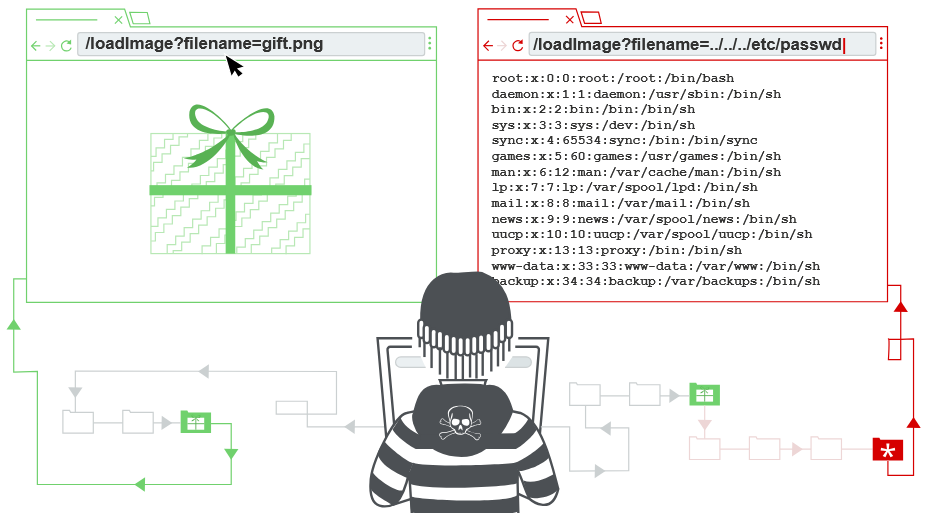

# 11.Path_traversal 
## 11.1 Что такое Path traversal?
`Path traversal`, также известный как `directory traversal`, — это уязвимость, которая позволяет злоумышленнику читать произвольные файлы на сервере, где работает приложение.

Это могут быть:
* код и данные приложения;
* учетные данные для внутренних систем;
* конфиденциальные файлы операционной системы.

В некоторых случаях злоумышленник также может записывать произвольные файлы на сервере. Это позволяет изменять данные или поведение приложения и в итоге получить полный контроль над сервером.



## 11.2 Чтение произвольных файлов через Path traversal
Представьте интернет-магазин, который показывает изображения товаров. Приложение может загружать изображение с помощью следующего HTML:
```HTML

```
URL `loadImage` принимает параметр `filename` и возвращает содержимое указанного файла. Изображения хранятся на сервере в каталоге `/var/www/images/`. Чтобы получить изображение, приложение добавляет имя файла к этому каталогу и читает файл через API файловой системы.

То есть приложение читает файл по следующему пути: `/var/www/images/218.png`

Приложение не защищено от `Path traversal`. Поэтому злоумышленник может запросить следующий URL, чтобы прочитать файл `/etc/passwd`:
```
https://insecure-website.com/loadImage?filename=../../../etc/passwd
```
В результате приложение попытается прочитать файл по пути:
```
/var/www/images/../../../etc/passwd
```
Последовательность `../` означает переход на один уровень вверх в структуре каталогов. Три последовательности `../` позволяют подняться из `/var/www/images/` до корня файловой системы. Поэтому фактически будет прочитан файл:
```
/etc/passwd
```
В Unix-подобных операционных системах это стандартный файл с информацией о пользователях, зарегистрированных на сервере. Однако тем же способом злоумышленник может получить доступ к другим произвольным файлам.

В Windows для обхода каталогов используются как `../`, так и `..\`. Например, аналогичная атака на Windows-сервер:
```
https://insecure-website.com/loadImage?filename=..\..\..\windows\win.ini
```
## 11.3 Общие препятствия для использования уязвимостей Path traversal
Многие приложения, которые используют пользовательский ввод в путях к файлам, имеют защиту от `Path traversal`. Однако такую защиту часто можно обойти.

Если приложение удаляет или блокирует последовательности обхода каталогов из имени файла, можно попробовать следующие методы.

Можно указать абсолютный путь от корня файловой системы, например:
```
filename=/etc/passwd
```
В этом случае последовательности обхода каталогов вообще не используются.

Можно использовать вложенные последовательности, например `....//` или `....\/`. Если внутренняя последовательность удаляется, они превращаются в обычные `../` или `..\`.

В некоторых случаях, например в URL или параметре `filename` запроса `multipart/form-data`, веб-сервер удаляет последовательности обхода каталогов перед передачей данных приложению. Иногда это можно обойти с помощью URL-кодирования или двойного URL-кодирования `../`. Они превращаются соответственно в `%2e%2e%2f` и `%252e%252e%252f`.

Также могут работать нестандартные варианты кодирования, например `..%c0%af` или `..%ef%bc%8f`.

В `Burp Suite Professional` можно использовать `Burp Intruder` и готовый список полезных нагрузок **Fuzzing - path traversal**. Он содержит различные закодированные последовательности обхода каталогов для тестирования.

Приложение может требовать, чтобы имя файла начиналось с определенного базового каталога, например `/var/www/images`. В этом случае можно указать этот каталог, а затем добавить последовательности обхода:
```
filename=/var/www/images/../../../etc/passwd
```
Приложение также может требовать, чтобы имя файла заканчивалось определенным расширением, например `.png`. В таком случае можно использовать нулевой байт, чтобы фактически завершить путь до добавления требуемого расширения:
```
filename=../../../etc/passwd%00.png
```
## 11.4 Как предотвратить атаку Path traversal
Самый эффективный способ защиты от `Path traversal` — не передавать пользовательский ввод напрямую в API файловой системы.

Многие функции приложения можно переписать так, чтобы они выполняли те же задачи, но без использования пользовательских данных в путях к файлам.

Если избежать этого невозможно, рекомендуется использовать два уровня защиты:
* Проверять пользовательский ввод до его обработки. Лучше всего сравнивать ввод с белым списком разрешенных значений. Если это невозможно, убедитесь, что ввод содержит только допустимые символы, например буквы и цифры.
* После проверки добавлять ввод к базовому каталогу и использовать API файловой системы для нормализации пути. Затем убедиться, что итоговый путь начинается с ожидаемого базового каталога.

Пример простой проверки канонического пути файла на Java:
```java
File file = new File(BASE_DIRECTORY, userInput);

if (file.getCanonicalPath().startsWith(BASE_DIRECTORY)) {
    // process file
}
```
Код проверяет, что пользовательский путь после нормализации остается внутри разрешенного каталога.
* `new File(BASE_DIRECTORY, userInput)` — создает путь, объединяя базовую директорию и пользовательский ввод.
* `getCanonicalPath()` — преобразует путь в полный нормализованный вид и удаляет последовательности вроде `../`.
* `startsWith(BASE_DIRECTORY)` — проверяет, что итоговый путь начинается с разрешенного каталога.

Если после обработки путь выходит за пределы `BASE_DIRECTORY`, файл не должен обрабатываться. Это предотвращает доступ к произвольным файлам через `Path traversal`.

https://portswigger.net/web-security/file-path-traversal