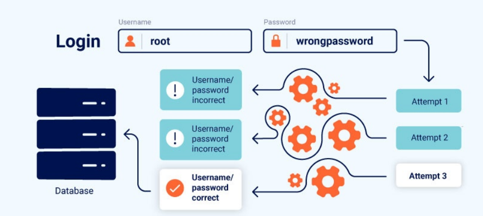

# 12. Уязвимости бизнес-логики (Business logic vulnerabilities)
В этом разделе мы разберём, что такое уязвимости бизнес-логики и как они возникают из-за неправильных предположений о действиях пользователей. Вы узнаете о возможных последствиях таких ошибок и о том, как их можно использовать.



## 1. Что такое уязвимость бизнес-логики?
Уязвимости `бизнес-логики` — это ошибки в разработке и реализации приложения, которые позволяют злоумышленнику вызвать непредусмотренное поведение. Это может позволить использовать обычные функции приложения для достижения вредоносной цели. Обычно такие ошибки возникают потому, что разработчики не предусмотрели необычные ситуации и не обеспечили их безопасную обработку.

> **Примечание**: В этом контексте «бизнес-логика» — это просто набор правил, по которым работает приложение. Поскольку эти правила не всегда связаны непосредственно с бизнесом, такие уязвимости также называют **уязвимостями логики приложения** или просто **логическими недостатками**.

Логические недостатки часто незаметны при обычном использовании приложения. Однако злоумышленник может использовать особенности его поведения, взаимодействуя с ним способами, которые разработчики не предусматривали.

Одна из основных задач `бизнес-логики` — обеспечивать соблюдение правил и ограничений, заданных при разработке приложения или его функций. Иными словами, бизнес-правила определяют, как приложение должно реагировать на различные сценарии. 

Ошибки в логике могут позволить обойти эти правила. Например, злоумышленник может завершить транзакцию, не пройдя предусмотренный процесс покупки. В других случаях отсутствие или неправильная проверка пользовательских данных позволяет изменять важные для транзакции значения или передавать бессмысленные данные и заставить приложение выполнить действие, которого не должно быть.

Логические уязвимости очень разнообразны и часто зависят от конкретного приложения и его функций. Для их поиска нередко требуется понимание предметной области и возможных целей злоумышленника. Поэтому автоматическим сканерам сложно обнаруживать такие уязвимости. В результате они особенно интересны для **багхантеров и специалистов, проводящих ручное тестирование**.

## 2. Как возникают уязвимости бизнес-логики?
Уязвимости бизнес-логики часто возникают из-за ошибочных предположений разработчиков о том, как пользователи будут взаимодействовать с приложением. Это может привести к неправильной проверке пользовательского ввода. Например, если разработчики считают, что пользователи будут передавать данные только через браузер, приложение может полагаться на слабую проверку на стороне клиента. Злоумышленник легко обходит такую проверку с помощью перехватывающего прокси.

В итоге, если злоумышленник отклоняется от ожидаемого поведения пользователя, приложение не предпринимает необходимых мер и не может безопасно обработать такую ситуацию.

Логические недостатки особенно часто встречаются в сложных системах, которые даже разработчики понимают не полностью. Чтобы избежать таких ошибок, нужно понимать приложение целиком, включая то, как разные функции могут неожиданно взаимодействовать друг с другом. Необходимо явно документировать логические недостатки функций компонентов.

## 3. Каковы последствия уязвимостей бизнес-логики?
Влияние уязвимостей бизнес-логики может быть разным — иногда незначительным, а иногда очень серьёзным. Любое непредусмотренное поведение потенциально может привести к серьёзной атаке, если злоумышленник сможет правильно манипулировать приложением. Поэтому необычную логику стоит исправлять, даже если вы сами не понимаете, как её использовать. Возможно, это сможет сделать кто-то другой.

Последствия логического недостатка зависят от того, с какой функцией он связан. Например, ошибка в механизме аутентификации может серьёзно повлиять на безопасность приложения. Злоумышленник может повысить свои привилегии или полностью обойти аутентификацию, получив доступ к конфиденциальным данным и функциям. 

Ошибки в логике финансовых операций могут привести к серьёзным потерям для бизнеса. Важно также помнить, что логический недостаток не обязательно должен давать злоумышленнику прямую выгоду. Он всё равно может позволить ему причинить вред бизнесу.

## 4. Каковы некоторые примеры уязвимостей бизнес-логики?
Лучший способ понять уязвимости бизнес-логики — изучать реальные случаи и ошибки, которые привели к их появлению.

Уязвимости бизнес-логики сильно зависят от контекста, в котором возникают. Однако разные логические недостатки могут иметь общие причины. Поэтому их можно условно группировать по первоначальным ошибкам, из-за которых появилась уязвимость.

В этом разделе мы рассмотрим типичные ошибки команд разработки и покажем, как они могут привести к уязвимостям бизнес-логики. Эти примеры помогут вам применять такое же критическое мышление при разработке собственных приложений и аудите уже существующих.


### 4.1 Чрезмерное доверие к клиентскому контролю
Фундаментальная ошибка — считать, что пользователи будут взаимодействовать с приложением только через его веб-интерфейс. Это может привести к предположению, что проверка на стороне клиента не позволит передать вредоносные данные. Однако злоумышленник может использовать `Burp Proxy`, чтобы изменить данные после их отправки браузером, но до того, как они попадут на сервер. Поэтому клиентские проверки можно легко обойти.

Если сервер принимает данные без правильной проверки целостности и валидации, злоумышленник может нанести серьёзный ущерб с минимальными усилиями. Возможные последствия зависят от функциональности приложения и того, как используются изменённые данные.

Например, сервер доверяет цене из запроса:
```python
price = request.form["price"]
charge(price)
```
Злоумышленник меняет http-запрос:
```http
price=1
```
и покупает товар за 1 вместо реальной цены.

**Проблема:** сервер должен сам проверять цену, а не доверять данным клиента.

### 4.2 Неспособность обрабатывать нетрадиционный ввод
Одна из задач бизнес-логики — ограничивать пользовательский ввод значениями, которые соответствуют правилам бизнеса. Например, приложение может принимать числа, но бизнес-логика определяет, какие значения допустимы. Многие приложения используют числовые ограничения для управления запасами, бюджетом, этапами поставок и т.д.

Рассмотрим интернет-магазин. При заказе товара пользователь указывает количество. Теоретически можно передать любое целое число, но бизнес-логика должна запрещать заказ большего количества, чем есть в наличии.

Чтобы реализовать такие правила, разработчики должны предусмотреть разные сценарии и явно определить, какие значения допустимы и как приложение должно на них реагировать. Если какой-то сценарий не учтён, это может привести к неожиданному и потенциально уязвимому поведению.

Например, числовое поле может принимать отрицательные значения. В зависимости от функции приложения это может не иметь смысла. Если сервер не проверяет такие данные и принимает отрицательное число, злоумышленник может передать его и вызвать нежелательное поведение.

Рассмотрим перевод средств между двумя банковскими счетами. Функция почти наверняка проверяет, достаточно ли у отправителя денег:
```php
$transferAmount = $_POST['amount'];
$currentBalance = $user->getBalance();

if ($transferAmount <= $currentBalance) {
    // Выполнить перевод
} else {
    // Заблокировать перевод: недостаточно средств
}
```
Но если приложение не запрещает передавать отрицательное значение в `amount`, злоумышленник может обойти проверку баланса и изменить направление перевода. Например, отправив `-1000` долларов на счёт жертвы, злоумышленник может фактически получить от неё 1000 долларов. Проверка пропустит значение, потому что `-1000` меньше текущего баланса.

Такие простые логические недостатки могут привести к серьёзным последствиям, если они находятся в важной функции. Их также легко пропустить при разработке и тестировании, особенно если веб-интерфейс не позволяет обычному пользователю вводить такие значения.

При аудите приложения используйте `Burp Proxy` и `Repeater`, чтобы передавать необычные значения. В частности, попробуйте значения, которые обычный пользователь вряд ли введёт: очень большие или очень маленькие числа, аномально длинные строки и неожиданные типы данных.

Обращайте внимание на следующие вопросы:
* Есть ли ограничения на вводимые данные?
* Что происходит при достижении этих ограничений?
* Выполняется ли преобразование или нормализация введённых данных?

Это может помочь обнаружить слабую проверку ввода, которая позволяет необычным образом управлять приложением. Если одна форма на сайте неправильно обрабатывает нетрадиционный ввод, другие формы также могут иметь такую же проблему.

### 4.3 Ошибочные предположения о поведении пользователей
Одна из самых распространённых причин логических уязвимостей — ошибочные предположения о поведении пользователей. Разработчики могут не предусмотреть опасные сценарии, которые нарушают эти предположения. В этом разделе мы рассмотрим типичные ошибки и покажем, как они могут привести к логическим уязвимостям.

#### 4.3.1 Доверенные пользователи не всегда остаются надёжными
Приложение может казаться безопасным, если в нём есть строгие меры для соблюдения бизнес-правил. Однако ошибочно считать, что после прохождения этих проверок пользователю и его данным можно доверять всегда. Из-за этого дальнейшие проверки могут выполняться недостаточно строго.

Если бизнес-правила и меры безопасности применяются непоследовательно на разных этапах работы приложения, это может создать опасные лазейки, которыми сможет воспользоваться злоумышленник.

Например, проверили роль один раз, а дальше доверяем:
```python
if user.is_admin:
    session["trusted"] = True

# Позже проверку роли уже не делаем
if session["trusted"]:
    delete_user(user_id)
```
Если права пользователя изменились, `trusted` всё ещё позволяет выполнить опасное действие.

#### 4.3.2 Пользователи не всегда будут предоставлять обязательные вводы
Одно из ошибочных предположений — считать, что пользователи всегда будут передавать значения обязательных полей. Браузер может не позволить обычному пользователю отправить форму без них, но злоумышленник может изменить запрос или полностью удалить параметр.

Это особенно важно, если несколько функций реализованы в одном серверном скрипте. Наличие или отсутствие параметра может определять, какой код будет выполнен. Удаление параметра может открыть злоумышленнику доступ к участкам кода, которые не должны быть ему доступны.

При поиске логических недостатков попробуйте по очереди удалять параметры и смотреть, как меняется ответ приложения:

1. **Удаляйте только один параметр за раз**, чтобы понять влияние каждого изменения.
2. Попробуйте **удалить только значение параметра и затем сам параметр целиком**. Сервер может обрабатывать эти случаи по-разному.
3. Если процесс состоит из нескольких шагов, пройдите его до конца. **Изменение параметра на одном шаге может повлиять на следующий**.

Проверяйте параметры в URL, `POST`-запросах и cookie. Такой простой подход может выявить необычное поведение приложения, которое можно использовать.

**Отсутствие обязательного параметра меняет логику**:
```python
action = request.POST.get("action")
if action:
    process_payment()
else:
    cancel_payment()  # неожиданный путь
```
Обычный запрос:
```http
POST /pay
action=confirm
```
А злоумышленник удаляет `action`:
```http
POST /pay
```
И приложение попадает в другой сценарий, который разработчик не предполагал.

#### 4.3.3 Пользователи не всегда будут следовать предполагаемой последовательности!
Многие операции используют заранее заданный процесс из нескольких шагов. Веб-интерфейс обычно проводит пользователя через этот процесс, переходя к следующему шагу после завершения текущего. Однако злоумышленник не обязан соблюдать эту последовательность. Если приложение не учитывает это, могут возникнуть опасные и легко используемые уязвимости.

Например, сайт с двухфакторной аутентификацией (`2FA`) может сначала попросить пользователя войти в систему, а затем ввести код на отдельной странице. Если приложение предполагает, что пользователь всегда сначала пройдёт вход, и не проверяет это, злоумышленник может полностью обойти шаг с `2FA`.

Пример:
```py
@app.route("/verify-2fa")
def verify_2fa():
    if request.args.get("code") == user_2fa_code:
        session["logged_in"] = True
        return "Welcome!"
    return "Invalid code"
```
> **Проблема**: сервер проверяет только code, но не проверяет, проходил ли пользователь логин.

Злоумышленник сразу обращается:
```
GET /verify-2fa?code=123456
```
Если код угадан/получен, logged_in=True устанавливается без прохождения первого шага входа.

Защита должна начинаться примерно так:
```py
if not session.get("user") or not session.get("need_2fa"):
    return "Login required", 403
```
Если приложение предполагает, что пользователь всегда выполняет действия в определённом порядке, это может привести к разным проблемам. С помощью `Burp Proxy` и `Repeater` злоумышленник может повторять перехваченные запросы и отправлять их в любом порядке. Это позволяет выполнять действия, пока приложение находится в состоянии, которого разработчики не предусмотрели.

Чтобы найти такие недостатки, попробуйте отправлять запросы в неправильной последовательности. Например, пропускайте шаги, повторяйте один шаг несколько раз или возвращайтесь к предыдущим шагам. Обращайте внимание на то, как приложение позволяет получать доступ к разным этапам. Иногда достаточно отправить `GET` или `POST` запрос на нужный URL, а иногда доступ к этапу зависит от разных наборов параметров в одном URL. Как и при поиске других логических недостатков, сначала определите, какие предположения сделали разработчики, а затем попробуйте их нарушить.

Такое тестирование может вызывать ошибки, если приложение получает неожидаемые или неинициализированные значения. Попытка перейти к этапу, когда приложение находится в непредусмотренном состоянии, также может вызвать ошибку. В таких случаях обращайте внимание на сообщения об ошибках и отладочную информацию. Они могут раскрыть важные сведения о работе бэкенда и помочь лучше понять, как проводить дальнейшее тестирование.

### 4.4 Недостатки, специфичные для домена
Во многих случаях логические недостатки связаны с конкретной бизнес-областью или назначением сайта.

**Классический пример — система скидок в интернет-магазинах.** Она может содержать различные логические ошибки в том, как применяются скидки.

Например, магазин даёт скидку 10% на заказы свыше $1000. Уязвимость может возникнуть, если приложение не проверяет, изменился ли заказ после применения скидки. Злоумышленник может добавить товары, чтобы сумма достигла $1000, получить скидку, а затем удалить ненужные товары перед оформлением заказа. В итоге скидка сохранится, хотя заказ больше не соответствует условию.

Особое внимание стоит уделять ситуациям, когда цена или другие важные значения изменяются в зависимости от действий пользователя. Попробуйте понять, по каким правилам приложение выполняет эти изменения и в какой момент. Затем проверьте, можно ли изменить состояние приложения так, чтобы скидка или другое изменение сохранилось, хотя исходные условия уже не выполняются.

Чтобы найти такие уязвимости, нужно подумать, какие цели может преследовать злоумышленник, и какие способы их достижения предоставляет функциональность приложения. Для этого иногда нужны знания конкретной предметной области. Например, нужно понимать особенности социальных сетей, чтобы осознать выгоду от возможности заставить большое количество пользователей подписаться на злоумышленника.

Без знания предметной области опасное поведение можно не заметить, потому что его последствия неочевидны. Также можно не понять, как две разные функции могут быть объединены для атаки.

Примеры в этом разделе связаны с интернет-магазинами, но вы можете столкнуться с менее знакомыми областями. В таком случае изучайте документацию и, если возможно, консультируйтесь со специалистами этой области. Это требует времени, но чем менее знакома предметная область, тем выше вероятность, что другие тестировщики пропустят уязвимости.

Вот простой пример со скидкой в интернет-магазине:
```py
if cart_total >= 1000:
    discount = 0.10
# Пользователь удалил товары после получения скидки
cart_total = 500
final_price = cart_total * (1 - discount)
```
Проблема: скидка осталась, хотя итоговая сумма уже меньше $1000.

Это и есть `domain-specific logic flaw` — ошибка именно в логике интернет-магазина.

### 4.5 Предоставление шифровального оракула
Опасная ситуация может возникнуть, когда приложение шифрует данные, введённые пользователем, а затем возвращает полученный шифротекст этому пользователю. Такой механизм называют **«шифровальным оракулом»**. Он позволяет злоумышленнику шифровать произвольные данные с помощью используемого алгоритма и ключа.

Это становится опасно, если в приложении есть другие пользовательские поля, которые ожидают данные, зашифрованные тем же алгоритмом. Тогда злоумышленник может использовать `шифровальный оракул`, чтобы создать корректный шифротекст и передать его в другую важную функцию.

Проблема может быть ещё серьёзнее, если приложение также позволяет пользователю расшифровывать данные. Это помогает злоумышленнику понять структуру ожидаемых данных, хотя для успешной атаки такая возможность не всегда необходима.

Серьёзность **шифровального оракула** зависит от того, какие другие функции приложения используют тот же алгоритм шифрования.

**Оракул шифрования**, который возвращает пользователю шифротекст:
```py
@app.post("/encrypt")
def encrypt():
    data = request.form["data"]
    return encrypt_aes(data)   # возвращает ciphertext
```
Затем есть другая функция:
```py
@app.post("/update")
def update():
    token = request.form["token"]
    data = decrypt_aes(token)
    update_account(data)
```
**Проблема**: злоумышленник может отправить произвольные data в `/encrypt`, получить корректный `ciphertext` и использовать его в `/update`.

**Идея**: один `endpoint` фактически становится «оракулом», позволяющим создавать зашифрованные данные для другой чувствительной функции.

### 4.6 Расхождения в обработке адресов электронной почты
Некоторые сайты анализируют адрес электронной почты, чтобы определить его домен и понять, к какой организации относится пользователь. Хотя это кажется простой задачей, на практике обработка даже корректных адресов может быть сложной.

Проблемы возникают, когда разные части приложения по-разному обрабатывают один и тот же адрес электронной почты.

Злоумышленник может использовать особенности кодирования, чтобы скрыть часть адреса. В результате адрес может пройти первоначальную проверку, но серверная логика обработает его иначе.

Основное последствие таких расхождений — несанкционированный доступ. Например, злоумышленник может зарегистрировать аккаунт с адресом, который выглядит как принадлежащий разрешённому домену, и получить доступ к закрытым функциям или административным разделам.

Например, проверка домена и фактическое использование адреса работают по-разному:
```py
email = request.form["email"]
# Проверка
if email.endswith("@company.com"):
    allow_admin_registration()
# Другая часть приложения разбирает адрес иначе
domain = email.split("@")[1]
```
Проблема возникает, когда разные части приложения по-разному разбирают один и тот же email. В реальной атаке злоумышленник пытается подобрать формат адреса, который пройдёт первую проверку, но будет иначе интерпретирован дальше.

## 5. Как предотвратить уязвимости бизнес-логики
Ключевые способы предотвращения уязвимостей бизнес-логики:
* Убедитесь, что разработчики и тестировщики понимают предметную область приложения.
* Не делайте неявных предположений о поведении пользователей или других частей приложения.

Определите, какие предположения вы делаете о состоянии приложения, и добавьте необходимую логику, чтобы эти предположения всегда проверялись. В частности, убедитесь, что входные данные имеют допустимые значения до начала обработки.

Важно, чтобы разработчики и тестировщики понимали эти предположения и знали, как приложение должно вести себя в разных сценариях. Это поможет обнаруживать логические недостатки как можно раньше. По возможности команда разработки должна придерживаться следующих практик:
* Поддерживайте `понятную документацию` по проекту и потокам данных для всех транзакций и процессов. Отмечайте предположения, которые делаются на каждом этапе.
* Пишите `код максимально понятно`. Если сложно понять, как должен работать код, сложно найти логические ошибки. В идеале хорошо написанный код не должен требовать дополнительной документации для понимания. Но если код неизбежно сложный, необходима понятная документация с описанием предположений и ожидаемого поведения.
* Следите за `зависимостями между компонентами`. Учитывайте, какие побочные эффекты могут возникнуть, если злоумышленник изменит их поведение необычным способом.

Из-за уникальности многих логических недостатков их легко списать на единичную человеческую ошибку. Однако такие уязвимости часто возникают из-за проблем в процессе разработки. Анализ того, почему появилась ошибка и почему её не заметила команда, помогает найти слабые места в процессе разработки. Даже небольшие изменения могут помочь предотвращать подобные недостатки на ранних этапах или обнаруживать их раньше.


https://portswigger.net/web-security/logic-flaws