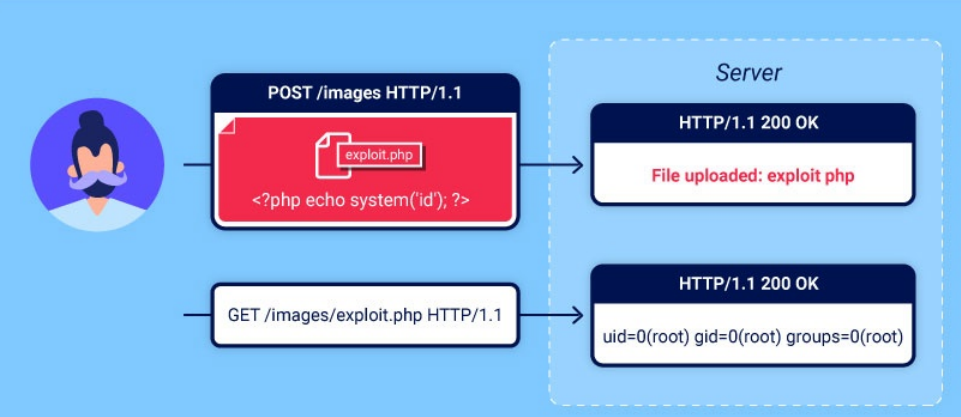

# 14. Уязвимости загрузки файлов (File upload vulnerabilities)
Функции загрузки файлов широко используются в веб-приложениях, поэтому важно уметь правильно их тестировать.


## 1. Что такое уязвимости загрузки файлов?
Уязвимость загрузки файлов возникает, когда веб-сервер позволяет пользователям загружать файлы без достаточной проверки их имени, типа, содержимого или размера.

Если такие ограничения проверяются неправильно, даже обычную загрузку изображений можно использовать для загрузки произвольных и потенциально опасных файлов. Например, это могут быть серверные скрипты, позволяющие удалённо выполнять код.

В некоторых случаях сам факт загрузки файла уже может привести к ущербу. Другие атаки требуют последующего HTTP-запроса к загруженному файлу, чтобы вызвать его выполнение на сервере.

## 2. Каково влияние уязвимостей загрузки файлов?
Влияние уязвимости загрузки файлов обычно зависит от двух факторов:
* Какие свойства файла веб-сайт неправильно проверяет: размер, тип, содержимое и т.д.
* Какие ограничения действуют на файл после его загрузки.

В худшем случае веб-сайт неправильно проверяет тип файла, а сервер позволяет выполнять определённые типы файлов (например, `.php` и `.jsp`) как код. Тогда злоумышленник может загрузить серверный скрипт, который работает как веб-оболочка и фактически даёт ему полный контроль над сервером.

Если имя файла проверяется неправильно, злоумышленник может перезаписать важные файлы, загрузив файл с таким же именем. Если сервер также уязвим к обходу каталогов, файлы можно загрузить даже в непредусмотренные места.

Если размер файла не ограничен должным образом, это может привести к DoS-атаке. Например, злоумышленник может заполнить всё доступное место на диске.

## 3. Как возникают уязвимости загрузки файлов?
Учитывая очевидные риски, веб-сайты редко полностью разрешают загрузку любых файлов. Обычно разработчики добавляют проверку файлов, но она может быть изначально небезопасной или легко обходиться.

Например, разработчики могут добавить в чёрный список опасные типы файлов, но не учесть различия в том, как разные компоненты системы определяют тип файла. Кроме того, в такой список легко не включить менее распространённые типы файлов, которые тоже могут быть опасными.

В других случаях веб-сайт может проверять тип файла по свойствам, которыми злоумышленник легко может управлять с помощью таких инструментов, как Burp Proxy или Repeater.

В итоге даже надёжная проверка может применяться не во всех хостах и каталогах веб-сайта. Такие различия могут создать уязвимости, которые можно использовать.

## 4. Как веб-серверы обрабатывают запросы на статические файлы?
Раньше веб-сайты почти полностью состояли из статических файлов, которые сервер отправлял пользователю по запросу. Поэтому путь запроса напрямую соответствовал расположению файла в файловой системе сервера. Сейчас сайты стали более динамичными, и путь запроса часто вообще не связан с файловой системой. Тем не менее серверы по-прежнему обрабатывают запросы к статическим файлам, например изображениям и таблицам стилей.

Процесс обработки таких файлов в основном остался прежним. Сервер анализирует путь запроса, определяет расширение файла и по нему устанавливает тип файла. Обычно для этого расширение сравнивается с заранее настроенным списком соответствий между расширениями и MIME-типами. Дальнейшая обработка зависит от типа файла и настроек сервера.

* Если файл **не является исполняемым**, например изображение или статическая HTML-страница, сервер просто отправляет его содержимое клиенту в HTTP-ответе.
* Если файл **является исполняемым**, например PHP-файл, и сервер настроен на его выполнение, сервер перед запуском скрипта устанавливает переменные на основе заголовков и параметров HTTP-запроса. Результат выполнения затем отправляется клиенту в HTTP-ответе.
* Если файл **является исполняемым**, но сервер **не настроен** на его выполнение, обычно сервер возвращает ошибку. Однако иногда содержимое такого файла может быть отправлено клиенту как обычный текст. Такая неправильная настройка может привести к утечке исходного кода и другой конфиденциальной информации.

> Совет - ***Заголовок ответа `Content-Type` может подсказать, какой тип файла сервер считает отправленным. Если приложение не установило этот заголовок самостоятельно, обычно в нём указывается MIME-тип, определённый сервером для файла.***

## 5. Эксплуатация неограниченной загрузки файлов для размещения веб-оболочки
С точки зрения безопасности худший сценарий — когда веб-сайт позволяет загружать серверные скрипты, например PHP, Java или Python, и сервер настроен на их выполнение. В таком случае злоумышленник может легко разместить на сервере собственную веб-оболочку.

> `Веб-оболочка` — это вредоносный скрипт, который позволяет злоумышленнику выполнять произвольные команды на удалённом веб-сервере, отправляя HTTP-запросы к нужной конечной точке.

Если `веб-оболочку` удалось загрузить, злоумышленник фактически получает контроль над сервером. Он может читать и изменять файлы, извлекать конфиденциальные данные, а также использовать сервер для атак на внутреннюю инфраструктуру и другие серверы за пределами сети.

Например, следующий PHP-код позволяет прочитать произвольный файл:
```php
<?php echo file_get_contents('/path/to/target/file'); ?>
```
После загрузки этого вредоносного файла запрос к нему вернёт содержимое указанного файла в HTTP-ответе.

Более универсальная веб-оболочка может выглядеть так:
```php
<?php echo system($_GET['command']); ?>
```
Этот скрипт позволяет передавать произвольную системную команду через параметр запроса:
```
GET /example/exploit.php?command=id HTTP/1.1
```

## 6. Эксплуатация ошибочной проверки загрузки файлов
На практике редко встретится веб-сайт, у которого вообще нет защиты от атак через загрузку файлов, как в предыдущей лаборатории. Но наличие защиты ещё не означает, что она надёжна. Иногда ошибки в механизме проверки позволяют обойти защиту, загрузить веб-оболочку и получить удалённое выполнение кода.

### 6.1 Ошибочная проверка типа файла
При отправке HTML-форм браузер обычно передаёт данные в `POST`-запросе с типом `application/x-www-form-urlencoded`. Это подходит для простого текста, например имени или адреса. Но для больших объёмов двоичных данных, таких как изображения или PDF-файлы, используется `multipart/form-data`.

Рассмотрим форму, в которой можно загрузить изображение, добавить его описание и указать имя пользователя. Запрос такой формы может выглядеть примерно так:
```
POST /images HTTP/1.1
Host: normal-website.com
Content-Length: 12345
Content-Type: multipart/form-data; boundary=---------------------------012345678901234567890123456

---------------------------012345678901234567890123456
Content-Disposition: form-data; name="image"; filename="example.jpg"
Content-Type: image/jpeg

[...binary content of example.jpg...]

---------------------------012345678901234567890123456
Content-Disposition: form-data; name="description"

This is an interesting description of my image.

---------------------------012345678901234567890123456
Content-Disposition: form-data; name="username"

wiener
---------------------------012345678901234567890123456--
```

Как видно, тело запроса разделено на отдельные части для каждого поля формы. Каждая часть содержит заголовок `Content-Disposition`, который указывает основную информацию о соответствующем поле. Также отдельная часть может содержать собственный заголовок `Content-Type`, указывающий MIME-тип передаваемых данных.

Один из способов проверки загружаемых файлов — убедиться, что заголовок `Content-Type` соответствует ожидаемому MIME-типу. Например, если сервер принимает только изображения, он может разрешать `image/jpeg` и `image/png`.

Проблема возникает, если сервер полностью доверяет значению этого заголовка. Если он дополнительно не проверяет содержимое файла, соответствие MIME-типу можно легко обойти с помощью таких инструментов, как `Burp Repeater`.

То есть главное: **сервер проверяет заявленный MIME-тип, но может не проверять, что файл действительно соответствует этому типу.** Надо проверять и содержиоме файла...

### 6.2 Предотвращение выполнения файлов в доступных пользователю каталогах
Лучше всего не допускать загрузки опасных типов файлов. ***Но дополнительная защита — не позволять серверу выполнять скрипты, которые всё же удалось загрузить***.

Обычно серверы выполняют только те скрипты, MIME-типы которых явно настроены для выполнения. В остальных случаях сервер может вернуть ошибку или, иногда, отправить содержимое файла как обычный текст:
```
GET /static/exploit.php?command=id HTTP/1.1
Host: normal-website.com

HTTP/1.1 200 OK
Content-Type: text/plain
Content-Length: 39

<?php echo system($_GET['command']); ?>
```
Такое поведение само по себе может быть опасным, поскольку позволяет получить исходный код файла. Но при этом оно не позволяет использовать файл как веб-оболочку.

Настройки могут отличаться для разных каталогов. Каталог, куда пользователи загружают файлы, обычно защищён строже, чем другие каталоги, которые не предназначены для пользовательских файлов. Если удастся загрузить скрипт в другой каталог, где такие ограничения отсутствуют, сервер в итоге может выполнить этот скрипт.

> Совет - Веб-серверы часто используют поле `filename` в запросе `multipart/form-data`, чтобы определить имя и место сохранения загружаемого файла.

Также важно учитывать, что один домен может указывать на прокси-сервер, например балансировщик нагрузки. За ним могут находиться несколько серверов, которые обрабатывают запросы и имеют разные настройки.

### 6.3 Недостаточное добавление опасных типов файлов в чёрный список
Один из очевидных способов запретить загрузку вредоносных скриптов — добавить опасные расширения, например `.php`, в чёрный список.

**Однако такой подход изначально ненадёжен:** сложно явно заблокировать все расширения, которые могут использоваться для выполнения кода. Обойти такой чёрный список иногда можно с помощью менее известных расширений, которые также могут быть исполняемыми, например `.php5`, `.shtml` и других.

#### Обход конфигурации сервера
Как мы обсуждали ранее, серверы обычно не выполняют файлы, если они не настроены на их выполнение. Например, чтобы Apache мог выполнять PHP-файлы, разработчикам может потребоваться добавить в `/etc/apache2/apache2.conf` такие директивы:
```
LoadModule php_module /usr/lib/apache2/modules/libphp.so
AddType application/x-httpd-php .php
```
Многие серверы также позволяют создавать отдельные конфигурационные файлы для конкретных каталогов. Они могут изменять или дополнять глобальные настройки. Например, Apache использует для этого файл `.htaccess`, если он присутствует.

Аналогично, на серверах IIS можно использовать файл `web.config` для настройки конкретного каталога. Например, с его помощью можно разрешить серверу отдавать пользователям JSON-файлы:
```
<staticContent>
    <mimeMap fileExtension=".json" mimeType="application/json" />
</staticContent>
```
Веб-серверы используют такие конфигурационные файлы, если они присутствуют, но обычно не позволяют получить их напрямую через HTTP-запрос.

Однако иногда сервер может позволить загрузить собственный вредоносный конфигурационный файл. В таком случае, даже если нужное расширение находится в чёрном списке, можно изменить настройки сервера так, чтобы произвольное расширение файла считалось исполняемым MIME-типом.

#### Запутывание расширений файлов
Даже большие чёрные списки можно обойти с помощью методов запутывания. Например, если проверка чувствительна к регистру и не распознаёт `exploit.pHp` как `.php`, но последующая обработка расширения не чувствительна к регистру, возникает несоответствие. Это позволяет загрузить PHP-файл, который затем может быть выполнен сервером.

Похожего результата можно добиться следующими способами:
* **Использовать несколько расширений.** В зависимости от того, как сервер анализирует имя файла, `exploit.php.jpg` может быть распознан как PHP-файл или изображение JPG.
* **Добавить символы в конец имени.** Некоторые компоненты удаляют или игнорируют конечные пробелы, точки и другие символы: `exploit.php.`
* **Использовать URL-кодирование или двойное URL-кодирование** точек, слешей и обратных слешей. Если при проверке расширения значение не декодируется, но позже декодируется сервером, это может позволить загрузить заблокированный файл: `exploit%2Ephp`
* **Добавить точку с запятой или URL-кодированный нулевой байт** перед расширением. Например: `exploit.asp;.jpg` или `exploit.asp%00.jpg`. Если проверка выполняется на языке высокого уровня, например PHP или Java, а сервер обрабатывает файл с помощью функций C/C++, это может привести к разному определению конца имени файла.
* **Использовать многобайтные символы Unicode**, которые после преобразования или нормализации могут превратиться в нулевой байт или точку. Например, последовательности `xC0 x2E`, `xC4 xAE` или `xC0 xAE` могут преобразоваться в `x2E`, если имя сначала обрабатывается как UTF-8, а затем преобразуется в ASCII.

Другой способ защиты — ***удалять или заменять опасные расширения***, чтобы предотвратить выполнение файла. Если такая обработка выполняется не рекурсивно, запрещённую строку можно расположить так, чтобы после её удаления осталось действительное расширение.

Например, если из файла `exploit.p.phphp` удалить `.php`, получится:

`exploit.php`

Это лишь небольшая часть множества способов запутывания расширений файлов.

### 6.4 Ошибочная проверка содержимого файла
Вместо того чтобы просто доверять заголовку `Content-Type` из запроса, более защищённые серверы пытаются проверить, действительно ли содержимое файла соответствует заявленному типу.

Например, при загрузке изображения сервер может проверить его внутренние свойства, такие как размеры. PHP-скрипт не имеет размеров изображения, поэтому сервер может определить, что это не изображение, и отклонить загрузку.

Некоторые типы файлов также всегда содержат определённую последовательность байтов в начале или конце файла. Её можно использовать как подпись, чтобы проверить тип файла. Например, JPEG-файлы всегда начинаются с байтов `FF D8 FF`.

Это более надёжный способ проверки типа файла, но и он не гарантирует безопасность. Например, с помощью специальных инструментов, таких как `ExifTool`, можно создать полиглотский JPEG-файл, содержащий вредоносный код в метаданных.

### 6.5 Эксплуатация загрузки файлов через условия гонки
Современные фреймворки лучше защищены от таких атак. Обычно они не загружают файлы сразу в конечную папку. Сначала файл помещается во временный каталог, а его имя случайно изменяется, чтобы избежать перезаписи существующих файлов. Затем файл проверяется и только после этого перемещается в нужное место, если считается безопасным.

Однако разработчики иногда самостоятельно реализуют обработку загрузки файлов, не используя возможности фреймворка. Это сложно сделать правильно и может привести к опасным условиям гонки, позволяющим обойти даже надёжную проверку.

Например, некоторые сайты сначала загружают файл непосредственно в основную файловую систему, а затем удаляют его, если он не проходит проверку. Такое поведение встречается на сайтах, которые используют антивирус или другое ПО для проверки файлов на наличие вредоносного содержимого. Проверка может занять всего несколько миллисекунд, но за это короткое время злоумышленник может успеть выполнить загруженный файл.

Такие уязвимости часто очень сложно обнаружить при тестировании методом чёрного ящика, если не удаётся получить исходный код, связанный с обработкой загрузки файлов.

#### Условия гонки при загрузке файлов по URL
Аналогичные условия гонки могут возникать при загрузке файла по URL. В этом случае сервер сначала скачивает файл из интернета и создаёт его локальную копию, а уже затем выполняет проверку.

Поскольку файл загружается через HTTP, разработчики не могут использовать встроенные механизмы фреймворка для безопасной проверки. Поэтому им приходится самостоятельно реализовывать временное хранение и проверку файла, что может быть менее безопасно.

Например, если файл сохраняется во временный каталог со случайным именем, злоумышленник теоретически не сможет воспользоваться условием гонки. Не зная имени каталога, он не сможет запросить файл и запустить его. Однако если случайное имя создаётся с помощью псевдослучайной функции, например PHP `uniqid()`, его потенциально можно подобрать перебором.

Чтобы упростить такую атаку, можно увеличить время обработки файла и тем самым расширить окно для подбора имени каталога. Один из способов — загрузить большой файл. Если сервер обрабатывает его частями, можно создать вредоносный файл, поместив полезную нагрузку в начале, а после неё добавив большое количество произвольных данных.

## 7. Эксплуатация уязвимостей загрузки файлов без удалённого выполнения кода
В предыдущих примерах мы загружали серверные скрипты и использовали их для удалённого выполнения кода. Это самое серьёзное последствие небезопасной загрузки файлов, но такие уязвимости можно использовать и другими способами.

### 7.1 Загрузка вредоносных клиентских скриптов
Даже если скрипты нельзя выполнять на сервере, их можно использовать для атак на стороне клиента. Например, если сайт позволяет загружать HTML-файлы или изображения SVG, в них можно добавить `<script>` для создания сохранённой XSS-атаки.

Если загруженный файл отображается на странице, которую посещают другие пользователи, их браузер выполнит скрипт при открытии страницы. Однако из-за политики одного источника такая атака сработает только тогда, когда загруженный файл отдаётся с того же источника, с которого выполняется загрузка.

### 7.2 Эксплуатация уязвимостей при обработке загруженных файлов
Если загруженный файл безопасно хранится и отдаётся пользователям, можно попробовать найти уязвимости в его разборе или обработке.

Например, если сервер обрабатывает XML-файлы, такие как Microsoft Office `.doc` или `.xls`, это может стать потенциальным способом проведения XXE-инъекций.

## 8. Загрузка файлов с помощью PUT
Некоторые веб-серверы могут быть настроены на поддержку `PUT`-запросов. Если такая функция не защищена должным образом, её можно использовать для загрузки вредоносных файлов, даже если обычная загрузка через веб-интерфейс недоступна.

Пример запроса:
```
PUT /images/exploit.php HTTP/1.1
Host: vulnerable-website.com
Content-Type: application/x-httpd-php
Content-Length: 49

<?php echo file_get_contents('/path/to/file'); ?>
```
> Совет - ***Можно отправлять `OPTIONS`-запросы к различным конечным точкам, чтобы проверить, поддерживает ли сервер метод `PUT`.***

## 9. Как предотвратить уязвимости загрузки файлов
Возможность загрузки файлов пользователями является обычной функцией и сама по себе не опасна, если принять необходимые меры защиты.

Для защиты веб-сайтов от таких уязвимостей рекомендуется использовать следующие методы:
* Проверяйте расширение файла по **белому списку** разрешённых расширений, а не по чёрному списку запрещённых. Гораздо проще определить, какие типы файлов разрешены, чем предусмотреть все опасные варианты.
* Убедитесь, что имя файла не содержит конструкции, которые могут быть использованы как путь к каталогу или для обхода директорий (`../`).
* Переименовывайте загруженные файлы, чтобы избежать конфликтов имён и перезаписи существующих файлов.
* Не сохраняйте файлы в постоянное хранилище сервера до тех пор, пока они полностью не пройдут проверку.
* По возможности используйте готовые проверенные механизмы обработки файлов вместо написания собственной логики проверки.


https://portswigger.net/web-security/file-upload