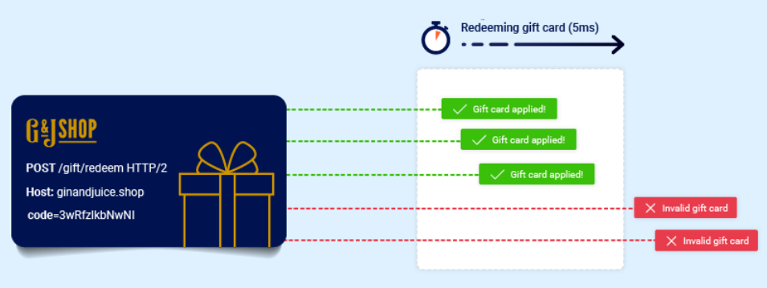
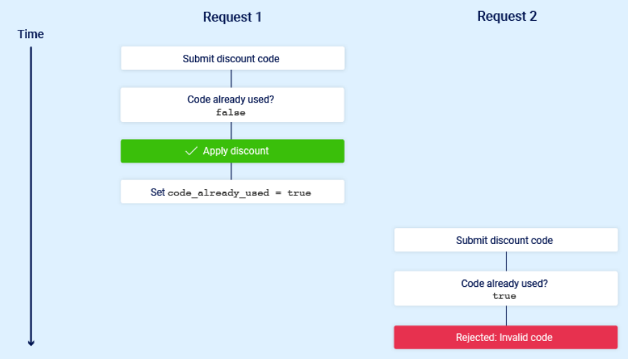
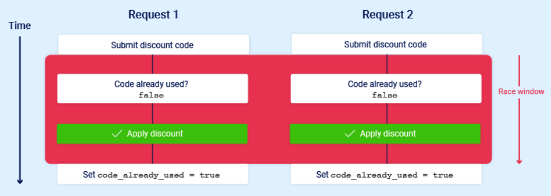
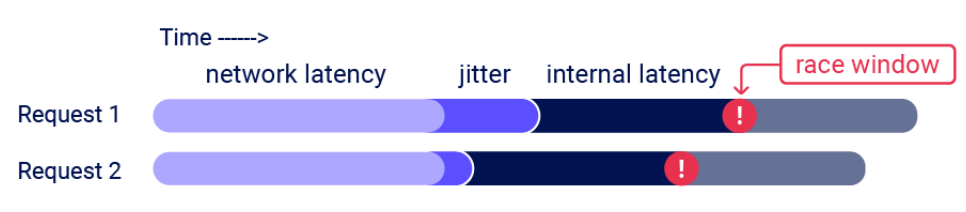
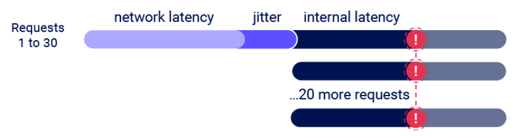
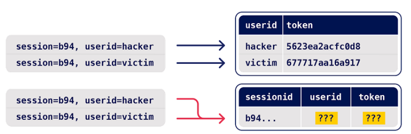
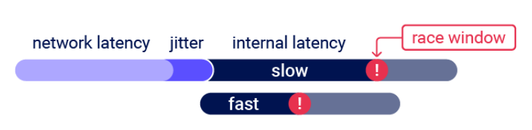
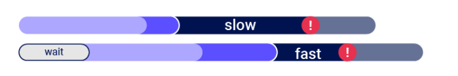
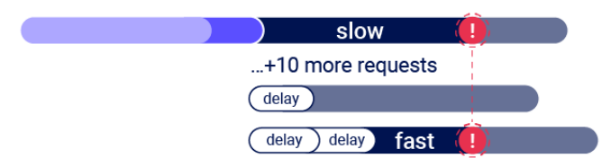
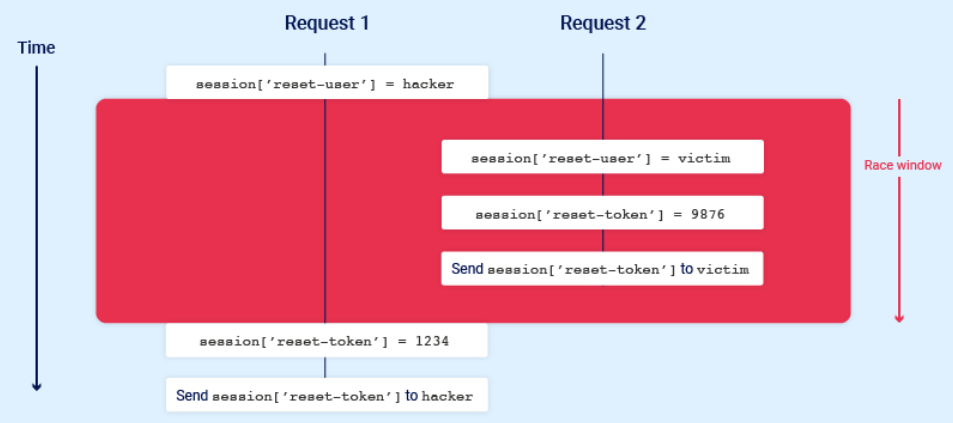

# 15. Race conditions (**Условия гонки**)
`Условия гонки` — это распространенный тип уязвимости, тесно **связанный с недостатками бизнес-логики**. Они возникают, когда веб-сайт одновременно обрабатывает несколько запросов без достаточной защиты.

В результате разные потоки могут одновременно работать с одними и теми же данными. Это может привести к «столкновению» и вызвать непредусмотренное поведение приложения.



Период времени, в течение которого может произойти столкновение, называется **«окном гонки»**. Например, оно может длиться долю секунды между двумя взаимодействиями с базой данных.

Как и другие недостатки бизнес-логики, влияние условий гонки во многом зависит от самого приложения и конкретной функции, в которой они возникают.

## 1. Превышение ограничений при условиях гонки
Наиболее известный тип условий гонки позволяет обойти ограничение, установленное бизнес-логикой приложения.

Например, интернет-магазин может разрешать использовать промокод при оформлении заказа для получения одноразовой скидки. Чтобы применить скидку, приложение может выполнять следующие действия:
1. Проверить, что вы еще не использовали этот код.
2. Применить скидку к общей стоимости заказа.
3. Обновить запись в базе данных, указав, что код уже использован.

Если позже попытаться использовать этот код повторно, первоначальная проверка должна помешать это сделать:



Теперь представим, что пользователь, который еще не использовал промокод, пытается применить его дважды почти одновременно:



Как видно, приложение на короткое время переходит в промежуточное состояние — оно уже изменилось, но обработка запроса еще не завершена. В данном случае оно начинается, когда сервер обрабатывает первый запрос, и заканчивается после обновления базы данных, где указывается, что код уже использован.

Это создает небольшое **окно гонки**, в течение которого можно несколько раз получить скидку.

Существует множество вариантов таких атак, например:
* Повторная активация подарочной карты.
* Повторная оценка товара.
* Снятие или перевод денег сверх баланса счета.
* Повторное использование одной CAPTCHA.
* Обход ограничения количества попыток при переборе паролей.

Превышение ограничений — это подтип уязвимостей, известных как **«время проверки — время использования» (TOCTOU)**. Далее мы рассмотрим примеры условий гонки, которые не относятся к этой категории.

### 1.1 Обнаружение и эксплуатация условий гонки с помощью Burp Repeater
Обнаружить и использовать условия гонки, позволяющие превысить ограничение, довольно просто. В общих чертах нужно:
1. **Найти одноразовую или ограниченную по количеству запросов конечную точку**, которая имеет какое-либо влияние на безопасность или другую полезную цель.
2. **Отправить несколько запросов к этой конечной точке почти одновременно** и проверить, удастся ли обойти ограничение.

Главная задача — правильно синхронизировать запросы, чтобы как минимум два из них попали в одно окно гонки и вызвали столкновение. Такое окно часто длится всего несколько миллисекунд и может быть еще короче.

Даже если отправить все запросы одновременно, на практике существуют разные непредсказуемые факторы, которые влияют на время обработки запросов сервером и их порядок.



В `Burp Suite 2023.9` в `Burp Repeater` появились новые возможности, которые позволяют легко отправлять группу параллельных запросов и значительно уменьшить влияние одного из таких факторов — сетевого джиттера. Burp автоматически выбирает подходящий способ синхронизации в зависимости от версии HTTP, которую поддерживает сервер:
* Для HTTP/1 используется классическая техника синхронизации **last-byte**.
* Для HTTP/2 используется техника **single-packet attack**, впервые представленная исследователями PortSwigger на Black Hat USA 2023.

Атака с одним пакетом позволяет полностью устранить влияние сетевого джиттера, отправляя 20–30 запросов одновременно в одном TCP-пакете.



Хотя для выполнения атаки часто достаточно всего двух запросов, отправка большого количества запросов помогает уменьшить влияние внутренней задержки сервера, также называемой **серверным джиттером**. Это особенно полезно на этапе первоначального поиска уязвимости. Далее мы подробнее рассмотрим эту методологию.

### 1.2 Обнаружение и эксплуатация условий гонки с Turbo Intruder
Помимо встроенной поддержки атаки с одним пакетом в `Burp Repeater`, эта техника также поддерживается в расширении **Turbo Intruder**. Последнюю версию можно скачать из `BApp Store`.

`Turbo Intruder` требует базовых знаний Python, но подходит для более сложных атак — например, когда нужны повторные попытки, поэтапная отправка запросов или очень большое количество запросов.

Чтобы использовать атаку с одним пакетом в `Turbo Intruder`:
1. Убедитесь, что цель поддерживает **HTTP/2**. Атака с одним пакетом не работает с HTTP/1.
2. Установите параметры `engine=Engine.BURP2` и `concurrentConnections=1` для движка запросов.
3. При добавлении запросов в очередь объединяйте их в группы с помощью именованных **gate**, передавая имя через аргумент `gate` метода `engine.queue()`.
4. Чтобы одновременно отправить все запросы из группы, откройте соответствующий gate с помощью метода `engine.openGate()`.

```python
def queueRequests(target, wordlists):
    engine = RequestEngine(endpoint=target.endpoint,concurrentConnections=1,engine=Engine.BURP2)

    # добавить 20 запросов в группу '1'
    for i in range(20):
        engine.queue(target.req, gate='1')

    # отправить все запросы из группы '1' одновременно
    engine.openGate('1')
```

Более подробную информацию можно найти в шаблоне `race-single-packet-attack.py`, который находится в стандартном каталоге примеров `Turbo Intruder`.

## 2. Скрытые многоступенчатые последовательности
На практике один запрос может запускать многоступенчатый процесс, в котором приложение проходит через несколько скрытых состояний. Оно входит в них и выходит из них до завершения обработки запроса. Мы будем называть такие состояния **«подсостояниями»**.

Если вы можете найти один или несколько HTTP-запросов, которые работают с одними и теми же данными, можно попытаться использовать эти подсостояния. Это позволяет находить логические уязвимости, зависящие от времени, в многоступенчатых процессах и использовать условия гонки, которые выходят далеко за рамки простого превышения ограничений.

Например, вам могут быть знакомы уязвимые процессы `многофакторной аутентификации` (MFA). Они позволяют выполнить первую часть входа с известными учетными данными, а затем напрямую перейти к приложению, фактически полностью обойдя `MFA`.

Следующий псевдокод показывает, как сайт может быть уязвим к атаке на условия гонки:
```python
session['userid'] = user.userid
if user.mfa_enabled:
    session['enforce_mfa'] = True
# сгенерировать и отправить пользователю код MFA
# перенаправить браузер на форму ввода кода MFA
```

Как видно, здесь многоступенчатый процесс происходит внутри одного запроса. Главное, что приложение проходит через подсостояние, в котором **у пользователя временно есть действительная сессия, но MFA еще не включена**.

Злоумышленник может попытаться использовать это, одновременно отправив запрос на вход и запрос к защищенной конечной точке, которая требует аутентификации.

Далее мы рассмотрим еще несколько примеров скрытых многоступенчатых последовательностей и попрактикуемся в их использовании в интерактивных лабораториях. Однако такие уязвимости сильно зависят от конкретного приложения, поэтому сначала важно понять общую методологию их поиска — как в лабораториях, так и в реальных приложениях.

## 3. Методология
Для обнаружения и эксплуатации скрытых многоступенчатых последовательностей мы рекомендуем следующую методологию. Она основана на исследовании PortSwigger Research **«Smashing the State Machine: The True Potential of Web Race Conditions»**.


### 3.1. Предсказать возможные столкновения (Predict)
Проверять каждую конечную точку нецелесообразно. После обычного изучения целевого сайта можно сократить количество точек для тестирования, задав себе следующие вопросы:
* **Насколько эта конечная точка важна с точки зрения безопасности?** Многие конечные точки не связаны с критически важными функциями, поэтому их не стоит тестировать.
* **Есть ли возможность столкновения?** Для успешной атаки обычно нужны два или более запроса, которые выполняют операции с одной и той же записью. Например, рассмотрим два варианта реализации сброса пароля:



В первом случае параллельные запросы на сброс пароля для двух разных пользователей вряд ли вызовут столкновение, поскольку они изменяют две разные записи.

Во втором случае запросы для двух разных пользователей могут изменить одну и ту же запись, поэтому здесь уже есть возможность для столкновения.

### 3.2 Поиск подсказок (Probe)
Чтобы обнаружить подсказки, сначала нужно сравнить поведение конечной точки в обычных условиях. В `Burp Repeater` можно сгруппировать запросы и отправить их **последовательно**.

Затем отправьте ту же группу запросов одновременно, используя **атаку с одним пакетом** (или синхронизацию `last-byte`, если HTTP/2 не поддерживается). Это позволяет уменьшить влияние сетевого джиттера. В `Burp Repeater` для этого выберите **Send group in parallel**. Также можно использовать расширение **Turbo Intruder**, доступное в `BApp Store`.

Подсказкой может быть любое изменение. Ищите отклонения от поведения, которое вы наблюдали при обычной отправке запросов. Это может быть изменение одного или нескольких ответов, но также обращайте внимание на последствия второго порядка — например, изменение содержимого электронных писем или заметное изменение поведения приложения после атаки.

> **Примечание** - В `Burp Suite Professional` для быстрой проверки условий гонки можно использовать пользовательское действие **Probe for Race Condition**. Оно отправляет параллельные запросы одним нажатием, поэтому не нужно вручную создавать и группировать вкладки в `Repeater`.

Дополнительную информацию об использовании пользовательских действий можно найти в разделе **Custom actions**.

### 3.3. Подтвердите концепцию
Постарайтесь понять, что происходит, удалите лишние запросы и убедитесь, что эффект по-прежнему воспроизводится.

Продвинутые условия гонки могут создавать необычные и уникальные возможности для атаки, поэтому путь к максимальному воздействию не всегда очевиден. Полезно рассматривать каждое условие гонки как **структурную слабость**, а не как отдельную изолированную уязвимость.

## 4. Многоконечные условия гонки
Возможно, самый понятный вид `условий гонки` — это атаки, при которых запросы одновременно отправляются к нескольким конечным точкам.

Представьте классическую уязвимость в интернет-магазине: вы добавляете товар в корзину, оплачиваете его, а затем добавляете туда новые товары до того, как приложение принудительно переводит вас на страницу подтверждения заказа.

Вариант этой уязвимости может возникнуть, если проверка платежа и подтверждение заказа выполняются в рамках обработки одного запроса. Состояния заказа могут выглядеть примерно так:


В этом случае можно попытаться добавить новые товары в корзину во время окна гонки — между подтверждением платежа и окончательным подтверждением заказа.

### 4.1 Синхронизация многоконечных окон гонки
При тестировании многоконечных условий гонки может быть сложно одновременно попасть в окна гонки для всех запросов, даже если отправлять их точно в одно время с помощью атаки с одним пакетом.


Эта проблема в основном возникает по двум причинам:
* **Задержки из-за сетевой архитектуры** — например, задержка может возникать, когда внешний сервер устанавливает новое соединение с внутренним сервером. Используемый протокол также может сильно влиять на задержку.
* **Задержки при обработке конечных точек** — разные конечные точки могут обрабатывать запросы за разное время, иногда значительно отличающееся, в зависимости от выполняемых операций.

К счастью, для обеих проблем есть возможные решения.

### 4.2 Прогрев соединения
Задержки при установлении нового соединения обычно не мешают атакам на условия гонки, поскольку параллельные запросы обычно задерживаются примерно одинаково и остаются синхронизированными.

Важно отличать такие задержки от задержек, связанных с обработкой конечных точек. Для этого можно «прогреть» соединение одним или несколькими несущественными запросами и проверить, уменьшилось ли оставшееся время обработки. В `Burp Repeater` можно добавить `GET`-запрос к главной странице в начало группы вкладок, а затем использовать **Send group in sequence (single connection)**.

Если первый запрос по-прежнему обрабатывается дольше, но остальные теперь выполняются в коротком временном окне, очевидную задержку можно проигнорировать и продолжить тестирование.

Если даже при использовании атаки с одним пакетом время ответа одной конечной точки остается непредсказуемым, это может означать, что задержка на стороне сервера мешает атаке. В таком случае можно использовать `Turbo Intruder`, чтобы сначала отправить несколько запросов для прогрева соединения, а затем выполнить основные запросы атаки.

### 4.3 Ограничение скорости или ресурсов
Если прогрев соединения не помогает, есть несколько способов решить эту проблему.

С помощью `Turbo Intruder` можно добавить небольшую задержку на стороне клиента. Однако тогда запросы атаки будут отправляться через несколько TCP-пакетов, поэтому использовать атаку с одним пакетом не получится. В результате на системах с большой задержкой атака вряд ли будет надежно работать независимо от выбранной задержки.


Вместо этого можно воспользоваться особенностью механизмов ограничения скорости и ресурсов.

**Веб-серверы часто замедляют обработку запросов, когда их слишком много поступает за короткое время**. Если отправить большое количество запросов на фиктивную цель и намеренно вызвать ограничение скорости или ресурсов, сервер создаст нужную задержку. Благодаря этому атаку с одним пакетом можно использовать даже тогда, когда требуется отложенная обработка запросов.


## 5. Одноконечные условия гонки
Отправка параллельных запросов с разными значениями на одну конечную точку иногда позволяет вызвать мощные условия гонки.

Рассмотрим механизм сброса пароля, который сохраняет идентификатор пользователя и токен сброса в сессии.

В этом случае отправка двух параллельных запросов на сброс пароля из одной сессии, но с разными именами пользователей, может вызвать следующее столкновение:



Обратите внимание на конечное состояние после завершения всех операций:
* `session['reset-user'] = victim`
* `session['reset-token'] = 1234`

Сессия теперь содержит идентификатор пользователя-жертвы, но действительный токен сброса отправляется злоумышленнику.

> **Примечание** - Чтобы атака сработала, операции, выполняемые каждым процессом, должны произойти в правильном порядке. Поэтому может потребоваться несколько попыток или немного удачи.

Подтверждение адреса электронной почты и другие операции, связанные с электронной почтой, часто являются хорошими целями для одноконечных условий гонки. Письма нередко отправляются в фоновом процессе после того, как сервер уже отправил HTTP-ответ клиенту, что повышает вероятность возникновения условия гонки.

## 6. Механизмы блокировки на основе сессий
Некоторые фреймворки пытаются предотвратить повреждение данных с помощью блокировки запросов. Например, обработчик сессий PHP позволяет выполнять только один запрос за раз для одной сессии.

Важно учитывать такое поведение, поскольку оно может скрывать простые для эксплуатации уязвимости. Если вы заметили, что все запросы выполняются последовательно, попробуйте отправлять каждый запрос с разными токенами сессии.

## 7. Условия гонки при частичном создании объектов
Многие приложения создают объекты в несколько этапов. Это может временно создавать промежуточное состояние, в котором объект уже существует, но еще не полностью настроен.

Например, при регистрации нового пользователя приложение может сначала создать запись пользователя в базе данных, а затем отдельным SQL-запросом установить его API-ключ. Между этими действиями существует небольшое окно, когда пользователь уже создан, но его API-ключ еще не инициализирован.

Такое поведение может привести к атакам, при которых передается значение, вызывающее возврат неинициализированных данных из базы, например пустой строки или `null` в JSON. Затем это значение может использоваться в проверках безопасности.

Фреймворки часто поддерживают передачу массивов и других нестандартных структур данных через специальный синтаксис. Например, в PHP:
* `param[]=foo` эквивалентно `param = ['foo']`
* `param[]=foo&param[]=bar` эквивалентно `param = ['foo', 'bar']`
* `param[]` эквивалентно `aram = []`

`Ruby on Rails` также позволяет создавать подобные структуры, если передать POST-параметр с ключом, но без значения. Например:
```ruby
params = {"param"=>{"key"=>nil}}
```
В таком случае во время окна гонки можно потенциально отправить аутентифицированный API-запрос:
```http
GET /api/user/info?user=victim&api-key[]= HTTP/2
Host: vulnerable-website.com
```

> **Примечание** - Подобные атаки при частичном создании объектов можно проводить и с паролями вместо API-ключей. Однако пароли обычно хешируются, поэтому нужно подобрать значение, хеш которого совпадет с неинициализированным значением.

## 8. Атаки с учетом времени
Иногда условия гонки обнаружить не удается, но методы точной синхронизации запросов все равно могут помочь найти другие уязвимости.

Один из примеров — использование временных меток с высокой точностью вместо криптографически безопасных случайных строк для создания токенов безопасности.

Рассмотрим токен сброса пароля, который создается только на основе временной метки. В таком случае можно попытаться запустить два сброса пароля для разных пользователей в один момент, чтобы оба получили одинаковый токен.

Для этого достаточно правильно выбрать время отправки запросов, чтобы они создали одну и ту же временную метку.

Представим, что сайт создаёт токен примерно так:
```
token = timestamp
```
Например, в 14:32:15.123 пользователь Alice запрашивает сброс пароля:
```
Alice → запрос сброса → token = 14:32:15.123
```
А злоумышленник почти в тот же момент отправляет запрос для Bob:
```
Bob → запрос сброса → token = 14:32:15.123
```
Если сайт использует только время для создания токена и оба запроса обрабатываются в пределах одной и той же временной отметки, токены окажутся одинаковыми.

## 9. Как предотвратить уязвимости, связанные с условиями гонки
Когда один запрос может переводить приложение через несколько скрытых подсостояний, его поведение становится очень сложно предсказать и защитить. Поэтому мы рекомендуем по возможности устранять подсостояния из всех чувствительных конечных точек с помощью следующих подходов:
* Избегайте смешивания данных из разных хранилищ.
* Убедитесь, что чувствительные конечные точки изменяют состояние атомарно, используя возможности хранилища данных для работы с параллельными операциями. Например, используйте одну транзакцию базы данных, чтобы проверить соответствие суммы платежа стоимости корзины и подтвердить заказ.
* В качестве дополнительной защиты используйте возможности хранилища данных для поддержания целостности и согласованности, например ограничения уникальности столбцов.
* Не используйте один уровень хранения данных для защиты другого. Например, сессии не подходят для предотвращения атак на ограничения, заданные в базе данных.
* Убедитесь, что система управления сессиями сохраняет внутреннюю согласованность данных. Обновление переменных сессии по отдельности, а не одновременно, может показаться удобной оптимизацией, но это крайне опасно. То же относится и к `ORM`: скрывая такие механизмы, как транзакции, ORM фактически берет ответственность за их правильное использование на себя.
* В некоторых архитектурах может быть целесообразно полностью отказаться от состояния на сервере. Вместо этого можно использовать шифрование для хранения состояния на стороне клиента, например с помощью `JWT`. Однако у такого подхода есть собственные риски, которые подробно рассматриваются в разделе об атаках на `JWT`.

`Атомарность` на уровне приложения действительно трудно обеспечить просто последовательностью функций.

Если написать:
```py
check_payment()
confirm_order()
```
то это две отдельные операции. Между ними существует окно гонки.

Поэтому правильная идея не:
* «сделаем эти две функции настолько быстрыми, чтобы между ними было 0 микросекунд».

А:
* «сделаем так, чтобы другой запрос не мог вмешаться между критическими операциями».

Это уже достигается **транзакциями**, **блокировками**, **условными UPDATE**, **уникальными ограничениями** и другими механизмами БД.

`race condition` — правильная синхронизация доступа к общему состоянию.

Примерная таблица необходимых механизмов на разных уровнях:
| Уровень | Что конкурирует | Чем синхронизировать | Примеры |
| --- | --- | --- | --- |
| **Потоки** | Потоки внутри одного процесса | Блокировки памяти | `threading.Lock`, `RLock`, `Semaphore` |
| **Процессы** | Процессы на одной машине | Межпроцессные блокировки | `multiprocessing.Lock`, `Semaphore` |
| **Async** | Корутинные задачи | Async-блокировки | `asyncio.Lock`, `Semaphore`, `Condition` |
| **Один экземпляр приложения** | HTTP-запросы внутри приложения | Lock / транзакции | `threading.Lock`, `asyncio.Lock` |
| **Несколько экземпляров приложения** | HTTP-запросы разных экземпляров | **Общий механизм синхронизации** | Redis lock, БД |
| **Несколько серверов** | Запросы разных серверов | **Распределённая синхронизация** | Redis, PostgreSQL, distributed lock |
| **Бизнес-операция в БД** | Параллельное изменение одной записи | **Транзакции и блокировки БД** | `SELECT FOR UPDATE`, `UPDATE ... WHERE` |
| **Уникальность данных** | Одновременное создание одинаковых объектов | **Ограничение БД** | `UNIQUE`, `PRIMARY KEY` |
| **Повторная отправка запроса** | Один запрос выполняется несколько раз | **Идемпотентность** | Idempotency Key |
| **Фоновая обработка** | Несколько воркеров выполняют одну задачу | **Очередь / блокировка задачи**  | Celery, Redis, RabbitMQ |


https://portswigger.net/web-security/race-conditions