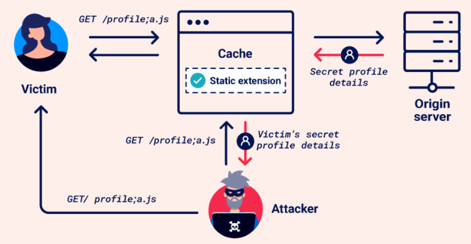
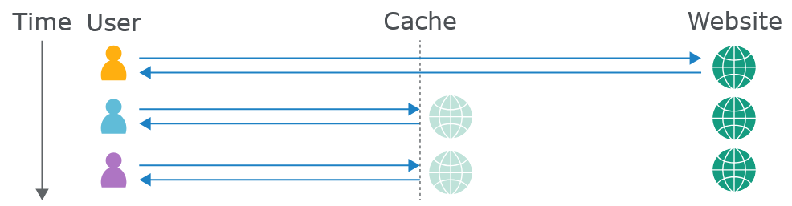

> *`Web Cache Deception` — это уязвимость, при которой **кэш и исходный сервер по-разному интерпретируют URL**. Из-за этого кэш может сохранить конфиденциальный динамический ответ как будто это статический ресурс, после чего злоумышленник получает этот закэшированный ответ.*

# 17. Веб-кэш обман (Web Cache Deception)
`Обман веб-кэша` — это уязвимость, которая позволяет злоумышленнику заставить веб-кэш сохранить конфиденциальный динамический контент. Это происходит из-за того, что кэш-сервер и исходный сервер по-разному обрабатывают один и тот же запрос.

Например, `Nginx` — это отдельный веб-сервер / reverse proxy, который принимает HTTP-запросы из интернета и решает, что с ними делать.
`Nginx/CDN/proxy` — это как раз тот уровень, на котором может находиться веб-кэш.

При атаке злоумышленник убеждает жертву перейти по вредоносному URL. Браузер жертвы отправляет неоднозначный запрос к конфиденциальному контенту. Кэш ошибочно воспринимает запрос как обращение к статическому ресурсу и сохраняет ответ. После этого злоумышленник запрашивает тот же URL и получает сохранённый ответ с личной информацией.

> Примечание - Важно отличать `обман` веб-кэша от `отравления` веб-кэша. Оба вида атак используют кэширование, но работают по-разному:
* **Обман веб-кэша** — злоумышленник использует правила кэширования, чтобы заставить кэш сохранить конфиденциальный контент, после чего получает к нему доступ.
* **Отравление веб-кэша** — злоумышленник изменяет ключ кэша, чтобы сохранить вредоносный контент, который затем будет отправляться другим пользователям.

|  | Обман кэша | Отравление кэша |
| ---- | --- | --- |
| Что хочет злоумышленник? | **Получить чужие данные** | **Доставить свой вредоносный контент** |
| Что оказывается в кэше? | Конфиденциальный ответ жертвы | Вредоносный ответ злоумышленника |
| Кто страдает? | В первую очередь жертва, чьи данные закэшировали | Другие пользователи, получившие отравленный ответ |


> **Кэш находится между пользователем и сервером сайта и предназначен для ускорения выдачи контента**. Ошибка возникает, когда кэш считает конфиденциальный ответ обычным статическим ресурсом.

> **Web Cache Deception** — это не про кэш Python или Ubuntu и не про /proc. Это про HTTP-кэширование между браузером и веб-приложением.

> **Web Cache** — это не только место хранения, но и компонент, который принимает HTTP-запрос, проверяет своё хранилище и решает, отдавать сохранённый ответ или отправлять запрос дальше.



## 1. Веб-кэши
`Веб-кэш` — это система, которая находится между исходным сервером и пользователем. Когда клиент запрашивает статический ресурс, запрос сначала поступает в кэш. Если нужной копии там нет (это называется **промахом кэша**), запрос передаётся исходному серверу. Сервер обрабатывает запрос и отправляет ответ обратно через кэш пользователю. При этом кэш по заранее заданным правилам решает, нужно ли сохранить копию ответа.

Если позже кто-то снова запросит тот же статический ресурс, кэш может сразу отправить сохранённую копию пользователю. Это называется **попаданием в кэш**.

Кэширование стало важной частью доставки веб-контента, особенно из-за широкого использования **сетей доставки контента (CDN)**. `CDN` хранят копии контента на распределённых серверах по всему миру. Это ускоряет загрузку, потому что контент можно получить с сервера, расположенного ближе к пользователю.


### 1.1 Кэш-ключи
Когда кэш получает HTTP-запрос, он должен определить, есть ли у него сохранённый ответ, который можно сразу отправить пользователю, или нужно передать запрос исходному серверу. Для этого кэш создаёт **ключ кэша** на основе данных HTTP-запроса. Обычно в него входят URL и параметры запроса, но также могут учитываться заголовки и тип контента.

> Если ключ нового запроса совпадает с ключом предыдущего запроса, кэш считает их одинаковыми и отправляет сохранённую копию ответа.

### 1.2 Правила кэша
Правила кэша определяют, какой контент можно сохранять и как долго. Обычно кэшируются статические ресурсы, которые редко меняются и используются на разных страницах. Динамический контент обычно не кэшируется, поскольку может содержать конфиденциальную информацию. В этом случае пользователь получает актуальные данные непосредственно с сервера.

Атаки обмана веб-кэша используют особенности этих правил, поэтому важно знать основные их типы. Например:
* **Правила по расширению файла** — определяют, можно ли кэшировать ресурс по его расширению, например `.css` для таблиц стилей или `.js` для JavaScript.
* **Правила статического каталога** — применяются ко всем URL, начинающимся с определённого пути. Например, `/static` или `/assets` могут использоваться для каталогов со статическими ресурсами.
* **Правила по имени файла** — применяются к определённым файлам, которые нужны для работы сайта и редко меняются, например `robots.txt` и `favicon.ico`.

Кэш также может использовать пользовательские правила, основанные на других параметрах, например параметрах URL или результатах динамического анализа.

## 2. Построение атаки веб-кэш обмана
В общем случае базовая атака на обман веб-кэша включает следующие шаги:
1. **Найдите целевую конечную точку**, которая возвращает динамический ответ с конфиденциальной информацией. Проверяйте ответы в Burp, поскольку часть данных может быть не видна на странице. Обращайте внимание на точки, которые поддерживают методы `GET`, `HEAD` или `OPTIONS`, так как запросы, изменяющие данные на сервере, обычно не кэшируются.
2. **Найдите различие в том, как кэш и исходный сервер обрабатывают URL.** Например, они могут по-разному:
   * сопоставлять URL с ресурсами;
   * обрабатывать разделители;
   * нормализовать пути.
3. **Создайте вредоносный URL**, используя это различие, чтобы заставить кэш сохранить динамический ответ. Когда жертва перейдёт по этому URL, её ответ сохранится в кэше. Затем с помощью Burp можно отправить запрос на тот же URL и получить сохранённый ответ с данными жертвы. Не стоит делать это напрямую в браузере: некоторые приложения перенаправляют пользователей без сессии или удаляют локальные данные, из-за чего уязвимость может остаться незаметной.

### 2.1 Использование кэш-бастера
`Cachebuster` (кэш-бастер) — это просто способ заставить кэш считать каждый запрос новым.

Тогда добавляем к URL случайный параметр:
```
GET /account?x=12345
GET /account?x=67891
GET /account?x=54321
```
Для кэша это могут быть разные ключи:
```
/account?x=12345
/account?x=67891
/account?x=54321
```
Поэтому кэш не отдаёт тебе старый результат, а обращается к серверу за новым.

При поиске различий в обработке запросов и создании атаки на обман веб-кэша убедитесь, что каждый отправляемый запрос имеет свой уникальный **ключ кэша**. Иначе вам могут возвращаться уже сохранённые ответы, что исказит результаты тестирования.

Поскольку ключ кэша обычно включает URL и параметры запроса, можно изменять его, добавляя к URL строку запроса и меняя её при каждом новом запросе. Этот процесс можно автоматизировать с помощью расширения **Param Miner**. После установки расширения откройте меню **Param Miner**, выберите **Add dynamic cachebuster**.

Теперь Burp будет автоматически добавлять уникальную строку запроса к каждому отправляемому запросу. Добавленные строки запроса можно посмотреть на вкладке **Logger**.

### 2.2 Обнаружение кэшированных ответов
При тестировании важно уметь определять, был ли ответ получен из кэша. Для этого можно проверить заголовки ответа и время его получения.

Некоторые заголовки могут указывать на то, что ответ был закэширован. Например:

* Заголовок `X-Cache` показывает, был ли ответ получен из кэша. Возможные значения:
  * `X-Cache: hit` — ответ получен из кэша.
  * `X-Cache: miss` — в кэше не было ответа для этого запроса, поэтому он был получен с исходного сервера. Обычно после этого ответ сохраняется в кэше. Чтобы проверить это, отправьте тот же запрос ещё раз.
  * `X-Cache: dynamic` — контент создаётся исходным сервером динамически. Обычно такой ответ не кэшируется.
  * `X-Cache: refresh` — сохранённый в кэше контент устарел, поэтому его нужно обновить.

* Заголовок `Cache-Control` может содержать директивы, указывающие на возможность кэширования, например `public` и `max-age` больше `0`. Но это только говорит о том, что ресурс **можно** кэшировать. Это не означает, что он действительно закэширован, поскольку кэш может игнорировать этот заголовок.

Если время ответа на один и тот же запрос сильно отличается, это также может указывать на то, что более быстрый ответ был получен из кэша.

## 3. Эксплуатация кэша по статическим расширениям файла (пункт 1.2)
Правила кэша часто определяют статические ресурсы по **расширению файла**, например `.css` или `.js`. Это стандартное поведение для большинства `CDN`.

Если кэш и исходный сервер по-разному обрабатывают путь URL или разделители, злоумышленник может создать запрос к динамическому ресурсу, добавив статическое расширение. Сервер проигнорирует это расширение, а кэш воспримет его как признак статического ресурса и сохранит ответ.

### 3.1 Расхождения в сопоставлении путей
Сопоставление URL-пути — это процесс связывания URL с ресурсами на сервере, например файлами, скриптами или командами. Разные фреймворки и технологии используют разные способы сопоставления. Два распространённых варианта — традиционное и RESTful-сопоставление URL.

**Традиционное сопоставление URL** напрямую связывает URL с расположением ресурса в файловой системе. Например:
```
http://example.com/path/in/filesystem/resource.html
```
* `http://example.com` — адрес сервера.
* `/path/in/filesystem/` — путь к каталогу на сервере.
* `resource.html` — конкретный файл.

**RESTful-сопоставление URL**, наоборот, не связано напрямую с расположением файлов. URL представляет логические части API:
```
http://example.com/path/resource/param1/param2
```
* `http://example.com` — адрес сервера.
* `/path/resource/` — конечная точка, представляющая ресурс.
* `param1` и `param2` — параметры пути, которые сервер использует для обработки запроса.

Различия в том, как кэш и исходный сервер сопоставляют URL с ресурсами, могут привести к уязвимости обмана веб-кэша. Например:
```
http://example.com/user/123/profile/wcd.css
```
* Сервер с RESTful-сопоставлением может понять этот запрос как обращение к `/user/123/profile` и вернуть данные профиля пользователя `123`, проигнорировав `wcd.css`.
* Кэш с традиционным сопоставлением может воспринять `wcd.css` как имя файла в каталоге `/user/123/profile`. Если кэш сохраняет ответы для URL, заканчивающихся на `.css`, он закэширует данные профиля как будто это CSS-файл.

Разные задачи.
* **Традиционное** — URL связан с файлами.
* **RESTful** — URL связан с ресурсами приложения/API.

То есть исторически сайты работали с файлами, а современные приложения — с логическими ресурсами.

### 3.2 Эксплуатация расхождений в сопоставлении путей
Чтобы проверить, как исходный сервер сопоставляет URL-путь с ресурсами, добавьте к URL целевой конечной точки дополнительный сегмент пути. Если ответ по-прежнему содержит те же конфиденциальные данные, что и исходный ответ, значит сервер игнорирует добавленный сегмент. Например, если изменение `/api/orders/123` на `/api/orders/123/foo` всё ещё возвращает информацию о заказе.

Чтобы проверить, как кэш сопоставляет URL-путь, измените путь так, чтобы он соответствовал правилу кэша, добавив статическое расширение. Например, измените `/api/orders/123/foo` на `/api/orders/123/foo.js`. Если ответ кэшируется, это означает:
* Кэш учитывает полный URL и воспринимает `.js` как статическое расширение.
* Существует правило, по которому кэшируются ответы на запросы, заканчивающиеся на `.js`.

Кэш может использовать правила для разных статических расширений. Попробуйте несколько вариантов, например `.css`, `.ico` и `.exe`.

После этого можно создать URL, который возвращает динамический ответ, а кэш сохраняет его. Важно учитывать, что такая атака относится только к той конечной точке, которую вы проверили, поскольку для разных конечных точек исходный сервер может использовать разные правила обработки путей.

> **Примечание** - `Burp Scanner` автоматически обнаруживает уязвимости обмана веб-кэша, вызванные расхождениями в сопоставлении путей, во время аудита. Также для поиска неправильно настроенных веб-кэшей можно использовать [Web Cache Deception Scanner](https://portswigger.net/bappstore/7c1ca94a61474d9e897d307c858d52f0) BApp.

Расширение проверяет приложения на уязвимость **Web Cache Deception** и добавляет соответствующую проверку в `Burp Scanner`.

Атака `Web Cache Deception` заключается в том, что:
1. Злоумышленник заставляет жертву открыть специальную ссылку на сервере приложения.
2. Затем злоумышленник открывает ту же ссылку и получает закэшированную страницу жертвы.

Для атаки нужны два условия:
1. Приложение при обработке URL учитывает только его первую часть. Например, `/my_profile_test` обрабатывается как `/my_profile`.
2. Кэш сохраняет ответы по расширению файла, например `/my_profile.jpg`, независимо от заголовков кэширования.

### 3.3 Расхождения в разделителях
Разделители определяют границы между частями URL. Например, `?` обычно отделяет путь URL от строки запроса. Однако разные фреймворки и технологии могут по-разному обрабатывать некоторые символы.

Если кэш и исходный сервер по-разному используют разделители, это может привести к уязвимости.

Например, рассмотрим `/profile;foo.css`:
* **Java Spring** использует `;` как разделитель параметров. Поэтому сервер воспринимает путь как `/profile` и возвращает данные профиля.
* **Web Cache** может считать `;foo.css` частью URL. Если он кэширует запросы, заканчивающиеся на `.css`, то сохранит данные профиля как CSS-файл.

То же самое может происходить с другими символами. Например, **Ruby on Rails** использует `.` для указания формата ответа:
* `/profile` — возвращает профиль пользователя.
* `/profile.css` — Rails распознаёт формат CSS, но не может обработать запрос и возвращает ошибку.
* `/profile.ico` — формат `.ico` не распознаётся, поэтому используется стандартный HTML-обработчик и возвращается профиль. Если кэш сохраняет ответы с `.ico`, он может закэшировать данные профиля как статический файл.

Закодированные символы также могут использоваться как разделители. Например, `/profile%00foo.js`:
* **OpenLiteSpeed** воспринимает `%00` как разделитель и обрабатывает путь как `/profile`.
* Другие фреймворки могут вернуть ошибку. Однако кэш **Akamai** или **Fastly** может считать `%00foo.js` частью пути и закэшировать ответ как файл `.js`.

### 3.4 Эксплуатация расхождений в разделителях
Расхождение в разделителях можно использовать, чтобы добавить статическое расширение к URL, которое будет видеть кэш, но не исходный сервер. Для этого нужно найти символ, который является разделителем для исходного сервера, но не для кэша.

Сначала найдите символы, которые исходный сервер использует как разделители. Для этого добавьте произвольную строку к URL целевой конечной точки. Например:
```
/settings/users/list → /settings/users/listaaa
```
Используйте этот ответ как основу для дальнейшего тестирования.

> **Примечание:**  - если ответ такой же, как исходный, это может означать перенаправление запроса. В таком случае выберите другую конечную точку.

Затем добавьте возможный разделитель между исходным путём и произвольной строкой:
```
/settings/users/list;aaa
```
* Если ответ совпадает с исходным, значит `;` является разделителем, и исходный сервер воспринимает путь как `/settings/users/list`.
* Если ответ соответствует пути с произвольной строкой, значит `;` не является разделителем, и сервер воспринимает путь как `/settings/users/list;aaa`.

После определения разделителей исходного сервера проверьте, использует ли их кэш. Добавьте статическое расширение в конец пути. Если ответ кэшируется, это означает:
* Кэш не использует этот разделитель и воспринимает весь URL вместе со статическим расширением.
* Кэш имеет правило для сохранения ответов, заканчивающихся, например, на `.js`.

Проверьте разные символы ASCII и расширения, например `.css`, `.ico` и `.exe`. Для быстрой проверки символов можно использовать `Burp Intruder`. Чтобы Burp не кодировал символы-разделители, отключите автоматическое кодирование полезной нагрузки.

После этого можно создать эксплойт, который использует правило кэша для статических расширений. Например:
```
/settings/users/list;aaa.js
```
Если `;` является разделителем для исходного сервера:
* **Web Cache** воспринимает путь как `/settings/users/list;aaa.js`.
* **Исходный сервер** воспринимает его как `/settings/users/list`.

В результате исходный сервер возвращает динамическую информацию, а кэш сохраняет её.

Поскольку разделители обычно используются одинаково внутри одного сервера, такую атаку часто можно применять к разным конечным точкам.

> **Примечание** - Некоторые разделители могут быть обработаны браузером до отправки запроса в кэш. Например, браузер кодирует `{`, `}`, `<`, `>` и использует `#` для обрезания пути.

Если кэш или исходный сервер декодирует эти символы, в эксплойте можно попробовать использовать их закодированную версию.

### 3.5 Расхождения в декодировании разделителей
Веб-сайты иногда передают в URL символы, которые имеют специальное значение, например разделители. Чтобы они воспринимались как обычные данные, их кодируют. Однако некоторые серверы декодируют такие символы перед обработкой URL. После декодирования символ может стать разделителем и изменить путь URL.

Различия в декодировании символов кэшем и исходным сервером могут привести к тому, что они по-разному понимают один и тот же URL. Например, `/profile%23wcd.css`, где `%23` — закодированный символ `#`:
* **Исходный сервер** декодирует `%23` в `#`, использует его как разделитель и воспринимает путь как `/profile`. В результате возвращается информация профиля.
* **Web Cache** также использует `#` как разделитель, но не декодирует `%23`. Поэтому он воспринимает путь как `/profile%23wcd.css`. Если кэширует `.css`, он сохранит этот ответ.

Кроме того, кэш может сначала декодировать URL и только потом применять правила кэширования. Другие кэши сначала применяют правила к закодированному URL, а затем декодируют его и передают дальше. Это тоже может привести к различиям в обработке URL.

Например, `/myaccount%3fwcd.css`:
* **Web Cache** сначала применяет правила к закодированному пути `/myaccount%3fwcd.css` и решает сохранить ответ из-за расширения `.css`. Затем он декодирует `%3f` в `?` и отправляет запрос дальше.
* **Исходный сервер** получает `/myaccount?wcd.css`. Он воспринимает `?` как разделитель и обрабатывает путь как `/myaccount`.

### 3.6 Эксплуатация расхождений в декодировании разделителей
Можно использовать различия в декодировании закодированного разделителя, чтобы добавить статическое расширение к URL, которое будет видеть кэш, но не исходный сервер.

Используйте тот же подход, что и при поиске расхождений в разделителях, но проверяйте также закодированные символы. В частности, проверьте непечатаемые символы `%00`, `%0A` и `%09`. Если сервер декодирует их, они также могут обрезать путь URL.

## 4. Эксплуатация статических правил кэша каталога
Веб-серверы часто хранят статические ресурсы в отдельных каталогах. Поэтому правила кэша могут кэшировать URL с определёнными префиксами, например `/static`, `/assets`, `/scripts` или `/images`. Такие правила также могут быть уязвимы для обмана веб-кэша.

> Примечание - Для эксплуатации таких правил нужно понимать основы атак **Path Traversal**.

### 4.1 Расхождения в нормализации
`Нормализация` — это приведение разных вариантов URL к единому виду. Она может включать декодирование символов и обработку сегментов `..`, но разные парсеры могут делать это по-разному.

Такие различия между кэшем и исходным сервером позволяют создать URL, который они будут обрабатывать по-разному. Например:
```
/static/..%2fprofile
```
* **Исходный сервер** декодирует `%2f` в `/` и обрабатывает `..`, поэтому получает `/profile` и возвращает данные профиля.
* **Web Cache** не декодирует `%2f` и не обрабатывает `..`, поэтому видит `/static/..%2fprofile`. Если кэширует URL с префиксом `/static`, он сохранит данные профиля.

Каждый сегмент `..` в такой последовательности должен быть закодирован. Иначе браузер жертвы обработает его до отправки запроса в кэш.

Таким образом, для эксплуатации расхождения нужно, чтобы кэш или исходный сервер **декодировал символы в пути и обрабатывал сегменты `..`**.

### 4.2 Обнаружение нормализации на исходном сервере
Чтобы проверить, как исходный сервер нормализует URL, отправьте запрос к несуществующему ресурсу, добавив в начало пути произвольный каталог и последовательность `..`. Например:
```
/profile → /aaa/..%2fprofile
```
* Если ответ такой же, как для `/profile`, и возвращает данные профиля, значит сервер преобразовал путь в `/profile`: декодировал `/` и обработал `..`.
* Если ответ отличается, например возвращает `404`, значит сервер воспринял путь как `/aaa/..%2fprofile` и не выполнил одно из этих преобразований.

> **Примечание** - При проверке сначала кодируйте только **второй слэш** в сегменте `..`. Это важно, поскольку некоторые `CDN` по-разному обрабатывают слэш после статического префикса каталога.

Также можно попробовать закодировать всю последовательность `../` или закодировать точку вместо слэша. Это иногда влияет на то, как парсер обрабатывает последовательность.

### 4.3 Обнаружение нормализации кэшем
Сначала найдите потенциальные статические каталоги. В **Proxy > HTTP History** ищите запросы с типичными префиксами, например `/assets`, и кэшированными ответами. Для удобства можно отфильтровать историю, оставив только ответы `2xx` с MIME-типами JavaScript, изображений и CSS.

Затем возьмите кэшированный запрос и добавьте последовательность `..` с произвольным каталогом перед статическим путём. Например:
```
/assets/js/stockCheck.js → /aaa/..%2fassets/js/stockCheck.js
```
* Если ответ больше не кэшируется, значит кэш **не нормализует путь** перед проверкой правила. Вероятно, правило основано на префиксе `/assets`.
* Если ответ всё ещё кэшируется, возможно, кэш нормализовал путь до `/assets/js/stockCheck.js`.

Также можно добавить `..` после префикса каталога:
```
/assets/js/stockCheck.js → /assets/..%2fjs/stockCheck.js
```
* Если ответ больше не кэшируется, возможно, кэш декодирует `/` и обрабатывает `..`, получая `/js/stockCheck.js`.
* Если ответ всё ещё кэшируется, возможно, кэш не декодирует `/` или не обрабатывает `..` и воспринимает путь как `/assets/..%2fjs/stockCheck.js`.

Учтите, что в обоих случаях ответ может кэшироваться из-за другого правила, например правила по расширению файла. Чтобы проверить, связано ли кэширование именно с каталогом, замените всё после его префикса произвольной строкой:
```
/assets/aaa
```
Если ответ всё ещё кэшируется, это подтверждает правило по префиксу `/assets`.

Если ответ не кэшируется, это не обязательно означает, что правила для каталога нет: например, ответы `404` могут не кэшироваться.

> **Примечание** - Иногда точно определить, обрабатывает ли кэш `..` и декодирует ли URL, можно только после попытки эксплуатации.

Например, чтобы понять откуда пришел ответ в ответе есть:
```
HTTP/1.1 200 OK
X-Cache: hit
```
Это явный признак - ответ пришёл из кэша.

Если:
```
X-Cache: miss
```
то кэш не нашёл сохранённый ответ и обратился к исходному серверу.

### 4.4 Использование нормализации на исходном сервере
Если исходный сервер обрабатывает закодированные сегменты `..`, а кэш — нет, можно использовать это расхождение. Структура URL:

`/<префикс-статического-каталога>/..%2f<динамический-путь>`

Например:
```
/assets/..%2fprofile
```
* **Web Cache** воспринимает путь как `/assets/..%2fprofile`.
* **Исходный сервер** воспринимает его как `/profile`.

Исходный сервер возвращает данные динамического профиля, после чего кэш сохраняет этот ответ.

### 4.5 Использование нормализации на кэше
Если кэш обрабатывает закодированные сегменты `..`, а исходный сервер — нет, можно использовать это расхождение. Структура URL:
```
/<динамический-путь>%2f%2e%2e%2f<префикс-статического-каталога>
```
> **Примечание** - При такой атаке кодируйте **все символы** в последовательности `..`. Это помогает избежать проблем с разделителями. Незакодированный `/` после статического префикса также не нужен, поскольку кэш сам выполнит декодирование.

Одного прохождения пути недостаточно. Например:
```
/profile%2f%2e%2e%2fstatic
```
* **Web Cache** воспринимает путь как `/static`.
* **Исходный сервер** воспринимает путь как `/profile%2f%2e%2e%2fstatic`.

В результате исходный сервер может вернуть ошибку вместо данных профиля.

Чтобы использовать это расхождение, нужно также найти разделитель, который использует исходный сервер, но не кэш. Добавьте возможные разделители после динамического пути:
* Если исходный сервер использует этот разделитель, он обрежет путь и вернёт динамические данные.
* Если кэш не использует этот разделитель, он продолжит обрабатывать путь и закэширует ответ.

Например:
```
/profile;%2f%2e%2e%2fstatic
```
Если исходный сервер использует `;` как разделитель:
* **Web Cache** воспринимает путь как `/static`.
* **Исходный сервер** воспринимает путь как `/profile`.

Исходный сервер возвращает данные профиля, а кэш сохраняет их. Такой URL можно использовать для эксплуатации уязвимости.

## 5. Эксплуатация правил кэша по имени файла
Некоторые файлы, например `robots.txt`, `index.html` и `favicon.ico`, часто кэшируются, поскольку редко изменяются. Правила кэша могут определять такие файлы по точному имени.

Чтобы проверить наличие такого правила, отправьте `GET`-запрос к возможному файлу и проверьте, кэшируется ли ответ.

### 5.1 Обнаружение расхождений в нормализации
Чтобы проверить, как исходный сервер нормализует URL, используйте тот же метод, что и для проверки статических правил кэша каталогов.

Чтобы проверить нормализацию кэшем, добавьте последовательность `..` и произвольный каталог перед именем файла. Например:
```
/profile%2f%2e%2e%2findex.html
```
* Если ответ кэшируется, значит кэш нормализует путь до `/index.html`.
* Если ответ не кэшируется, значит кэш не декодирует `/` и не обрабатывает `..`, поэтому воспринимает путь как `/profile%2f%2e%2e%2findex.html`.

### 5.2 Использование расхождений в нормализации
Поскольку ответ кэшируется только при точном совпадении с именем файла, такое расхождение можно использовать, если кэш разрешает закодированные сегменты `..`, а исходный сервер — нет.

Используйте тот же подход, что и для правил кэша статических каталогов, но вместо префикса каталога укажите имя файла. Подробнее см. в разделе **«Использование нормализации кэш-сервером»**.

## 6. Предотвращение уязвимостей обмана веб-кэша
Чтобы предотвратить уязвимости обмана веб-кэша, можно выполнить несколько действий:
* Для динамических ресурсов всегда используйте заголовок `Cache-Control` с директивами `no-store` и `private`.
* Настройте CDN так, чтобы его правила кэширования не переопределяли заголовок `Cache-Control`.
* Включите защиту CDN от атак обмана веб-кэша, если она доступна. Многие CDN позволяют проверять, соответствует ли `Content-Type` расширению файла в URL. Например, **Cloudflare** предоставляет защиту `Cache Deception Armor`.
* Убедитесь, что исходный сервер и кэш одинаково интерпретируют пути URL. Корень проблемы именно в этом: **кэш и исходный сервер должны одинаково интерпретировать URL**.На практике защита строится так:
    1. Нормализовать URL одинаково на уровне кэша и исходного сервера:
        * одинаково обрабатывать `%2f`, `%23`, `%00` и другие кодированные символы;
        * одинаково обрабатывать `..`;
        * одинаково обрабатывать разделители.
    2. Одинаково сопоставлять URL с ресурсом.       
        * Например, если сервер считает `/profile/anything` обращением к `/profile`, кэш тоже должен понимать этот URL таким же образом.
    3. Не кэшировать динамические ответы.
        * Cache-Control: no-store / private должны учитываться кэшем и не переопределяться его настройками.
    4. Дополнительно проверять тип содержимого.
        * Например, если URL заканчивается на .css, а сервер вернул `Content-Type: text/html`, такой ответ не следует считать обычным CSS-ресурсом.

https://portswigger.net/web-security/web-cache-deception