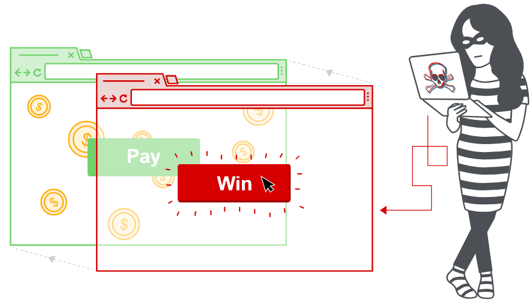

# 19. Clickjacking (кликджекинг)
## 1. Что такое кликджекинг?
**Clickjacking** — это атака через интерфейс, при которой пользователя обманом заставляют нажать на работающий элемент скрытого сайта, думая, что он нажимает на другой элемент сайта-приманки.

Например, пользователь переходит на сайт-приманку по ссылке из письма и нажимает кнопку, чтобы получить приз. Но злоумышленник скрывает под этой кнопкой другую кнопку, которая, например, подтверждает оплату на другом сайте. Пользователь не понимает, что на самом деле нажал на скрытый элемент.

Для этого обычно используется невидимая рабочая веб-страница (или несколько страниц) с кнопкой или ссылкой, размещённая внутри `iframe`. Этот `iframe` накладывается поверх обычного содержимого сайта-приманки.

Кликджекинг отличается от `CSRF` тем, что **при кликджекинге пользователь должен сам выполнить действие**, например нажать кнопку. При `CSRF` запрос создаётся без ведома и непосредственного действия пользователя.


Атаки **кликджекинга** нельзя предотвратить с помощью `CSRF`-токена, поскольку целевая сессия создаётся с содержимым настоящего сайта, и все запросы выполняются в его домене.

`CSRF`-токены находятся в запросах и передаются на сервер как часть обычной пользовательской сессии. Отличие только в том, что при кликджекинге всё происходит внутри скрытого `iframe`.

## 2. Как создать базовую атаку кликджекинга
Атаки **Clickjacking** используют CSS для создания и управления слоями. Злоумышленник размещает целевой веб-сайт внутри `iframe` и накладывает его поверх сайта-приманки. Например:

```html
<head>
    <style>
        #target_website {
            position: relative;
            width: 128px;
            height: 128px;
            opacity: 0.00001;
            z-index: 2;
        }

        #decoy_website {
            position: absolute;
            width: 300px;
            height: 400px;
            z-index: 1;
        }
    </style>
</head>

<body>
    <div id="decoy_website">
        ...содержимое сайта-приманки...
    </div>

    <iframe id="target_website"
            src="https://vulnerable-website.com">
    </iframe>
</body>
```

`iframe` с целевым сайтом размещается так, чтобы его нужный элемент точно совпадал с элементом сайта-приманки. Значения ширины, высоты и положения позволяют сохранять такое расположение независимо от размера экрана, браузера и платформы.

`z-index` определяет порядок слоёв: какой элемент находится поверх другого. Прозрачность `opacity` устанавливается близкой к `0`, поэтому пользователь его не видит.

Браузер может обнаружить слишком высокую прозрачность и применить защиту от кликджекинга. Например, такое поведение есть в `Chrome 76`, но его нет в `Firefox`. Поэтому злоумышленник подбирает значение прозрачности так, чтобы `iframe` оставался практически невидимым и не вызывал защиту браузера.

### 2.1 Clickbandit
Хотя PoC кликджекинга можно создать вручную, как описано выше, на практике это может быть долго и неудобно. Поэтому при тестировании кликджекинга рекомендуется использовать инструмент `Burp Clickbandit`.

Он позволяет выполнять нужные действия в браузере на тестируемой странице, а затем автоматически создаёт HTML-файл с подходящим наложением для `кликджекинга`. Таким образом, интерактивный PoC можно создать за несколько секунд без написания HTML или CSS.

`Burp Clickbandit` упрощает проверку уязвимости кликджекинга. Он позволяет наложить фрейм на сайт-приманку и проверить, можно ли обманом заставить пользователя нажать на элемент целевого сайта. `Clickbandit` записывает действия в браузере и создаёт HTML-файл с таким наложением.

`Clickbandit` работает в браузере с помощью JavaScript. Он поддерживается всеми современными браузерами, кроме Edge.

> **Примечание**  - Будьте осторожны при запуске Burp `Clickbandit` на ненадёжных сайтах. Вредоносный JavaScript целевого сайта может повлиять на HTML-файл, который создаёт `Clickbandit`.

### 2.2 Настройка Burp Clickbandit
Для настройки Clickbandit:
1. В верхнем меню **Burp** выберите **Burp Clickbandit**.
2. Нажмите **Копировать Clickbandit в буфер обмена**, чтобы скопировать скрипт.
3. Откройте в браузере веб-страницу, которую хотите протестировать.
4. Откройте **консоль разработчика**. Она также может называться инструментами разработчика или JavaScript-консолью.
5. Вставьте скрипт `Clickbandit` в консоль и нажмите Enter.

В верхней части окна браузера появится панель Clickbandit.

### 2.3 Запуск атаки
Чтобы запустить атаку кликджекинга с помощью Burp `Clickbandit`:
1. Нажмите **Начать**, чтобы загрузить сайт.
2. Нажимайте на элементы сайта так, как это мог бы делать пользователь-жертва. `Clickbandit` запишет эти действия.
3. Нажмите **Финиш**, чтобы завершить атаку.

Целевая страница по-прежнему будет обрабатывать клики обычным образом. Чтобы отключить это, выберите **Отключить действия клика**.

Чтобы избежать защиты от загрузки страницы во фрейме, выберите **Sandbox iframe**. Это добавит атрибут `sandbox` к `iframe`.

### 2.4 Просмотр атаки
После завершения атаки можно посмотреть наложение интерфейса на исходную страницу. Нажимайте кнопки в интерфейсе атаки, чтобы проверить, работает ли она.

Доступны следующие команды:
* **Переключить прозрачность** — показать или скрыть исходный интерфейс страницы.
* **Reset** — сбросить атаку.
* **Сохранить** — сохранить атаку в HTML-файле. Этот файл можно использовать как реальный эксплойт уязвимости кликджекинга.
* Кнопки **+** и **−** — изменить масштаб.
* **Стрелки на клавиатуре** — изменить положение интерфейса атаки.

## 3. Кликджекинг с предварительно заполненной формой
Некоторые сайты позволяют заранее заполнить поля формы с помощью параметров **GET** перед её отправкой. Другие сайты могут требовать ввода текста перед отправкой формы.

Поскольку значения **GET** находятся в URL, злоумышленник может изменить целевой URL и добавить туда нужные значения. Затем на сайт-приманку накладывается прозрачная кнопка **«Отправить»**, как в обычной атаке кликджекинга.

## 4. Сценарии разрушения кадров
Атаки кликджекинга возможны, когда веб-сайт можно открыть внутри `iframe`. Поэтому защита заключается в ограничении возможности размещать сайт во фреймах.

Распространённый способ защиты на стороне браузера — **скрипты разрушения кадров (frame-busting)**. Они могут реализовываться с помощью JavaScript или специальных расширений браузера. Такие скрипты обычно делают одно или несколько из следующего:
* проверяют, что текущее окно является главным или верхним окном;
* делают все фреймы видимыми;
* не позволяют нажимать на невидимые фреймы;
* обнаруживают и сообщают пользователю о возможной атаке кликджекинга.

Методы разрушения кадров часто зависят от браузера и платформы и из-за особенностей HTML могут быть обойдены. Поскольку они используют JavaScript, их работе могут помешать настройки безопасности браузера или отключённый JavaScript.

Один из способов обойти такую защиту — использовать атрибут HTML5 `iframe sandbox`. Если указать `allow-forms` или `allow-scripts`, но не указывать `allow-top-navigation`, скрипт разрушения кадров можно нейтрализовать: `iframe` не сможет определить, является ли он верхним окном.
```html
<iframe id="victim_website"
        src="https://victim-website.com"
        sandbox="allow-forms">
</iframe>
```

Значения `allow-forms` и `allow-scripts` разрешают соответствующие действия внутри `iframe`, но переход на верхнем уровне запрещён. Это мешает работе защиты от кликджекинга, при этом функциональность целевого сайта сохраняется.

## 5. Объединение кликджекинга с атакой DOM XSS
До этого мы рассматривали кликджекинг как отдельную атаку. Исторически его, например, использовали для действий вроде увеличения числа «лайков» на странице Facebook. Однако кликджекинг становится особенно эффективным, когда используется для проведения другой атаки, например **DOM XSS**.

Создать такую комбинированную атаку относительно просто, если злоумышленник уже нашёл XSS-эксплойт. Затем XSS-эксплойт добавляется в URL целевого `iframe`. В результате пользователь нажимает на кнопку или ссылку и тем самым запускает атаку `DOM XSS`.

Например, на сайте есть `DOM XSS` через параметр `search`:
```
https://victim.com/search?search=PAYLOAD
```
Злоумышленник помещает этот URL в скрытый `iframe`:
```html
<iframe src="https://victim.com/search?search=PAYLOAD"></iframe>
```
А поверх `iframe` размещает обычную кнопку-приманку:
```
[ Получить приз ]
```
Пользователь думает, что нажимает **«Получить приз»**, но на самом деле кликает по скрытому элементу сайта. В результате выполняется **DOM XSS**.

## 6. Многоступенчатый кликджекинг
Манипуляция целевым сайтом может потребовать нескольких действий. Например, злоумышленник хочет обманом заставить пользователя купить товар в интернет-магазине. Для этого сначала нужно добавить товар в корзину, а затем оформить заказ.

Злоумышленник может выполнить эти действия с помощью нескольких фреймов или этапов кликджекинга. Такие атаки требуют высокой точности и осторожности, чтобы оставаться эффективными и незаметными.

## 7. Как предотвратить атаки кликджекинга
Мы рассмотрели распространённый способ защиты на стороне браузера — **скрипты разрушения кадров**. Однако такие меры часто можно обойти. Поэтому существуют серверные механизмы, которые ограничивают использование `iframe` браузером и защищают от кликджекинга.

Кликджекинг выполняется на стороне браузера, поэтому его успех зависит от возможностей браузера и соблюдения веб-стандартов. Серверная защита заключается в передаче браузеру ограничений на использование таких элементов, как `iframe`. При этом эффективность защиты зависит от того, поддерживает ли браузер эти ограничения и соблюдает ли их.

Основные серверные механизмы защиты от кликджекинга:
* **X-Frame-Options**
* **Content Security Policy (CSP)**

## 8. X-Frame-Options
**X-Frame-Options** сначала появился как неофициальный заголовок ответа в Internet Explorer 8, а затем был принят другими браузерами. Он позволяет владельцу сайта управлять тем, может ли его страница открываться внутри `iframe` или другого фрейма.

Директива `deny` полностью запрещает открывать страницу во фрейме:
```http
X-Frame-Options: deny
```

Можно разрешить открывать страницу во фрейме только с того же источника с помощью `sameorigin`:
```http
X-Frame-Options: sameorigin
```

Или разрешить фрейм только для указанного сайта с помощью `allow-from`:
```http
X-Frame-Options: allow-from https://normal-website.com
```

**X-Frame-Options** поддерживается браузерами не одинаково. Например, `allow-from` не поддерживается в Chrome 76 и Safari 12. Однако при правильном использовании вместе с **Content Security Policy (CSP)** этот механизм может эффективно защищать от кликджекинга.

## 9. Политика безопасности контента (CSP)
**Content Security Policy (CSP)** — это механизм защиты, который помогает обнаруживать и предотвращать атаки, такие как `XSS` и `кликджекинг`. Обычно `CSP` передаётся веб-сервером в виде HTTP-заголовка:
```http
Content-Security-Policy: policy
```
`policy` содержит набор директив, разделённых точками с запятой. CSP сообщает браузеру, какие источники веб-ресурсов разрешены. Браузер использует эти правила для обнаружения и блокировки нежелательного поведения.

Для защиты от кликджекинга рекомендуется использовать директиву `frame-ancestors`: 
* `frame-ancestors 'none'` по смыслу похожа на `X-Frame-Options: deny`, 
* а `frame-ancestors 'self'` — на `X-Frame-Options: sameorigin`.

Чтобы разрешить размещение страницы во фрейме только на том же домене:
```http
Content-Security-Policy: frame-ancestors 'self';
```

Можно также разрешить размещение страницы только на указанном сайте:
```http
Content-Security-Policy: frame-ancestors normal-website.com;
```

Для эффективной защиты от `кликджекинга` и `XSS` CSP требует правильной разработки, настройки и тестирования. Её следует использовать как часть многоуровневой защиты.

`CSP` позволяет гибче защищаться от кликджекинга, чем `X-Frame-Options`, потому что можно указать несколько доменов и использовать подстановочные знаки. Например:
```text
frame-ancestors 'self' https://normal-website.com https://*.robust-website.com
```

`CSP` также проверяет каждый `iframe` в цепочке родительских фреймов, тогда как `X-Frame-Options` проверяет только фрейм верхнего уровня.

Для защиты от кликджекинга рекомендуется использовать **CSP**. Также можно использовать её вместе с `X-Frame-Options`, чтобы обеспечить защиту в старых браузерах, которые не поддерживают `CSP`, например Internet Explorer.


https://portswigger.net/web-security/clickjacking