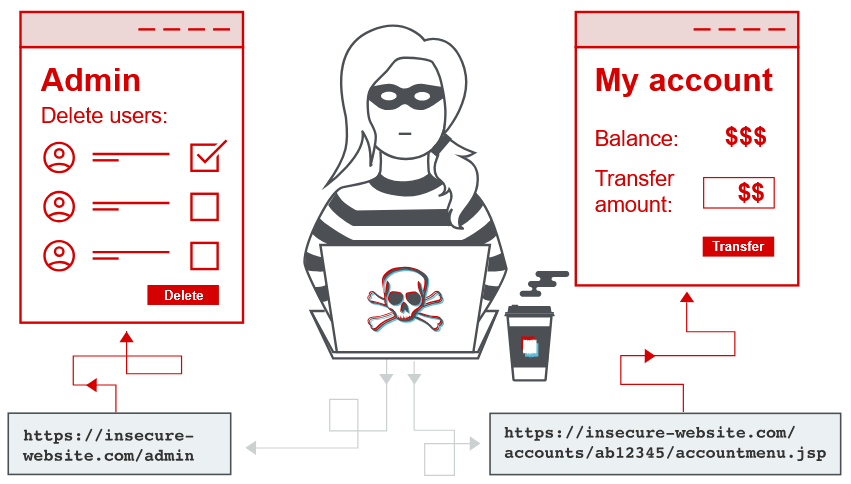

https://portswigger.net/web-security/access-control

https://habr.com/ru/companies/bizone/articles/1011196/

https://owasp.org/Top10/2025/A01_2025-Broken_Access_Control/

# 2. Уязвимости контроля доступа и эскалация привилегий (Access control vulnerabilities and privilege escalation)
## 1. Что такое контроль доступа?
`Контроль доступа` — это правила, которые определяют, кто может делать какие действия и к каким данным иметь доступ.

В веб-приложениях контроль доступа работает вместе с двумя другими механизмами:
* `Аутентификация` подтверждает, кто ты (например, логин и пароль доказывают, что ты — это ты).
* `Управление сессиями` позволяет системе понимать, что все запросы от браузера принадлежат одному и тому же пользователю.
* `Контроль доступа` решает, можно ли этому пользователю выполнять конкретные действия (например, смотреть данные, удалять их или менять).

Нарушения в контроле доступа встречаются очень часто и обычно приводят к серьёзным уязвимостям.

Настроить контроль доступа правильно сложно, потому что он зависит не только от кода, но и от правил бизнеса, организации и даже законов. Поэтому такие решения почти всегда делают люди, и из-за этого часто возникают ошибки.


## 2. Модели безопасности контроля доступа
`Модель безопасности контроля доступа` — это заранее описанный набор правил, который объясняет, кто и что может делать в системе.

Важно, что сама модель не зависит от конкретной технологии или платформы. Такие модели используются в разных системах:
* операционных системах
* сетях
* базах данных
* серверном и прикладном ПО

Со временем появилось несколько моделей, чтобы лучше подстраивать правила доступа под бизнес-логику и новые технологии.

### 2.1 Программный контроль доступа
В программном контроле доступа права пользователей хранятся в системе (например, в базе данных) в виде матрицы разрешений. Система проверяет эту матрицу при каждом действии.

**Особенности:**
* можно использовать пользователей, группы, роли
* можно задавать очень точные (детализированные) правила доступа
* подходит для сложных систем

**Минус:** при большом количестве правил становится сложно управлять и поддерживать.

### 2.2 Дискреционный контроль доступа (DAC)
В этой модели доступ к ресурсам определяется владельцем ресурса.

То есть:
* пользователь, который создал файл или ресурс, может сам решать, кому дать доступ
* можно выдавать права другим пользователям или группам

**Особенности:**
* гибкая и детализированная система
* права задаются отдельно для каждого ресурса и пользователя

**Минус:** при большом количестве ресурсов и пользователей система быстро становится сложной и трудноуправляемой.

### 2.3 Обязательный контроль доступа (MAC)
Это централизованная модель, где правила доступа задаёт сама система, а не пользователи.

**Особенности:**
* пользователи не могут менять права доступа
* доступ строго контролируется централизованно
* часто используется в системах с повышенной безопасностью (например, военных)

**Минус:** менее гибкая, чем другие модели.

### 2.4 Контроль доступа на основе ролей (RBAC)
В этой модели права назначаются не пользователям напрямую, а ролям.

Как это работает:
* создаются роли (например: бухгалтер, менеджер, администратор)
* каждой роли назначаются права доступа
* пользователи получают одну или несколько ролей

Пример: сотрудник с ролью «закупки» получает доступ только к нужным функциям бухгалтерии.

**Плюсы:**
* удобно управлять доступом
* легко добавлять и удалять сотрудников (достаточно изменить их роль)
* хорошо подходит для больших систем

**Минус:**
если ролей становится слишком много, система снова усложняется и становится неудобной.

### 2.5 Вертикальный контроль доступа
`Вертикальный контроль доступа` — это механизм, который ограничивает доступ к определённым функциям в зависимости от роли пользователя.

При таком подходе разные пользователи имеют разные права.

Например:
* администратор может создавать, изменять и удалять учётные записи пользователей;
* обычный пользователь может работать только со своей учётной записью и не имеет доступа к административным функциям.

Вертикальный контроль доступа помогает реализовать принципы безопасности, такие как разделение обязанностей и принцип наименьших привилегий, когда каждый пользователь получает только те права, которые необходимы ему для работы.

### 2.6 Горизонтальный контроль доступа
`Горизонтальный контроль доступа` — это механизм, который ограничивает доступ пользователей к данным одного типа.

***При таком подходе пользователи имеют одинаковые возможности, но могут работать только со своими данными.***

Например, в банковском приложении каждый пользователь может:
* просматривать историю операций;
* выполнять переводы;
* управлять своими счетами.

При этом он не может получить доступ к счетам или операциям других клиентов.

### 2.7 Контекстно-зависимый контроль доступа
`Контекстно-зависимый контроль доступа` ограничивает выполнение действий в зависимости от текущего состояния приложения или последовательности действий пользователя.

Такие проверки не позволяют выполнять операции в неправильном порядке.

Например, в интернет-магазине после оплаты заказа пользователь уже не сможет изменить содержимое своей корзины, поскольку оформление покупки уже завершено.

## 3. Примеры нарушений контроля доступа
Нарушение контроля доступа возникает, когда пользователь получает возможность выполнять действия или получать доступ к данным, которые ему недоступны по правилам безопасности.

### 3.1 Вертикальная эскалация привилегий
`Вертикальная эскалация привилегий` происходит, когда пользователь получает доступ к функциям, предназначенным для пользователей с более высокими правами.

Например, обычный пользователь получает доступ к панели администратора и может удалять учётные записи других пользователей.

#### 3.1.1 Незащищённая функциональность
Самый простой случай вертикальной эскалации привилегий возникает тогда, когда приложение вообще не защищает административные функции.

Например, ссылка на панель администратора отображается только администраторам, однако сам URL-адрес доступен любому пользователю.

Например:
```
https://insecure-website.com/admin
```
Если сервер не проверяет права пользователя, любой, кто знает этот адрес, сможет открыть административную панель.

Иногда такие URL можно найти в файле:
```
https://insecure-website.com/robots.txt
```
Даже если адрес нигде не опубликован, злоумышленник может подобрать его с помощью словарного перебора (Wordlist).

**Сокрытие URL не является защитой**

Некоторые разработчики пытаются защитить административные функции, используя сложные и трудно угадываемые URL.

Например:
```
https://insecure-website.com/administrator-panel-yb556
```
Такой подход называется ***«безопасность через неизвестность»*** (Security through Obscurity).

Однако скрытый URL сам по себе не является механизмом контроля доступа. Если злоумышленник узнает этот адрес, он сможет воспользоваться им.

Например, URL может быть раскрыт в JavaScript-коде страницы.
```js
var isAdmin = false;
if (isAdmin) {
    var adminPanelTag = document.createElement("a");
    adminPanelTag.setAttribute(
        "href",
        "https://insecure-website.com/administrator-panel-yb556"
    );
}
```
Хотя ссылка отображается только администраторам, сам JavaScript загружается всем пользователям. Поэтому любой может просмотреть исходный код страницы и узнать скрытый адрес административной панели.

#### 3.1.2 Контроль доступа на основе параметров
Некоторые приложения сохраняют информацию о роли пользователя в данных, которыми может управлять сам пользователь.

Это могут быть:
* скрытые поля HTML-форм;
* cookie;
* параметры URL.

Например:
```
https://insecure-website.com/login/home.jsp?admin=true
```
или
```
https://insecure-website.com/login/home.jsp?role=1
```
Если сервер доверяет этим значениям без дополнительной проверки, пользователь может изменить параметр и получить права администратора.

Поэтому хранить информацию о правах доступа на стороне клиента небезопасно.

#### 3.1.3 Нарушение контроля доступа из-за неправильной настройки платформы
Иногда контроль доступа реализуется средствами веб-сервера или фреймворка. Например, может существовать правило:
```
DENY: POST, /admin/deleteUser, managers
```
Оно запрещает пользователям с ролью managers отправлять POST-запросы на удаление пользователей.

Однако ошибки в настройке могут позволить обойти такую защиту. Например, некоторые серверы поддерживают HTTP-заголовки:
```
X-Original-URL
X-Rewrite-URL
```
Эти заголовки позволяют изменить путь запроса уже после прохождения проверки контроля доступа.

Например:
```
POST / HTTP/1.1
X-Original-URL: /admin/deleteUser
```
Если приложение использует такой механизм, злоумышленник может получить доступ к защищённому ресурсу.

#### 3.1.4 Обход через другой HTTP-метод
Контроль доступа также может зависеть от HTTP-метода (POST, GET). Например, сервер запрещает выполнение:
```
POST /admin/deleteUser
```
Но если приложение по ошибке разрешает выполнять то же действие через:
```
GET /admin/deleteUser
```
то злоумышленник сможет обойти ограничения и выполнить запрещённую операцию.

#### 3.1.5 Нарушение контроля доступа из-за особенностей обработки URL
Некоторые веб-приложения и серверы по-разному обрабатывают URL. Например, приложение может считать следующие адреса одинаковыми:
```
/admin/deleteUser
```
и
```
/ADMIN/DELETEUSER
```
Если механизм контроля доступа проверяет только первый вариант, второй может использоваться для обхода защиты.

#### 3.1.6 Обход с использованием расширений файлов
Некоторые фреймворки (например, старые версии Spring) позволяли обращаться к одному и тому же обработчику через URL с любым расширением.Например:
```
/admin/deleteUser
```
и
```
/admin/deleteUser.anything
```
обрабатывались как один и тот же запрос.

Если механизм контроля доступа проверял только первый вариант, второй мог использоваться для обхода ограничений.

#### 3.1.7 Обход с помощью символа «/»
В некоторых приложениях сервер считает разными адресами:
```
/admin/deleteUser
```
и
```
/admin/deleteUser/
```
Если контроль доступа применяется только к одному из них, злоумышленник может добавить или удалить завершающий символ `/` и получить доступ к защищённой функции.

### 3.2 Горизонтальная эскалация привилегий
Горизонтальная эскалация привилегий происходит, когда пользователь получает доступ к данным или ресурсам другого пользователя, хотя должен иметь доступ только к своим.

Например, сотрудник может просматривать не только свою личную информацию, но и данные других сотрудников.

Горизонтальная эскалация привилегий часто возникает из-за тех же ошибок, что и вертикальная. Например, пользователь открывает свою страницу по адресу:
```
https://insecure-website.com/myaccount?id=123
```
Если злоумышленник изменит значение параметра id, например на 124, и приложение не проверит права доступа, он сможет открыть страницу другого пользователя и получить доступ к его данным.

***Примечание! Такая уязвимость называется `IDOR` (Insecure Direct Object Reference) — небезопасная прямая ссылка на объект.***

Она возникает, когда приложение использует передаваемый пользователем идентификатор (например, id) для доступа к данным, но не проверяет, имеет ли пользователь право работать с этим объектом.

#### 3.2.1 Использование непредсказуемых идентификаторов
Некоторые приложения используют вместо обычных числовых идентификаторов `GUID` (глобально уникальные идентификаторы).

Например, вместо:
```
id=123
```
используется что-то вроде:
```
id=8f14e45f-ceea-4d79-9d76-ef8f2d4b8c73
```
Такой идентификатор сложно подобрать перебором.

Однако это не устраняет проблему контроля доступа. Если `GUID` другого пользователя можно узнать из других частей приложения (например, из сообщений, комментариев или отзывов), злоумышленник сможет использовать его для получения доступа к чужим данным.

#### 3.2.2 Утечка данных при перенаправлении
Иногда приложение понимает, что пользователь не имеет прав на доступ к ресурсу, и перенаправляет его на страницу входа.

Однако до перенаправления сервер может успеть отправить часть конфиденциальной информации в ответе.

В этом случае, даже несмотря на перенаправление, злоумышленник всё равно сможет получить доступ к данным другого пользователя.

### 3.3 Переход от горизонтальной к вертикальной эскалации привилегий
Иногда `горизонтальная эскалация` привилегий может привести к `вертикальной эскалации`. Это происходит, когда злоумышленник сначала получает доступ к учётной записи другого пользователя, а затем использует её более высокие права.

Например:
* пользователь получает доступ к аккаунту другого сотрудника;
* этот сотрудник имеет больше прав (например, является администратором);
* злоумышленник получает административный доступ.

Например, уязвимость горизонтального доступа позволяет изменить идентификатор пользователя:
```
https://insecure-website.com/myaccount?id=456
```
Если id=456 принадлежит администратору, злоумышленник сможет открыть его страницу учётной записи.

На странице администратора могут находиться:
* пароль или данные для его восстановления;
* возможность изменить пароль;
* доступ к административным функциям приложения.

Таким образом, обычная ошибка проверки доступа между пользователями может привести к получению полного контроля над системой.

## 4. Небезопасные прямые ссылки на объекты (IDOR)
Небезопасные прямые ссылки на объекты (`IDOR` — Insecure Direct Object Reference) — это разновидность уязвимостей контроля доступа.

Они возникают, когда приложение использует данные, которые вводит пользователь, для прямого обращения к объектам (например, файлам, записям базы данных или аккаунтам), но не проверяет, имеет ли пользователь право доступа к этим объектам.

В результате злоумышленник может изменить передаваемое значение и получить доступ к чужим данным. Уязвимость IDOR стала широко известна после включения в список `OWASP Top 10 2007`.

Однако `IDOR` — это только один из вариантов ошибок реализации контроля доступа, которые позволяют обходить ограничения безопасности.

### 4.1 Что такое небезопасные прямые ссылки на объект (IDOR)?
`IDOR` — это ошибка контроля доступа, при которой приложение использует пользовательский ввод для поиска конкретного объекта без проверки прав доступа.

Например, приложение получает идентификатор пользователя из URL:
```
https://insecure-website.com/myaccount?id=123
```
Если сервер просто использует этот идентификатор для загрузки данных и не проверяет владельца объекта, пользователь может изменить значение:
```
https://insecure-website.com/myaccount?id=456
```
и получить доступ к данным другого пользователя.

Чаще всего `IDOR` приводит к горизонтальной эскалации привилегий, когда пользователь получает доступ к данным другого пользователя. Однако в некоторых случаях `IDOR` может привести и к вертикальной эскалации, если злоумышленник получает доступ к объекту пользователя с повышенными правами.

### 4.2 Примеры IDOR
Существует много случаев, когда пользовательские параметры используются для прямого доступа к ресурсам или функциям без проверки разрешений.

#### 4.2.1 IDOR через прямой доступ к объектам базы данных
Рассмотрим сайт, который открывает страницу клиента по следующему адресу:
```
https://insecure-website.com/customer_account?customer_number=132355
```
Параметр `customer_number` используется приложением для поиска записи клиента во внутренней базе данных. Если система не проверяет права доступа, злоумышленник может изменить значение:
```
https://insecure-website.com/customer_account?customer_number=132356
```
и получить данные другого клиента.

***Это пример IDOR, который приводит к горизонтальной эскалации привилегий.***

Если изменить идентификатор на пользователя с более высокими правами, например администратора, атака может привести к вертикальной эскалации привилегий.

Дополнительные последствия могут включать:
* получение паролей или другой конфиденциальной информации;
* изменение данных пользователя;
* получение доступа к административным функциям.

#### 4.2.2 IDOR через прямой доступ к статическим файлам
`IDOR` также часто возникает, когда конфиденциальные данные хранятся в обычных файлах на сервере.

Например, сайт сохраняет историю сообщений пользователей в текстовых файлах:
```
https://insecure-website.com/static/12144.txt
```
Если имя файла создаётся по последовательному номеру, злоумышленник может изменить его:
```
https://insecure-website.com/static/12145.txt
```
и получить файл другого пользователя.

В таком файле могут находиться:
* личные сообщения;
* учётные данные;
* конфиденциальная информация.

***Причина уязвимости — отсутствие проверки, имеет ли пользователь право получать доступ к указанному файлу.***

## 5. Уязвимости контроля доступа в многоэтапных процессах
Многие веб-приложения выполняют важные операции не одним действием, а через несколько последовательных шагов.

Например, это может быть необходимо, когда:
* пользователь должен ввести несколько параметров или выбрать настройки;
* перед выполнением действия пользователь должен проверить и подтвердить данные.

Например, изменение данных пользователя администратором может состоять из следующих этапов:
* Открытие формы с информацией о пользователе.
* Внесение изменений.
* Просмотр изменений и подтверждение операции.

Иногда разработчики правильно защищают только некоторые этапы процесса, но забывают проверить остальные. Например:
* первый и второй шаги имеют проверку прав доступа;
* третий шаг не защищён.

Разработчик предполагает, что пользователь попадёт на третий шаг только после прохождения первых двух, поэтому отдельная проверка кажется ненужной.

Однако злоумышленник может пропустить первые шаги и напрямую отправить запрос к третьему этапу, передав необходимые параметры вручную. В результате он получает доступ к функции, которая должна быть недоступна.

### 5.1 Контроль доступа на основе заголовка Referer
Некоторые приложения используют HTTP-заголовок `Referer` для проверки доступа. Этот заголовок показывает, с какой страницы был отправлен запрос.

Например, приложение может защищать главную административную страницу:
```
/admin
```
но для внутренней страницы:
```
/admin/deleteUser
```
проверять только наличие заголовка:
```
Referer: /admin
```
Если заголовок содержит адрес административной страницы, запрос разрешается.

***Проблема заключается в том, что заголовок `Referer` можно изменить вручную.***

Злоумышленник может отправить прямой запрос к защищённой функции и самостоятельно добавить нужный заголовок:
```
Referer: /admin
```
В результате проверка будет пройдена, и пользователь получит доступ к запрещённой функции.

### 5.2 Контроль доступа на основе местоположения
Некоторые веб-приложения ограничивают доступ на основе географического расположения пользователя. Например, такие ограничения могут использоваться:
* банковскими сервисами;
* медиасервисами;
* системами, где действуют законодательные ограничения разных стран.

Проверка может выполняться по IP-адресу или другим данным о местоположении пользователя. Однако такие ограничения часто можно обойти с помощью:
* VPN;
* прокси-серверов;
* изменения данных геолокации на стороне клиента.

Поэтому географическое расположение пользователя не должно быть единственным механизмом защиты доступа.

## 6. Как предотвратить уязвимости контроля доступа
Чтобы защитить приложение от уязвимостей контроля доступа, необходимо использовать несколько уровней защиты и придерживаться следующих принципов:
* **Не используйте скрытие информации как способ защиты доступа.**  
Например, сложный или неизвестный URL-адрес не должен считаться защитой. Если пользователь не имеет прав, сервер должен самостоятельно запретить доступ.
* **Запрещайте доступ по умолчанию.**  
Если ресурс не должен быть доступен всем пользователям, доступ к нему должен быть закрыт до тех пор, пока явно не будут назначены необходимые права.
* **Используйте единый механизм контроля доступа.**  
Лучше реализовать общую систему проверки прав для всего приложения, чем создавать отдельные проверки для каждой функции.
* **Явно указывайте разрешённые действия в коде.**  
Разработчики должны заранее определять, какие пользователи могут выполнять определённые действия. Все остальные запросы должны автоматически отклоняться.
* **Регулярно проверяйте работу контроля доступа.**
Необходимо проводить аудит и тестирование, чтобы убедиться, что система действительно соответствует требованиям безопасности и не позволяет обойти ограничения.