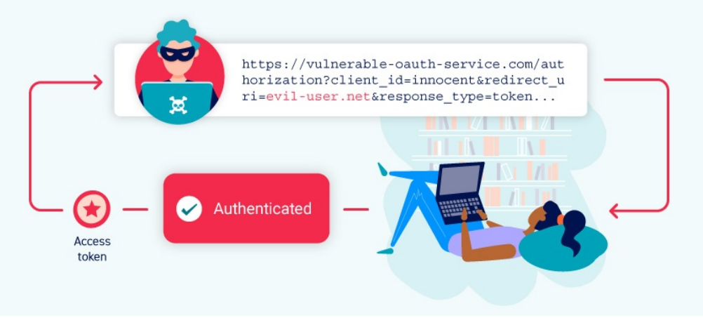

# 7.2 OAuth 2.0 authentication vulnerabilities
## 1. Уязвимости аутентификации OAuth 2.0
При работе в интернете вы наверняка встречали сайты, которые позволяют войти в систему через аккаунт в социальных сетях, например Google, Facebook или GitHub. Обычно такая авторизация реализуется с помощью популярного протокола OAuth 2.0.

OAuth 2.0 часто становится целью атак, потому что он широко используется и имеет сложную логику работы. Ошибки при его настройке или реализации могут привести к серьёзным уязвимостям. В результате злоумышленник может получить доступ к конфиденциальным данным пользователей или полностью обойти механизм аутентификации.

Также мы рассмотрим уязвимости расширения OpenID Connect, которое используется поверх OAuth 2.0 для построения систем аутентификации. В конце раздела будут приведены рекомендации по защите приложений от подобных атак.

## 1. Что такое OAuth?
`OAuth` — это популярный протокол авторизации, который позволяет веб-сайтам и приложениям получать ограниченный доступ к данным пользователя в другом сервисе.

Главная особенность `OAuth` заключается в том, что пользователю не нужно передавать свои логин и пароль стороннему приложению. Вместо этого пользователь самостоятельно разрешает доступ к определённым данным. Например, можно разрешить приложению получить только список контактов, но не полный доступ к аккаунту.

*Таким образом, `OAuth` позволяет контролировать, какие именно данные передаются стороннему сервису, не предоставляя ему полный контроль над учётной записью.*

Основной механизм `OAuth` часто используется для интеграции сторонних функций, которым нужен доступ к определённой информации пользователя. Например, приложение может запросить доступ к списку контактов электронной почты, чтобы предложить добавить знакомых или найти друзей.

Кроме этого, `OAuth` широко применяется для аутентификации пользователей. Благодаря этому механизму сайты позволяют входить через аккаунты других сервисов, например Google, GitHub или Facebook, вместо создания отдельной учётной записи.

*Примечание - Хотя сейчас основным стандартом является `OAuth 2.0`, некоторые приложения всё ещё используют старую версию `OAuth 1.0a`. Важно понимать, что OAuth 2.0 был полностью переработан и создан заново, а не является просто улучшенной версией OAuth 1.0. В данном материале термин `OAuth` используется исключительно для обозначения `OAuth 2.0`.*

## 2. Как работает OAuth 2.0?
Изначально `OAuth 2.0` был создан для безопасного обмена доступом к определённым данным между приложениями. Он описывает взаимодействие между тремя основными участниками: клиентским приложением, владельцем ресурса и поставщиком услуг `OAuth`.

**Клиентское приложение** — веб-сайт или приложение, которое хочет получить доступ к данным пользователя.  
**Владелец ресурса** — пользователь, чьи данные хочет получить клиентское приложение.  
**Поставщик услуг OAuth** — сайт или приложение, которое хранит данные пользователя и управляет доступом к ним. Он предоставляет API для взаимодействия с сервером авторизации и сервером ресурсов.

Существует несколько вариантов реализации процесса `OAuth`. Они называются` OAuth flows` или типами грантов.

В этом разделе мы рассмотрим два наиболее распространённых типа:
* Authorization Code Grant (код авторизации);
* Implicit Grant (неявный тип гранта).

В целом оба варианта работают по следующей схеме:
1. Клиентское приложение запрашивает доступ к определённым данным пользователя, указывая используемый тип гранта и необходимые разрешения.
2. Пользователю предлагается войти в `OAuth-сервис` и подтвердить предоставление запрошенного доступа.
3. Клиентское приложение получает уникальный токен доступа, который подтверждает наличие разрешения пользователя на получение данных.  Способ получения этого токена зависит от используемого типа гранта.
4. Клиентское приложение использует этот токен доступа для выполнения API-запросов и получения данных с сервера ресурсов.

Перед изучением того, как `OAuth` используется для аутентификации, важно понять основной принцип работы этого процесса. Если вы впервые знакомитесь с `OAuth`, рекомендуется сначала изучить подробнее два типа грантов, которые будут рассмотрены далее.

## 3. Что такое грант OAuth?
Тип гранта OAuth определяет точную последовательность действий, которые выполняются во время процесса OAuth. Также он определяет, как клиентское приложение взаимодействует с OAuth-сервисом на каждом этапе, включая способ передачи самого токена доступа. Поэтому типы грантов часто называют `OAuth flows` (потоками OAuth).

`OAuth-сервис` должен поддерживать определённый тип гранта, прежде чем клиентское приложение сможет использовать соответствующий поток. Клиентское приложение указывает выбранный тип гранта в первом запросе авторизации, который оно отправляет в `OAuth-сервис`.

Существует несколько различных типов грантов, каждый из которых имеет свои особенности и требования безопасности. 

https://portswigger.net/web-security/oauth