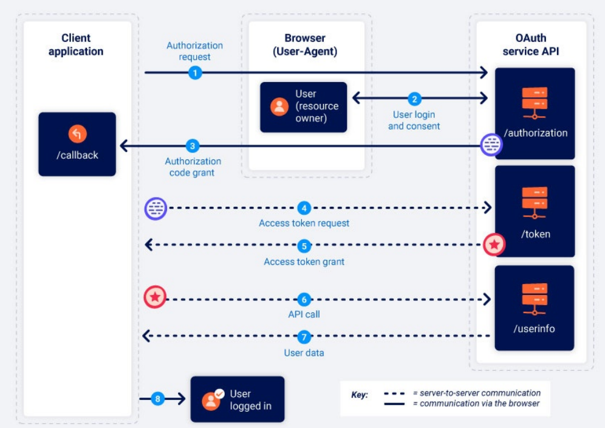
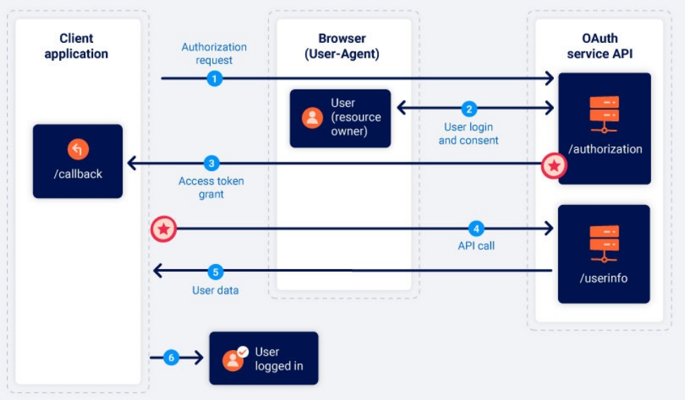

# 7.2 OAuth 2.0 authentication vulnerabilities
## 1. Уязвимости аутентификации OAuth 2.0
При работе в интернете вы наверняка встречали сайты, которые позволяют войти в систему через аккаунт в социальных сетях, например Google, Facebook или GitHub. Обычно такая авторизация реализуется с помощью популярного протокола OAuth 2.0.

OAuth 2.0 часто становится целью атак, потому что он широко используется и имеет сложную логику работы. Ошибки при его настройке или реализации могут привести к серьёзным уязвимостям. В результате злоумышленник может получить доступ к конфиденциальным данным пользователей или полностью обойти механизм аутентификации.

Также мы рассмотрим уязвимости расширения OpenID Connect, которое используется поверх OAuth 2.0 для построения систем аутентификации. В конце раздела будут приведены рекомендации по защите приложений от подобных атак.


## 1. Что такое OAuth?
`OAuth` — это популярный протокол авторизации, который позволяет веб-сайтам и приложениям получать ограниченный доступ к данным пользователя в другом сервисе.

Главная особенность `OAuth` заключается в том, что пользователю не нужно передавать свои логин и пароль стороннему приложению. Вместо этого пользователь самостоятельно разрешает доступ к определённым данным. Например, можно разрешить приложению получить только список контактов, но не полный доступ к аккаунту.

*Таким образом, `OAuth` позволяет контролировать, какие именно данные передаются стороннему сервису, не предоставляя ему полный контроль над учётной записью.*

Основной механизм `OAuth` часто используется для интеграции сторонних функций, которым нужен доступ к определённой информации пользователя. Например, приложение может запросить доступ к списку контактов электронной почты, чтобы предложить добавить знакомых или найти друзей.

Кроме этого, `OAuth` широко применяется для аутентификации пользователей. Благодаря этому механизму сайты позволяют входить через аккаунты других сервисов, например Google, GitHub или Facebook, вместо создания отдельной учётной записи.

*Примечание - Хотя сейчас основным стандартом является `OAuth 2.0`, некоторые приложения всё ещё используют старую версию `OAuth 1.0a`. Важно понимать, что OAuth 2.0 был полностью переработан и создан заново, а не является просто улучшенной версией OAuth 1.0. В данном материале термин `OAuth` используется исключительно для обозначения `OAuth 2.0`.*

## 2. Как работает OAuth 2.0?
Изначально `OAuth 2.0` был создан для безопасного обмена доступом к определённым данным между приложениями. Он описывает взаимодействие между тремя основными участниками: клиентским приложением, владельцем ресурса и поставщиком услуг `OAuth`.

**Клиентское приложение** — веб-сайт или приложение, которое хочет получить доступ к данным пользователя.  
**Владелец ресурса** — пользователь, чьи данные хочет получить клиентское приложение.  
**Поставщик услуг OAuth** — сайт или приложение, которое хранит данные пользователя и управляет доступом к ним. Он предоставляет API для взаимодействия с сервером авторизации и сервером ресурсов.

Существует несколько вариантов реализации процесса `OAuth`. Они называются` OAuth flows` или типами грантов.

В этом разделе мы рассмотрим два наиболее распространённых типа:
* Authorization Code Grant (код авторизации);
* Implicit Grant (неявный тип гранта).

***Разница в `коде авторизации` !!!***

В целом оба варианта работают по следующей схеме:
1. Клиентское приложение запрашивает доступ к определённым данным пользователя, указывая используемый тип гранта и необходимые разрешения.
2. Пользователю предлагается войти в `OAuth-сервис` и подтвердить предоставление запрошенного доступа.
3. Клиентское приложение получает уникальный токен доступа, который подтверждает наличие разрешения пользователя на получение данных.  Способ получения этого токена зависит от используемого типа гранта.
4. Клиентское приложение использует этот токен доступа для выполнения API-запросов и получения данных с сервера ресурсов.

Перед изучением того, как `OAuth` используется для аутентификации, важно понять основной принцип работы этого процесса. Если вы впервые знакомитесь с `OAuth`, рекомендуется сначала изучить подробнее два типа грантов, которые будут рассмотрены далее.

## 3. Что такое грант OAuth?
Тип гранта `OAuth` определяет точную последовательность действий, которые выполняются во время процесса `OAuth`. Также он определяет, как клиентское приложение взаимодействует с `OAuth`-сервисом на каждом этапе, включая способ передачи самого токена доступа. Поэтому типы грантов часто называют `OAuth flows` (потоками `OAuth`).

`OAuth-сервис` должен поддерживать определённый тип гранта, прежде чем клиентское приложение сможет использовать соответствующий поток. Клиентское приложение указывает выбранный тип гранта в первом запросе авторизации, который оно отправляет в `OAuth-сервис`.

Существует несколько различных типов грантов, каждый из которых имеет свои особенности и требования безопасности. 

### 3.1 Области доступа OAuth (OAuth scopes)
Для любого типа гранта `OAuth` клиентское приложение должно указать, к каким данным оно хочет получить доступ и какие действия может выполнять с ними. Для этого используется параметр **scope** в запросе авторизации, который отправляется в `OAuth`-сервис.

В обычном `OAuth` набор доступных областей зависит от конкретного `OAuth`-сервиса. Названия областей являются обычными текстовыми строками, поэтому разные сервисы могут использовать разные форматы.

Например, запрос доступа к списку контактов пользователя может выглядеть по-разному в зависимости от используемого `OAuth`-сервиса:
```
scope=contacts
scope=contacts.read
scope=contact-list-r
scope=https://oauth-authorization-server.com/auth/scopes/user/contacts.readonly
```

Когда `OAuth` используется для аутентификации, вместо этого часто применяются стандартизированные области **OpenID Connect**.

Например, область **openid profile** предоставляет клиентскому приложению доступ к заранее определённой информации о пользователе, такой как адрес электронной почты, имя пользователя и другие основные данные.

### 3.2 Тип гранта Authorization Code
Клиентское приложение и `OAuth`-сервис используют перенаправления для обмена серией HTTP-запросов через браузер пользователя. Сначала пользователь должен подтвердить, что он согласен предоставить запрошенный доступ. После подтверждения клиентское приложение получает **код авторизации**.

Затем клиентское приложение отправляет этот код в OAuth-сервис и получает **токен доступа**. Этот токен используется для выполнения API-запросов и получения необходимых данных пользователя.

***access token никогда не проходит через браузер — он остаётся между серверами.***

Обмен `кодом авторизации` и `токеном` происходит напрямую между серверами через защищённый канал и не виден пользователю. Этот канал настраивается при регистрации клиентского приложения в OAuth-сервисе. В этот момент также создаётся **client_secret**, который приложение использует для подтверждения своей подлинности при серверных запросах.

Так как наиболее важные данные (**токен доступа и пользовательские данные**) не передаются через браузер, этот тип гранта считается одним из самых безопасных. Серверные приложения должны использовать этот тип гранта, если это возможно.



Если очень кратко, процесс `OAuth Authorization Code Grant` при входе через Google выглядит так:
```
1. Пользователь нажимает "Войти через Google"
    → сайт (клиентское приложение) понимает, что ему нужно авторизовать пользователя через Google.
2. Сайт перенаправляет пользователя на Google
    → браузер открывает страницу авторизации Google с запросом:
        * кто запрашивает доступ;
        * какие данные нужны (scope);
        * куда вернуть пользователя после входа (redirect_uri).
3. Пользователь вводит логин и пароль Google
    → Google проверяет личность пользователя.
4. Пользователь подтверждает доступ
    → например: "Разрешить сайту получить ваш email и имя".
5. OAuth-сервис (например, Google) создает authorization code и возвращает пользователя обратно на сайт
    → в URL передаётся authorization code (код авторизации) для клиента.
Пример:
https://site.com/callback?code=abc123

6. Сайт отправляет этот authorization code напрямую на сервер Google
    → Google проверяет:
        * настоящий ли этот code;
        * кому он выдан;
        * совпадает ли client_secret.
    → сервер сайта обменивает authorization code на access token.

Запрос идёт примерно так:
POST https://google.com/oauth/token
code=abc123
client_id=...
client_secret=...

7. Google возвращает access token
    → теперь сайт имеет право запросить данные пользователя.
8. Сайт использует access token для получения данных
    → например:
        email;
        имя;
        аватар.
9. Сайт создаёт локальную сессию пользователя
→ пользователь уже считается вошедшим в этот сайт.
```
***Ключевой момент:*** браузер видит только шаги с переходами и `код авторизации`. Сам токен доступа передаётся между серверами и не попадает в браузер. Именно поэтому `Authorization Code` считается более безопасным вариантом OAuth.

#### 3.2.1 Запрос на авторизацию
Клиентское приложение отправляет запрос к конечной точке `OAuth` **/authorization**, чтобы получить разрешение на доступ к определённым данным пользователя.

Название конечной точки может отличаться у разных OAuth-провайдеров. Например, в лабораториях используется **/auth**. Определить её можно по параметрам, которые передаются в запросе.

Пример запроса:
```http
GET /authorization?client_id=12345&redirect_uri=https://client-app.com/callback&response_type=code&scope=openid%20profile&state=ae13d489bd00e3c24 HTTP/1.1
Host: oauth-authorization-server.com
```

В запросе обычно передаются следующие параметры:
* **client_id** - Обязательный параметр, содержащий уникальный идентификатор клиентского приложения. Он создаётся при регистрации приложения в `OAuth`-сервисе.

* **redirect_uri** - Адрес, куда `OAuth`-сервис должен вернуть пользователя после авторизации вместе с кодом авторизации.

Этот адрес также называют **callback URI** или **endpoint обратного вызова**. Многие `OAuth`-атаки связаны с ошибками проверки этого параметра.

* **response_type** - Определяет, какой тип ответа ожидает клиентское приложение и какой `OAuth`-поток используется.

Для типа гранта **Authorization Code** значение должно быть:
```text
response_type=code
```
* **scope** - Определяет, к каким данным пользователя клиентское приложение хочет получить доступ. Это могут быть как собственные области доступа OAuth-провайдера, так и стандартные области **OpenID Connect**.

* **state** - Содержит уникальное случайное значение, связанное с текущей сессией пользователя. `OAuth`-сервис должен вернуть это же значение вместе с кодом авторизации. Параметр **state** используется как защита от `CSRF-атак`, позволяя убедиться, что запрос на `callback` был создан тем же пользователем, который начал процесс авторизации.

#### 3.2.2 Вход пользователя и согласие
После получения первоначального запроса сервер авторизации перенаправляет пользователя на страницу входа `OAuth`-сервиса. Там пользователь должен войти в свою учётную запись, например в аккаунт социальной сети.

После входа пользователю показывается список данных, к которым хочет получить доступ клиентское приложение. Этот список формируется на основе параметра **scope**, указанного в запросе авторизации.

Пользователь может разрешить или запретить предоставление этого доступа.

Важно учитывать, что после первого подтверждения доступа этот шаг может выполняться автоматически, если у пользователя всё ещё есть **активная сессия** в `OAuth`-сервисе. 

Например, при первом входе через социальную сеть пользователь вручную вводит данные и подтверждает доступ. Но при следующем входе ему часто достаточно просто нажать кнопку «Войти», так как `OAuth`-сервис уже помнит его авторизацию.

#### 3.2.3 Выдача кода авторизации
Если пользователь разрешает доступ, его браузер перенаправляется на адрес **/callback**, который был указан в параметре **redirect_uri** в запросе авторизации.

В результате выполняется **GET-запрос**, который содержит **код авторизации** в параметре запроса.

В зависимости от настроек, вместе с кодом авторизации также может передаваться параметр **state** с тем же значением, которое было отправлено в первоначальном запросе.

Пример:
```http
GET /callback?code=a1b2c3d4e5f6g7h8&state=ae13d489bd00e3c24 HTTP/1.1
Host: client-app.com
```

#### 3.2.4 Запрос на получение токена доступа
После получения **кода авторизации** клиентское приложение должно обменять его на **токен доступа**.

Для этого оно отправляет серверный **POST-запрос** к конечной точке `OAuth` **/token**. С этого момента обмен данными происходит напрямую между серверами через защищённый канал, поэтому обычно злоумышленник не может его увидеть или изменить.

Пример запроса:
```http id="gqz5tq"
POST /token HTTP/1.1
Host: oauth-authorization-server.com
...
client_id=12345&client_secret=SECRET&redirect_uri=https://client-app.com/callback&grant_type=authorization_code&code=a1b2c3d4e5f6g7h8
```
Кроме уже знакомых параметров **client_id** и **code**, используются следующие параметры:

* **client_secret** - Секретный ключ клиентского приложения, который создаётся при регистрации в `OAuth`-сервисе. Он используется для подтверждения личности приложения. ОБЯЗАТЕЛЕН!

* **grant_type** - Указывает `OAuth`-сервису, какой тип гранта используется.

Для этого случая значение должно быть:
```text id="1v1m5r"
grant_type=authorization_code
```

#### 3.2.5 Выдача токена доступа
`OAuth`-сервис проверяет запрос на получение токена доступа. Если все параметры корректны, сервер возвращает клиентскому приложению **токен доступа** с указанными правами (**scope**).

Пример ответа:
```json
{
    "access_token": "z0y9x8w7v6u5",
    "token_type": "Bearer",
    "expires_in": 3600,
    "scope": "openid profile",
    ...
}
```
#### 3.2.6 Запрос к API
Теперь, когда клиентское приложение получило **токен доступа**, оно может получить данные пользователя с сервера ресурсов.

Для этого приложение отправляет API-запрос к конечной точке `OAuth` **/userinfo**.

Токен доступа передаётся в заголовке **Authorization: Bearer**, чтобы подтвердить, что приложение имеет разрешение на получение этих данных.

Пример запроса:
```http id="m8h4wp"
GET /userinfo HTTP/1.1
Host: oauth-resource-server.com
Authorization: Bearer z0y9x8w7v6u5
```

#### 3.2.7 Получение ресурса
Сервер ресурсов проверяет, что токен доступа действителен и принадлежит текущему клиентскому приложению.

Если проверка проходит успешно, сервер возвращает запрошенные данные пользователя в соответствии с правами, указанными в токене доступа.

Пример ответа:
```json
{
    "username":"carlos",
    "email":"carlos@carlos-montoya.net",
    ...
}
```
После этого клиентское приложение может использовать полученные данные по назначению.

При использовании `OAuth` для аутентификации эти данные обычно применяются для идентификации пользователя и создания его авторизованной сессии.

### 3.3 Неявный тип гранта (Implicit Grant)
Неявный тип гранта работает проще. В отличие от **Authorization Code Grant**, здесь нет отдельного этапа получения `кода авторизации`.

После того как пользователь подтверждает доступ, клиентское приложение сразу получает **токен доступа**. Может возникнуть вопрос: почему тогда всегда не использовать неявный тип гранта? Причина в том, что он менее безопасен.

При использовании **Implicit Grant** весь обмен данными происходит через перенаправления браузера. В отличие от `Authorization Code Grant`, здесь нет защищённого серверного канала.

Из-за этого токен доступа и пользовательские данные могут быть более уязвимыми для атак.

Неявный тип гранта чаще используется для одностраничных приложений и нативных приложений, которые не могут безопасно хранить **client_secret** на серверной стороне. Поэтому они не получают всех преимуществ `Authorization Code Grant`.



Раньше многие приложения были полностью клиентскими (JavaScript SPA) и не имели собственного сервера, а значит:
* негде было безопасно хранить `client_secret`;
* некому было обменивать `authorization code` на `access_token`.

Поэтому появился `Implicit Grant`:
* пользователь входит;
* `OAuth`-сервер сразу возвращает `access_token` в браузер;
* `JavaScript`-приложение начинает работать.

Сегодня ситуация изменилась. Для SPA используется `Authorization Code Grant с PKCE`:
* `client_secret` больше не нужен;
* код авторизации безопасно обменивается на токен с использованием механизма `PKCE`;
* уровень защиты значительно выше.

`PKCE` (Proof Key for Code Exchange) — это расширение `OAuth`, которое защищает `Authorization Code` от кражи: 
* приложение создаёт секретный одноразовый код (`code_verifier`); 
* отправляет его хэш (`code_challenge`);
* а при обмене `authorization code` на токен приложение должно предъявить исходный `code_verifier`.

В классическом `Authorization Code Grant` схема выглядит так:
1. Google отправляет браузеру:
```
https://site.com/callback?code=abc123
```
2. Браузер передаёт этот `code` вашему сайту.
3. Сервер сайта обменивает `code` на `access_token`.

Проблема в том, что `authorization code` проходит через браузер. Если злоумышленник каким-либо способом перехватит этот код, он может попытаться обменять его на `access_token`.

Для обычных серверных приложений это не работает, потому что злоумышленнику ещё нужен `client_secret`, которого у него нет.

Но у мобильных приложений и SPA `client_secret` либо отсутствует, либо его невозможно хранить в секрете. Поэтому украденный `authorization code` мог быть использован злоумышленником.

#### 3.3.1 Запрос на авторизацию
Неявный поток начинается почти так же, как **Authorization Code Grant**. Главное отличие заключается в параметре **response_type**. Для неявного типа гранта вместо `code` указывается значение `token`.

Пример запроса:
```http
GET /authorization?client_id=12345&redirect_uri=https://client-app.com/callback&response_type=token&scope=openid%20profile&state=ae13d489bd00e3c24 HTTP/1.1
Host: oauth-authorization-server.com
```
#### 3.3.2 Вход пользователя и согласие
Пользователь входит в OAuth-сервис и решает, разрешить ли запрошенный доступ. Этот процесс полностью совпадает с процессом в **Authorization Code Grant**.

#### 3.3.3 Выдача токена доступа
После того как пользователь разрешает доступ, процесс начинает отличаться от **Authorization Code Grant**.

`OAuth`-сервис перенаправляет браузер пользователя на адрес **redirect_uri**, указанный в запросе авторизации. Но вместо передачи кода авторизации он сразу отправляет **токен доступа** и связанные с ним данные в фрагменте URL.

Пример:
```http id="7j3h8m"
GET /callback#access_token=z0y9x8w7v6u5&token_type=Bearer&expires_in=5000&scope=openid%20profile&state=ae13d489bd00e3c24 HTTP/1.1
Host: client-app.com
```
Так как токен доступа передаётся в **фрагменте URL**, он не отправляется напрямую на сервер клиентского приложения. Вместо этого клиентское приложение должно использовать `JavaScript`-код, чтобы извлечь токен из URL и сохранить его.

#### 3.3.4 Запрос к API
После того как клиентское приложение извлекло **токен доступа** из фрагмента URL, оно может использовать его для отправки API-запросов к конечной точке `OAuth` **/userinfo**.

В отличие от **Authorization Code Grant**, этот запрос `также выполняется через браузер`.

Пример:
```http id="r2k9pv"
GET /userinfo HTTP/1.1
Host: oauth-resource-server.com
Authorization: Bearer z0y9x8w7v6u5
```

#### 3.3.5 Получение ресурса
Сервер ресурсов проверяет, что токен доступа действителен и принадлежит текущему клиентскому приложению.

Если проверка проходит успешно, сервер возвращает запрошенные данные пользователя в соответствии с правами, указанными в токене доступа.

Пример ответа:
```json
{
    "username":"carlos",
    "email":"carlos@carlos-montoya.net"
}
```
После этого клиентское приложение может использовать полученные данные по назначению.

При использовании `OAuth` для аутентификации эти данные обычно применяются для идентификации пользователя и создания его авторизованной сессии.

## 4. Аутентификация OAuth
Хотя `OAuth` изначально создавался для `авторизации`, со временем его начали использовать и для `аутентификации` пользователей.

Например, многие сайты позволяют войти через существующий аккаунт Google, Facebook или другой социальной сети вместо создания новой учётной записи. В большинстве таких случаев используется **OAuth 2.0**.

При использовании `OAuth` для аутентификации основной процесс `OAuth` остаётся почти таким же. Главное отличие заключается в том, как клиентское приложение использует полученные данные. Для пользователя такой вход выглядит как обычная система **единого входа (SSO)**, похожая на `SAML`. 

Аутентификация `OAuth` обычно работает следующим образом:
* Пользователь выбирает вход через социальную сеть. Клиентское приложение обращается к OAuth-сервису этой социальной сети и запрашивает доступ к данным, которые могут использоваться для идентификации пользователя, например к адресу электронной почты.

* После получения токена доступа клиентское приложение запрашивает эти данные с сервера ресурсов, обычно через специальную конечную точку **/userinfo**.

* Получив данные пользователя, клиентское приложение использует их для входа вместо обычного логина и пароля. Токен доступа, полученный от OAuth-сервера, часто заменяет традиционный пароль.

## 5. Как возникают уязвимости аутентификации OAuth?
Уязвимости аутентификации `OAuth` часто возникают из-за того, что спецификация `OAuth` достаточно гибкая и оставляет много деталей на усмотрение разработчиков.

Хотя для работы каждого типа гранта существуют обязательные компоненты, **большая часть настроек является необязательной**. Среди них есть параметры, которые напрямую влияют на безопасность пользовательских данных. Из-за этого неправильная настройка может привести к уязвимостям.

Ещё одна проблема `OAuth` — отсутствие большого количества встроенных механизмов защиты. Безопасность в основном зависит от того, правильно ли разработчики настроили параметры и добавили дополнительные меры защиты, например проверку входных данных.

Из-за большого количества настроек `OAuth` может быть сложно правильно реализовать, особенно если разработчики недостаточно знакомы с этим протоколом. Кроме того, в некоторых типах грантов важные данные могут передаваться через браузер, что создаёт дополнительные возможности для их перехвата злоумышленником.

## 6. Определение аутентификации OAuth
Определить использование `OAuth`-аутентификации обычно достаточно просто. Если сайт предлагает войти с помощью учётной записи другого сервиса, например социальной сети, это является признаком использования `OAuth`.

Самый надёжный способ проверить использование `OAuth` — перехватить трафик через **Burp** и изучить HTTP-запросы при входе через этот способ.

Независимо от используемого типа гранта, первый запрос `OAuth` всегда отправляется к конечной точке **/authorization** и содержит специальные параметры.

Особое внимание стоит обратить на параметры:
* **client_id**;
* **redirect_uri**;
* **response_type**.

Пример запроса авторизации:
```http id="h7m2qs"
GET /authorization?client_id=12345&redirect_uri=https://client-app.com/callback&response_type=token&scope=openid%20profile&state=ae13d489bd00e3c24 HTTP/1.1
Host: oauth-authorization-server.com
```

## 7. Разведка (Recon)
Проведение базовой разведки используемого `OAuth`-сервиса может помочь найти возможные уязвимости. В первую очередь необходимо изучить HTTP-запросы, из которых состоит `OAuth`-процесс. 

Если используется внешний `OAuth`-сервис, его можно определить по имени хоста, на который отправляется запрос авторизации. Так как такие сервисы обычно имеют открытый API, часто доступна подробная документация с информацией о конечных точках и параметрах настройки.

После определения хоста сервера авторизации стоит проверить стандартные конечные точки:
```
/.well-known/oauth-authorization-server
/.well-known/openid-configuration
```
Они часто возвращают JSON-файл с информацией о конфигурации `OAuth`-сервиса, включая поддерживаемые функции.

Эти данные могут помочь обнаружить дополнительные возможности и потенциальную поверхность атаки, которые не указаны в основной документации.

## 8. Использование уязвимостей аутентификации OAuth
Уязвимости могут возникнуть в реализации клиентской части `OAuth`, а также в конфигурации самой службы `OAuth`.

### 8.1 Уязвимости в клиентском приложении OAuth
Клиентские приложения часто используют надёжные и хорошо защищённые `OAuth`-сервисы, которые уже имеют защиту от известных атак.

Однако собственная реализация `OAuth` для обработки на стороне приложения может быть менее безопасной.

Как уже отмечалось, спецификация `OAuth` достаточно гибкая и не определяет все детали реализации. Особенно это касается клиентской части приложения.

`OAuth`-процесс состоит из множества этапов, параметров и настроек. Из-за большого количества вариантов настройки легко допустить ошибку в конфигурации, которая может привести к уязвимости.

#### 8.1.1 Неправильная реализация неявного типа гранта
Из-за риска передачи токена доступа через браузер **Implicit Grant** в основном рекомендуется использовать только для одностраничных приложений.

Однако из-за своей простоты он часто встречается и в обычных клиент-серверных веб-приложениях.

В этом потоке токен доступа передаётся от `OAuth`-сервиса к клиентскому приложению через браузер в виде фрагмента `URL`. Затем приложение извлекает токен с помощью `JavaScript`.

Проблема возникает, когда приложению нужно сохранить сессию пользователя после закрытия страницы. Для этого ему необходимо где-то хранить данные пользователя, например его идентификатор и токен доступа.

Чтобы решить эту проблему, приложение часто отправляет эти данные на сервер через **POST-запрос**, после чего сервер создаёт сессионную `cookie` и выполняет вход пользователя.

Такой запрос похож на обычную отправку формы при входе по логину и паролю. Но в данном случае сервер не проверяет секретные данные, а просто доверяет полученной информации.

В неявном потоке этот **POST-запрос доступен для изменения через браузер пользователя**. Поэтому, если приложение неправильно проверяет соответствие токена доступа и других данных запроса, возникает серьёзная уязвимость.

В таком случае злоумышленник может изменить отправляемые параметры и войти от имени другого пользователя.

#### 8.1.2 Неправильная защита от CSRF
Хотя многие компоненты `OAuth` являются необязательными, некоторые из них настоятельно рекомендуются для защиты приложения. Один из таких компонентов — параметр **state**.

Параметр **state** должен содержать случайное непредсказуемое значение, связанное с сессией пользователя в момент начала `OAuth`-процесса. Затем это значение передаётся между клиентским приложением и `OAuth`-сервисом и используется как защита от `CSRF`-атак.

Если в запросе авторизации отсутствует параметр **state**, это может быть признаком уязвимости. Злоумышленник может самостоятельно запустить `OAuth`-процесс, а затем заставить браузер пользователя завершить его, аналогично обычной `CSRF`-атаке.

Последствия зависят от того, как именно приложение использует `OAuth`.

Например, сайт позволяет входить двумя способами: через пароль или через социальную сеть с помощью `OAuth`. Если приложение не использует **state**, злоумышленник может попытаться привязать учётную запись жертвы к своему аккаунту в социальной сети и получить доступ к её аккаунту.

Если сайт использует только вход через `OAuth`, отсутствие **state** может быть менее опасным. Однако это всё равно может позволить проводить `CSRF`-атаки, при которых пользователя заставляют войти в аккаунт злоумышленника.

### 8.2 Уязвимости в OAuth сервис. 
#### 8.2.1 Утечка кодов авторизации и токенов доступа
Одна из самых серьёзных OAuth-уязвимостей возникает, когда неправильная настройка OAuth-сервиса позволяет злоумышленнику получить **коды авторизации** или **токены доступа**, связанные с другими пользователями.

Получив действительный `код` или `токен`, злоумышленник может получить доступ к данным жертвы и потенциально полностью захватить её аккаунт в клиентском приложении, использующем этот `OAuth`-сервис.

В зависимости от типа гранта код авторизации или токен доступа передаётся через браузер пользователя на конечную точку **/callback**, указанную в параметре **redirect_uri**.

Если `OAuth`-сервис неправильно проверяет этот `URI`, злоумышленник может создать атаку, похожую на `CSRF`, и заставить браузер жертвы начать `OAuth`-процесс, который отправит код или токен на контролируемый злоумышленником **redirect_uri**.

В случае **Authorization Code Grant** злоумышленник может перехватить код авторизации до того, как он будет использован. Затем он может отправить этот код в настоящий **/callback** клиентского приложения и получить доступ к аккаунту пользователя.

При такой атаке злоумышленнику не обязательно знать **client_secret** или сам `токен доступа`. Если у жертвы есть активная сессия с `OAuth`-сервисом, приложение само выполнит обмен кода на токен и войдёт в аккаунт жертвы.

Использование параметров **state** или **nonce** не всегда предотвращает такие атаки, так как злоумышленник может создать собственные значения из своего браузера.

Более защищённые `OAuth`-сервисы требуют, чтобы параметр **redirect_uri** также передавался при обмене кода на токен. Сервер сравнивает его с первоначальным значением из запроса авторизации и отклоняет запрос, если значения не совпадают.

Так как эта проверка выполняется между серверами через защищённый канал, злоумышленник не может изменить второй параметр **redirect_uri**.

#### 8.2.2 Неправильная проверка redirect_uri
Из-за подобных атак клиентским приложениям рекомендуется при регистрации в OAuth-сервисе указывать список разрешённых **redirect_uri**.

Когда `OAuth`-сервис получает запрос авторизации, он сравнивает переданный **redirect_uri** с этим списком. Если адрес не совпадает, запрос должен быть отклонён.

Однако даже при такой защите иногда существуют способы обойти проверку. При анализе `OAuth`-потока стоит проверить, как именно проверяется параметр **redirect_uri**. Например:

1. Некоторые реализации проверяют только начало строки и могут разрешить дополнительные части адреса. Попробуйте изменять путь, параметры запроса и фрагменты URL, чтобы проверить, что именно допускает проверка.

2. Если можно добавить дополнительные значения к **redirect_uri**, можно попытаться использовать различия в обработке URL разными компонентами `OAuth`-сервиса.

Например:
```text
https://default-host.com&@foo.evil-user.net#@bar.evil-user.net/
```

3. Иногда встречаются уязвимости, связанные с дублированием параметров. Например, можно попробовать отправить несколько значений **redirect_uri**:
```text
https://oauth-authorization-server.com/?client_id=123&redirect_uri=client-app.com/callback&redirect_uri=evil-user.net
```

4. Некоторые `OAuth`-сервисы специально разрешают адреса **localhost**, так как они часто используются при разработке. Иногда такая логика остаётся включённой в рабочей среде. Это может позволить обойти проверку через домен вроде:
```text
localhost.evil-user.net
```
Важно не проверять только параметр **redirect_uri** отдельно. На практике нужно исследовать разные комбинации параметров, так как изменение одного параметра может влиять на обработку других.

Например, изменение **response_mode** с `query` на `fragment` иногда может изменить обработку **redirect_uri** и позволить использовать адрес, который ранее блокировался.

Также, если поддерживается режим ответа **web_message**, это может разрешать более широкий диапазон поддоменов в параметре **redirect_uri**.

#### 8.2.3 Кража кодов и токенов доступа через прокси-страницу
В более защищённых приложениях может оказаться, что вы не можете указать внешний домен в параметре **redirect_uri**. Однако это не означает, что дальнейший поиск бесполезен.

На этом этапе нужно использовать информацию о том, какие части URI можно изменять. Цель — найти другие страницы внутри разрешённого домена, которые можно использовать вместо стандартного **redirect_uri**.

Попробуйте проверить, можно ли получить доступ к другим путям или поддоменам. Например, стандартный адрес `OAuth` часто выглядит так:
```text
/oauth/callback
```

У него может не быть полезных подкаталогов, но иногда можно использовать обходы путей:
```text
https://client-app.com/oauth/callback/../../example/path
```

На сервере это может быть обработано как:
```text
https://client-app.com/example/path
```

После определения доступных **redirect_uri** нужно проверить эти страницы на наличие уязвимостей, которые позволят получить код авторизации или токен.

Для **Authorization Code Grant** нужно найти способ получить `параметры запроса`, а для **Implicit Grant** — извлечь `фрагмент URL с токеном`.

Одной из самых полезных уязвимостей для этого является **Open Redirect**. Её можно использовать как промежуточный шаг: перенаправить пользователя вместе с кодом или токеном на контролируемый злоумышленником домен.

В случае **Implicit Grant** кража токена доступа даёт больше возможностей. Так как весь процесс происходит через браузер, злоумышленник может использовать токен не только для входа в аккаунт жертвы, но и для выполнения собственных API-запросов к серверу ресурсов `OAuth`-сервиса.

Это может позволить получить данные пользователя, которые недоступны через обычный интерфейс приложения.

Кроме открытых перенаправлений, стоит искать другие уязвимости, которые позволяют получить код или токен и отправить его на внешний домен:
1. **Небезопасный JavaScript**, который обрабатывает параметры запроса или фрагменты URL.

Например, небезопасная обработка сообщений между окнами может помочь передать токен через несколько скриптов и в итоге отправить его на внешний домен.

2. **XSS-уязвимости**.

`XSS` сама по себе может быть опасной, но обычно злоумышленник имеет ограниченное время доступа к сессии пользователя. Кроме того, `cookie` с флагом **HttpOnly** нельзя получить напрямую через `JavaScript`.

Однако кража `OAuth`-кода или токена позволяет получить доступ к аккаунту пользователя из собственного браузера злоумышленника и значительно увеличивает последствия `XSS`.

3. **HTML-инъекции**.

Даже если нельзя выполнить JavaScript из-за `CSP` или фильтрации, простая HTML-инъекция иногда может использоваться для кражи кода авторизации. Если **redirect_uri** указывает на страницу, где можно вставить `HTML`, можно попытаться отправить код через заголовок **Referer**:
```html

```
При загрузке изображения некоторые браузеры могут отправить полный URL страницы в заголовке **Referer**, включая параметры запроса с кодом авторизации.

#### 8.2.4 Неправильная проверка области доступа (scope)
В любом `OAuth`-процессе пользователь должен подтвердить доступ, указанный в параметре **scope** в запросе авторизации.

После этого полученный токен доступа позволяет клиентскому приложению работать только с теми данными и действиями, которые были разрешены пользователем.

Однако из-за неправильной проверки со стороны `OAuth`-сервиса злоумышленник иногда может получить токен с дополнительными разрешениями.

Это может произойти с украденным токеном или токеном, полученным через вредоносное клиентское приложение. Способ атаки зависит от используемого типа гранта.

#### 8.2.5 Расширение области доступа: Authorization Code Grant
При использовании **Authorization Code Grant** данные пользователя передаются через защищённое серверное соединение, которым злоумышленник обычно не может напрямую управлять.

Однако получить дополнительные права иногда можно другим способом — зарегистрировав собственное клиентское приложение в `OAuth`-сервисе.

Например, вредоносное приложение злоумышленника изначально запрашивает только доступ к email пользователя:
```text
scope=openid email
```

После согласия пользователя приложение получает код авторизации.

Так как злоумышленник контролирует своё приложение, он может изменить запрос обмена кода на токен и добавить дополнительный **scope**, например:
```http
POST /token
Host: oauth-authorization-server.com
…

client_id=12345&client_secret=SECRET&redirect_uri=https://client-app.com/callback&grant_type=authorization_code&code=a1b2c3d4e5f6g7h8&scope=openid%20email%20profile
```

Если `OAuth`-сервис не проверяет, совпадает ли этот **scope** с первоначальным запросом авторизации, он может выдать токен с расширенными правами:
```json
{
    "access_token": "z0y9x8w7v6u5",
    "token_type": "Bearer",
    "expires_in": 3600,
    "scope": "openid email profile",
    ...
}
```
После этого злоумышленник может использовать своё приложение для выполнения API-запросов и получения дополнительных данных пользователя.

#### 8.2.6 Расширение области доступа: Implicit Grant
В **Implicit Grant** токен доступа передаётся через браузер, поэтому злоумышленник может украсть токен, связанный с клиентским приложением, и использовать его напрямую.

Получив токен, злоумышленник может отправить запрос к конечной точке **/userinfo** и вручную изменить параметр **scope**, добавив дополнительные права доступа.

В идеале `OAuth`-сервис должен проверять, соответствует ли новый **scope** тому, который использовался при создании токена. Однако некоторые реализации не выполняют такую проверку.

Если новые права не превышают максимальный уровень доступа, разрешённый этому клиентскому приложению, злоумышленник может получить дополнительные данные пользователя без его повторного согласия.

#### 8.2.7 Непроверенная регистрация пользователей
При использовании `OAuth` для аутентификации клиентское приложение обычно доверяет данным, которые предоставляет `OAuth`-сервис. Это может быть опасно, если `OAuth`-провайдер не проверяет корректность пользовательских данных.

Некоторые `OAuth`-сервисы позволяют создавать аккаунты без полной проверки информации, например адреса электронной почты. Злоумышленник может воспользоваться этим и зарегистрировать учётную запись с такими же данными, как у целевого пользователя, например с известным `email`.

После этого клиентское приложение может ошибочно принять эту учётную запись за настоящую и позволить злоумышленнику войти от имени жертвы.

## 9. Расширение OAuth с OpenID Connect
### 9.1 Что такое OpenID Connect?
**OpenID Connect (OIDC)** расширяет `OAuth`, добавляя отдельный уровень `идентификации` и `аутентификации` пользователя поверх обычного `OAuth`. Он добавляет дополнительные функции, которые делают использование `OAuth` для входа пользователей более удобным и безопасным.

Изначально `OAuth` создавался не для аутентификации, а для передачи разрешений на доступ к определённым данным между приложениями. Однако многие сайты начали использовать `OAuth` для входа пользователей. Обычно они запрашивали доступ к базовой информации пользователя и считали, что если пользователь разрешил этот доступ, значит он успешно прошёл аутентификацию у OAuth-провайдера.

Такой подход был неудобным и небезопасным. Клиентское приложение не могло точно определить, когда, где и каким способом пользователь был аутентифицирован.

Кроме того, не существовало единого стандарта получения информации о пользователе. Разработчикам приходилось отдельно настраивать `OAuth` для каждого провайдера с разными конечными точками и параметрами.

**OpenID Connect** решает эти проблемы, добавляя стандартные механизмы идентификации пользователя и делая аутентификацию через `OAuth` более единообразной.

### 9.2 Как работает OpenID Connect?
**OpenID Connect** работает поверх стандартных `OAuth`-потоков и почти не меняет их основную логику.

Главные отличия для клиентского приложения — это наличие стандартных **scope**, которые одинаковы у всех провайдеров, и дополнительного типа ответа **id_token**.

#### 9.2.1 Роли OpenID Connect
Роли в **OpenID Connect** почти такие же, как в обычном `OAuth`. Главное отличие — используется другая терминология.

* **Relying Party (RP)** — приложение, которое запрашивает аутентификацию пользователя. Это аналог `OAuth`-клиента.

* **End-User** — пользователь, который проходит аутентификацию. Это аналог владельца ресурса в `OAuth`.

* **OpenID Provider (OP)** — `OAuth`-сервис, который поддерживает `OpenID Connect`.

#### 9.2.2 Claims и scope в OpenID Connect
**Claims** — это пары `key:value`, которые содержат информацию о пользователе, полученную от сервера ресурсов:
```json
{
  "family_name": "Montoya"
}
```
В отличие от обычного `OAuth`, где **scope** зависит от конкретного провайдера, в `OpenID Connect` используются стандартные области доступа, одинаковые для всех сервисов.

Чтобы использовать `OpenID Connect`, клиентское приложение должно указать область:
```text
openid
```
Также можно запросить дополнительные стандартные области:
* `profile`
* `email`
* `address`
* `phone`

Каждая область предоставляет доступ к определённому набору пользовательских данных (**claims**), описанных в спецификации `OpenID`.

Например, запрос:
```text
openid profile
```
даёт доступ к данным профиля пользователя, таким как:
```text
family_name
given_name
birth_date
```
и другим сведениям.

#### 9.2.3 Идентификационный токен (ID Token)
Главное дополнение **OpenID Connect** — это новый тип ответа **id_token**.

Он возвращает **JWT-токен**, подписанный с помощью **JWS**. Внутри `JWT` содержатся **claims** пользователя, которые соответствуют запрошенным ранее **scope**.

Также `токен` содержит информацию о том, когда и каким способом пользователь проходил аутентификацию. Клиентское приложение может использовать эти данные, чтобы определить, достаточно ли надёжно был подтверждён пользователь.

Основное преимущество **id_token** — уменьшение количества запросов между клиентским приложением и `OAuth`-сервисом.

В обычном `OAuth` приложение сначала получает токен доступа, а затем отдельно запрашивает данные пользователя. В `OpenID Connect` эти данные уже находятся внутри ID-токена и передаются сразу после аутентификации пользователя.

В отличие от обычного `OAuth`, где безопасность зависит в основном от защищённого канала связи, целостность данных в **id_token** обеспечивается криптографической подписью `JWT`.

Это помогает защититься от некоторых атак типа **Man-in-the-Middle**. Однако, так как ключи для проверки подписи также передаются через сеть (обычно через `/.well-known/jwks.json`), некоторые атаки всё ещё возможны.

`OpenID Connect` также может использоваться вместе с обычными `OAuth`-ответами. Клиентское приложение может запросить одновременно **id_token** и `код` или `токен доступа`:
```text
response_type=id_token token

response_type=id_token code
```

В этом случае приложение получает одновременно **ID-токен** и **код авторизации** или **токен доступа**.

### 9.3 Определение OpenID Connect
Если клиентское приложение использует **OpenID Connect**, это обычно видно из запроса авторизации. Самый простой способ проверить это — найти обязательный **scope**:
```text
openid
```

Даже если текущий процесс входа не использует `OpenID Connect`, стоит проверить, поддерживает ли его `OAuth`-сервис. Для этого можно добавить **openid** в параметр **scope** или изменить тип ответа на:
```text
id_token
```
и посмотреть, будет ли запрос принят или вызовет ошибку.

Как и при анализе обычного `OAuth`, полезно изучить документацию `OAuth`-провайдера.

Также можно проверить стандартную конечную точку:
```text
/.well-known/openid-configuration
```
Она может содержать информацию о поддержке `OpenID Connect` и доступных функциях.

### 9.4 Уязвимости OpenID Connect
Спецификация **OpenID Connect** более строго определена, чем обычный `OAuth`. Поэтому в нём меньше возможностей для неправильных реализаций с очевидными уязвимостями.

Однако `OpenID Connect` является дополнительным уровнем поверх `OAuth`, поэтому клиентское приложение или `OAuth`-сервис всё ещё могут быть уязвимы к некоторым `OAuth`-атакам, которые рассматривались ранее.

#### 9.4.1 Незащищённая динамическая регистрация клиента
Спецификация **OpenID Connect** описывает стандартный способ, с помощью которого клиентские приложения могут регистрироваться у `OpenID`-провайдера.

Если поддерживается динамическая регистрация, приложение может отправить **POST-запрос** к специальной конечной точке **/registration**. Её адрес обычно указан в документации или конфигурационном файле.

В теле запроса клиентское приложение передаёт информацию о себе в формате JSON. Например, обычно указываются разрешённые **redirect_uri**, а также дополнительные данные: название приложения, логотип, методы аутентификации и другие параметры.

Пример запроса:
```http
POST /openid/register HTTP/1.1
Content-Type: application/json
Accept: application/json
Host: oauth-authorization-server.com
Authorization: Bearer ab12cd34ef56gh89
```

```json
{
    "application_type": "web",
    "redirect_uris": [
        "https://client-app.com/callback",
        "https://client-app.com/callback2"
    ],
    "client_name": "My Application",
    "logo_uri": "https://client-app.com/logo.png",
    "token_endpoint_auth_method": "client_secret_basic",
    "jwks_uri": "https://client-app.com/my_public_keys.jwks",
    "userinfo_encrypted_response_alg": "RSA1_5",
    "userinfo_encrypted_response_enc": "A128CBC-HS256",
}
```
`OpenID`-провайдер должен требовать, чтобы клиентское приложение прошло аутентификацию при регистрации.

В примере выше используется **Bearer-токен** в заголовке HTTP. Однако некоторые провайдеры позволяют выполнять динамическую регистрацию без проверки клиента.

Это позволяет злоумышленнику зарегистрировать собственное вредоносное приложение. Последствия зависят от того, как используются параметры, которые контролирует злоумышленник.

Например, некоторые параметры могут содержать URI. Если `OpenID`-провайдер обращается к этим адресам без дополнительной проверки, это может привести к уязвимостям **SSRF второго порядка**.

#### 9.4.2 Запросы авторизации через ссылку
До этого момента параметры запроса авторизации передавались стандартным способом — через строку запроса URL.

Некоторые `OpenID`-провайдеры также позволяют передавать эти параметры внутри **JWT-токена**. В таком случае вместо множества параметров используется один параметр **request_uri**, который указывает на `JWT` с остальными данными `OAuth`.

В зависимости от реализации `OAuth` этот параметр может стать дополнительным источником уязвимости **SSRF**.

Также такая возможность может использоваться для обхода проверки параметров. Например, сервер может проверять параметры в обычной строке запроса, но не выполнять такую же проверку для значений внутри `JWT`, включая **redirect_uri**.

Чтобы проверить поддержку этой функции, нужно найти параметр:
```text
request_uri_parameter_supported
```
в конфигурации или документации `OpenID`-провайдера.

Также можно просто добавить **request_uri** в запрос авторизации и проверить, принимает ли его сервер. Некоторые провайдеры поддерживают эту возможность, даже если она не указана в документации.

## 10. Предотвращение уязвимостей аутентификации OAuth
Для защиты от `OAuth`-уязвимостей необходимо, чтобы и **OAuth-провайдер**, и **клиентское приложение** правильно проверяли важные параметры, особенно **redirect_uri**.

В `OAuth` мало встроенных механизмов защиты, поэтому разработчики сами должны правильно настроить и защитить весь `OAuth`-процесс. Важно учитывать, что уязвимости могут находиться как в клиентском приложении, так и в самом `OAuth`-сервисе.

Даже если ваша реализация безопасна, она всё равно зависит от надёжности другой стороны — `OAuth-провайдера` или `клиентского приложения`.

### 10.1 Для OAuth-провайдеров
1. Требуйте от клиентских приложений заранее регистрировать разрешённые `redirect_uri`. Проверяйте их строго — **только полное совпадение адреса, без шаблонов и частичных совпадений**. Это предотвращает перенаправление на другие страницы в разрешённых доменах.
2. Обязательно используйте параметр `state`. Его значение должно быть связано с сессией пользователя и содержать **уникальные данные текущей сессии**, например хэш с использованием сессионной cookie. Это помогает защитить от `CSRF`-подобных атак и усложняет использование украденных кодов авторизации.
3. На сервере ресурсов проверяйте, что токен доступа был выдан именно тому `client_id`, который делает запрос. Также проверяйте `scope`, чтобы убедиться, что запрошенные права совпадают с теми, которые были выданы при создании токена.

### 10.2 Для OAuth-клиентских приложений
1. Перед внедрением `OAuth` необходимо полностью понимать, как работает весь процесс. Многие уязвимости возникают из-за неправильного понимания этапов `OAuth` и возможных атак.
2. Используйте параметр **state**, даже если он не является обязательным.
3. Передавайте параметр **redirect_uri** не только в запрос **/authorization**, но и при обмене токена через **/token**.
4. Для мобильных и нативных приложений часто невозможно безопасно хранить **client_secret**. В таких случаях используйте механизм **PKCE (RFC 7636)** для дополнительной защиты от перехвата или утечки кода авторизации.
5. Если используется **OpenID Connect id_token**, убедитесь, что он правильно проверяется согласно стандартам **JSON Web Signature**, **JSON Web Encryption** и OpenID.
6. Будьте осторожны с кодами авторизации. Они могут утечь через заголовок **Referer** при загрузке внешних изображений, скриптов или CSS-файлов.
7. Также не следует добавлять коды авторизации в динамически создаваемый `JavaScript`, так как такой код может быть выполнен с внешнего домена через тег `<script>`.


https://portswigger.net/web-security/oauth