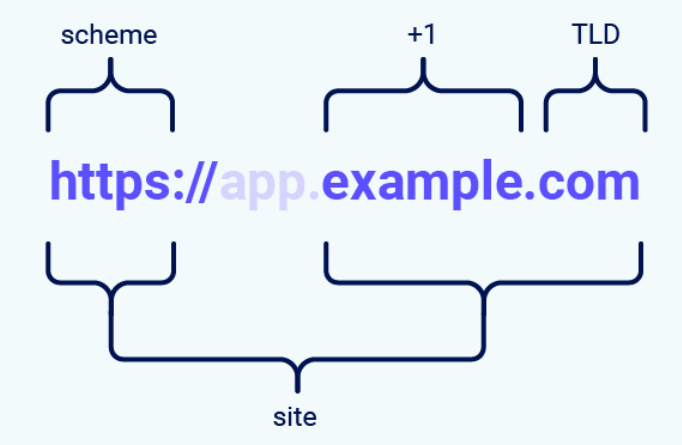
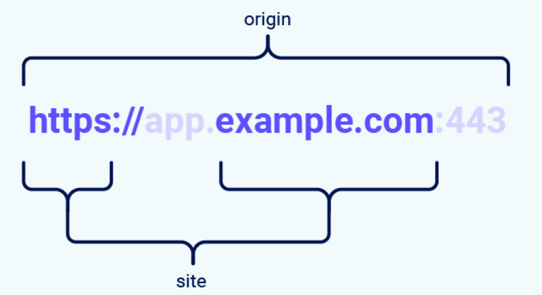

***Кратко - Злоумышленник может заставить браузер пользователя отправить запрос с кредами или куками пользователя, но не может прочитать ответ сервера.***
# 7.3 CSRF (Cross-site request forgery)
# Подделка запроса на межсайтовом уровне (CSRF)
## 1. Что такое CSRF?
`Подделка межсайтового запроса (CSRF)` — это уязвимость веб-безопасности, которая позволяет злоумышленнику заставить пользователя выполнить действие, которого он не планировал.

Атака использует тот факт, что браузер автоматически отправляет данные авторизации пользователя при запросах. В результате злоумышленник может частично обойти защиту **Same-Origin Policy**, которая должна предотвращать взаимодействие разных сайтов друг с другом.

## 2. Каковы последствия атаки CSRF?
Например, пользователь может изменить адрес электронной почты в аккаунте, после чего злоумышленник сможет сбросить пароль, или выполнить перевод денежных средств.

В зависимости от действия злоумышленник может получить полный контроль над учетной записью пользователя. Если скомпрометированный пользователь имеет высокие привилегии в приложении, атакующий может получить доступ ко всем данным и функциям системы.

## 3. Как работает CSRF?
Для успешной `CSRF`-атаки должны выполняться три условия:
* **Есть подходящее действие.** В приложении существует функция, которую злоумышленнику выгодно выполнить от имени пользователя. Например, изменение пароля, адреса электронной почты или прав доступа.
* **Аутентификация основана на cookie.** Приложение определяет пользователя `только по сессионным cookie`. Дополнительной проверки запросов нет.
* **Нет непредсказуемых параметров.** Все параметры запроса известны или могут быть угаданы злоумышленником. Например, если для смены пароля требуется указать текущий пароль, такая атака уже не сработает.

Например, в приложении есть функция изменения адреса электронной почты. При ее использовании браузер отправляет такой запрос:
```http
POST /email/change HTTP/1.1
Host: vulnerable-website.com
Content-Type: application/x-www-form-urlencoded
Content-Length: 30
Cookie: session=yvthwsztyeQkAPzeQ5gHgTvlyxHfsAfE
...
email=wiener@normal-user.com
```
Этот запрос соответствует всем условиям для `CSRF`:
* Изменение адреса электронной почты интересно злоумышленнику. После этого он может сбросить пароль и получить доступ к аккаунту.
* Приложение использует только сессионную `cookie` для определения пользователя. Дополнительной защиты нет.
* Все параметры запроса известны, поэтому злоумышленник может легко сформировать такой же запрос.

В этом случае злоумышленник может создать страницу со следующим HTML-кодом:
```html
<html>
    <body>
        <form action="https://vulnerable-website.com/email/change" method="POST">
            <input type="hidden" name="email" value="pwned@evil-user.net" />
        </form>
        <script>
            document.forms[0].submit();
        </script>
    </body>
</html>
```
Если авторизованный пользователь откроет эту страницу, произойдет следующее:
* Страница злоумышленника отправит запрос на уязвимый сайт.
* Браузер автоматически добавит к запросу сессионную cookie пользователя (если ограничения **SameSite** не применяются).
* Сервер воспримет запрос как отправленный самим пользователем и изменит адрес электронной почты в его аккаунте.

> **Примечание** - Хотя `CSRF` обычно рассматривают применительно к аутентификации через cookie, эта уязвимость возможна и в других случаях, когда браузер автоматически добавляет учетные данные пользователя к запросам. Например, при использовании **HTTP Basic Authentication** или аутентификации с помощью клиентских сертификатов.

## 4. Как создать CSRF-атаку
Создавать HTML-код для `CSRF`-атаки вручную бывает неудобно, особенно если запрос содержит много параметров или имеет нестандартную структуру. Проще всего использовать **генератор CSRF PoC**, встроенный в **Burp Suite Professional**.

Для этого:
1. Выберите запрос, который хотите проверить.
2. Щелкните по нему правой кнопкой мыши и выберите **Engagement tools → Generate CSRF PoC**.
3. `Burp Suite` автоматически создаст HTML-код, который повторяет выбранный запрос. `Cookie` в него не включаются, так как браузер пользователя добавит их автоматически.
4. При необходимости настройте параметры генератора, если запрос имеет нестандартные особенности.
5. Скопируйте полученный HTML на веб-страницу, откройте ее в браузере, где пользователь уже авторизован на целевом сайте, и убедитесь, что запрос выполняется и действие успешно происходит.

### 4.1 Генерация CSRF PoC
Эта функция позволяет автоматически создать **PoC (Proof of Concept)** для проверки уязвимости `CSRF`.

Чтобы открыть генератор:
1. Выберите URL или HTTP-запрос в `Burp Suite`.
2. Щелкните правой кнопкой мыши и выберите **Engagement tools → Generate CSRF PoC**.

В верхней части окна `Burp` покажет выбранный HTTP-запрос, а в нижней — сгенерированный HTML-код. Он использует HTML-форму и/или JavaScript для отправки запроса из браузера жертвы.

При необходимости запрос можно изменить вручную. После редактирования нажмите **Regenerate**, чтобы `Burp` заново создал HTML-код.

### 4.2 Проверка PoC
Чтобы проверить, работает ли созданный PoC:
1. Нажмите **Test in browser**.
2. Откройте предложенный `Burp` URL в браузере.
3. Проследите в **Proxy**, был ли отправлен нужный запрос и выполнено ли действие.

### 4.3 Особенности генерации CSRF PoC
* **Cross-domain XMLHttpRequest (XHR)** работает только в современных браузерах с поддержкой **CORS** и включенным `JavaScript`. Этот метод не подходит для доставки отраженных `XSS`-атак. Если из-за ограничений браузера запрос может не сработать, Burp предупредит об этом.

* Если запрос содержит тело в формате **XML** или **JSON**, `Burp` использует либо HTML-форму с типом `text/plain`, либо `cross-domain XHR`. Во втором случае желательно использовать стандартный `Content-Type`, чтобы избежать предварительного **preflight**-запроса. Иногда сервер отклоняет запрос из-за неподходящего `Content-Type`, даже если его содержимое правильное. В таких случаях `Burp` также покажет предупреждение.

* Если вручную выбрать метод генерации, который не подходит для данного запроса, `Burp` все равно попытается создать PoC и сообщит о возможных проблемах.

* При использовании HTML-формы с кодировкой `text/plain` тело запроса должно содержать символ `=`. Он необходим `Burp` для корректной генерации формы. Если его нет, можно добавить его в место, которое не повлияет на обработку запроса сервером.

### 4.4 Параметры CSRF PoC
Нажмите **Options**, чтобы изменить настройки генерации.

* **CSRF technique** — выбор способа создания PoC. Обычно рекомендуется режим **Auto**, в котором `Burp` автоматически подбирает наиболее подходящий метод.

* **Include auto-submit script** — добавляет в HTML JavaScript-код, который автоматически отправляет запрос сразу после открытия страницы в браузере.

## 3. Как доставить CSRF-эксплойт
Способы доставки `CSRF`-атаки практически такие же, как и для **Reflected XSS**.

Обычно злоумышленник размещает вредоносный HTML-код на подконтрольном сайте и убеждает пользователя открыть его. Для этого могут использоваться `ссылки в электронных письмах`, `сообщениях в мессенджерах` или социальных сетях. Если вредоносный код размещен на популярном сайте (например, в комментарии), злоумышленнику остается дождаться, пока жертва откроет страницу.

Некоторые простые `CSRF`-атаки используют метод **GET** и могут состоять всего из одного URL. В этом случае злоумышленнику не нужен собственный сайт — достаточно заставить пользователя перейти по `специально созданной ссылке` на уязвимый ресурс.

Например, если адрес электронной почты можно изменить через GET-запрос, атака может выглядеть так:
```html

```
## 4. XSS и CSRF
### 4.1 Чем отличаются XSS и CSRF?
**Cross-Site Scripting (XSS)** позволяет злоумышленнику выполнить произвольный JavaScript-код в браузере пользователя.

**Cross-Site Request Forgery (CSRF)** позволяет заставить пользователя выполнить действия, которых он не собирался выполнять.

Обычно последствия **XSS** более опасны, чем последствия **CSRF**:

* **CSRF** обычно позволяет выполнить только отдельные действия, для которых отсутствует защита. Во многих приложениях защита реализована почти везде, но некоторые функции остаются уязвимыми. 
* При успешной **XSS**-атаке злоумышленник может выполнять любые действия, доступные пользователю, независимо от того, где находится уязвимость.

* **CSRF** — это «односторонняя» атака. Злоумышленник может заставить браузер отправить запрос, но не может прочитать ответ сервера. 
* **XSS** — «двусторонняя» атака: внедренный JavaScript может отправлять запросы, читать ответы и передавать полученные данные на сервер злоумышленника.

## 4.2 Могут ли CSRF-токены защитить от XSS?
В некоторых случаях **CSRF-токены** действительно могут помешать эксплуатации **Reflected XSS**. Например, уязвимый запрос может выглядеть так:
```text
https://insecure-website.com/status?message=<script>/*+Bad+stuff+here...+*/</script>
```
Если приложение требует корректный `CSRF`-токен:
```text
https://insecure-website.com/status?csrf-token=CIwNZNlR4XbisJF39I8yWnWX9wX4WFoz&message=<script>/*+Bad+stuff+here...+*/</script>
```
и сервер проверяет этот токен, то без него запрос будет отклонен. В результате злоумышленник не сможет просто отправить пользователю вредоносную ссылку и использовать **Reflected XSS**.

Однако есть несколько важных ограничений:
* Если на сайте есть другая **Reflected XSS**-уязвимость в функции, которая не защищена `CSRF`-токеном, ее можно эксплуатировать обычным способом.
* Если злоумышленник уже может выполнить **XSS** на сайте, он способен обойти защиту `CSRF`. Вредоносный JavaScript может получить действительный `CSRF`-токен со страницы приложения и использовать его для выполнения защищенного действия.
* **CSRF-токены** не защищают от **Stored XSS**. Если на странице с `CSRF`-защитой есть сохраненная `XSS`-уязвимость, вредоносный код все равно будет выполняться при открытии этой страницы пользователем.

## 5. Основные способы защиты от CSRF
На практике успешная `CSRF`-атака часто требует обхода защитных механизмов, реализованных на стороне приложения, браузера или сразу в обоих местах.

Наиболее распространенные способы защиты:
* **CSRF-токены.** Это уникальные, секретные и непредсказуемые значения, которые сервер создает для каждого пользователя. При выполнении важных действий (например, отправке формы) клиент должен передать правильный токен вместе с запросом. Без него злоумышленнику сложно сформировать действительный запрос.
* **SameSite.** Это механизм безопасности браузера, который определяет, когда `cookie` могут отправляться в запросах с других сайтов. Поскольку для выполнения большинства действий требуется сессионная `cookie`, ограничения **SameSite** помогают предотвратить `CSRF`-атаки. Начиная с 2021 года Chrome использует режим **SameSite=Lax** по умолчанию. Ожидается, что аналогичное поведение будет поддерживаться и другими браузерами.
* **Проверка заголовка Referer.** Некоторые приложения проверяют HTTP-заголовок **Referer**, чтобы убедиться, что запрос пришел с собственного сайта. Однако этот способ считается менее надежным, чем использование `CSRF`-токенов.

### 5.1 Использование CSRF-токенов
Самый надежный способ защиты от `CSRF` — использовать **CSRF-токены** в запросах, выполняющих важные действия.

Токен должен соответствовать следующим требованиям:
* быть непредсказуемым и иметь высокую энтропию;
* быть привязанным к сессии пользователя;
* проверяться сервером перед выполнением каждого защищаемого действия.

#### 5.1.1 Как должны генерироваться CSRF-токены?
`CSRF`-токены должны быть случайными и трудно угадываемыми, как и сессионные токены.

Для их генерации рекомендуется использовать **криптографически стойкий генератор псевдослучайных чисел (CSPRNG)**. В качестве источников энтропии можно использовать время создания токена и статический секрет.

Если требуется дополнительная защита, можно создать токен из нескольких источников случайных данных, а затем вычислить криптографический хэш от полученного значения. Это усложняет анализ токенов и их подбор злоумышленником.

#### 5.1.2 Как должны передаваться CSRF-токены?
`CSRF`-токены считаются секретными данными, поэтому их необходимо безопасно передавать и хранить.

Обычно токен помещают в **скрытое поле HTML-формы**, отправляемой методом **POST**. При отправке формы токен автоматически передается серверу.
```html
<input type="hidden" name="csrf-token" value="CIwNZNlR4XbisJF39I8yWnWX9wX4WFoz" />
```

Для дополнительной защиты поле с `CSRF`-токеном рекомендуется размещать как можно раньше в HTML-документе — до других полей формы и до мест, куда могут попадать пользовательские данные. Это снижает риск атак, основанных на изменении структуры HTML.

Передавать `CSRF`-токен в **URL** менее безопасно, потому что:
* параметры URL могут сохраняться в журналах на стороне клиента и сервера;
* URL может попасть на сторонние сайты через HTTP-заголовок **Referer**;
* токен будет виден в адресной строке браузера.

Некоторые приложения передают `CSRF`-токен в **пользовательском HTTP-заголовке**. Это повышает защиту, так как браузеры обычно не позволяют сторонним сайтам отправлять произвольные заголовки. Однако такой способ работает только с запросами **XMLHttpRequest (XHR)** или **Fetch**, а не с обычными HTML-формами, поэтому во многих случаях он излишне сложен.

***CSRF-токены не следует передавать в cookie.***

#### 5.1.3 Как должны проверяться CSRF-токены?
После создания `CSRF`-токен должен сохраняться на сервере в данных сессии пользователя.

Когда приходит запрос, требующий проверки, сервер должен убедиться, что переданный токен совпадает с тем, который сохранен в сессии пользователя.

Проверка должна выполняться независимо от HTTP-метода и типа содержимого запроса.

Если запрос не содержит `CSRF`-токен или передан неверный токен, сервер должен отклонить такой запрос.

### 5.2 Использование строгих ограничений SameSite для cookie
Помимо надежной проверки `CSRF`-токенов, рекомендуется явно задавать параметр **SameSite** для каждого `cookie`, который использует приложение. Это позволяет контролировать, в каких случаях `cookie` могут отправляться, независимо от настроек браузера.

Даже если все браузеры перейдут на режим **Lax** по умолчанию, он подходит не для всех `cookie` и может быть проще обойти, чем строгий режим **Strict**. Кроме того, разные браузеры поддерживают защиту `SameSite` по-разному, поэтому не все пользователи могут получить одинаковый уровень защиты.

Лучше использовать политику **SameSite=Strict** по умолчанию и менять ее на **Lax** только при необходимости.

Не следует отключать защиту `SameSite` с помощью **SameSite=None**, если вы полностью не понимаете возможные последствия для безопасности.

***SameSite=Strict*** - Самый строгий вариант. `Cookie` отправляется только если запрос идет с самого сайта.

Пример:
* ✅ Вы находитесь на `bank.com` → запрос к `bank.com` → `cookie` отправляется.
* ❌ Вы находитесь на `evil.com` → запрос к `bank.com` → `cookie` НЕ отправляется.

Это самая надежная защита от `CSRF`.

### 5.3 Остерегайтесь атак с одного сайта. Referer
Даже правильно настроенный **SameSite** хорошо защищает от атак между разными сайтами, но не помогает против атак внутри одного сайта.

Если возможно, рекомендуется размещать небезопасный контент (например, загруженные пользователями файлы) на отдельном домене, отдельно от функций и данных, требующих защиты.

При проверке безопасности сайта необходимо учитывать всю поверхность атаки, связанную с этим сайтом, включая связанные поддомены.

## 6. Обход традиционных способов защит
### 6.1 Обход валидации токенов CSRF
**CSRF-токен** — это уникальное, секретное и непредсказуемое значение, которое сервер создает и передает клиенту. При выполнении важных действий (например, отправке формы) клиент должен передать этот токен вместе с запросом. Если токен отсутствует или неверен, сервер отклонит запрос.

Обычно `CSRF`-токен передается в виде скрытого поля (`hidden`) HTML-формы:
```html
<form name="change-email-form" action="/my-account/change-email" method="POST">
    <label>Email</label>
    <input required type="email" name="email" value="example@normal-website.com">
    <input required type="hidden" name="csrf" value="50FaWgdOhi9M9wyna8taR1k3ODOR8d6u">
    <button class="button" type="submit">Update email</button>
</form>
```
При отправке формы браузер сформирует следующий запрос:
```http
POST /my-account/change-email HTTP/1.1
Host: normal-website.com
Content-Length: 70
Content-Type: application/x-www-form-urlencoded
...
csrf=50FaWgdOhi9M9wyna8taR1k3ODOR8d6u&email=example@normal-website.com
```
При правильной реализации **CSRF-токены** защищают от CSRF-атак, поскольку злоумышленник не может узнать или подобрать правильное значение токена. Без действительного токена сервер не выполнит запрос.

> ***Примечание - CSRF-токены не обязательно передаются как скрытые поля в POST-формах. Некоторые приложения передают их в HTTP-заголовках.***

Уязвимости `CSRF` часто возникают из-за неправильной проверки **CSRF-токенов**. Рассмотрим одну из самых распространенных ошибок, которая позволяет обойти эту защиту.

#### 6.1.1 Проверка CSRF-токена зависит от HTTP-метода
Некоторые приложения проверяют `CSRF`-токен только для **POST**-запросов, но не выполняют такую проверку для **GET**-запросов.

В этом случае злоумышленник может изменить метод запроса с **POST** на **GET** и обойти защиту:
```http
GET /email/change?email=pwned@evil-user.net HTTP/1.1
Host: vulnerable-website.com
Cookie: session=2yQIDcpia41WrATfjPqvm9tOkDvkMvLm
```

Если сервер обрабатывает такой **GET**-запрос без проверки `CSRF`-токена, атака будет успешной.

#### 6.1.2 Проверка CSRF-токена зависит от его наличия
Некоторые приложения проверяют `CSRF`-токен только тогда, когда он присутствует в запросе. Если токен отсутствует, проверка не выполняется.

В этом случае злоумышленник может просто полностью удалить параметр с `CSRF`-токеном и обойти защиту:
```http
POST /email/change HTTP/1.1
Host: vulnerable-website.com
Content-Type: application/x-www-form-urlencoded
Content-Length: 25
Cookie: session=2yQIDcpia41WrATfjPqvm9tOkDvkMvLm
...
email=pwned@evil-user.net
```
Если сервер принимает такой запрос без проверки `CSRF`-токена, атака будет успешной.

#### 6.1.3 CSRF-токен не привязан к сессии пользователя
Некоторые приложения не проверяют, что **CSRF-токен** принадлежит текущей сессии пользователя. Вместо этого они принимают любой действительный токен из общего списка ранее выданных токенов.

В такой ситуации злоумышленник может войти в приложение под своей учетной записью, получить действительный `CSRF`-токен и использовать его в `CSRF`-атаке против другого пользователя.

#### 6.1.4 CSRF-токен привязан не к сессионной cookie
Иногда приложение привязывает **CSRF-токен** к `cookie`, которая **не используется для хранения сессии пользователя**. Такое может произойти, если за управление сессиями и защиту от `CSRF` отвечают разные механизмы.

Например:
```http id="5w3s9a"
POST /email/change HTTP/1.1
Host: vulnerable-website.com
Content-Type: application/x-www-form-urlencoded
Content-Length: 68
Cookie: session=pSJYSScWKpmC60LpFOAHKixuFuM4uXWF; csrfKey=rZHCnSzEp8dbI6atzagGoSYyqJqTz5dv

csrf=RhV7yQDO0xcq9gLEah2WVbmuFqyOq7tY&email=wiener@normal-user.com
```
То есть:
* `session` — идентификатор сессии пользователя (кто вошел в систему).
* `csrfKey` — дополнительная cookie, которая используется механизмом CSRF.
* `csrf` — сам CSRF-токен, который отправляется в форме.

Такую уязвимость сложнее эксплуатировать, но это все еще возможно.

Если злоумышленник может установить `cookie` в браузере жертвы, он может:
1. Войти в приложение под своей учетной записью.
2. Получить действительный CSRF-токен и связанную с ним `cookie`.
Получает
    * session = HACKER_SESSION
    * csrfKey = HACKER_KEY
    * csrf = HACKER_TOKEN
3. Установить эту `cookie` в браузер жертвы.
Теперь браузер жертвы выглядит так:
    * `session` = VICTIM_SESSION
    * `csrfKey` = HACKER_KEY
4. Использовать соответствующий `CSRF`-токен в своей атаке. Отправляет запрос:
```
Cookie:
session=VICTIM_SESSION
csrfKey=HACKER_KEY

POST:
csrf=HACKER_TOKEN
```
сервер делает только одну проверку: совпадает ли `csrf` с `csrfKey`? Да. Пара правильная. Сервер говорит: Отлично, `CSRF` пройден. Потом он смотрит:
```
session = VICTIM_SESSION
```
и выполняет действие от имени жертвы.

Сессия (`session`) остается жертвы. Хакер не меняет `session`. Он меняет только: `csrfKey` и `csrf`. В результате сервер примет запрос как действительный.

> **Примечание** - Возможность установить `cookie` не обязательно должна находиться в том же веб-приложении, где есть `CSRF`-уязвимость.

Если несколько приложений работают в пределах одного общего **DNS-домена**, одно из них может установить `cookie` для другого приложения, если область действия (**Domain**) этой `cookie` позволяет это.

Например, если приложение на:
```text
staging.demo.normal-website.com
```
может устанавливать cookie для домена:
```text
normal-website.com
```
то эта cookie будет автоматически отправляться и на:
```text
secure.normal-website.com
```
В результате уязвимость в одном поддомене может использоваться для атаки на другое приложение в пределах того же домена.

#### 6.1.5 CSRF-токен просто дублируется в cookie
В некоторых приложениях сервер **не хранит CSRF-токены**. Вместо этого одно и то же значение записывается в **cookie** и передается в параметре запроса. При проверке сервер лишь сравнивает, совпадают ли эти два значения. Такой подход называется **Double Submit Cookie**:
```http id="n8h3vk"
POST /email/change HTTP/1.1
Host: vulnerable-website.com
Content-Type: application/x-www-form-urlencoded
Content-Length: 68
Cookie: session=1DQGdzYbOJQzLP7460tfyiv3do7MjyPw; csrf=R8ov2YBfTYmzFyjit8o2hKBuoIjXXVpa

csrf=R8ov2YBfTYmzFyjit8o2hKBuoIjXXVpa&email=wiener@normal-user.com
```
Такой механизм проще реализовать, поскольку серверу не нужно хранить `CSRF`-токены.

Однако если злоумышленник может установить `cookie` в браузере жертвы, он сможет обойти эту защиту. Для этого ему даже не нужен действительный `CSRF`-токен. Достаточно:
1. Придумать любое значение токена.
2. Установить это же значение в cookie жертвы.
3. Отправить запрос с таким же значением в параметре `csrf`.

Поскольку сервер проверяет только совпадение значений в `cookie` и `запросе`, защита будет успешно обойдена.

### 6.2 Обход ограничений cookie SameSite
**SameSite** — это механизм безопасности браузера, который определяет, когда cookie сайта могут отправляться в запросах с других сайтов.

Ограничения **SameSite** помогают частично защититься от различных межсайтовых атак, включая **CSRF**, утечки данных и некоторые атаки через **CORS**.

С 2021 года Chrome использует режим **SameSite=Lax** по умолчанию, если сайт сам не указал другой уровень защиты. Этот подход постепенно внедряется и другими браузерами.

Поэтому важно понимать, как работает **SameSite**, а также знать способы обхода этих ограничений при проверке безопасности веб-приложений.

#### 6.2.1 Что такое сайт в контексте cookie SameSite?
В контексте **SameSite** сайт определяется как **домен верхнего уровня (TLD)** плюс один дополнительный уровень домена. Это называется **TLD+1**:
```text
example.com
```
— это один сайт.

А:
```text
app.example.com
admin.example.com
```
— это разные поддомены, но они относятся к одному сайту `example.com`.

При определении, является ли запрос межсайтовым, браузер также учитывает **схему URL** (`http` или `https`):
```text
http://app.example.com
```
и
```text
https://app.example.com
```
будут считаться разными сайтами в большинстве браузеров.

> **Примечание** - Иногда используется термин **eTLD (effective Top-Level Domain)**. Он нужен для учета специальных доменных зон, которые состоят из нескольких частей и работают как один `TLD`, например:
```text
.co.uk
```
В таком случае учитывается весь такой суффикс при определении сайта.


#### 6.2.2 В чем разница между сайтом и origin?
Главное отличие — в области действия.

**Site (сайт)** может включать несколько доменных имен, а **origin (источник)** относится только к одному конкретному домену.

`site` означает не весь сайт с точки зрения пользователя, а границу доверия между доменами.

Эти понятия связаны, но их нельзя использовать как синонимы. Ошибка в понимании разницы между ними может привести к проблемам безопасности.

Два URL имеют одинаковый **origin**, если у них совпадают:
* схема (`http` или `https`);
* доменное имя;
* порт.

При этом порт часто определяется автоматически на основе схемы. Например, для `https` обычно используется порт `443`, а для `http` — `80`.


Как видно из примеров, термин **«сайт»** менее строгий, чем **origin**, потому что учитывает только схему и основной домен (eTLD+1).

Важно понимать: **межсайтовый запрос может быть запросом с тем же origin? Нет — наоборот: запросы с разным origin могут быть одним сайтом.**

`Origin` меньше, он более строгий. `Origin` — это точное место:
```
scheme + domain + port
```
То есть:
```
https://app.example.com:443
```
Это один `origin`.

А:
```
https://admin.example.com:443
```
уже другой `origin`. Хотя они один `site`.

|Запрос от|Запрос на|Тот же сайт?|Один origin?|
| ------------------------- | ------------------------------ | ----------------- | ------------------ |
|`https://example.com`|`https://example.com`|Да|Да|
|`https://app.example.com`|`https://intranet.example.com`| Да|Нет: разные домены|
|`https://example.com`|`https://example.com:8080`|Да|Нет: разные порты|
|`https://example.com`|`https://example.co.uk`|Нет: разные eTLD|Нет: разные домены|
|`https://example.com`|`http://example.com`|Нет: разные схемы|Нет: разные схемы|

Это различие важно для безопасности. Если на одном домене есть уязвимость, позволяющая выполнить произвольный JavaScript, ее можно использовать для обхода защиты других доменов, которые относятся к тому же сайту.

#### 6.2.3 Как работает SameSite?
До появления **SameSite** браузеры отправляли `cookie` при каждом запросе к домену, который их создал, даже если запрос был вызван другим сайтом.

**SameSite** позволяет браузеру и владельцу сайта управлять тем, когда `cookie` могут отправляться в межсайтовых запросах.

Это помогает снизить риск **CSRF-атак**, где злоумышленник заставляет браузер жертвы отправить запрос на уязвимый сайт. Так как такие запросы обычно требуют сессионную `cookie` пользователя, атака не сработает, если браузер не отправит эту `cookie`.

Основные браузеры поддерживают три режима `SameSite`:
* **Strict**
* **Lax**
* **None**

Разработчики могут задавать режим для каждой `cookie` через атрибут `SameSite` в заголовке `Set-Cookie`:
```http
Set-Cookie: session=0F8tgdOhi9ynR1M9wa3ODa; SameSite=Strict
```
Хотя **SameSite** помогает защититься от `CSRF`, ни один из режимов не гарантирует полную защиту. Некоторые ограничения можно обойти.

> **Примечание** - Если сайт не указывает атрибут `SameSite`, Chrome автоматически применяет режим **SameSite=Lax** по умолчанию.

Это означает, что `cookie` не будут отправляться в большинстве межсайтовых запросов, даже если разработчик явно не настроил защиту.

Ожидается, что такое поведение со временем будет принято и другими основными браузерами.

#### 6.2.4 Strict
Если cookie установлена с атрибутом:
```http
SameSite=Strict
```
браузер **не будет отправлять ее в межсайтовых запросах**.

Простыми словами: если сайт, с которого выполняется запрос, отличается от сайта, открытого в адресной строке браузера, `cookie` не будет добавлена в запрос.

Этот режим рекомендуется использовать для `cookie`, которые позволяют изменять данные или выполнять важные действия, например для доступа к страницам, доступным только авторизованным пользователям.

**Strict** — самый безопасный вариант, но он может ухудшить удобство использования, если сайту требуется работа с запросами от других сайтов.

#### 6.2.5 Lax
При использовании:
```http
SameSite=Lax
```
браузер отправляет `cookie` в межсайтовых запросах только при выполнении двух условий:
* запрос использует метод **GET**;
* запрос появился в результате действия пользователя верхнего уровня, например перехода по ссылке.

Это означает, что `cookie` не отправляется в межсайтовых **POST-запросах**.

Так как **POST** обычно используется для действий, которые изменяют данные или состояние приложения, именно такие запросы чаще всего становятся целью **CSRF-атак**.

Также `cookie` не отправляется в фоновых запросах, например созданных через:
* JavaScript;
* `iframe`;
* загрузку изображений или других ресурсов.

#### 6.2.6 None
Если `cookie` установлена с атрибутом:
```http
SameSite=None
```
ограничения **SameSite отключаются**.

В этом случае браузер будет отправлять `cookie` во всех запросах к сайту, который ее создал, включая запросы с других сайтов.

Кроме Chrome, это поведение раньше использовалось браузерами по умолчанию, если атрибут `SameSite` не был указан. Сейчас Chrome применяет **Lax** по умолчанию.

Иногда отключение **SameSite** необходимо, например, если `cookie` должна использоваться на сторонних сайтах и не дает доступ к важным данным или функциям. 

После появления режима **Lax-by-default** некоторые сайты столкнулись с проблемами совместимости и временно отключили `SameSite` для всех `cookie`, включая потенциально важные.

При использовании `SameSite=None` обязательно нужно добавлять атрибут: `Secure`. Он гарантирует, что `cookie` будет отправляться только через защищенное HTTPS-соединение:
```http
Set-Cookie: trackingId=0F8tgdOhi9ynR1M9wa3ODa; SameSite=None; Secure
```
Без `Secure` браузеры отклонят такую cookie и не сохранят ее.

#### 6.2.7 Обход ограничений SameSite Lax через GET-запросы
На практике серверы не всегда проверяют, каким методом был отправлен запрос — **GET** или **POST**. Даже если функция обычно использует форму, сервер может принять GET-запрос.

Если приложение использует `SameSite=Lax` для сессионной `cookie`, `CSRF`-атака все еще может быть возможна через **GET-запрос**.

При переходе пользователя на другой URL браузер может отправить его сессионную `cookie`, если это навигация верхнего уровня.

Пример атаки:
```html
<script>
    document.location = 'https://vulnerable-website.com/account/transfer-payment?recipient=hacker&amount=1000000';
</script>
```
Даже если приложение ожидает **POST**, некоторые фреймворки позволяют изменить HTTP-метод через специальный параметр.

Например, `Symfony` поддерживает параметр `_method`:
```html
<form action="https://vulnerable-website.com/account/transfer-payment" method="GET">
    <input type="hidden" name="_method" value="POST">
    <input type="hidden" name="recipient" value="hacker">
    <input type="hidden" name="amount" value="1000000">
</form>
```
* `_method` — это специальный параметр, который некоторые веб-фреймворки используют для подмены HTTP-метода запроса.

`SameSite=Lax` обычно блокирует `cookie` для межсайтовых POST-запросов, но разрешает некоторые GET-навигации.

Получается обход:
* Злоумышленник отправляет жертве GET-запрос.
* Браузер прикладывает `cookie` сессии (потому что это Lax-разрешенный переход).
* Сервер через `_method` превращает `GET` в `POST`.
* Действие выполняется от имени жертвы.

В этом случае сервер может обработать запрос как **POST**, несмотря на то, что фактически был отправлен **GET**.

Другие фреймворки имеют похожие механизмы переопределения HTTP-метода.

#### 6.2.8 Обход ограничений SameSite через гаджеты на сайте
Если cookie установлена с `SameSite=Strict` браузер не будет отправлять ее в межсайтовых запросах.

Обойти это ограничение можно, если найти **гаджет на том же сайте**, который создаёт новый запрос внутри этого же сайта.

Например, это может быть **клиентский редирект**, который формирует адрес перехода из данных, контролируемых пользователем (например, из параметра URL).

Для браузера такой редирект считается не новым межсайтовым запросом, а обычным запросом внутри того же сайта. Поэтому браузер отправит связанные `cookie`, даже если для них установлен режим `SameSite=Strict`.

Если злоумышленник сможет управлять таким гаджетом и заставить его создать нужный запрос, он сможет обойти ограничения **SameSite**.

Важно: такой обход работает только для **клиентских редиректов**.

При **серверном редиректе** браузер понимает, что переход начался с межсайтового запроса, поэтому продолжает применять ограничения `SameSite` и не отправляет cookie.

Представим, что есть уязвимый редирект:
```html
<script>
window.location = location.search.substring(5);
</script>
```
Атакующий отправляет жертве ссылку:
```
https://site.com/redirect?url=https://site.com/change-email?email=hacker@test.com
```

Происходит:
1. Жертва открывает ссылку с другого сайта.
2. Первый запрос идет на `site.com/redirect`.
3. JavaScript внутри сайта делает второй запрос:
```
site.com/change-email?email=hacker@test.com
```
Для браузера второй запрос уже **внутри того же сайта**, поэтому он отправляет `cookie` даже с:
```
SameSite=Strict
```
Итог: уязвимый клиентский редирект позволяет превратить межсайтовый запрос в same-site запрос и обойти защиту `SameSite`.

#### 6.2.9 Обход ограничений SameSite через уязвимые соседние домены
Важно помнить: запрос может считаться **тем же сайтом**, даже если он был отправлен с другого **origin**.

Поэтому при проверке безопасности нужно анализировать не только основной домен, но и все связанные поддомены.

Особенно опасны уязвимости, которые позволяют выполнять произвольные запросы, например **XSS**. Такая уязвимость на одном поддомене может обойти защиту `SameSite` и поставить под угрозу другие домены того же сайта.

Кроме обычного **CSRF**, стоит проверять и **WebSocket**. Если приложение использует `WebSocket`, он может быть уязвим для **CSWSH (Cross-Site WebSocket Hijacking)** — атаки, похожей на `CSRF`, но направленной на установление `WebSocket`-соединения.

#### 6.2.10 Обход ограничений SameSite Lax через недавно созданные cookie
`Cookie` с:
```http
SameSite=Lax
```
обычно не отправляются в межсайтовых **POST-запросах**, но существуют исключения.

Если сайт не указывает атрибут `SameSite`, Chrome автоматически использует режим **Lax** по умолчанию.

Однако, чтобы не ломать механизмы **SSO (Single Sign-On)**, Chrome не применяет это ограничение в течение первых **120 секунд** после создания `cookie` для некоторых POST-запросов верхнего уровня.

В результате появляется двухминутное окно, когда пользователь может быть уязвим к `CSRF`-атакам.

> **Примечание** - Это двухминутное исключение не применяется к `cookie`, для которых явно указан:
```http
SameSite=Lax
```

Пытаться выполнить атаку прямо в короткое двухминутное окно после создания `cookie` сложно.

Но если на сайте есть **гаджет**, который позволяет заставить пользователя получить новую сессионную `cookie`, можно сначала обновить `cookie` жертвы, а затем выполнить `CSRF`-атаку.

Например, повторное завершение входа через **OAuth** может создать новую сессию, потому что `OAuth`-сервис не всегда знает, остался ли пользователь авторизованным на целевом сайте.

Чтобы обновить `cookie` без повторного входа пользователя, нужно использовать **навигацию верхнего уровня**, чтобы браузер отправил текущие `OAuth`-cookie.

Проблема в том, что после этого нужно вернуть пользователя обратно на свой сайт, чтобы запустить `CSRF`-атаку.

Другой вариант — открыть обновление `cookie` в новой вкладке, чтобы основная страница не закрылась. Однако браузеры блокируют автоматическое открытие новых вкладок:
```javascript
window.open('https://vulnerable-website.com/login/sso');
```
Чтобы обойти это ограничение, вызов можно привязать к действию пользователя:
```javascript
window.onclick = () => {
    window.open('https://vulnerable-website.com/login/sso');
}
```
Теперь `window.open()` выполнится только после клика пользователя, поэтому браузер не будет блокировать открытие вкладки.

### 6.3 Обход защиты CSRF через Referer
Некоторые приложения используют HTTP-заголовок `Referer` для защиты от `CSRF`-атак.

Обычно приложение проверяет, что запрос был отправлен с собственного домена. Этот способ защиты менее надежен, чем `CSRF`-токены, и часто может быть обойден.

Заголовок `Referer` содержит адрес страницы, с которой был отправлен запрос. Обычно браузер автоматически добавляет его при выполнении HTTP-запросов, например, когда пользователь:
* переходит по ссылке;
* отправляет форму.

Существуют способы, которые позволяют странице изменять или скрывать значение заголовка `Referer`. Обычно это используется для защиты конфиденциальности пользователя.

Например, пользователь находится на странице:
```
https://attacker.com/page.html
```
и нажимает ссылку:
```
https://bank.com/account
```
Браузер отправит запрос:
```
GET /account HTTP/1.1
Host: bank.com
Referer: https://attacker.com/page.html
Cookie: session=abc123
```
Здесь:
* `Host` — куда идет запрос (bank.com);
* `Referer` — откуда пришел пользователь (attacker.com/page.html);
* `Cookie` — данные сессии пользователя.

Сервер bank.com может проверить:
```
Referer: https://attacker.com/page.html
```
и сказать: "Запрос пришел не с моего сайта, возможно это `CSRF` — отклонить".

#### 6.3.1 Проверка Referer зависит от наличия заголовка
Некоторые приложения проверяют заголовок `Referer` только если он присутствует в запросе. Если заголовок отсутствует, приложение пропускает проверку.

В такой ситуации злоумышленник может создать `CSRF`-атаку так, чтобы браузер жертвы не отправлял заголовок `Referer`.

Например, это можно сделать с помощью HTML-тега:
```html
<meta name="referrer" content="never">
```
После этого браузер не будет добавлять `Referer` в запрос, и проверка приложения может быть обойдена.

#### 6.3.2 Обход проверки Referer
Некоторые приложения неправильно проверяют заголовок `Referer` и такую проверку можно обойти.

Например, если приложение проверяет только начало значения `Referer`, злоумышленник может создать похожий домен:
```text
http://vulnerable-website.com.attacker-website.com/csrf-attack
```
Приложение может ошибочно принять его за свой домен.

Другой вариант — если приложение просто ищет наличие своего домена в `Referer`. Тогда злоумышленник может разместить его внутри URL:
```text
http://attacker-website.com/csrf-attack?vulnerable-website.com
```
Приложение увидит строку `vulnerable-website.com` и может ошибочно разрешить запрос.

> **Примечание** - Такую проверку можно увидеть через `Burp Suite`, но при проверке атаки в браузере она может не сработать.

Многие браузеры теперь удаляют параметры URL из заголовка `Referer`, чтобы снизить риск утечки данных. Обойти это можно, добавив в ответ страницы с эксплойтом заголовок:
```http
Referrer-Policy: unsafe-url
```
Тогда браузер отправит полный URL вместе с параметрами запроса.


https://portswigger.net/web-security/csrf