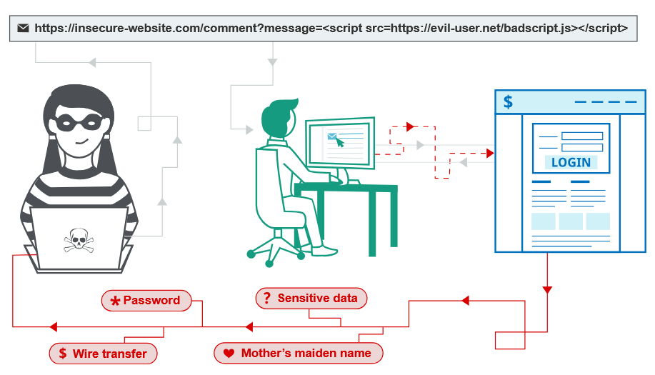

# 7.5 Cross-site-scripting (XSS)
> *XSS — это уязвимость веб-приложения, при которой злоумышленник внедряет вредоносный JavaScript-код, который выполняется в браузере другого пользователя.*

> "Сначала ищу точки входа пользовательских данных. Проверяю, отражаются ли они в HTML-ответе. Определяю контекст — HTML, атрибут, JavaScript, URL. Затем проверяю возможность выхода из контекста и выполнения JavaScript. Если есть фильтры, анализирую обходы и защитные механизмы вроде CSP."

## 1. Что такое межсайтовый сценарий (XSS)?
`Межсайтовый скриптинг (XSS)` — это уязвимость веб-безопасности, которая позволяет злоумышленнику вмешиваться во взаимодействие пользователей с уязвимым приложением.

Она позволяет обойти политику одного источника (`Same-Origin Policy`), которая должна разделять разные веб-сайты друг от друга. Уязвимости `XSS` обычно позволяют злоумышленнику выдавать себя за пользователя, выполнять действия от его имени и получать доступ к его данным.

Если у жертвы есть привилегированные права в приложении, злоумышленник может получить полный контроль над функциями приложения и его данными.

## 2. Как работает XSS?
`Межсайтовый скриптинг (XSS)` работает за счёт того, что злоумышленник изменяет уязвимый веб-сайт так, чтобы он отправлял пользователям вредоносный JavaScript-код.

Когда этот код выполняется в браузере жертвы, злоумышленник может полностью контролировать взаимодействие пользователя с приложением.

Цепочка: Уязвимость веб-приложения → внедрение JavaScript → выполнение в браузере жертвы → атака на пользователя

Браузер здесь скорее является исполнителем кода, а не целью атаки. Злоумышленник не ломает Chrome или Firefox, он заставляет браузер сделать то, что он обычно делает — выполнить JavaScript с доверенного сайта.


## 3. Доказательство концепции XSS
Большинство видов `XSS` можно проверить, вставив полезную нагрузку, которая заставляет ваш браузер выполнить произвольный JavaScript-код.

Обычно для этого используют функцию `alert()`, потому что она короткая, безопасная и сразу показывает, что код успешно выполнился. Поэтому во многих лабораториях `XSS` достаточно вызвать `alert()` в браузере тестовой жертвы.

Однако в Chrome есть ограничение: начиная с версии 92 (20 июля 2021 года) фреймы с другого источника не могут вызывать `alert()`. Так как такие фреймы используются в некоторых более сложных `XSS`-атаках, иногда нужно использовать другую полезную нагрузку для проверки. В таких случаях рекомендуется использовать функцию `print()`. 

* `Фрейм (iframe)` — это элемент HTML, который позволяет вставить одну веб-страницу внутрь другой.

Например:
```
<iframe src="https://example.com"></iframe>
```
Страница загрузит внутрь себя содержимое с `example.com`.

* Другой источник (cross-origin) означает, что это другой домен, протокол или порт.

Например:
```
https://site.com
https://evil.com
```
— это разные источники.

В старых версиях Chrome такой код внутри `iframe` мог вызвать: `alert("XSS")` и показать окно пользователю.

После Chrome 92 сделали ограничение: если JavaScript выполняется внутри `iframe` с другого источника, он больше не может вызывать `alert()`. Зачем это сделали? Потому что такие окна можно было использовать для злоупотреблений: например, создавать множество всплывающих окон или мешать пользователю.

## 4. Какие бывают типы XSS-атак?
Существует три основных типа XSS-атак:
* **Отражённый XSS (Reflected XSS)** — вредоносный скрипт попадает из текущего HTTP-запроса и сразу возвращается пользователю.
* **Хранимый XSS (Stored XSS)** — вредоносный скрипт сохраняется на сервере, например в базе данных сайта, а затем показывается другим пользователям.
* **DOM-based XSS** — уязвимость находится в клиентском JavaScript-коде, который выполняется в браузере, а не в серверной части приложения.

> **Reflected XSS — скрипт приходит из запроса, Stored XSS — скрипт хранится на сервере, DOM XSS — скрипт выполняется из уязвимого JavaScript в браузере.**

Официальная шпаргалка (cheat sheet) от PortSwigger по `XSS` - https://portswigger.net/web-security/cross-site-scripting/cheat-sheet

Простыми словами, это список различных вариантов `XSS`-полезных нагрузок (payloads), которые используют специалисты по безопасности при тестировании веб-приложений. Например, обычный `XSS` `<script>alert(1)</script>` может не сработать, если приложение фильтрует `<script>`. Тогда тестировщик проверяет другие варианты.

### 4.1 Отражённый межсайтовый сценарий (Reflected XSS)
**Reflected XSS** — это самый простой вид `XSS`. Он возникает, когда приложение получает данные из HTTP-запроса и сразу выводит их в ответе без безопасной обработки.

Пример обычного запроса:
```
https://insecure-website.com/status?message=All+is+well
```
Ответ приложения:
```html
<p>Status: All is well.</p>
```

Если приложение не проверяет полученные данные, злоумышленник может вставить вместо текста JavaScript-код:
```
https://insecure-website.com/status?message=<script>/* Bad stuff here... */</script>
```
Ответ приложения:
```html
<p>Status: <script>/* Bad stuff here... */</script></p>
```
Если пользователь откроет такой `URL`, скрипт выполнится в его браузере в контексте сайта. После этого злоумышленник может выполнять действия от имени пользователя и получать доступ к доступным ему данным.

### 4.2 Что такое отражённый межсайтовый сценарий (Reflected XSS)?
`Отражённый XSS` возникает, когда приложение получает данные из HTTP-запроса и выводит их в ответе без безопасной обработки. Например, сайт имеет поиск, который получает запрос через параметр URL:
```
https://insecure-website.com/search?term=gift
```
Приложение выводит этот запрос на странице:
```html
<p>You searched for: gift</p>
```
Если приложение не проверяет полученные данные, злоумышленник может вставить JavaScript-код:
```
https://insecure-website.com/search?term=<script>/* Bad stuff here... */</script>
```
В ответе сайт вернёт:
```html
<p>You searched for: <script>/* Bad stuff here... */</script></p>
```
Если другой пользователь откроет такой URL, вредоносный скрипт выполнится в его браузере в контексте работы с этим сайтом.

### 4.3 Влияние отражённых атак XSS
Если злоумышленник может управлять JavaScript-кодом, который выполняется в браузере жертвы, он обычно может полностью скомпрометировать пользователя.

Злоумышленник может:
* выполнять любые действия в приложении от имени пользователя;
* просматривать данные, доступные пользователю;
* изменять данные, которые пользователь может изменять;
* взаимодействовать с другими пользователями приложения от имени жертвы.

Чтобы провести отражённую `XSS`-атаку, злоумышленнику нужно заставить пользователя открыть специально созданный запрос. Для этого он может разместить ссылку на своём сайте, отправить её по электронной почте, в сообщении или другом источнике.

Атака может быть направлена на конкретного пользователя или на любых пользователей приложения.

Так как для отражённого `XSS` требуется внешний способ доставки ссылки, его влияние обычно меньше, чем у хранимого `XSS`, где вредоносный код уже находится внутри самого приложения.

### 4.4 Отражённый XSS в разных контекстах
Существует несколько вариантов отражённого `XSS`. То, где именно данные пользователя появляются в ответе приложения, определяет, какой `XSS`-код можно использовать и насколько серьёзной будет уязвимость.

Также важно учитывать, выполняет ли приложение проверку или обработку полученных данных перед их выводом. Это может изменить способ эксплуатации `XSS`.

### 4.5 Как найти и проверить отражённые уязвимости XSS
Большинство отражённых `XSS`-уязвимостей можно быстро найти с помощью веб-сканера уязвимостей `Burp Suite`.

Ручная проверка отражённого `XSS` включает следующие шаги:
* **Проверить все точки входа.** Нужно проверить все места, куда приложение принимает данные из HTTP-запросов: параметры URL, тело запроса, пути URL и HTTP-заголовки.
* **Отправить случайные значения.** Для каждой точки входа отправляется уникальное случайное буквенно-цифровое значение и проверяется, появляется ли оно в ответе приложения. Обычно используют значение около 8 символов, чтобы его было легко найти и сложно случайно встретить в ответе.
* **Определить контекст отражения.** Нужно понять, где именно приложение выводит полученное значение: внутри HTML-кода, атрибута тега, JavaScript-кода или другого места.
* **Проверить XSS-payload.** В зависимости от найденного контекста вставляется тестовый JavaScript-код. Удобно делать это через `Burp Repeater`: изменить запрос, отправить его и посмотреть, как приложение обработало нагрузку.
* **Проверить другие payload'ы.** Если приложение изменяет или блокирует первоначальный `XSS`-код, нужно попробовать другие варианты, подходящие под найденный контекст.
* **Проверить атаку в браузере.** Если payload работает в `Burp Repeater`, нужно проверить его в настоящем браузере. Часто используют простой код вроде `alert(document.domain)`, который показывает всплывающее окно при успешном выполнении JavaScript.

### 4.6 Общие вопросы об отражённом XSS
**В чём разница между отражённым XSS и хранимым XSS?**

`Отражённый XSS` возникает, когда приложение получает данные из HTTP-запроса и сразу выводит их в ответе без безопасной обработки.

При `хранимом XSS` приложение сначала сохраняет вредоносные данные, а затем выводит их пользователям в будущих ответах.

**В чём разница между отражённым XSS и Self-XSS?**

`Self-XSS` похож на обычный `отражённый XSS`, но его нельзя запустить через специально созданную ссылку или запрос.

Уязвимость срабатывает только тогда, когда сам пользователь вручную вводит вредоносный код в свой браузер. Обычно злоумышленник пытается обманом заставить жертву выполнить такие действия.

Поэтому `Self-XSS` обычно считается менее серьёзной проблемой с низким уровнем воздействия.

## 5. Хранение поперечно-площадочный сценарий
`Хранимый XSS` (также известный как постоянный или второй порядок XSS) возникает, когда приложение получает данные из ненадежного источника и включает эти данные в свои более поздние ответы HTTP небезопасным способом.

Данные, о которых идет речь, могут быть отправлены в приложение через HTTP-запросы; например, комментарии к сообщению в блоге, прозвища пользователя в чате или контактные данные о заказе клиента. В других случаях данные могут поступать из других ненадежных источников; например, приложение веб-почты, отображающее сообщения, полученные по SMTP, маркетинговое приложение, отображающее сообщения в социальных сетях, или приложение для мониторинга сети, отображающее данные пакетов из сетевого трафика.

Вот простой пример сохраненной уязвимости `XSS`. Приложение на доске объявлений позволяет пользователям отправлять сообщения, которые отображаются другим пользователям:
```
<p>Hello, this is my message!</p>
```
Приложение не выполняет никакой другой обработки данных, поэтому злоумышленник может легко отправить сообщение, которое атакует других пользователей:
```
<p><script>/* Bad stuff here... */</script></p>
```

### 5.1 Хранимый межсайтовый сценарий (Stored XSS)
`Хранимый XSS` (также известный как постоянный XSS) возникает, когда приложение получает данные из ненадёжного источника, сохраняет их и позже выводит в ответах HTTP без безопасной обработки.

Например, сайт позволяет пользователям оставлять комментарии в блоге, которые видят другие пользователи.

Пользователь отправляет комментарий:
```http
POST /post/comment HTTP/1.1
Host: vulnerable-website.com
...
comment=This+post+was+extremely+helpful.
```
После публикации комментария другие пользователи видят его на странице:
```html
<p>This post was extremely helpful.</p>
```

Если приложение не проверяет данные, злоумышленник может отправить вместо комментария JavaScript-код:
```html
<script>/* Bad stuff here... */</script>
```
Сайт сохранит этот код и будет показывать его всем пользователям:
```html
<p><script>/* Bad stuff here... */</script></p>
```
Когда пользователь откроет страницу с таким комментарием, вредоносный скрипт выполнится в его браузере в контексте работы с этим сайтом.

### 5.2 Последствия хранимых XSS-атак
Если злоумышленник может управлять JavaScript-кодом, который выполняется в браузере жертвы, он обычно может полностью скомпрометировать пользователя.

Злоумышленник получает те же возможности, что и при отражённом `XSS`: выполнять действия от имени пользователя, получать доступ к его данным и изменять доступную ему информацию.

Главное отличие `хранимого XSS` от отражённого заключается в способе атаки. При `хранимом XSS` вредоносный код уже находится внутри приложения, поэтому злоумышленнику не нужно заставлять пользователей переходить по специальной ссылке или отправлять определённый запрос.

***Злоумышленник один раз размещает вредоносный код в приложении и ждёт, пока пользователи его откроют.***

Это особенно важно, когда `XSS` работает только для пользователей, которые вошли в систему. При `отражённом XSS` пользователь должен открыть вредоносную ссылку именно в момент активной сессии. При `хранимом XSS` пользователь уже находится в приложении, когда сталкивается с вредоносным кодом.

### 5.3 Хранимый XSS в разных контекстах
Существует несколько вариантов `хранимого XSS`. То, где именно сохранённые данные появляются в ответе приложения, определяет, какой XSS-payload нужен для атаки и насколько серьёзной будет уязвимость.

Также важно учитывать, выполняет ли приложение проверку или обработку данных перед сохранением или перед выводом. Это может влиять на то, какой `XSS`-payload сработает.

### 5.4 Как найти и проверить хранимые уязвимости XSS
Многие `хранимые XSS-уязвимости` можно найти с помощью веб-сканера уязвимостей Burp Suite.

Ручная проверка `хранимого XSS` сложнее, чем отражённого. Нужно проверить все **точки входа**, куда злоумышленник может отправить данные, и все **точки выхода**, где эти данные могут появиться в ответах приложения.

**Точки входа могут включать:**
* параметры и данные в URL и теле HTTP-запроса;
* путь URL;
* HTTP-заголовки запросов;
* внешние источники данных, которые приложение обрабатывает.

Например, почтовое приложение может обрабатывать данные из писем, лента новостей — данные из сторонних публикаций, а агрегатор новостей — информацию с других сайтов.

**Точки выхода** — это любые HTTP-ответы приложения, в которых сохранённые данные могут быть показаны пользователям.

Первый шаг при проверке `хранимого XSS` — найти связь между **точками входа** и **точками выхода**, то есть определить, где данные, отправленные пользователем, появляются позже в ответах приложения.

Это может быть сложно по следующим причинам:
* Данные из одной точки входа могут появляться в любой точке выхода. Например, имя пользователя может отображаться в скрытом журнале действий, доступном только некоторым пользователям.
* Сохранённые данные могут быть перезаписаны другими действиями. Например, список последних поисковых запросов быстро меняется, когда пользователи выполняют новые поиски.

Полная проверка всех возможных связей между точками входа и выхода требует тестирования каждой комбинации отдельно. В больших приложениях такой подход слишком сложный.

Более практичный способ — по очереди проверять точки входа, отправлять уникальное значение и отслеживать ответы приложения, чтобы найти места, где оно появляется. Особое внимание стоит уделять функциям, которые работают с пользовательскими данными, например комментариям.

Когда значение найдено в ответе, нужно убедиться, что оно действительно было сохранено и получено из другого запроса, а не просто отражено сразу после отправки.

После определения связи между точкой входа и выхода нужно проверить её на `XSS`. Для этого необходимо определить контекст вывода данных и использовать подходящий `XSS`-payload. Этот процесс аналогичен проверке отражённого `XSS`.

## 6. DOM-based межсайтовый сценарий (DOM XSS)
`DOM Invader` - это инструмент на основе браузера, который помогает вам тестировать уязвимости DOM XSS с использованием различных источников - https://portswigger.net/burp/documentation/desktop/tools/dom-invader

`DOM XSS` возникает, когда клиентский JavaScript-код приложения небезопасно обрабатывает данные из ненадёжного источника и изменяет с их помощью `DOM` страницы.

Например, приложение получает значение из поля поиска и вставляет его в HTML:
```javascript
var search = document.getElementById('search').value;
var results = document.getElementById('results');
results.innerHTML = 'You searched for: ' + search;
```

Если злоумышленник может управлять значением этого поля, он может вставить вредоносный код, который выполнится в браузере:
```html
You searched for: 
```

Обычно значение для обработки берётся из HTTP-запроса, например из параметра URL. Поэтому злоумышленник может создать специальную ссылку, похожую на атаку `отражённого XSS`.

### 6.1 Что такое DOM-based XSS?
`DOM XSS` возникает, когда JavaScript получает данные из источника, который контролирует злоумышленник (например, URL), и передаёт их в опасное место, где возможно выполнение кода, например `eval()` или `innerHTML`.

Это позволяет злоумышленнику выполнить свой JavaScript-код в браузере пользователя и, например, получить доступ к его аккаунту.

Чтобы выполнить `DOM XSS-атаку`, злоумышленник должен поместить вредоносные данные в источник, откуда они попадут в уязвимый участок кода и приведут к выполнению JavaScript.

Чаще всего источником является URL, который приложение получает через объект `window.location`. Злоумышленник может создать специальную ссылку с вредоносным кодом в параметрах запроса или фрагменте URL и отправить её жертве.

В некоторых случаях полезная нагрузка также может размещаться прямо в пути URL.

### 6.2 Как проверить DOM XSS
Большинство `DOM XSS-уязвимостей` можно быстро найти с помощью веб-сканера уязвимостей `Burp Suite`.

Для ручной проверки `DOM XSS` обычно используют браузер с инструментами разработчика, например Chrome. Необходимо по очереди проверять каждый возможный источник данных и тестировать их отдельно.

#### 6.2.1 Тестирование HTML-раковин
Чтобы проверить `DOM XSS` в HTML-раковине, нужно поместить случайную буквенно-цифровую строку в источник данных (например, `location.search`), а затем через инструменты разработчика найти, где эта строка появилась в `DOM`.

Обычный просмотр исходного кода страницы не подходит для проверки `DOM XSS`, потому что он не показывает изменения HTML, которые были выполнены JavaScript. В Chrome DevTools можно использовать поиск (`Ctrl+F` или `Command+F` на macOS), чтобы найти свою строку в DOM.

Для каждого найденного места нужно определить контекст, в котором используется значение. Например, если строка находится внутри атрибута HTML, можно проверить, удастся ли выйти из атрибута с помощью специальных символов.

Также важно учитывать обработку URL. Chrome, Firefox и Safari кодируют значения из `location.search` и `location.hash`, а старые версии Internet Explorer и Edge могли этого не делать. Если данные уже закодированы перед обработкой, `XSS`-атака может не сработать.

#### 6.2.2 Тестирование JavaScript-раковин
Проверка JavaScript-раковин для `DOM XSS` сложнее, чем проверка HTML-раковин. Данные могут нигде не отображаться в `DOM`, поэтому их нельзя просто найти на странице.

Вместо этого нужно использовать JavaScript-отладчик, чтобы проверить, попадают ли данные из источника в опасную функцию.

Для каждого возможного источника, например `location`, нужно найти в JavaScript-коде страницы места, где он используется. В Chrome DevTools можно использовать поиск по коду (`Ctrl+Shift+F` или `Command+Alt+F` на macOS).

После нахождения места, где читается источник, нужно установить точку останова и проследить, как используются полученные данные. Если значение передаётся через другие переменные, нужно отслеживать их дальше, пока данные не попадут в раковину.

Когда найдено место, где данные из источника передаются в опасную функцию, можно проверить их значение через отладчик и изменить входные данные, чтобы определить, возможна ли `XSS`-атака.

#### 6.2.3 Тестирование DOM XSS с помощью DOM Invader
Поиск и эксплуатация `DOM XSS` в реальных приложениях может быть сложным и требовать ручного анализа большого и минифицированного JavaScript-кода.

Если использовать браузер Burp, можно воспользоваться встроенным расширением **DOM Invader**, которое автоматизирует большую часть этой работы - https://portswigger.net/burp/documentation/desktop/tools/dom-invader.

### 6.3 Эксплуатация DOM XSS с разными источниками и раковинами
Сайт уязвим для `DOM XSS`, если существует путь, по которому данные могут попасть от источника к раковине и привести к выполнению кода.

На практике разные источники и раковины работают по-разному. Также JavaScript сайта может проверять или изменять данные перед использованием, поэтому при атаке нужно учитывать обработку данных.

Существует множество раковин, связанных с `DOM XSS`.

Например, раковина `document.write()` может создавать HTML-элементы `script`, поэтому можно использовать простой payload:
```javascript
document.write('... <script>alert(document.domain)</script> ...');
```
При использовании `document.write()` нужно учитывать окружающий HTML-контекст. Иногда перед вставкой JavaScript-кода необходимо сначала закрыть существующие элементы.

Раковина `innerHTML` не позволяет выполнять элементы `<script>` в современных браузерах, а также не запускает события `svg onload`.

Поэтому нужно использовать другие HTML-элементы, например `img` или `iframe`, вместе с обработчиками событий `onload` или `onerror`:
```javascript
element.innerHTML='...  ...'
```

#### 6.3.1 Источники и раковины в сторонних компонентах
Современные веб-приложения часто используют сторонние библиотеки и фреймворки, которые добавляют готовые функции.

Важно учитывать, что некоторые из этих компонентов также могут содержать источники или раковины, приводящие к `DOM XSS`.

#### 6.3.2 DOM XSS в jQuery
Если приложение использует JavaScript-библиотеку **jQuery**, нужно проверять функции, которые могут изменять DOM-элементы.

Например, функция `attr()` может изменять атрибуты HTML-элементов. Если данные из пользовательского источника (например, URL) передаются в эту функцию, злоумышленник может изменить значение так, чтобы выполнить JavaScript:
```javascript
$(function() {
	$('#backLink').attr("href",(new URLSearchParams(window.location.search)).get('returnUrl'));
});
```
В этом случае злоумышленник может передать вредоносный URL через параметр:
```
?returnUrl=javascript:alert(document.domain)
```
После изменения атрибута `href` нажатие на ссылку выполнит JavaScript-код.

---

Ещё одна опасная раковина в **jQuery** — функция `$()`, которая используется для поиска элементов в `DOM`. При неправильном использовании она может привести к добавлению вредоносного HTML в страницу.

Раньше была распространена уязвимость, когда сайт использовал `location.hash` вместе с `$()` для прокрутки или перехода к элементу страницы:
```javascript
$(window).on('hashchange', function() {
	var element = $(location.hash);
	element[0].scrollIntoView();
});
```
Так как пользователь может управлять значением `hash`, злоумышленник мог передать туда `XSS`-payload и выполнить код через `$()`.

Позже новые версии **jQuery** исправили эту проблему, запретив передачу HTML в селектор, если значение начинается с `#`. Однако уязвимый код всё ещё может встречаться в старых приложениях.

Для эксплуатации такой уязвимости нужно вызвать событие `hashchange` без действий пользователя. Один из способов — использовать `iframe`:
```html
<iframe src="https://vulnerable-website.com#" onload="this.src+=''">
```
В этом примере `iframe` сначала открывает страницу с пустым `hash`. После загрузки к нему добавляется XSS-payload, что вызывает событие `hashchange`.

> Примечание: *даже новые версии **jQuery** могут быть уязвимы через `$()`, если злоумышленник полностью контролирует входные данные и они не требуют символа `#` в начале.*

#### 6.3.3 DOM XSS в AngularJS
Если приложение использует фреймворк **AngularJS**, JavaScript можно выполнить без использования HTML-тегов или обработчиков событий.

Когда на странице есть атрибут `ng-app`, этот HTML обрабатывается **AngularJS**. В таком случае **AngularJS** выполняет выражения JavaScript внутри двойных фигурных скобок:
```html
{{ }}
```
Они могут находиться как прямо в HTML-коде, так и внутри атрибутов элементов.

### 6.4 DOM XSS с отражёнными и хранимыми данными
Некоторые `DOM XSS-уязвимости` полностью находятся на стороне клиента. Например, JavaScript получает данные из URL и передаёт их в опасную раковину.

Но источником данных может быть не только браузер. Данные также могут приходить от самого сайта.

Например, сайт может отражать параметры URL в HTML-ответе. Обычно это связано с обычным `XSS`, но также может привести к `DOM XSS`.

При **отражённом DOM XSS** сервер получает данные из запроса и возвращает их в ответе. Эти данные могут попасть в JavaScript-код или в элемент `DOM`, например поле формы.

Затем JavaScript на странице небезопасно обрабатывает эти данные и передаёт их в опасную раковину:
```javascript
eval('var data = "reflected string"');
```

При **хранимом DOM XSS** сервер получает данные из одного запроса, сохраняет их, а затем выводит в другом ответе.

После этого JavaScript на странице обрабатывает сохранённые данные небезопасным способом:
```javascript
element.innerHTML = comment.author
```

### 6.5 Какие раковины могут привести к DOM XSS?
Некоторые основные раковины, которые могут привести к `DOM XSS`:
```javascript
document.write()
document.writeln()
document.domain
element.innerHTML
element.outerHTML
element.insertAdjacentHTML()
element.onevent
```
Также опасными могут быть следующие функции **jQuery**:
```javascript
add()
after()
append()
animate()
insertAfter()
insertBefore()
before()
html()
prepend()
replaceAll()
replaceWith()
wrap()
wrapInner()
wrapAll()
has()
constructor()
init()
index()
jQuery.parseHTML()
$.parseHTML()
```

### 6.6 Как предотвратить DOM XSS
Кроме общих мер защиты от `DOM XSS` (20.DOM-based_vulnerabilities), необходимо избегать динамической записи данных из ненадёжных источников напрямую в HTML-документ.

## 7. Для чего можно использовать XSS?
Злоумышленник, используя `XSS`-уязвимость, обычно может:
* выдавать себя за другого пользователя;
* выполнять любые действия, доступные пользователю;
* получать доступ к данным, которые видит пользователь;
* похищать учётные данные пользователя;
* изменять содержимое веб-сайта;
* добавлять вредоносные функции на сайт.

## 8. Влияние уязвимостей XSS
Последствия `XSS`-атаки зависят от типа приложения, его функций, хранимых данных и прав пользователя, которого удалось скомпрометировать.

Например:
* В простом информационном сайте, где все пользователи анонимны и данные открыты, влияние обычно минимальное.
* В приложениях с конфиденциальными данными, например банковскими операциями, почтой или медицинскими записями, последствия могут быть серьёзными.
* Если атакованный пользователь имеет высокие привилегии, злоумышленник может получить полный контроль над приложением и доступ к данным всех пользователей.

## 9. Использование уязвимостей XSS
Обычно наличие `XSS` проверяют с помощью всплывающего окна через функцию `alert()`.

Это не связано с тем, что `XSS` использует всплывающие окна. `alert()` нужен только для того, чтобы показать: злоумышленник может выполнить произвольный JavaScript-код в данном домене.

Иногда используют:
```javascript
alert(document.domain)
```
чтобы явно показать, на каком домене выполняется JavaScript.

В некоторых случаях нужно не просто доказать наличие `XSS`, а показать реальные последствия уязвимости с помощью полноценной атаки.

Далее рассматриваются три наиболее распространённых и эффективных способа использования XSS.

### 9.1 Использование XSS для кражи cookie
Кража `cookie` — один из традиционных способов эксплуатации `XSS`. Многие веб-приложения используют `cookie` для управления пользовательскими сессиями.

Через `XSS` злоумышленник может попытаться отправить `cookie` жертвы на свой сервер, а затем использовать их в браузере, чтобы выдать себя за пользователя.

На практике этот способ имеет ограничения:
* пользователь может не быть авторизован;
* приложение может скрывать `cookie` от JavaScript с помощью флага `HttpOnly`;
* сессия может быть привязана к дополнительным условиям, например IP-адресу пользователя;
* сессия может закончиться до того, как злоумышленник успеет её использовать.

### 9.2 Использование XSS для кражи паролей
Многие пользователи используют менеджеры паролей, которые автоматически заполняют поля входа.

Злоумышленник может использовать `XSS`, чтобы создать поддельное поле пароля, получить автоматически заполненный пароль и отправить его на свой сервер.

Этот способ позволяет обойти некоторые ограничения кражи `cookie` и может дать доступ к другим аккаунтам, если пользователь использует один и тот же пароль.

***Главный недостаток метода — он работает только у пользователей, у которых менеджер паролей автоматически заполняет сохранённые пароли.*** Если пароль не сохранён, потребуется использовать другие методы, например фишинг.

### 9.3 Использование XSS для обхода защиты CSRF
`XSS` позволяет злоумышленнику выполнять действия от имени пользователя, так как JavaScript выполняется в браузере жертвы с её правами.

Например, злоумышленник может заставить пользователя отправить сообщение, принять запрос, изменить данные или выполнить другие действия в приложении.

Некоторые сайты позволяют изменить `email` без повторного ввода пароля. Если на таком сайте есть `XSS`, злоумышленник может использовать её для получения `CSRF`-токена.

Затем он может изменить `email` жертвы на свой и выполнить сброс пароля, чтобы получить доступ к аккаунту.

Такая атака объединяет `XSS` и `CSRF`. Обычный `CSRF` позволяет только отправлять запросы от имени жертвы, но не видеть ответы. `XSS` даёт возможность читать ответы и получать данные, поэтому позволяет обходить `CSRF`-защиту.

> Примечание: ***`CSRF-токены` не защищают от `XSS`, потому что при наличии `XSS` злоумышленник может прочитать токен из ответа приложения.***

## 10. Как найти и проверить уязвимости XSS
Большинство `XSS`-уязвимостей можно быстро найти с помощью веб-сканера уязвимостей `Burp Suite`.

Ручная проверка `отражённого` и `хранимого XSS` обычно включает:
* отправку уникальных тестовых данных в разные точки входа приложения;
* поиск мест, где эти данные появляются в HTTP-ответах;
* проверку каждого места, чтобы определить, можно ли выполнить JavaScript.

Это помогает понять контекст `XSS` и выбрать подходящий `payload` для атаки.

Для проверки `DOM XSS`, связанных с параметрами URL, используется похожий подход: отправить тестовое значение, найти его в `DOM` через инструменты разработчика браузера и проверить, можно ли его использовать.

Другие виды `DOM XSS` сложнее обнаружить вручную. Например, уязвимости, связанные с источниками вроде `document.cookie` или раковинами вроде `setTimeout()`, требуют анализа JavaScript-кода.

Сканер `Burp Suite` использует статический и динамический анализ JavaScript, чтобы автоматически находить `DOM XSS-уязвимости`.

## 11. Перекрестный контекст сценариев XSS
При проверке отражённого и хранимого XSS важно определить **контекст уязвимости**:
* где именно в ответе приложения появляются данные, контролируемые злоумышленником;
* выполняет ли приложение проверку или обработку этих данных.

На основе этой информации можно выбрать подходящий XSS-payload и проверить, работает ли атака.

> Примечание: ***PortSwigger создал подробную XSS-шпаргалку для тестирования веб-приложений и фильтров. В ней можно искать payload'ы по тегам, событиям и другим параметрам, а также найти варианты обхода защиты и дополнительные материалы по XSS.***  - https://portswigger.net/web-security/cross-site-scripting/cheat-sheet

### 11.1 XSS между HTML-тегами
Если `XSS` находится в тексте между `HTML`-тегами, нужно добавить новые `HTML`-теги, которые позволяют выполнить JavaScript.

Примеры payload:
```html
<script>alert(document.domain)</script>
```
```html

```

### 11.2 XSS в атрибутах HTML-тегов
Если `XSS` находится внутри значения HTML-атрибута, иногда можно закрыть текущий атрибут и тег, а затем добавить свой HTML-код:
```html
"><script>alert(document.domain)</script>
```
Часто угловые скобки блокируются или кодируются, поэтому выйти из тега не получается. В таком случае можно попробовать добавить новый атрибут, который создаёт JavaScript-контекст, например обработчик события:
```html
" autofocus onfocus=alert(document.domain) x="
```

Этот payload добавляет событие `onfocus`, которое выполняет JavaScript при получении элементом фокуса. Атрибут `autofocus` автоматически устанавливает фокус на элемент, чтобы событие сработало без действий пользователя. `x="` закрывает оставшуюся часть HTML-кода.

---

Иногда сам атрибут уже позволяет выполнить JavaScript. В таком случае не нужно закрывать значение атрибута.

Например, если `XSS` находится в атрибуте `href`, можно использовать `javascript:`:
```html
<a href="javascript:alert(document.domain)">
```

---

Иногда сайты блокируют угловые скобки, но позволяют добавлять атрибуты. Это может работать даже с тегами, которые обычно не выполняют код автоматически.

Например, можно использовать атрибут `accesskey`, который создаёт сочетание клавиш для запуска события элемента.

Также существуют техники для эксплуатации XSS в скрытых полях ввода - https://portswigger.net/research/xss-in-hidden-input-fields.

### 11.3 XSS в JavaScript
Если `XSS` находится внутри существующего JavaScript-кода страницы, способ эксплуатации зависит от того, где именно находятся внедряемые данные.

#### 11.3.1 Завершение существующего скрипта
В простом случае можно закрыть текущий тег `<script>` и добавить свой HTML-код, который выполнит JavaScript.

Например, если код выглядит так:
```javascript
<script>
...
var input = 'controllable data here';
...
</script>
```

Можно использовать payload:
```html
</script>
```
Это работает потому, что браузер сначала обрабатывает HTML и определяет элементы страницы, включая блоки `<script>`, а затем выполняет JavaScript внутри них.

Даже если исходный JavaScript после вставки становится некорректным, браузер всё равно найдёт новый тег `<script>` или другой HTML-элемент и выполнит содержащийся в нём код.

#### 11.3.2 Выход из JavaScript-строки
Если `XSS` находится внутри строкового значения JavaScript, часто можно закрыть строку и выполнить свой JavaScript-код.

Важно, чтобы после вставки кода исходный JavaScript оставался корректным, иначе весь скрипт не выполнится.

Примеры payload для выхода из строки:
```javascript
'-alert(document.domain)-'
';alert(document.domain)//
```
Некоторые приложения пытаются защититься от этого, экранируя кавычки обратным слэшем (`\`).

Например, введённое значение:
```javascript
';alert(document.domain)//
```
приложение изменяет на:
```javascript
\';alert(document.domain)//
```
Но если приложение неправильно обрабатывает обратные слэши, можно добавить свой обратный слэш:
```javascript
\\';alert(document.domain)//
```
Теперь первый обратный слэш экранирует второй, и кавычка снова становится закрывающим символом строки, что позволяет выполнить JavaScript.

---

#### 11.3.3 Обход фильтров символов
Некоторые сайты ограничивают использование определённых символов или используют `WAF` для блокировки подозрительных запросов. В таких случаях можно искать альтернативные способы вызова JavaScript-функций.

Например, можно использовать `throw` вместе с обработчиком ошибок:
```javascript
onerror=alert;throw 1
```
Здесь функция `alert()` назначается обработчиком ошибок, а `throw 1` вызывает её с аргументом `1`.

Таким способом можно вызывать функции без использования скобок.

#### 11.3.4 Использование HTML-кодирования
Если `XSS` находится внутри существующего JavaScript в атрибуте HTML-тега (например, обработчике событий), можно использовать HTML-кодирование для обхода некоторых фильтров.

Браузер сначала разбирает HTML и декодирует значения атрибутов, а уже потом выполняет JavaScript. Поэтому символы, которые были закодированы в HTML, могут снова превратиться в обычные символы при выполнении кода.

Например, если контекст `XSS` такой:
```html
<a href="#" onclick="... var input='controllable data here'; ...">
```
и приложение блокирует кавычки, можно использовать HTML-сущности:
```html
&apos;-alert(document.domain)-&apos;
```
* `&apos;` — это HTML-код для апострофа (`'`).

После обработки браузером эти значения превращаются в обычные кавычки, которые закрывают строку JavaScript и позволяют выполнить свой код.

#### 11.3.5 XSS в шаблонных литералах JavaScript
Шаблонные литералы JavaScript — это строки, в которые можно вставлять JavaScript-код. Они заключаются в обратные кавычки, а вставляемые выражения записываются через `${...}`:
```javascript
document.getElementById('message').innerText = `Welcome, ${user.displayName}.`;
```
В этом примере значение `user.displayName` будет вставлено в строку.

Если `XSS` находится внутри шаблонного литерала JavaScript, не нужно закрывать строку. Можно сразу вставить выражение через `${...}`, которое выполнится при обработке шаблона.

Например, если код выглядит так:
```javascript
<script>
...
var input = `controllable data here`;
...
</script>
```
можно использовать:
```javascript
${alert(document.domain)}
```
и JavaScript выполнит это выражение внутри шаблонной строки.

### 11.4 XSS через внедрение в клиентские шаблоны
Некоторые сайты используют клиентские шаблонизаторы, например **AngularJS**, для динамического создания страниц.

Если пользовательские данные добавляются в такие шаблоны небезопасным способом, злоумышленник может внедрить свой код и выполнить `XSS`-атаку - ГЛАВА 12.

## 12. Введение в инъекции клиентских шаблонов
В этом разделе рассматриваются уязвимости внедрения в клиентские шаблоны и способы их использования для `XSS`-атак. Хотя проблема встречается в разных шаблонизаторах, далее рассматриваются примеры на **AngularJS**, так как он является одним из самых распространённых.

### 12.1 Что такое инъекция шаблона на стороне клиента?
Уязвимость внедрения в клиентские шаблоны возникает, когда приложение использует клиентский шаблонизатор и небезопасно добавляет в шаблон пользовательские данные.

При создании страницы фреймворк ищет специальные шаблонные выражения и выполняет их. Злоумышленник может внедрить своё вредоносное выражение, которое выполнится в браузере и приведёт к XSS-атаке.

### 12.2 ### Что такое песочница AngularJS?
Песочница **AngularJS** — это механизм, который ограничивает доступ к опасным объектам, таким как `window` и `document`, внутри выражений **AngularJS**.

Она также блокирует доступ к опасным свойствам, например `__proto__`.

Хотя разработчики **AngularJS** не считали песочницу полноценной защитой, многие специалисты по безопасности рассматривали её как защитный механизм. Со временем исследователи нашли способы её обхода.

В версии **AngularJS 1.6** песочница была удалена. Однако многие старые приложения всё ещё используют предыдущие версии и могут быть уязвимы.

### 12.3 Как работает песочница AngularJS?
Песочница **AngularJS** анализирует выражение, изменяет JavaScript-код и проверяет, нет ли в нём опасных объектов.

Например, функция `ensureSafeObject()` проверяет, не обращается ли код к опасным объектам, таким как `window`.

Конструктор `Function` также обнаруживается похожим способом — проверяется, ссылается ли свойство `constructor` само на себя.

Функция `ensureSafeMemberName()` проверяет доступ к свойствам объектов и блокирует опасные свойства, например `__proto__` и `__lookupGetter__`.

Функция `ensureSafeFunction()` запрещает использование опасных методов, таких как `call()`, `apply()`, `bind()` и `constructor()`.

Посмотреть работу песочницы можно, установив точку останова в файле `angular.js`. Переменная `fnString` содержит изменённый код, который показывает, как **AngularJS** преобразует выражение.

### 12.4 Как работает обход песочницы AngularJS?
Обход песочницы заключается в том, чтобы заставить **AngularJS** считать вредоносное выражение безопасным.

Один из известных методов использует изменение функции `charAt()` внутри выражения:
```javascript
'a'.constructor.prototype.charAt=[].join
```
Атака заменяет `charAt()` на `[].join`, из-за чего функция начинает возвращать не один символ, а всю строку.

Из-за этого проверка `isIdent()` неправильно обрабатывает данные и считает вредоносную строку допустимой:
```javascript
isIdent('x9=9a9l9e9r9t9(919)')
```
может быть воспринято как корректный идентификатор.

После обхода проверки можно выполнить JavaScript-код. Например:
```javascript
$eval('x=alert(1)')
```
сработает, потому что **AngularJS** считает символы безопасными.

Функция `charAt()` должна быть изменена до выполнения проверки, поэтому используется `$eval()`. Такой подход позволяет обойти песочницу и выполнить произвольный JavaScript. Исследователи PortSwigger находили несколько способов обхода песочницы **AngularJS**.

### 12.5 Создание сложного обхода песочницы AngularJS
Базовый обход песочницы может не работать, если сайт ограничивает доступные символы. Например, он может блокировать одинарные и двойные кавычки.

В таком случае можно использовать функции вроде `String.fromCharCode()`, чтобы создавать нужные символы. Хотя **AngularJS** ограничивает доступ к конструктору `String`, это можно обойти через свойство `constructor`.

***Главная сложность — создать строку без использования кавычек.***

Обычно для выполнения JavaScript используют `$eval()`, но иногда эта функция недоступна. Тогда можно использовать фильтр `orderBy`.

Пример синтаксиса:
```javascript
[123]|orderBy:'Some string'
```
В **AngularJS** символ `|` означает применение фильтра, а не операцию `OR`, как в обычном JavaScript.

В этом примере массив `[123]` передаётся в фильтр `orderBy`, а после `:` указывается аргумент фильтра.

Фильтр `orderBy` обычно используется для сортировки данных, но также принимает выражения, поэтому его можно использовать для выполнения полезной нагрузки.

### 12.6 Как работает обход CSP в AngularJS?
Обход `Content Security Policy (CSP)` в **AngularJS** похож на обход песочницы, но обычно требует внедрения HTML-кода.

Когда в **AngularJS** включён режим `CSP`, фреймворк по-другому обрабатывает шаблоны и не использует конструктор `Function`. Поэтому стандартные методы обхода песочницы уже не работают.

`CSP` может блокировать обычные JavaScript-события, но **AngularJS** имеет собственные события, которые можно использовать.

Во время обработки события **AngularJS** создаёт специальный объект `$event`, который содержит информацию о событии браузера. В Chrome у этого объекта есть свойство `path`, содержащее цепочку объектов, через которые прошло событие. Последним объектом в этой цепочке является `window`.

Передав этот массив в фильтр `orderBy`, можно получить доступ к `window` и выполнить глобальную функцию, например `alert()`.

Пример:
```html
<input autofocus ng-focus="$event.path|orderBy:'[].constructor.from([1],alert)'">
```
Здесь используется функция `from()`, которая преобразует объект в массив и вызывает указанную функцию для элементов массива.

Прямой вызов `window` блокируется песочницей **AngularJS**, поэтому `from()` используется, чтобы скрыть обращение к `window` и обойти проверку.

Исследователи PortSwigger смогли создать обход `CSP` в **AngularJS** длиной всего 56 символов, используя эту технику.

### 12.7 Обход CSP с помощью обхода песочницы AngularJS
Чтобы выполнить обход, нужно найти способ скрыть объект `window` от проверки песочницы **AngularJS**.

Один из вариантов — использовать функцию `array.map()`:
```javascript
[1].map(alert)
```
Функция `map()` принимает другую функцию и вызывает её для каждого элемента массива.

Такой подход позволяет обойти песочницу, потому что используется ссылка на `alert()`, но без прямого обращения к объекту `window`.

Для решения лаборатории нужно найти способы вызвать `alert()`, не вызывая обнаружение `window` со стороны **AngularJS**.

### 12.8 Как предотвратить уязвимости инъекций клиентских шаблонов
Чтобы защититься от инъекций клиентских шаблонов, не используйте непроверенные пользовательские данные для создания шаблонов или выражений.

Если это невозможно, фильтруйте синтаксис шаблонных выражений из пользовательского ввода перед добавлением его в клиентский шаблон.

***Важно: HTML-кодирование не защищает от таких атак, потому что фреймворки сначала декодируют HTML, а затем ищут и выполняют шаблонные выражения.***

## 13. Политика безопасности контента (CSP)
`Content Security Policy (CSP)` — это механизм защиты браузера, который помогает снизить риск `XSS`-атак и некоторых других уязвимостей.

Если приложение с `CSP` содержит `XSS`-уязвимость, политика может ограничить или полностью заблокировать её эксплуатацию.

Однако во многих случаях `CSP` можно обойти, чтобы использовать саму `XSS`-уязвимость.

### 13.1 Что такое CSP (политика безопасности контента)?
`CSP` (Content Security Policy) — это механизм защиты браузера, который помогает снизить риск XSS-атак и других угроз.

Он ограничивает ресурсы, которые может загружать страница (например, скрипты и изображения), а также может запрещать встраивание страницы в другие сайты.

Чтобы включить `CSP`, сервер должен отправить HTTP-заголовок `Content-Security-Policy` с описанием политики. Политика состоит из одной или нескольких директив, разделённых точками с запятой.

### 13.2 Смягчение XSS-атак с помощью CSP
`CSP` может ограничить источники, из которых разрешено загружать скрипты. Например, следующая директива разрешает скрипты только с того же домена:
```text
script-src 'self'
```

А эта разрешает загрузку скриптов только с указанного домена:
```text
script-src https://scripts.normal-website.com
```

При разрешении внешних доменов нужно быть осторожным. Если злоумышленник может контролировать содержимое на таком домене, он сможет выполнить атаку.

Кроме списка доверенных доменов `CSP` поддерживает два других способа проверки скриптов:
* **Nonce** — случайное значение, которое добавляется в `CSP` и тег скрипта. Скрипт выполнится только при совпадении значений. Оно должно быть случайным и новым при каждой загрузке страницы.
* **Hash** — хэш доверенного скрипта. Скрипт выполнится только если его содержимое соответствует указанному хэшу. При изменении скрипта нужно обновить хэш.

---

Часто `CSP` блокирует загрузку скриптов, но разрешает запросы изображений. Поэтому иногда можно использовать элементы `img` для отправки запросов на внешние серверы.

Некоторые браузеры дополнительно блокируют подозрительные запросы с опасными символами, например необработанными переносами строк или угловыми скобками.

Более строгие `CSP` могут запрещать любые внешние запросы. Однако иногда такие ограничения можно обойти, если заставить пользователя выполнить действие, например нажать на специально созданный HTML-элемент, который отправит данные на внешний сервер.

### 13.3 Защита от атак с висящей разметкой с помощью CSP
`CSP` может ограничить источники, из которых разрешено загружать изображения. Например, эта директива разрешает изображения только с текущего домена:
```text
img-src 'self'
```

А эта разрешает загрузку изображений только с указанного домена:
```text
img-src https://images.normal-website.com
```
Такие ограничения могут предотвратить некоторые атаки с висящей разметкой, так как часто для отправки данных используется тег `img`.

Однако `CSP` не защищает от всех вариантов атак. Например, она не предотвратит атаки, использующие HTML-элементы вроде ссылки `<a>` с изменённым атрибутом `href`.

### 13.4 Обход CSP через внедрение политики
Иногда сайт может отражать пользовательский ввод внутри самой `CSP`-политики, например в директиве `report-uri`.

Если вы можете контролировать этот параметр, можно добавить точку с запятой (`;`) и внедрить свои директивы `CSP`.

Обычно `report-uri` находится в конце политики, поэтому для обхода защиты нужно переопределить существующие правила.

Обычную директиву `script-src` обычно нельзя заменить. Однако в Chrome появилась директива `script-src-elem`, которая управляет загрузкой элементов `<script>`.

Важно, что `script-src-elem` может переопределять существующую `script-src`, что позволяет обойти `CSP` в некоторых случаях.

### 13.5 Защита от кликджекинга с помощью CSP
Следующая директива разрешает встраивать страницу только на страницах того же источника:
```
frame-ancestors 'self'
```

Следующая директива полностью запрещает встраивание страницы:
```
frame-ancestors 'none'
```

Использование `Content Security Policy (CSP)` для защиты от кликджекинга более гибкое, чем заголовок `X-Frame-Options`, так как позволяет указывать несколько доменов и использовать подстановочные символы. Например:
```
frame-ancestors 'self' https://normal-website.com https://*.robust-website.com
```

`CSP` проверяет каждый кадр во всей цепочке родительских фреймов, тогда как `X-Frame-Options` проверяет только самый верхний уровень.

Рекомендуется использовать `CSP` для защиты от атак **кликджекинга**. Также можно дополнительно использовать заголовок `X-Frame-Options` для поддержки старых браузеров, которые не поддерживают `CSP`, например Internet Explorer.

## 14. Внедрение разметки
`Внедрение разметки` — это техника, которая используется для получения данных из другого источника, когда полноценная `XSS`-атака невозможна из-за фильтров ввода или других механизмов защиты.

Её часто применяют для кражи конфиденциальной информации, доступной другим пользователям, например `CSRF`-токенов. Эти токены могут использоваться для выполнения действий от имени пользователя без его разрешения.

### 14.1 Что такое висячая инъекция разметки?
`Висячая инъекция разметки` — это техника захвата данных из другого источника, когда полноценная атака `XSS` невозможна.

Предположим, приложение небезопасно вставляет данные, контролируемые злоумышленником, в HTML-ответ:
```html
<input type="text" name="input" value="CONTROLLABLE DATA HERE
```
Также предположим, что приложение не фильтрует и не экранирует символы `>` или `"`. Тогда злоумышленник может выйти из значения атрибута и вернуть браузер в HTML-контекст с помощью такой нагрузки:
```html
">
```

В обычной ситуации злоумышленник попытался бы выполнить `XSS`-атаку. Но если она невозможна из-за фильтров ввода, CSP или других защит, можно использовать висячую инъекцию разметки с такой нагрузкой:
```html
"> Примечание *Браузер Chrome добавил защиту от висячих атак разметки, запретив тегам вроде `img` использовать URL, содержащие необработанные символы, например угловые скобки или переносы строк.*

Это помогает блокировать такие атаки, потому что перехватываемые данные обычно содержат эти символы, из-за чего запрос на сервер злоумышленника не выполняется.

## 15. Как предотвратить атаки XSS
Предотвращение межсайтового скриптинга (`XSS`) иногда может быть простым, но в сложных приложениях это становится гораздо труднее из-за разных способов обработки пользовательских данных.

Обычно эффективная защита от `XSS` включает комбинацию следующих мер:
* **Фильтрация входных данных.** При получении пользовательского ввода проверяйте и фильтруйте его как можно строже, основываясь на ожидаемых допустимых значениях.
* **Кодирование данных при выводе.** Когда данные пользователя добавляются в HTTP-ответ, необходимо кодировать их, чтобы браузер не воспринимал их как активное содержимое. В зависимости от места вывода может потребоваться `HTML-`, `URL-`, `JavaScript-` или `CSS-кодирование`.
* **Использование правильных HTTP-заголовков.** Для ответов, которые не должны содержать HTML или JavaScript, используйте заголовки `Content-Type` и `X-Content-Type-Options`, чтобы браузер правильно обрабатывал содержимое ответа.
* **Политика безопасности контента (CSP).** В качестве дополнительного уровня защиты можно использовать `CSP`, чтобы уменьшить последствия XSS-уязвимостей, которые всё же могут остаться в приложении.

### 15.1 Как предотвратить XSS
Обычно предотвращение `XSS` достигается с помощью двух основных уровней защиты:
* **Кодирование данных при выводе.**
* **Проверка входных данных при получении.**

Для поиска `XSS` и других уязвимостей можно использовать `Burp Scanner`. Его алгоритмы имитируют действия опытного злоумышленника и позволяют находить большое количество `XSS`-уязвимостей.

`Burp Scanner` помогает проверить, насколько эффективно приложение защищено от XSS-атак.

### 15.2 Кодирование данных при выводе
Кодирование необходимо выполнять непосредственно перед выводом пользовательских данных на страницу, потому что способ кодирования зависит от контекста, в котором эти данные используются. Например, значение внутри JavaScript-строки требует другого кодирования, чем значение внутри HTML.

В HTML-контексте специальные символы нужно преобразовывать в HTML-сущности:
```html
< преобразуется в: &lt;
> преобразуется в: &gt;
```

В контексте JavaScript-строки не буквенно-цифровые символы нужно заменять на Unicode-экранированные значения:
```javascript
< преобразуется в: \u003c
> преобразуется в: \u003e
```

Иногда требуется несколько уровней кодирования в правильном порядке. Например, при вставке пользовательских данных в обработчик событий нужно учитывать сразу два контекста: JavaScript и HTML.

В таком случае сначала выполняется Unicode-экранирование, а затем HTML-кодирование:
```html
<a href="#" onclick="x='This string needs two layers of escaping'">test</a>
```

### 15.2 Проверка ввода при получении
`Кодирование данных` — это основная защита от `XSS`, но оно не может предотвратить все возможные случаи. Поэтому также необходимо проверять пользовательский ввод как можно строже сразу после его получения.

Примеры проверки ввода:
* Если пользователь отправляет URL, который будет возвращаться в ответах, убедитесь, что он использует безопасный протокол, например `HTTP` или `HTTPS`. Иначе злоумышленник может использовать опасные схемы, такие как `javascript` или `data`.
* Если ожидается числовое значение, проверьте, что оно действительно содержит число.
* Убедитесь, что введённые данные содержат только разрешённый набор символов.

> Примечание: ***Проверка ввода должна работать по принципу блокировки некорректных данных. Попытка исправить или очистить опасный ввод обычно более подвержена ошибкам, поэтому такой подход следует избегать.***

#### **Белый список против черного списка**
Проверка данных должна использовать **белый список**, а не черный список.

Например, вместо попытки перечислить все опасные протоколы (`javascript`, `data` и другие), лучше разрешить только безопасные протоколы (`HTTP`, `HTTPS`) и блокировать всё остальное.

Такой подход защищает от новых опасных значений, которые могут появиться в будущем, и снижает риск обхода защиты с помощью специально изменённых данных, которые пытаются обмануть черный список.

### 15.3 Разрешение «безопасного» HTML
Разрешать пользователям добавлять HTML-разметку следует только в случае необходимости. Например, блог может позволять пользователям оставлять комментарии с ограниченным набором HTML-тегов.

Обычный подход — попытаться отфильтровать опасные теги и JavaScript. Можно создать белый список разрешённых тегов и атрибутов, но из-за различий в обработке HTML разными браузерами и таких проблем, как мутационный `XSS`, этот способ сложно реализовать безопасно.

Более безопасный вариант — использовать JavaScript-библиотеки, которые выполняют фильтрацию и кодирование в браузере пользователя, например `DOMPurify`. Также существуют библиотеки, которые преобразуют пользовательскую разметку из `Markdown` в `HTML`.

Однако у таких библиотек иногда обнаруживаются `XSS`-уязвимости, поэтому необходимо следить за обновлениями безопасности.

> Примечание ***Не только JavaScript может быть опасным. В некоторых случаях вредоносным может быть также CSS и даже обычный HTML.***

### 15.4 Как предотвратить XSS с помощью шаблонного движка
Многие современные сайты используют серверные шаблонные движки, такие как `Twig` и `Freemarker`, чтобы добавлять динамический контент в HTML. Обычно они имеют собственные механизмы экранирования данных.

Например, в `Twig` можно использовать фильтр `e()` и указать контекст экранирования:
```twig
{{ user.firstname | e('html') }}
```

Некоторые шаблонные движки, например `Jinja` и `React`, автоматически экранируют динамический контент по умолчанию. Это помогает предотвратить большинство `XSS`-атак.

Перед использованием шаблонного движка или фреймворка рекомендуется внимательно изучить, как он выполняет экранирование данных.

> Примечание - ***Если напрямую вставлять пользовательский ввод в шаблоны, можно получить уязвимость Server-Side Template Injection (SSTI), которая часто опаснее XSS.***

### 15.5 Как предотвратить XSS в PHP
В PHP есть встроенная функция `htmlentities()` для кодирования данных. Её следует использовать при выводе пользовательского ввода в HTML-контексте.

Функцию рекомендуется вызывать с тремя аргументами:
* строка с пользовательским вводом;
* `ENT_QUOTES` — флаг, который кодирует все кавычки;
* кодировка символов, обычно `UTF-8`.

Например:
```php
<?php echo htmlentities($input, ENT_QUOTES, 'UTF-8');?>
```

Если данные выводятся внутри JavaScript-строки, необходимо выполнять Unicode-экранирование, как описано ранее. К сожалению, PHP не предоставляет встроенной функции для Unicode-экранирования строк, поэтому нужно использовать собственную реализацию:
```php
<?php
function jsEscape($str) {
    $output = '';
    $str = str_split($str);
    for($i=0;$i<count($str);$i++) {
        $chrNum = ord($str[$i]);
        $chr = $str[$i];
        if($chrNum === 226) {
            if(isset($str[$i+1]) && ord($str[$i+1]) === 128) {
                if(isset($str[$i+2]) && ord($str[$i+2]) === 168) {
                    $output .= '\u2028';
                    $i += 2;
                    continue;
                }
                if(isset($str[$i+2]) && ord($str[$i+2]) === 169) {
                    $output .= '\u2029';
                    $i += 2;
                    continue;
                }
            }
        }
        switch($chr) {
            case "'":
            case '"':
            case "\n";
            case "\r";
            case "&";
            case "\\";
            case "<":
            case ">":
                $output .= sprintf("\\u%04x", $chrNum);
            break;
            default:
                $output .= $str[$i];
            break;
    }
    }
    return $output;
}
?>
```
Пример использования функции `jsEscape()` в PHP:
```php
<script>x = '<?php echo jsEscape($_GET['x'])?>';</script>
```
Также можно использовать шаблонные движки, которые выполняют экранирование данных автоматически.

### 15.6 Как предотвратить клиентский XSS в JavaScript
Чтобы безопасно использовать пользовательские данные в HTML-контексте внутри JavaScript, необходимо самостоятельно выполнять HTML-кодирование, так как JavaScript не предоставляет встроенной функции для этого.

Пример функции JavaScript, которая преобразует строку в HTML-сущности:
```javascript
function htmlEncode(str){
    return String(str).replace(/[^\w. ]/gi, function(c){
        return '&#'+c.charCodeAt(0)+';';
    });
}
```
Использование:
```html
<script>document.body.innerHTML = htmlEncode(untrustedValue)</script>
```

Если пользовательские данные находятся внутри JavaScript-строки, необходимо выполнять Unicode-экранирование.

Пример Unicode-кодировщика:
```javascript
function jsEscape(str){
    return String(str).replace(/[^\w. ]/gi, function(c){
        return '\\u'+('0000'+c.charCodeAt(0).toString(16)).slice(-4);
    });
}
```
Использование:
```html
<script>document.write('<script>x="'+jsEscape(untrustedValue)+'";<\/script>')</script>
```

### 15.7 Как предотвратить XSS в jQuery
Один из самых распространённых вариантов `XSS` в `jQuery` — передача пользовательского ввода в селектор `jQuery`.

Разработчики часто используют `location.hash` и передают его в селектор. Это могло привести к `XSS`, потому что `jQuery` интерпретировал переданные данные как HTML.

`jQuery` исправил эту проблему: теперь селектор проверяет, начинается ли ввод с символа `#`. HTML обрабатывается только в том случае, если первый символ — `<`.

Если вы передаёте недоверенные данные в селектор `jQuery`, убедитесь, что они правильно экранируются с помощью функции `jsEscape()`.

### 15.8 Смягчение XSS с помощью политики безопасности контента (CSP)
`Content Security Policy (CSP)` — это дополнительный уровень защиты от `XSS`. Если основные меры защиты не сработали, `CSP` может уменьшить последствия атаки, ограничивая действия злоумышленника.

`CSP` позволяет управлять загрузкой ресурсов: например, разрешать или запрещать внешние скрипты, а также выполнение встроенного JavaScript. Для использования `CSP` необходимо добавить HTTP-заголовок `Content-Security-Policy` с описанием политики.

**Пример CSP**:
```http
default-src 'self'; script-src 'self'; object-src 'none'; frame-src 'none'; base-uri 'none';
```
Эта политика разрешает загружать ресурсы, такие как изображения и скрипты, только с того же источника, что и сама страница.

Даже если злоумышленнику удалось внедрить `XSS`-нагрузку, он сможет загружать ресурсы только с текущего домена. Это значительно усложняет использование уязвимости.

Если приложению нужны внешние ресурсы, разрешайте только те скрипты, которые не могут помочь злоумышленнику атаковать сайт. Например, разрешение целого домена позволяет загрузить любой скрипт с него. По возможности храните ресурсы на собственном домене.

Если это невозможно, можно использовать **хэши** или **nonce** для разрешения отдельных скриптов с других доменов.

`Nonce` — это случайная строка, которая добавляется к скрипту или ресурсу. Браузер выполнит его только тогда, когда `nonce` совпадает со значением, созданным сервером. Злоумышленник не может угадать эту строку, поэтому не сможет запустить скрипт с корректным `nonce`.

## 16. Общие вопросы о межсайтовом скриптинге (XSS)
**Насколько распространены уязвимости XSS?**
XSS-уязвимости встречаются очень часто и являются одними из самых распространённых проблем безопасности веб-приложений.

**Насколько распространены XSS-атаки?**
Точных данных о реальных XSS-атаках мало, но, вероятно, они используются реже, чем другие виды атак.

**В чём разница между XSS и CSRF?**
`XSS` заставляет сайт выполнить вредоносный JavaScript. `CSRF` заставляет пользователя выполнить действие, которое он не собирался выполнять.

**В чём разница между XSS и SQL-инъекцией?**
`XSS` — это клиентская уязвимость, которая направлена на пользователей приложения. `SQL-инъекция` — серверная уязвимость, которая направлена на базу данных приложения.

**Как предотвратить XSS в PHP?**
Используйте белый список допустимых символов для проверки ввода и применяйте строгие типы данных. Для HTML-контекста используйте `htmlentities()` с флагом `ENT_QUOTES`, а для JavaScript-контекста — Unicode-экранирование.

**Как предотвратить XSS в Java?**
Проверяйте ввод с помощью белого списка допустимых символов. Для HTML-контекста используйте библиотеки для HTML-кодирования, например Google Guava, а для JavaScript-контекста — Unicode-экранирование.


https://portswigger.net/web-security/cross-site-scripting

https://portswigger.net/burp/documentation/desktop/tools/dom-invader