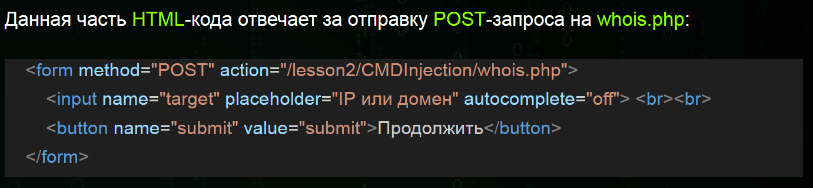

# Web Application Security Analysis (WASA)
Анализ защищенности веб-приложений — это комплексный процесс технического обследования, направленный на выявление уязвимостей, логических ошибок и слабых мест в безопасности веб-ресурсов (сайтов, API). Он включает автоматизированное сканирование и ручное тестирование, имитирующие действия злоумышленников для предотвращения утечек данных, несанкционированного доступа и взлома.

## Серверные уязвимости
Серверные уязвимости используются для компрометации серверов и они гораздо опаснее, чем клиентские уязвимости.
Пример серверных веб-уязвимостей:
1. OS Command Injection
2. PHP Code Injection
3. SQL Injection
4. XXE (XML External Entity)
5. SSTI (Server Side Template Injection)
### 1. OS Command Injection
Уязвимость, которая позволяет злоумышленнику выполнять произвольный код на уязвимом сервере и может привести к полной компрометации сервера. **В наше время встречается редко**.
### 2. PHP Code Injection
В PHP Code Injection злоумышленник внедряет PHP-код в уязвимое веб-приложение. Тоже **встречается крайне редко** и ведёт к полной компрометации сервера.
### 3. SQL Injection
Уязвимость, которая позволяет изменить первоначальный SQL-запрос. С ее помощью можно получить доступ к конфиденциальной информации, так как злоумышленник может отправлять произвольные запросы к базам данных. **Встречается умеренно**.
### 4. XML External Entity (XXE)
`XML` - это формат данных, который используется в HTTP-запросах наравне с JSON и данными в чистом виде. Уязвимость `XXE` встречается на веб-сервисах, где есть XML-парсеры. Может привести к полной компрометации сервера.
### 5. Server Side Template Injection (SSTI)
`SSTI` - внедрение шаблонов на стороне сервера. Опасная уязвимость, которая может встретиться везде, где используются `шаблонизаторы` (Template) - как правило в Python/PHP проектах. Также может привести к полной компрометации сервера.

## Клиентские уязвимости
Как правило клиентские уязвимости используются для мошеннических действий по отношению к пользователям/клиентам.
Пример клиентских веб-уязвимостей:
1. HTML Injection
2. XSS(Cross-Site Scripting)
3. CSRF(Cross-Site Request Forgery)

### 1. HTML Injection
https://owasp.org/www-project-web-security-testing-guide/latest/4-Web_Application_Security_Testing/11-Client-side_Testing/03-Testing_for_HTML_Injection

`HTML`- язык гипертекстовой разметки страницы. Не является языком программирования. Уязвимость, которая позволяет злоумышленнику внедрить HTML-код в уязвимую страницу. 

У неё есть 2 вида: 
* отражённые (reflected);
* хранимые (stored). 

Самые опасные из них `хранимые`, так как они позволяют записать вредоносный HTML-код в базу данных веб-сайта или любое другое хранилище. 

Если же HTML-инъекция `отражённая`, то она эксплуатируется через URL и используется для фишинга. 

Данная уязвимость может привести к краже конфиденциальных данных и денежных ресурсов пользователей.

### 2. XSS (Cross-Site Scripting)
Данная уязвимость схожа с HTML Injection, но
гораздо опаснее, потому что внедряется код на языке программирования `JavaScript`. Если злоумышленнику удастся заэксплуатировать `XSS`, то он сможет выполнять любые действия пользователя в рамках веб-сайта и видеть всё то, что видит пользователь, записывать нажатия клавиш жертвы. 

`XSS` включает в себя 3 вида:
* отражённые (reflected); 
* хранимые (stored);
* DOM-based. 

Первые два работают по аналогии с HTML Injection, а `DOM-based` - это `XSS`, при которой веб-сайт не возвращает полезную нагрузку в ответе. То есть эксплутация происходит только на стороне клиента. **XSS встречается крайне часто**.

### 3. CSRF (Cross-Site Request Forgery)
`CSRF` - это межсайтовая подделка запросов. Через данную уязвимость злоумышленник может вынудить пользователей совершить действие на веб-сайте без их согласия, например, удалить свой же аккаунт, перевести деньги и так далее.
**Встречается достаточно часто**.

## Мисконфиги (Misconfiguration)
`Мисконфиги` - это уязвимости, возникающие вследствие ошибок в настройках безопасности приложений. Практически всегда являются человеческой ошибкой - администратор веб-сервера мог установить какой-то софт и забыть сменить стандартные данные входа. В таком случае злоумышленнику не составит труда найти эти данные в интернете и авторизоваться, например, с правами админа.

Веб-сервера apache2 настроен так, что автоматически запускается вместе с операционной системой. Проверить работоспособность веб-сервера можно через следующую команду в терминале:
```
$ sudo systemctl status apache2
```
Запустите веб-сервер с помощью команды:
```
$ sudo systemctl start apache2
```
Установим листенер (слушатель обратного подключения) через команду `nc` (`netcat`) с портом 1234, который изначально указан в `php-reverse-shell.php`:
```
$ nc-nlvp 1234
```
* `-l` используется, чтобы сообщить netcat, что это будет прослушиватель.
* `-v` используется для запроса подробного вывода.
* `-n` указывает netcat не разрешать имена хостов и не использовать DNS.
* `-p` указывает, что последует спецификация порта.

Загрузив реверс reverse-shell на сервер и запустив его на сервере мы получим доступ к серверу из хоста клиента. 

## Обход авторизации (Authentication Bypass)
`Обход авторизации` - это несанкционированный доступ к различным ресурсам веб-сервера. То есть непривилегированный пользователь может получить доступ к контенту, который изначально не был предназначен для него. 

## IDOR
`IDOR` (Insecure Direct Object References "Небезопасная прямая ссылка на объект").

Как правило у каждого веб-приложения есть свои `объекты` (которые реализовываются через сущности). И пользователи могут обращаться к этим объектам. Предположим, что есть веб-сайт и на нём реализована служба поддержки. Пользователь переходит на страницу, где можно открыть обращение в тех. поддержку. Он описывает в веб-форме свою проблему и нажимает кнопку отправить. На бэкэнде записывается его обращение и отправляется в базу данных:
* http://example.com/problem/1
* http://example.com/problem/2
* http://example.com/problem/N
* http://example.com/problem.php?id=1
* http://example.com/problem.php?id=2
* http://example.com/problem.php?id=N

Когда Вы открываете обращение, то скорее всего Вам вернётся ссылка, например, `http://example.com/problem/29312`. А что, если попробовать перейти не на `http://example.com/problem/29312`, а на `http://example.com/problem/29311`? Можно попробовать перейти на
`http://example.com/problem/29311`, и если у Вас это получилось, то поздравляем, Вы
обнаружили `IDOR`. Очевидно, что пользователи не должны видеть обращения других
пользователей.

### Защита от IDOR
1. Создавать случайные идентификаторы. Например, какие-нибудь `идентификационные хэши`, то получить доступ к чужим обращениям без прямых ссылок было бы крайне сложно.
2. Использовать различные методы идентификации, например, `JWT-токены` (Json Web Token — ключ аутентификации пользователя). В таком случае на сервере могла бы быть проверка на то, действительно ли принадлежит токен с определённым ID пользователю, который обращается по ссылке. Если не принадлежит, то и доступа нет.
3. Должна присутствовать `фильтрация ввода` пользователей. 

## CMD Injection
CMD Injection (OS Command Injection) - уязвимость, которая позволяет внедрить команды операционной системы с помощью вредоносного запроса. Злоумышленник найдёт и получит удалённый доступ - RCE (Remote Code Execution).

### Разбор HTML-кода

* Тег `<form>` предназначен для создания формы, как правило в него помещают другие теги.
* Тег `<input>` - это сама форма ввода. Используется атрибут name со значением `target`. Это значит, что мы можем получить значение из тега в PHP через массив `$_POST[‘target’]` после отправки формы.
* Тег `<button>` предназначен для создания кнопки при нажатии на которую происходит отправка данных из формы.

### Разбор PHP-кода
```php
<?php
if (isset($_POST['submit'])) {
    $target = $_POST['target'];
    echo "<h3>Результат:</h3>";
    echo "<pre>";
    system("whois $target");
    echo "</pre>";
}
?>
```
Используется условная конструкция `if` вместе с функцией `isset()`, которая проверяет наличие данных в массиве `$_POST['submit']`. То есть, когда мы нажимаем кнопку, то значение `submit` отправляется в `$_POST['submit']`, следовательно, функция `isset()` возвращает положительный результат. А значение из `input` отправляется в `$_POST['target']`, поскольку тег имеет атрибут name равным `target`.

В данной строке кода мы присваиваем значение из массива `$_POST['target']` переменной `target`:
```
$target = $_POST['target'];
```
Функция `system` выполняет код операционной системы:
```
whois наша_цель
```
Давайте подумаем, как мы можем это проэксплуатировать, тем самым скомпрометировав сервер. У нас есть шаблон:
```
whois $target
```
Очевидно, что нужно внедрять команды через переменную target. Попробуем команду whoami: